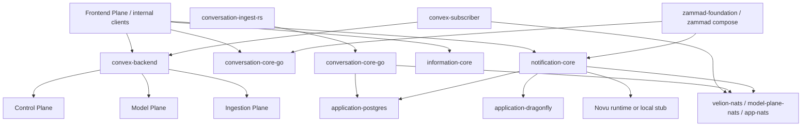

# Application Plane Deep Dive

## Executive Summary

The Application Plane is the app-layer coordination and projection boundary that sits above the lower operational planes. Its current runtime is not just a single collaborative workspace backend. It now includes:

1. `convex-core` as a reactive projection and UI-state mirror.
2. `conversation-core` as a first-party support/conversation API.
3. `conversation-ingest-rs` as a thin ingest shim into conversation-core.
4. `information-core` as an internal information API for weather/traffic/news.
5. `notification-core` as a notification and inbox/feed service.
6. `social-core` (`:3162`) as a social account/publish/metrics/catalog service via integration-corev2.
7. `insight-core` (`:3163`) as an analytics/briefs (market-intelligence) service.
8. `leads-core` (`:3164`) as a non-PII company-leads service backed by real Brreg/Enhetsregisteret.
9. Optional or partial AFFiNE surfaces in compose.
10. `zammad-foundation` as a support-stack foundation package with its own separate compose/runtime path.

This plane currently has two notable characteristics:

- It is more service-rich than the main architecture doc admits.
- Several docs and optional runtime paths still reflect older assumptions, incomplete migrations, or partial integrations.

> **Verified 2026-07-11.** All Application Plane services returned `/health=200` on a host-curl pass, including `social-core` (`:3162`), `insight-core` (`:3163`), and `leads-core` (`:3164`) — three active first-party services that earlier revisions of this doc omitted (now added to the topology table below). Docker exec/build/logs were unavailable this pass (containerd content-store corruption), so container internals were read from compose/source on disk. Spot-checks confirmed: `convex/http.ts` still calls a missing `api.jobs.*` module and `internal.nats.onOrganizationMemberRemoved` (called in `http.ts`, never defined in `nats.ts`); `verifyWebhookSignature` is still a placeholder; `convex/ai.ts` still uses `AI_CORE_URL` + `/stream/chat`/`/chat`; `./affine-core` build context is still absent; `notification-core` route surface below is accurate; `application-postgres` is shared by conversation/social/insight/leads/affine services.

> **Source update 2026-07-12:** Docker cleanup removed the unusable
> `affine-core` service declaration because its build context is absent. The
> digest-pinned vendor `affine-runtime` remains opt-in, while
> `AFFINE_CORE_URL` now defaults empty instead of advertising nonexistent DNS.

> **Production-readiness refresh 2026-07-13:** `docs/core-research/plane-audit-2026-07-13.md` supersedes the July 11 current-state conclusions. Postgres is healthy; the exact native-arm64 leads container reached real Brreg with HTTP 200. Convex member removal/import/authz/reconciliation, notification organization/recipient signing and ZDR containment, information provenance, exact Auth Core membership, User Core denial-driven projection revocation, gateway-wide live membership enforcement, signed conversation delegation, per-org conversation→integration service bearer, effect-bound Ed25519 provider-write attestations, and content-free conversation/integration outbound ledgers are complete in changed source but not deployed. Final review forced the stronger Integration receipt relationship out of the immutable 0008 baseline into forward-only migration 0009, which aggregate-count audits an already-applied 0008 database before replacing and validating the constraint; it also serialized bootstrap and every version with one transaction-scoped advisory lock so API/worker startups cannot both apply the same version. The plane is not a secure MVP: the new authority chain, keys, migrations, and workloads must be provisioned/deployed/live-tested; ZDR is incomplete plane-wide, stale/ambiguous delivery has no reconciler or provider callback, cross-plane membership fan-out is not issuer-verifiable, notification lacks an authority writer/outbox/callback path, and coverage remains incomplete.

## Current Runtime Topology

Primary compose file: `apps/Application Plane/docker-compose.yml`

### Active/default compose services

| Service | Host ports | Role |
|---|---:|---|
| `convex-backend` | `3210`, `3211` | Convex backend runtime with mounted app functions and sqlite storage |
| `convex-dashboard` | `6791` | Convex admin UI |
| `convex-gateway` | `3006 -> 3000` | Convex dev gateway / schema push path |
| `convex-subscriber` | worker | NATS subscriber mirroring cross-plane events into Convex |
| `application-postgres` | `9540` | Shared Application Plane Postgres |
| `application-dragonfly` | `6480` | Shared Application Plane Dragonfly cache |
| `conversation-core-go` | `3160` | Support/conversation API |
| `conversation-ingest-rs` | `3161` | Conversation ingest adapter |
| `information-core` | `3190` | Internal weather/traffic/news API |
| `notification-core` | `3140` | Notification boundary service |
| `social-core` | `3162` | Social account/publish/metrics/catalog via integration-corev2 |
| `insight-core` | `3163` | Analytics/briefs (W3 market-intelligence) |
| `leads-core` | `3164` | Non-PII company leads vs real Brreg (W1 lead-builder) |
| `nats` / `app-nats` | internal | Plane-local NATS bus |

### Optional/profile-gated compose surfaces

| Service | Status |
|---|---|
| `affine-runtime` | compose profile `affine`, image-based runtime |
| `affine-runtime-migration` | compose profile `affine`, one-shot migration helper |

### Separate but adjacent support runtime

| Path | Role |
|---|---|
| `docker-compose.zammad.yml` | Separate Zammad stack |
| `zammad-foundation/` | bootstrap scripts, config examples, checklists, architecture guidance |

## Plane Boundary and Ownership

The Application Plane should own app-facing projections, support workflows, notifications, and interactive workspace state. It should not become the source of truth for foundational plane data.

It should own:

- Reactive app-state mirrors and projections for frontend workflows.
- App-facing conversation/support workflow APIs.
- Notification request, feed, preference, and subscriber management.
- Internal app-support information surfaces used by higher layers.
- Optional app/workspace runtimes such as Convex or AFFiNE when actually wired.

It should not own:

- Identity, org, auth, billing, and canonical session truth. Control Plane owns those.
- Document, embedding, retrieval, graph, or wiki stores. Data Plane owns those.
- Ingestion pipelines and connector acquisition. Ingestion Plane owns those.
- Reasoning, execution, agent orchestration, and model routing. Model Plane owns those.

## Relationship Map

## Current Service-by-Service Understanding

## Control membership authority and gateway boundary

Application Plane does not own membership. Changed source adds an exact Auth Core decision for `(user_id, organization_id)`, called through User Core with a dedicated credential and redirect refusal. It accepts only canonical owner/admin/member/viewer roles, rejects ambiguous duplicates, and ships migration 016 with an operator-visible duplicate preflight before the unique index is created. Velion gateway uses the decision before signing tenant/user/role-bound conversation requests; the same fail-closed result must cover every notification/social/leads/knowledge/privacy/action caller rather than trusting a stale `active_org_id`.

This is source-only. Auth Core, User Core, gateway, migration 016, and new credentials are not deployed. A successful denial must also remove User Core's stale local projection; authority outages must remain 503 and must never mutate authority state.

## convex-core

`apps/Application Plane/convex-core`

This is the reactive UI-state mirror for the system. It is explicitly non-authoritative.

### What it includes

- Convex schema and TypeScript functions under `convex/`.
- Official `convex-backend` container image with mounted function code.
- `convex-subscriber.js` as an external NATS-to-Convex sync service.
- Projections for organizations, users, conversations, messages, planner documents, control sessions, agent runs, Q&A, and conversation projections.

### What it owns

- UI projections and reactive subscriptions.
- Frontend-facing app/session/workspace state caches.
- Mirrored control-session snapshots.
- Mirrored agent-run lifecycle rows.
- Mirrored conversation inbox/message/AI-action projections.

### What it does not own

- Canonical org/user/session truth.
- Canonical run/execution truth.
- Canonical document truth.

### Important runtime facts

- `agentRuns.ts` mirrors Model Plane run events into Convex for UI subscriptions.
- `controlSessions.ts` mirrors Control Plane aggregated session snapshots into Convex.
- `conversationProjection.ts` stores projected conversation inbox/message/action state from external events.
- `knowledgeQnA.ts` is a first-class org-scoped Q&A entity in Convex, not just transient UI state.

## conversation-core-go

`apps/Application Plane/conversation-core/conversation-core-go`

This is a real first-party support/conversation API, not just an auxiliary library.

### What it includes

- Internal-key-gated HTTP API.
- Postgres-backed repository and migrations.
- Optional NATS publisher.
- Support/conversation service with inbox, queue, messages, notes, assignment, tags, and AI-action review.

### Exposed surface

- `/health`, `/ready`
- `/api/v1/inboxes`
- `/api/v1/inboxes/:id/queue`
- `/api/v1/conversations`
- `/api/v1/conversations/:id`
- `/api/v1/conversations/search`
- `/api/v1/conversations/:id/messages`
- `/api/v1/conversations/:id/notes`
- `/api/v1/conversations/:id/status`
- `/api/v1/conversations/:id/assignment`
- `/api/v1/conversations/:id/tags`
- `/api/v1/ai-actions/:id/{review,approve,reject}`
- internal ingest/projection paths

### Current position

- This service is active in compose.
- It is missing from the main architecture doc, which makes that doc incomplete.
- Changed source requires HMAC-v2 delegation bound to service, audience, method, URI, body, user, organization, role, timestamp, and nonce; gateway and ingest are separate principals.
- External replies require a stable idempotency key. A content-free `conversation_outbound_intents` row is claimed before the provider call; `submitted`, `failed`, and `unknown` outcomes prevent a blind duplicate, and message/audit/AI execution finalize atomically.
- Integration-corev2 has a second durable provider receipt keyed by tenant/idempotency. This is defense in depth, not a delivery callback.
- `/messages` cannot select `internal:true`; `/notes` is the only store-only route. Inbox ambiguous retry reuses one key and says `Reply submitted`, never `Reply sent`.
- Open MVP gaps are real Postgres migration execution, provisioning/deployment of the implemented Auth Core service principal and Ed25519 attestation key pair, stale-state reconciliation, submitted/sent/delivered callbacks, durable approval-event outbox, multi-replica replay protection, and authoritative ZDR/retention.

## conversation-ingest-rs

`apps/Application Plane/conversation-core/conversation-ingest-rs`

This is a thin Rust adapter into `conversation-core-go`.

### Responsibilities

- Accept ingress on `3161`.
- Forward into `conversation-core-go`.
- Hold internal API key and outbound HTTP client configuration.

### Current position

- Active in compose.
- Small but real.
- Also omitted from the main architecture doc.

## information-core

`apps/Application Plane/information-core`

This is a small Go service exposing internal information endpoints.

### Responsibilities

- Weather lookups.
- Traffic lookups.
- News lookups.
- Internal-key-gated access.

### Current position

- Active in compose on `3190`.
- Uses in-memory cache plus outbound HTTP clients.
- Not represented in the main Application Plane architecture doc.

This service reads more like a utility/internal-support API than a central workspace core, but it is live and should be documented honestly.

## notification-core

`apps/Application Plane/notification-core`

This is the first-party notification boundary.

### What it includes

- Postgres-backed notification request storage.
- Feed/inbox surface.
- Preferences API.
- Channel configuration API.
- Organization-scoped subscriber membership projection.
- Novu adapter.
- NATS publication; prior unsigned shared-bus consumers are intentionally disabled in changed source.

### Exposed surface

- `/health`
- `/api/v1/notification-requests`
- `/notifications`
- `/notifications/unread/count`
- `/notifications/unseen/count`
- `/notifications/:id/read`
- `/notifications/:id/seen`
- `/notifications/mark-all-read`
- `/notifications/mark-all-seen`
- `/notifications/:id`
- `/preferences`
- `/channels/config`

### Current position

- Much broader than the README's V0 summary.
- Changed source does not start unsigned shared-bus control-session/identity/social consumers.
- Changed source requires explicit `novu` or `disabled` delivery mode. Disabled mode reports readiness 503 and cannot fabricate a provider transaction; the running July 13 image is older and still has the unsafe synthetic-success behavior.
- Intake/feed/preferences now require signed organization/user scope, active membership, typed user recipients, and caller workflow allowlists. Support requests are ZDR and the worker defaults disabled.
- No trustworthy Control membership writer/backfill exists, so the secure source denies legitimate access. Delivery/feed outbox, callback reconciliation, durable preference sync, and HA replay protection remain open.

## AFFiNE surfaces

`affine-runtime`, `affine-runtime-migration`

### Current position

- Compose retains optional vendor AFFiNE runtime/migration paths.
- `affine-runtime` and migration image paths exist in compose.
- The removed first-party `affine-core` build context is historical and is not a default runtime blocker.

The AFFiNE story is opt-in vendor runtime only unless a future owner explicitly restores a first-party application service.

## zammad-foundation

`apps/Application Plane/zammad-foundation`

This is not the main app compose runtime. It is a support-stack foundation package plus a separate Zammad compose path.

### What it includes

- Detailed Zammad architecture and operating model documentation.
- Bootstrap script package.
- Example config JSON.
- Admin/test checklists.
- Separate `docker-compose.zammad.yml`.

### Current position

- More foundation/bootstrap/documentation than integrated app runtime.
- Should be treated as a support-domain package inside the Application Plane, not confused with the always-on main compose runtime.

## Shared Infrastructure and Data Boundaries

Current Application Plane infrastructure:

- `application-postgres`
- `application-dragonfly`
- plane-local `app-nats`
- access to `inter-plane-bus`

### Important current boundary fact

The main architecture doc claims `application-postgres` is exclusively the notification DB. That is not true anymore in the current compose:

- `conversation-core-go` also points at `application-postgres`.
- AFFiNE runtime paths also point at `application-postgres`.
- This means the plane's database boundary is shared across multiple app services today.

## Stub, Mock, Placeholder, and TODO Audit

This section excludes normal test-only mocks and focuses on runtime-relevant or documentation-relevant partial surfaces.

## convex-core

1. `convex/http.ts`
   - The dead legacy jobs webhooks and their placeholder signature verifier were removed in changed source.
   - Generic internal projection webhooks fail closed on a configured internal credential but are still bearer/shared-key boundaries; they are not replay-bound issuer proof.

2. `convex/http.ts`
   - `api.jobs.*` callers were removed rather than masked with no-op functions.
   - `imports.recordCompleted` and member removal now have real source implementations and called-function contract tests.

3. `convex/nats.ts`
   - `startSubscriber` is explicitly a placeholder.
   - The actual running subscriber logic lives in `nats-subscriber.js`, not in the Convex function itself.

4. `convex/ai.ts`
   - Still uses older `AI_CORE_URL` naming and older `/stream/chat` and `/chat` path assumptions.
   - Current compose points `AI_CORE_URL`/`MODEL_GATEWAY_URL` to `model-gateway:8080`, so these calls need to be treated as potentially stale integration assumptions until verified against the gateway surface.

5. `convex/messages.ts`
   - Assistant placeholder message creation for streaming is intentional and not itself a problem.

6. Compose defaults
   - The predictable Convex `change-me` fallback is removed. Changed source requires generic internal, subscriber, NATS, and dedicated reconciliation credentials; runtime deployment remains unverified.

## notification-core

1. `internal/runtime/client.go`
   - Historical runtime behavior fabricated transaction IDs when `NOVU_SECRET_KEY` was unset.
   - Changed source removes that behavior and fails closed in explicit `disabled` mode; it is not deployed as of 2026-07-13.

2. `internal/subscribers/service.go`
   - Explicitly inserts stub subscriber rows for sparse identity states that will later be merged.

## AFFiNE

1. `docker-compose.yml`
   - Optional digest-pinned vendor runtime/migration paths remain; the invalid first-party `affine-core` declaration was removed on 2026-07-12.

## Documentation/runtime mismatch

1. `APPLICATION_PLANE_ARCHITECTURE.md`
   - Omits `conversation-core-go`, `conversation-ingest-rs`, and `information-core`.
   - Still frames Model Plane as `Model Plane v2`.
   - Still claims `application-postgres` is only notification storage.

2. `convex-core/README.md` and `CONVEX_INTEGRATION.md`
   - Still use older `auth-service`, `org-core-service`, and `ai-core` narratives and URLs in parts.

## Relationship Coverage

The main relationships are mapped well enough for broader system analysis:

- Convex as reactive projection of Control/Model/Ingestion-derived state.
- Conversation and notification services as first-party app/support APIs.
- Information-core as internal app-support utility.
- Zammad foundation as adjacent support stack.
- Shared app Postgres/Dragonfly/NATS inside the plane.

What remains partially converged:

- Optional AFFiNE vendor-runtime ownership.
- Convex's dependence on unsigned/unrevisioned Control events and a shared NATS publish boundary.
- Notification organization/recipient identity and support-worker enablement.
- ZDR/retention propagation across conversation, social, notification, cache/log, analytics, and event paths.

## Likely Legacy, Unused, or Transitional Surfaces

### AFFiNE first-party core

The invalid first-party service declaration was removed. Only the opt-in vendor runtime remains; restoring a first-party core would be a new ownership decision.

### Old Convex integration assumptions

Some Convex docs and actions still reference older service names and older AI endpoint shapes.

### `docker-compose.ui.yml`

This overlay duplicates at least part of the main compose's Convex dashboard story and adds only a small AFFiNE port overlay. It may now be redundant or at least in need of a truth pass.

## Stale-Doc Candidates

These are candidates only. Do not delete until the cross-plane stale-doc register is complete.

1. `apps/Application Plane/APPLICATION_PLANE_ARCHITECTURE.md`
   - High-value but stale.
   - Omits active services and contains outdated Model Plane and DB-boundary assumptions.

2. `apps/Application Plane/convex-core/README.md`
   - Useful orientation doc, but integration examples still point at older service names and older AI-core framing.

3. `apps/Application Plane/convex-core/CONVEX_INTEGRATION.md`
   - Needs verification against the current compose and current Model Plane gateway contract.

4. `apps/Application Plane/docker-compose.ui.yml`
   - Candidate for consolidation or deletion if it no longer adds meaningful separation.

5. AFFiNE-related doc sections in runtime docs
   - Need review so they describe the vendor runtime as opt-in and the removed first-party service as historical.

## Operational Notes

- The Application Plane is currently a broader app-support layer than the main architecture doc suggests.
- Convex is still intentionally non-authoritative, but it now mirrors more control/model/application state than earlier docs emphasize.
- `conversation-core-go` and `notification-core` are meaningful first-party APIs, not side notes.
- `information-core` is live but strategically narrower than the other application services.
- Zammad belongs here as a support foundation package, but not as part of the always-on main compose runtime.

## Recommended Follow-Up Checks

1. Replace shared internal-key/forwarded-header authority with tenant/audience/role-bound workload identity.
2. Propagate and prove ZDR/retention across every content-persisting boundary.
3. Add a durable provider-bound conversation outbound ledger and crash reconciliation.
4. Give Control membership events transactional delivery, signed issuer identity, event IDs, revisions, and subject ACLs before deploying Convex reconciliation.
5. Supply a signed/revisioned notification membership writer and scoped removal-first backfill; add delivery/feed outbox, callbacks/reconciliation, and HA replay state. Keep support automation disabled until workflows carry authoritative mappings.
6. Deploy information-core, Model formatter, and Velion v3 provenance changes together; migrate or retire legacy Velion v2.
7. Follow the dated deployment/reconciliation/native-build runbooks under `docs/runbooks/` and preserve immutable rollback evidence.
