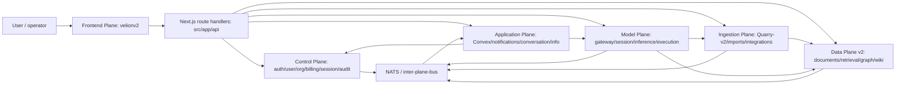

# CoreSystem Codebase Information System

Generated: 2026-06-07

Scope:
- `apps/Application Plane`
- `apps/Data Plane v2`
- `apps/Channel Plane`
- `apps/Control Plane`
- `apps/Model Plane`
- `apps/Ingestion Plane`
- `apps/Frontend Plane/velionv2`

Evidence used:
- CodeGraph index: 3,246 indexed files, 58,130 symbols, Go/TypeScript/TSX/Python/Rust/JavaScript.
- Canonical target ownership: `apps/master-ownership-matrix.md`.
- Cross-plane privacy contract: `apps/GDPR_SUMMARY.md`.
- As-built snapshot: `apps/Frontend Plane/velionv2/docs/coresystem-architecture-map.md`.
- Plane docs and manifests indexed in context-mode as `CoreSystem plane docs snapshot 2026-06-07`.
- Channel Plane is docs-only today: `apps/Channel Plane/docs/vision.md`.

## Overview

CoreSystem is a multi-plane AI customer experience platform. The architecture is a monorepo of independently runnable service stacks connected by explicit API, gRPC, NATS, and Docker network boundaries. Authority flows downward: Control owns identity and governance, Data owns durable knowledge, Ingestion captures evidence, Model reasons and executes agent loops, Application owns collaborative/realtime workspace state, Frontend exposes Velion v2 and its BFF, and Channel Plane is reserved for future external agent deployment.

## Plane Pyramid

| Layer | Plane | Directory | Current role |
|---|---|---|---|
| L1 | Control Plane | `apps/Control Plane` | Identity, users, orgs, billing, sessions, audit, quotas, entitlements |
| L2 | Data Plane v2 | `apps/Data Plane v2` | Documents, chunks, embeddings, retrieval, GraphRAG, LLM wiki, quality gates |
| L3 | Ingestion Plane | `apps/Ingestion Plane` | Quarry-v2 web/search evidence, imports, integrations, SharePoint/M365 sync |
| L4 | Model Plane | `apps/Model Plane` | AI gateway, sessions, inference, execution loop, Temporal orchestration, capabilities |
| L5 | Application Plane | `apps/Application Plane` | Convex workspace, realtime sync, notifications, conversation/information services |
| L6 | Frontend Plane | `apps/Frontend Plane/velionv2` | Next.js 16 Velion workspace and BFF route handlers |
| Future | Channel Plane | `apps/Channel Plane` | Planned widgets, adapters, public visitor conversations, inbox/handoff runtime |

## Architecture Map



## Non-Negotiable Cross-Plane Rules

1. No direct database crossing. Model and Ingestion/Quarry consume Data Plane APIs only.
2. No independent embeddings or reranking outside isolated labs. Data Plane owns embedding and retrieval parity.
3. No browser-agent bypass around Quarry policy. Model Plane proposes browser actions; Quarry executes or rejects them.
4. Zero Data Retention must propagate across every boundary that could persist content.
5. GDPR policy metadata must travel with data and processing jobs: purpose, lawful basis, retention, residency, privacy class, third-party processing allowance, and deletion scope.
6. Durable knowledge assets live in Data Plane: documents, chunks, embeddings, graph, wiki, source logs, retrieval traces.
7. Reasoning lives in Model Plane: planning, synthesis, agent loops, tool selection, memory/wiki maintenance proposals.
8. Human-facing UX lives in Frontend/Application/Channel surfaces, not in core storage or reasoning services.

## Plane Details

### Control Plane

Purpose: authority root for authentication, authorization, users, organizations, billing, sessions, and audit.

Primary services:
- `auth-core` - NestJS/TypeScript auth authority, Better Auth-adjacent runtime, JWT/session/token flows.
- `user-core` - Go user profile and preference service.
- `org-core` - Go organization, entitlement, quota, feature flag, compliance authority.
- `billing-core` - Go billing, usage, invoice, account, and quota events.
- `session-core` - session authority where active.
- `audit-core` - audit API/subscriber/store.

Common entry points:
- `apps/Control Plane/auth-core/src/main.ts`
- `apps/Control Plane/{audit-core,billing-core,org-core,session-core,user-core}/cmd/server/main.go`
- HTTP/gRPC servers under `internal/http` and `internal/grpc`.

Primary docs:
- `apps/Control Plane/README.md`
- `apps/Control Plane/CONTROL_PLANE_ARCHITECTURE.md`

### Data Plane v2

Purpose: canonical knowledge infrastructure for source documents, chunks, embeddings, graph/wiki state, retrieval, and data quality.

Primary services:
- `documents-api-go` - document CRUD, org scoping, bulk ingest, status, internal ingest.
- `index-engine-rs` - chunking, BLAKE3 fingerprints, knowledge units, indexing events.
- `embedding-engine-rs` - provider-backed embeddings, Qdrant upserts/deletes, NATS consumers.
- `retrieval-engine-rs` - hybrid retrieval, query embedding, ANN, BM25, rerank, source join, context packing.
- `graph-index-rs` - GraphRAG entities, relationships, claims, communities, provenance.
- `wiki-store-go` - LLM wiki pages, versions, backlinks, source/maintenance logs.
- `data-orchestrator-go` - reindex/rebuild/refresh/compaction jobs.
- `data-quality-go` - eval, trust score, and release gates.
- `quickwit-adapter-rs` - search/log adapter.

Common entry points:
- `apps/Data Plane v2/services/*/cmd/main.go` for Go services.
- `apps/Data Plane v2/services/*/src/main.rs` for Rust services.
- `apps/Data Plane v2/docker-compose.yml` for local stack wiring.

Primary docs:
- `apps/Data Plane v2/docs/gap-data.md`
- `apps/Data Plane v2/docs/production-deploy.md`
- `apps/Data Plane v2/docs/WIRE_RECONCILIATION.md`

### Ingestion Plane

Purpose: evidence capture and acquisition. It authenticates through Control Plane, captures or imports source material, and persists durable knowledge only through Data Plane contracts.

Current source of truth:
- Use `Quarry-v2` for Velion v2 web/search ingestion.
- `Quarry/` is deferred legacy and should not be the active target for new Velion v2 work.

Primary services:
- `Quarry-v2/crates/quarry-edge` - Rust public REST/SSE ingest edge.
- `Quarry-v2/crates/quarry-runtime` - Rust fetch/browser/driver/transform runtime.
- `Quarry-v2/crates/quarry-browser` - browser drivers and session state.
- `Quarry-v2/services/quarry-control` - Go jobs, resources, schedules, histories, webhooks.
- `Quarry-v2/services/quarry-orchestrator` - Go Temporal workflows.
- `imports-core` - Python/FastAPI file import path.
- `integration-corev2` - Go OAuth/connectors and workers.
- `finspo-core` - Go SharePoint/M365 sync.
- `autocomplete-core` - Rust quick lookup/autocomplete service.

Common entry points:
- `apps/Ingestion Plane/Quarry-v2/crates/quarry-edge/src/main.rs`
- `apps/Ingestion Plane/Quarry-v2/services/quarry-control/cmd/control/main.go`
- `apps/Ingestion Plane/Quarry-v2/services/quarry-orchestrator/cmd/orchestrator/main.go`
- `apps/Ingestion Plane/imports-core/app/main.py`
- `apps/Ingestion Plane/integration-corev2/cmd/api/main.go`
- `apps/Ingestion Plane/finspo-core/cmd/api/main.go`

Primary docs:
- `apps/Ingestion Plane/README.md`
- `apps/Ingestion Plane/Quarry-v2/docs/ARCHITECTURE.md`
- `apps/Ingestion Plane/Quarry-v2/docs/CONTRACTS.md`
- `apps/Ingestion Plane/Quarry-v2/docs/CROSS_PLANE_INTEGRATION.md`

### Model Plane

Purpose: AI reasoning, agent orchestration, model gateway, session/run authority, inference routing, execution loop, tools, policies, sandboxes, browser grants, cost, and bridge services.

Primary services:
- `model-gateway` - Rust public HTTP/gRPC/SSE boundary, auth, normalization, rate limiting.
- `session-core` - Rust threads, runs, messages, checkpoints, context assembly, memory index.
- `inference-core` - Rust provider routing, streaming, fallback, prompt cache.
- `execution-core` - Rust runtime loop, tool planning, permission gates, hooks, artifacts, subagents.
- `orchestrator-core` - Go Temporal workflows.
- `capability-core` - Go skills/tools/policy/model eligibility registry.
- `sandbox-manager` - Go sandbox leases.
- `browser-broker` - Go browser grants.
- `letta-bridge` - Go optional memory bridge.
- `cost-core` and `bridge-core` - Go cost ledger and MCP/LSP/bridge boundaries.

Common entry points:
- `apps/Model Plane/rust/services/*/src/main.rs`
- `apps/Model Plane/go/services/*/cmd/main.go`
- `apps/Model Plane/deploy/docker-compose.yml`

Primary docs:
- `apps/Model Plane/README.md`
- `apps/Model Plane/docs/ARCHITECTURE.md`
- `apps/Model Plane/docs/CONTRACTS.md`
- `apps/Model Plane/docs/VERIFICATION.md`

### Application Plane

Purpose: collaborative workspace and realtime synchronization layer. It may mirror or project state from lower planes, but it does not own identity, billing, durable knowledge, ingestion, or reasoning.

Primary services:
- `convex-backend`, `convex-dashboard`, `convex-gateway`, `convex-subscriber`.
- `affine-core` and `affine-runtime`.
- `conversation-core-go` and `conversation-ingest-rs`.
- `information-core`.
- `notification-core`.
- `application-postgres`, `application-redis`, app-local NATS.

Common entry points:
- `apps/Application Plane/convex-core/convex/*`
- `apps/Application Plane/conversation-core/conversation-core-go/cmd/server/main.go`
- `apps/Application Plane/conversation-core/conversation-ingest-rs/src/main.rs`
- `apps/Application Plane/information-core/cmd/server/main.go`
- `apps/Application Plane/notification-core/cmd/server/main.go`

Primary docs:
- `apps/Application Plane/APPLICATION_PLANE_ARCHITECTURE.md`
- `apps/Application Plane/convex-core/README.md`
- `apps/Application Plane/notification-core/README.md`
- `apps/Application Plane/zammad-foundation/README.md`

### Frontend Plane: velionv2

Purpose: clean Next.js 16 App Router rebuild of Velion. It is the human-facing workspace plus BFF that normalizes upstream plane responses.

Primary surfaces:
- `src/app/(workspace)` - workspace pages for dashboard, onboarding, knowledge, search, agents, chat, inbox, settings, account, ingestions.
- `src/features/*-v2` - feature-sliced frontend domains.
- `src/app/api/**/route.ts` - BFF route handlers for chat, ingestions, onboarding, support, control-plane proxying, search, integrations, information, voice, Convex auth.
- `src/lib/api` - typed REST envelope conventions.
- `src/lib/control-plane`, `src/lib/knowledge`, `src/lib/integrations`, `src/lib/services` - plane clients and app services.

Conventions:
- Server Components by default; Client Components at interaction leaves.
- TanStack Query for client cache and mutation state.
- Cursor pagination for unbounded collections.
- SSE stream IDs and `Last-Event-ID` resume shape for long-running work.
- Route handlers normalize upstream responses and must not leak upstream secrets or OAuth tokens.

Primary docs:
- `apps/Frontend Plane/velionv2/README.md`
- `apps/Frontend Plane/velionv2/docs/api-contracts.md`
- `apps/Frontend Plane/velionv2/docs/adr/`
- `apps/Frontend Plane/velionv2/docs/coresystem-architecture-map.md`

### Channel Plane

Purpose: future runtime and deployment surface for external-facing Velion agents.

Current state:
- Docs-only stub: `apps/Channel Plane/docs/vision.md`.
- No source files are indexed by CodeGraph for this plane.

Planned modules:
- `adapter-core` - Shopify, WooCommerce, WordPress, generic embed deployment/install lifecycle.
- `widget-core` - widget metadata, allowed domains, visitor bootstrap, browser tokens/cookies.
- `conversation-core` - public visitor conversation runtime, agent calls, canonical messages, handoff.
- Convex realtime layer - token streaming, typing, presence, operator handoff, live inbox.
- Postgres canonical storage - compliance-sensitive conversation records and retention/deletion workflows.

## Request Lifecycles

### Grounded Chat

1. User sends a prompt in `velionv2`.
2. `src/app/api/chat/stream/route.ts` accepts the request and normalizes the BFF contract.
3. BFF calls Model Plane `model-gateway`.
4. Model Plane validates auth/context, creates or resumes a run/session, and requests Data Plane retrieval/graph/wiki context through APIs.
5. Data Plane performs hybrid retrieval, source joins, graph/wiki lookups, and returns auditable context/citations.
6. Model Plane streams reasoning/output via SSE.
7. Frontend renders chunks, grounding, citations, artifacts, and status.

### Website Ingestion To Knowledge

1. User starts website crawl/onboarding/import from `velionv2`.
2. BFF route under `src/app/api/onboarding` or `src/app/api/ingestions` calls Quarry-v2 or integration/import services.
3. Ingestion Plane validates org/user context, fetches/crawls/imports evidence, emits run events, and stores artifacts as allowed by policy.
4. Ingestion submits durable content through Data Plane ingest/document contracts.
5. Data Plane stores source records, chunks, embeds, indexes, graphifies, and makes the result retrievable.
6. Frontend polls or streams status and later queries Data Plane/Model Plane through the BFF.

### External Channel Agent (Future)

1. Admin configures an agent and widget/channel deployment in Velion.
2. Channel Plane adapter installs the external channel integration and widget metadata.
3. Public visitor bootstraps through widget runtime with allowed-domain and visitor-session validation.
4. Channel conversation runtime calls Model Plane for agent behavior and uses Convex for realtime state.
5. Canonical conversation records are stored in Postgres with retention/deletion workflows.
6. Internal users monitor, hand off, and manage the conversation from Velion inbox surfaces.

## Directory Map

| Path | Purpose |
|---|---|
| `apps/master-ownership-matrix.md` | Canonical target ownership and cross-plane decision rules |
| `apps/Application Plane` | Collaborative workspace, Convex/AFFiNE, notifications, application-facing services |
| `apps/Data Plane v2` | Durable knowledge, retrieval, graph, wiki, indexing, embedding, data quality |
| `apps/Channel Plane` | Future external channel runtime documentation |
| `apps/Control Plane` | Identity, org, user, billing, session, audit authority |
| `apps/Model Plane` | Reasoning, agent runtime, model gateway, sessions, inference, execution |
| `apps/Ingestion Plane` | Evidence capture, web/search scraping, file imports, OAuth/connectors |
| `apps/Frontend Plane/velionv2` | Velion v2 UI and BFF |

## Coding Conventions Detected

- Monorepo, multi-stack microservices. There are 81 detected manifests across focused paths.
- Language split: Rust for latency/parsing/retrieval/browser/protocol-heavy hot paths; Go for durable workflow, CRUD, registry, policy, scheduling; Python for labs, evals, provider glue, and imports; TypeScript/TSX for frontend/BFF/NestJS/Convex.
- Entry points: Go services usually use `cmd/*/main.go`; Rust services use `src/main.rs`; Python FastAPI services use `app/main.py`; Next.js BFF uses `src/app/api/**/route.ts`.
- Tests: Go uses `*_test.go`; Rust uses `tests/*.rs`; TypeScript uses `*.test.ts`, `*.test.tsx`, and Playwright `*.spec.ts`; Python SDK/labs use `test_*.py`.
- API envelopes in Velion v2 use `{ data }`, cursor `meta`/`links`, and `{ error: { code, message, details } }`.
- HTTP validation failures map to `422`, auth failures to `401`, upstream failures to `502` or `503`.
- NATS/JetStream is the dominant event spine; Docker Compose stacks join the shared `inter-plane-bus`.
- Commit history uses Conventional Commit style: `feat:`, `fix(scope):`, `docs:`.

## Common Commands

Frontend:

```bash
cd "apps/Frontend Plane/velionv2"
pnpm dev
pnpm lint
pnpm typecheck
pnpm test
pnpm test:e2e
pnpm build
```

Data Plane v2:

```bash
cd "apps/Data Plane v2"
make up
make down
make build
make check-rs
make test-rs
make build-go
make test-integration
```

Ingestion Plane:

```bash
cd "apps/Ingestion Plane"
make up
make down
make build
make test-endpoints
make dev-quarry
make test-quarry
```

Quarry-v2:

```bash
cd "apps/Ingestion Plane/Quarry-v2"
make build
make test
make fmt
make lint
make dev
```

Model Plane:

```bash
cd "apps/Model Plane"
./scripts/compose.sh up -d
cd rust && cargo test --workspace
cd ../go && go test ./...
```

Control Plane:

```bash
cd "apps/Control Plane"
docker compose up -d --build
docker compose ps
```

Application Plane:

```bash
cd "apps/Application Plane"
docker compose up -d --build
```

## Where To Look

| Task | Start here |
|---|---|
| Understand ownership boundaries | `apps/master-ownership-matrix.md` |
| Inspect actual service stack wiring | `apps/Frontend Plane/velionv2/docs/coresystem-architecture-map.md` and each plane `docker-compose.yml` |
| Add a Velion page | `apps/Frontend Plane/velionv2/src/app/(workspace)` |
| Add frontend domain behavior | `apps/Frontend Plane/velionv2/src/features/*-v2` |
| Add BFF/API route | `apps/Frontend Plane/velionv2/src/app/api/**/route.ts` |
| Change REST envelope behavior | `apps/Frontend Plane/velionv2/src/lib/api` and `docs/api-contracts.md` |
| Add auth/org/user/billing behavior | `apps/Control Plane/*-core` |
| Add documents/retrieval/graph/wiki behavior | `apps/Data Plane v2/services/*` |
| Add scrape/crawl/import/connectors | `apps/Ingestion Plane/Quarry-v2`, `imports-core`, `integration-corev2`, `finspo-core` |
| Add model gateway/session/inference/execution behavior | `apps/Model Plane/rust/services/*` |
| Add orchestration/capability/sandbox/browser/cost behavior | `apps/Model Plane/go/services/*` |
| Add realtime workspace or notification behavior | `apps/Application Plane/convex-core`, `notification-core`, `conversation-core` |
| Plan external widget/channel runtime | `apps/Channel Plane/docs/vision.md` |

## Known Drift And Watch Items

- `apps/Channel Plane` is intentionally future/docs-only today.
- Some older Ingestion documentation still describes legacy `Quarry/`; current Velion v2 work should target `Quarry-v2`.
- `apps/Model Plane v2` exists in the repository, but the focused current map is `apps/Model Plane`.
- The worktree observed during generation had many pre-existing deletions and local changes; do not reset or revert without explicit user direction.
- Several Model Plane services have documented partial/stubbed backing stores in `docs/ARCHITECTURE.md` and `docs/CONTRACTS.md`.
- Data Plane v2 docs report Control Plane wiring as the remaining production blocker for multi-tenant deployment: `X-Org-ID` trust needs full auth-core/user-core/org-core/cost-core consultation.

## Information-System Persistence

This map is meant to exist in four places:

1. Local source of truth: `apps/CODEBASE_INFORMATION_SYSTEM.md`.
2. Agent instructions: root `CLAUDE.md` for concise workflow/convention reminders.
3. Logseq page: `CoreSystem Codebase Information System`.
4. Search/memory tools: context-mode source `CoreSystem codebase information system 2026-06-07` and mempalace KG facts for plane ownership.
