# CoreSystem Codebase Information System

Updated: 2026-07-02

Scope:
- `apps/Application Plane`
- `apps/Data Plane v2`
- `apps/Control Plane`
- `apps/Model Plane`
- `apps/Ingestion Plane`
- `apps/Frontend Plane/velionv3`

Reference-only:
- `apps/Channel Plane` remains future/docs-only.
- `apps/Frontend Plane/velionv2` remains historical/reference unless explicitly targeted.

Evidence used:
- Consolidated cross-plane runtime map: `docs/CORESYSTEM_CROSS_PLANE_ARCHITECTURE_MAP.md`.
- CodeGraph status on 2026-07-02: 11,635 indexed files, 216,888 nodes, 760,041 edges.
- Canonical target ownership: `apps/master-ownership-matrix.md`.
- Cross-plane privacy contract: `apps/GDPR_SUMMARY.md`.
- Velion v3 source/docs: `apps/Frontend Plane/velionv3/README.md`, `package.json`, `vite.config.ts`, `apps/gateway/src/main.rs`, `apps/gateway/src/domains/*`, `src/shared/actions/action-registry.ts`.
- Data Plane v2 docs/manifests: `apps/Data Plane v2/docs/gap-data.md`, `Makefile`, service manifests.
- Ingestion docs/manifests: `apps/Ingestion Plane/Quarry-v2/docs/ARCHITECTURE.md`, `docs/CONTRACTS.md`, `docs/CROSS_PLANE_INTEGRATION.md`, service manifests.
- Model Plane docs/manifests: `apps/Model Plane/README.md`, `docs/ARCHITECTURE.md`, `docs/CONTRACTS.md`, `docs/VERIFICATION.md`.
- Control/Application manifests and service READMEs.
- Audit backlog: `apps/CORESYSTEM_AUDIT_BACKLOG.md`.

## Overview

CoreSystem is a multi-plane AI customer experience platform. The architecture is a monorepo of independently runnable service stacks connected by explicit HTTP, gRPC, NATS/JetStream, Docker network, and gateway boundaries.

The current active frontend target is Velion v3. Velion v3 is not the old Next.js BFF shape from Velion v2. It is a SolidJS/Vite TypeScript app at the plane root, a Rust Axum same-origin gateway under `apps/gateway`, and a separate nested Next.js web app under `apps/velion-web`.

The authority model stays unchanged:

```text
Control owns authority.
Data owns durable knowledge.
Ingestion captures evidence.
Model reasons and executes agent loops.
Application projects collaborative/realtime workspace state.
Frontend presents and normalizes access.
```

## Plane Pyramid

| Layer | Plane | Directory | Current role |
|---|---|---|---|
| L1 | Control Plane | `apps/Control Plane` | Identity, users, orgs, billing, sessions, audit, quotas, entitlements |
| L2 | Data Plane v2 | `apps/Data Plane v2` | Documents, chunks, embeddings, retrieval, GraphRAG, LLM wiki, quality gates |
| L3 | Ingestion Plane | `apps/Ingestion Plane` | Quarry-v2 web/search evidence, imports, integrations, SharePoint/M365 sync |
| L4 | Model Plane | `apps/Model Plane` | AI gateway, sessions, inference, execution loop, Temporal orchestration, capabilities |
| L5 | Application Plane | `apps/Application Plane` | Convex workspace, realtime sync, notifications, conversation/information/social services |
| L6 | Frontend Plane | `apps/Frontend Plane/velionv3` | Solid/Vite Velion UI, Rust same-origin gateway, nested Velion web app |
| Future | Channel Plane | `apps/Channel Plane` | Planned widgets, adapters, public visitor conversations, inbox/handoff runtime |

## Architecture Map

The canonical live runtime map and integration-proof matrix is maintained in `docs/CORESYSTEM_CROSS_PLANE_ARCHITECTURE_MAP.md`. The diagram below is the compact orientation view.

```mermaid
flowchart LR
  User["User / operator"] --> Frontend["Frontend Plane: Velion v3 Solid/Vite"]
  Frontend --> Gateway["Velion v3 Rust gateway: apps/gateway"]
  Frontend --> Actions["Shared action registry and context packs"]
  Gateway --> Control["Control Plane: auth/user/org/billing/session/audit"]
  Gateway --> Ingestion["Ingestion Plane: Quarry-v2/imports/integrations"]
  Gateway --> Data["Data Plane v2: documents/retrieval/graph/wiki"]
  Gateway --> Model["Model Plane: gateway/session/inference/execution"]
  Gateway --> Application["Application Plane: Convex/notifications/conversation/info/social"]
  Actions --> Gateway
  Ingestion --> Data
  Model --> Data
  Model --> Ingestion
  Application --> Control
  Application --> Model
  Control --> Events["NATS / inter-plane-bus"]
  Ingestion --> Events
  Data --> Events
  Model --> Events
  Events --> Application
```



## Non-Negotiable Cross-Plane Rules

1. No direct database crossing. Model, Frontend, Application, and Ingestion consume Data Plane APIs only.
2. No independent embeddings or reranking outside isolated labs. Data Plane owns embedding and retrieval parity.
3. No browser-agent bypass around Quarry policy. Model Plane proposes browser actions; Quarry-v2 executes or rejects them.
4. Zero Data Retention must propagate across every boundary that could persist content.
5. GDPR policy metadata must travel with data and processing jobs: purpose, lawful basis, retention, residency, privacy class, third-party processing allowance, and deletion scope.
6. Durable knowledge assets live in Data Plane: documents, chunks, embeddings, graph, wiki, source logs, retrieval traces.
7. Reasoning lives in Model Plane: planning, synthesis, agent loops, tool selection, memory/wiki maintenance proposals.
8. Human-facing UX lives in Frontend/Application/Channel surfaces, not in core storage or reasoning services.
9. Browser-facing and frontend calls must pass through the Velion gateway/BFF surface; upstream secrets, OAuth tokens, and forged org/user headers must not reach the browser.

## Plane Details

### Control Plane

Purpose: authority root for authentication, authorization, users, organizations, billing, sessions, and audit.

Primary services:
- `auth-core` - NestJS/TypeScript auth authority, Better Auth-adjacent runtime, JWT/session/token flows.
- `user-core` - Go user profile and preference service.
- `org-core` - Go organization, entitlement, quota, feature flag, compliance authority.
- `billing-core` - Go billing, usage, invoice, account, and quota events.
- `session-core` - session authority where active.
- `audit-core` - audit API/subscriber/store.

Common entry points:
- `apps/Control Plane/auth-core/src/main.ts`
- `apps/Control Plane/{audit-core,billing-core,org-core,session-core,user-core}/cmd/server/main.go`
- HTTP/gRPC servers under service-local `internal/http` and `internal/grpc`.

Primary docs:
- `apps/Control Plane/README.md`
- `apps/Control Plane/CONTROL_PLANE_ARCHITECTURE.md`

### Data Plane v2

Purpose: canonical knowledge infrastructure for source documents, chunks, embeddings, graph/wiki state, retrieval, and data quality.

Primary services:
- `documents-api-go` - document CRUD, org scoping, bulk ingest, status, internal ingest.
- `index-engine-rs` - chunking, BLAKE3 fingerprints, knowledge units, indexing events.
- `embedding-engine-rs` - provider-backed embeddings, Qdrant upserts/deletes, NATS consumers.
- `retrieval-engine-rs` - hybrid retrieval, query embedding, ANN, BM25, rerank, source join, context packing.
- `graph-index-rs` - GraphRAG entities, relationships, claims, communities, provenance.
- `wiki-store-go` - LLM wiki pages, versions, backlinks, source/maintenance logs.
- `data-orchestrator-go` - reindex/rebuild/refresh/compaction jobs.
- `data-quality-go` - eval, trust score, and release gates.
- `quickwit-adapter-rs` - search/log adapter.

Common entry points:
- `apps/Data Plane v2/services/*/cmd/main.go` for Go services.
- `apps/Data Plane v2/services/*/src/main.rs` for Rust services.
- `apps/Data Plane v2/docker-compose.yml` for local stack wiring.

Primary docs:
- `apps/Data Plane v2/docs/gap-data.md`
- `apps/Data Plane v2/docs/production-deploy.md`
- `apps/Data Plane v2/docs/WIRE_RECONCILIATION.md`

### Ingestion Plane

Purpose: evidence capture and acquisition. It authenticates through Control Plane, captures or imports source material, and persists durable knowledge only through Data Plane contracts.

Current source of truth:
- Use `Quarry-v2` for Velion v3 web/search ingestion.
- `Quarry/` is legacy/deferred and should not be the active target for new Velion v3 work.

Primary services:
- `Quarry-v2/crates/quarry-edge` - Rust public REST/SSE ingest edge.
- `Quarry-v2/crates/quarry-runtime` - Rust fetch/browser/driver/transform runtime.
- `Quarry-v2/crates/quarry-browser` - browser drivers and session state.
- `Quarry-v2/services/quarry-control` - Go jobs, resources, schedules, histories, webhooks.
- `Quarry-v2/services/quarry-orchestrator` - Go Temporal workflows.
- `imports-core` - Python/FastAPI file import path.
- `integration-corev2` - Go OAuth/connectors and workers.
- `finspo-core` - Go SharePoint/M365 sync.
- `autocomplete-core` - Rust quick lookup/autocomplete service.
- `services/support-worker` - TypeScript worker package.

Common entry points:
- `apps/Ingestion Plane/Quarry-v2/crates/quarry-edge/src/main.rs`
- `apps/Ingestion Plane/Quarry-v2/services/quarry-control/cmd/control/main.go`
- `apps/Ingestion Plane/Quarry-v2/services/quarry-orchestrator/cmd/orchestrator/main.go`
- `apps/Ingestion Plane/imports-core/app/main.py`
- `apps/Ingestion Plane/integration-corev2/cmd/api/main.go`
- `apps/Ingestion Plane/finspo-core/cmd/api/main.go`

Primary docs:
- `apps/Ingestion Plane/README.md`
- `apps/Ingestion Plane/Quarry-v2/docs/ARCHITECTURE.md`
- `apps/Ingestion Plane/Quarry-v2/docs/CONTRACTS.md`
- `apps/Ingestion Plane/Quarry-v2/docs/CROSS_PLANE_INTEGRATION.md`

### Model Plane

Purpose: AI reasoning, agent orchestration, model gateway, session/run authority, inference routing, execution loop, tools, policies, sandboxes, browser grants, cost, and bridge services.

Primary services:
- `model-gateway` - Rust public HTTP/gRPC/SSE boundary, auth, normalization, rate limiting.
- `session-core` - Rust threads, runs, messages, checkpoints, context assembly, memory index.
- `inference-core` - Rust provider routing, streaming, fallback, prompt cache.
- `execution-core` - Rust runtime loop, tool planning, permission gates, hooks, artifacts, subagents.
- `orchestrator-core` - Go Temporal workflows.
- `capability-core` - Go skills/tools/policy/model eligibility registry.
- `sandbox-manager` - Go sandbox leases.
- `browser-broker` - Go browser grants.
- `letta-bridge` - Go optional memory bridge.
- `cost-core` and `bridge-core` - Go cost ledger and MCP/LSP/bridge boundaries.

Common entry points:
- `apps/Model Plane/rust/services/*/src/main.rs`
- `apps/Model Plane/go/services/*/cmd/main.go`
- `apps/Model Plane/deploy/docker-compose.yml`

Primary docs:
- `apps/Model Plane/README.md`
- `apps/Model Plane/docs/ARCHITECTURE.md`
- `apps/Model Plane/docs/CONTRACTS.md`
- `apps/Model Plane/docs/VERIFICATION.md`

### Application Plane

Purpose: collaborative workspace and realtime synchronization layer. It may mirror or project state from lower planes, but it does not own identity, billing, durable knowledge, ingestion, or reasoning.

Primary services:
- `convex-core` - Convex backend/dashboard/gateway/subscriber package.
- `conversation-core/conversation-core-go` and `conversation-core/conversation-ingest-rs`.
- `information-core`.
- `insight-core`.
- `leads-core`.
- `notification-core`.
- `social-core`.
- `zammad-foundation/bootstrap`.

Common entry points:
- `apps/Application Plane/convex-core/convex/*`
- `apps/Application Plane/conversation-core/conversation-core-go/cmd/server/main.go`
- `apps/Application Plane/conversation-core/conversation-ingest-rs/src/main.rs`
- `apps/Application Plane/{information-core,insight-core,leads-core,notification-core,social-core}/cmd/server/main.go`

Primary docs:
- `apps/Application Plane/convex-core/README.md`
- `apps/Application Plane/information-core/README.md`
- `apps/Application Plane/insight-core/README.md`
- `apps/Application Plane/notification-core/README.md`
- `apps/Application Plane/zammad-foundation/README.md`

### Frontend Plane: Velion v3

Purpose: the current human-facing Velion workspace and frontend gateway surface.

Primary surfaces:
- `src/app` - Solid app routing, providers, and shell.
- `src/features/*` - feature-sliced product surfaces: dashboard, chat, inbox, agents, knowledge, onboarding, settings, social, studio, and related workspace areas.
- `src/shared/actions` - AI-first command registry. The current registry exposes 25 action IDs across knowledge, operating map, security, inbox, tickets, social, agents, and workflow policy.
- `src/shared/context-packs` - model context packaging from route, visible records, draft input, and available actions.
- `src/shared/api`, `src/shared/rpc`, `src/shared/graphrest` - API-first transport clients.
- `apps/gateway` - Rust Axum same-origin gateway/BFF. It owns route normalization, upstream selection, envelopes, auth/session context, rate limiting, security headers, CORS, metrics, and cross-plane domain modules.
- `apps/velion-web` - separate Next.js app under the Velion v3 tree. Its README currently still contains the generated Next template and needs project-specific documentation.

Gateway domain modules include actions, agent actions/runs, AG-UI, AI, audit, auth, billing, briefs, browser, chat, cost, eval, finetune, inbox, information, ingestions, insights, integrations, knowledge, leads, MCP, monitoring, navbar, notifications, onboarding, orchestration, orgs, ownership, privacy, router policy, search, settings, shares, social, studio, and tickets.

Conventions:
- The root app is SolidJS/Vite/TypeScript.
- Add the action contract before wiring a meaningful UI operation.
- UI controls and model-driven calls should use the same action ID, input schema, approval rule, and audit path.
- The browser talks to same-origin `/api` and `/health`; Vite dev proxy targets the Rust gateway.
- The gateway must strip forged identity/org scoping headers before forwarding upstream.
- Responses use typed envelopes: `{ data }`, cursor `meta`/`links`, or `{ error: { code, message, details } }`.
- Honest empty/degraded data is preferred over fabricated demo data. Gateway helpers can annotate `meta.source` for degraded responses.

Primary docs:
- `apps/Frontend Plane/velionv3/README.md`
- `apps/Frontend Plane/velionv3/package.json`
- `apps/Frontend Plane/velionv3/vite.config.ts`
- `apps/Frontend Plane/velionv3/apps/gateway/Cargo.toml`
- `apps/Frontend Plane/velionv3/apps/velion-web/package.json`

### Channel Plane

Purpose: future runtime and deployment surface for external-facing Velion agents.

Current state:
- Docs-only stub: `apps/Channel Plane/docs/vision.md`.
- Do not treat it as active runtime for this onboarding pass.

## Request Lifecycles

### Grounded Chat

1. User sends a prompt in Velion v3.
2. The Solid UI calls same-origin API helpers and/or action registry entries.
3. Vite dev proxy or production routing sends `/api` traffic to the Rust gateway.
4. Gateway validates session context, strips forged scoping headers, normalizes payloads, and calls Model Plane `model-gateway`.
5. Model Plane creates or resumes a run/session and requests Data Plane retrieval/graph/wiki context through APIs.
6. Data Plane performs hybrid retrieval, source joins, graph/wiki lookups, and returns auditable context/citations.
7. Model Plane streams reasoning/output.
8. Gateway and frontend render chunks, grounding, citations, artifacts, and status.

### Website Ingestion To Knowledge

1. User starts website crawl/onboarding/import from Velion v3.
2. UI calls knowledge/onboarding/ingestion actions or gateway endpoints.
3. Gateway calls Quarry-v2 edge, imports-core, integration-corev2, or finspo-core as the relevant Ingestion Plane boundary.
4. Ingestion validates org/user context, fetches/crawls/imports evidence, emits run events, and stores artifacts as allowed by policy.
5. Ingestion submits durable content through Data Plane ingest/document contracts.
6. Data Plane stores source records, chunks, embeddings, graph/wiki projections, and retrieval traces.
7. Frontend polls or streams status and later queries Data Plane/Model Plane through the gateway.

### Studio/Social/Application Projection

1. User opens Studio, Social, Inbox, Knowledge, or collaborative workspace surfaces.
2. Velion v3 loads session/org context and calls the Rust gateway.
3. Gateway selects Application Plane, Control Plane, Data Plane, or Ingestion Plane upstreams by domain.
4. Application Plane may project realtime/collaborative workspace state, but lower-plane durable authorities remain the owners.
5. Any fallback/degraded view must be labeled or represented as unavailable/planned/fallback, not fabricated as live state.

### External Channel Agent

This is future scope. Channel Plane should eventually own adapter install/runtime, visitor bootstrap, public conversation runtime, and handoff. Until runtime exists, do not wire active product flows against Channel Plane as if it is deployed.

## Directory Map

| Path | Purpose |
|---|---|
| `apps/master-ownership-matrix.md` | Canonical target ownership and cross-plane decision rules |
| `apps/CORESYSTEM_AUDIT_BACKLOG.md` | Current bug/gap/remediation backlog from onboarding audits |
| `apps/Application Plane` | Collaborative workspace, Convex/AFFiNE-adjacent projections, notifications, application-facing services |
| `apps/Data Plane v2` | Durable knowledge, retrieval, graph, wiki, indexing, embedding, data quality |
| `apps/Control Plane` | Identity, org, user, billing, session, audit authority |
| `apps/Model Plane` | Reasoning, agent runtime, model gateway, sessions, inference, execution |
| `apps/Ingestion Plane` | Evidence capture, web/search scraping, file imports, OAuth/connectors |
| `apps/Frontend Plane/velionv3` | Current Velion UI and gateway |
| `apps/Channel Plane` | Future external channel runtime documentation |

## Coding Conventions Detected

- Monorepo, multi-stack microservices. Current manifest inventory spans Rust, Go, TypeScript/TSX, and Python across the active planes.
- Language split: Rust for latency/parsing/retrieval/browser/protocol-heavy hot paths; Go for durable workflow, CRUD, registry, policy, scheduling; Python for labs, evals, provider glue, and imports; TypeScript/TSX for frontend/Auth/Convex/workers.
- Entry points: Go services usually use `cmd/*/main.go`; Rust services use `src/main.rs`; Python FastAPI services use `app/main.py`; Velion v3 root uses Solid/Vite; Velion v3 gateway uses Rust Axum modules under `apps/gateway/src`.
- Tests: Go uses `*_test.go`; Rust uses crate/workspace tests; TypeScript uses `*.test.ts`, `*.test.tsx`, and Playwright `*.spec.ts`; Python SDK/labs use `test_*.py`.
- API envelopes use `{ data }`, cursor `meta`/`links`, and `{ error: { code, message, details } }`.
- HTTP validation failures generally map to `422`, auth failures to `401`, upstream failures to `502` or `503`.
- NATS/JetStream is the dominant event spine; Docker Compose stacks join the shared `inter-plane-bus` or equivalent local networks.
- Commit history uses Conventional Commit style: `feat:`, `fix(scope):`, `docs:`.

## Common Commands

Frontend:

```bash
cd "apps/Frontend Plane/velionv3"
pnpm dev
pnpm lint
pnpm typecheck
pnpm test
pnpm build
cargo test --manifest-path apps/gateway/Cargo.toml --all-targets
```

Data Plane v2:

```bash
cd "apps/Data Plane v2"
make up
make down
make build
make check-rs
make test-rs
make build-go
make test-integration
```

Ingestion Plane:

```bash
cd "apps/Ingestion Plane"
make up
make down
make build
make test-endpoints
cd "Quarry-v2" && cargo test --workspace
```

Model Plane:

```bash
cd "apps/Model Plane"
./scripts/compose.sh up -d
cd rust && cargo test --workspace
cd ../go && go test ./...
```

Control Plane:

```bash
cd "apps/Control Plane"
docker compose up -d --build
docker compose ps
```

Application Plane:

```bash
cd "apps/Application Plane"
docker compose up -d --build
```

## Where To Look

| Task | Start here |
|---|---|
| Understand ownership boundaries | `apps/master-ownership-matrix.md` |
| Inspect current audit findings | `apps/CORESYSTEM_AUDIT_BACKLOG.md` |
| Add a Velion v3 product surface | `apps/Frontend Plane/velionv3/src/features/*` and `src/app` |
| Add a human/model action | `apps/Frontend Plane/velionv3/src/shared/actions/action-registry.ts` |
| Add frontend API client behavior | `apps/Frontend Plane/velionv3/src/shared/api`, `src/shared/rpc`, `src/shared/graphrest` |
| Add or change gateway/BFF behavior | `apps/Frontend Plane/velionv3/apps/gateway/src/domains/*` |
| Change REST envelope behavior | `apps/Frontend Plane/velionv3/apps/gateway/src/envelope.rs` and frontend API clients |
| Add auth/org/user/billing behavior | `apps/Control Plane/*-core` |
| Add documents/retrieval/graph/wiki behavior | `apps/Data Plane v2/services/*` |
| Add scrape/crawl/import/connectors | `apps/Ingestion Plane/Quarry-v2`, `imports-core`, `integration-corev2`, `finspo-core` |
| Add model gateway/session/inference/execution behavior | `apps/Model Plane/rust/services/*` |
| Add orchestration/capability/sandbox/browser/cost behavior | `apps/Model Plane/go/services/*` |
| Add realtime workspace or notification behavior | `apps/Application Plane/convex-core`, `notification-core`, `conversation-core`, `social-core` |
| Plan external widget/channel runtime | `apps/Channel Plane/docs/vision.md` |

## Current Audit Snapshot

The current audit did not edit implementation code. Confirmed findings and remediation candidates live in `apps/CORESYSTEM_AUDIT_BACKLOG.md`.

High-signal confirmed items from this refresh:
- Root onboarding docs were stale to Velion v2 and have been updated to Velion v3.
- `pnpm test` in Velion v3 fails because Vitest catches unhandled rejections from `loadStudioWorkspace` when session context lacks `orgs`.
- Quarry-v2 workspace tests fail to compile where `DataPlaneIngestRequest` constructors have not been updated for `initiator_user_id` and `visibility`.
- Data Plane Rust check passes with a cleanup warning for unused `RerankClient::new`.
- Model Plane Rust workspace tests pass; Model Plane Go still has failing gates in `orchestrator-core/internal/orchestration` and `letta-bridge/internal/memstore`.
- Control Plane checked Go services and `auth-core` Jest pass in this worktree.
- Application Plane checked Go services pass; Convex direct TypeScript/ESLint checks pass, but pnpm script wrappers are blocked by ignored-build approval for `esbuild@0.27.0`.
- Ingestion top-level Makefile still points some dev/test targets at legacy `Quarry`, while active architecture is `Quarry-v2`.
- Nested `.claude/worktrees`, generated artifacts, build output, and package caches can pollute naive repository discovery and CodeGraph/static inventory.

## Known Drift And Watch Items

- `apps/Channel Plane` is intentionally future/docs-only today.
- `apps/Frontend Plane/velionv3/apps/velion-web/README.md` is still the generated Next.js template.
- Some older Ingestion documentation and Makefile targets still describe legacy `Quarry/`; current Velion v3 work should target `Quarry-v2`.
- `apps/Model Plane v2` may exist in the repository, but the focused current map is `apps/Model Plane`.
- The worktree observed during generation had many pre-existing local changes. Never reset, clean, or revert without explicit user direction.
- Data Plane v2 docs report Control Plane wiring as the remaining production blocker for multi-tenant deployment: `X-Org-ID` trust needs full auth-core/user-core/org-core/cost-core consultation.
- Quarry-v2 docs identify a current exception where Velion v3 onboarding crawl handlers post to control `/v1/jobs/` directly; migrate that path to edge rather than extending it.
- Large frontend/global styling files and fallback/preview surfaces should be audited before declaring Velion v3 feature completeness.

## Information-System Persistence

This map is meant to exist in source control as the local source of truth. If external memory/search tools are updated later, mirror the same facts rather than creating divergent onboarding maps.
