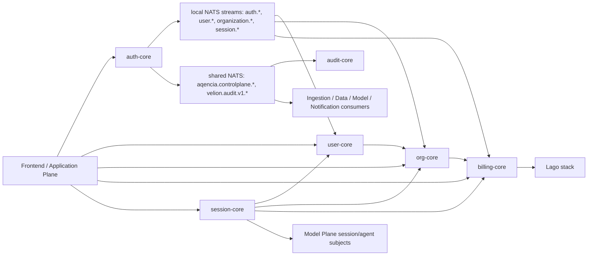

# Control Plane Deep Dive

Generated: 2026-06-07

Scope: `/apps/Control Plane`

This document maps what is in the Control Plane, how the services work together, which relationships are currently wired, and which surfaces appear stale, partial, placeholder, or intentionally unused.

## Executive Summary

Control Plane is the authority plane for identity, user profile, organization, entitlement, quota, billing, session aggregation, and audit/usage records. It does not own product documents, embeddings, retrieval indexes, crawl output, reasoning pipelines, agent memory, or agent execution state.

The plane is implemented as six first-party services plus Lago billing infrastructure:

| Service | Path | Runtime | Main ownership | Primary APIs |
|---|---|---:|---|---|
| `auth-core` | `auth-core/` | NestJS/TypeScript | authentication, Better Auth integration, plane tokens, OAuth, auth events | HTTP, Better Auth, oRPC-style HTTP, NATS request-reply, gRPC |
| `user-core` | `user-core/` | Go | user profile, preferences/settings, provider links, API keys, document ACL gRPC | HTTP, business gRPC, NATS subscribers/publishers |
| `org-core` | `org-core/` | Go | organizations, members, RBAC, entitlements, plan state, BRREG lookup | HTTP, health/reflection gRPC, NATS bridge |
| `billing-core` | `billing-core/` | Go | billing accounts, usage, quotas, invoices, Stripe/Lago facade | HTTP, health/reflection gRPC, NATS subscribers/publishers |
| `session-core` | `session-core/` | Go | Control Session aggregator and legacy Model Plane session bridge | HTTP, NATS bridge, empty gRPC listener |
| `audit-core` | `audit-core/` | Go | append-only audit and usage persistence | HTTP, NATS queue subscribers |
| Lago stack | compose-only | Ruby/Sidekiq/etc. | external billing engine behind billing-core | HTTP UI/API, private Control Plane network |

Current compose wiring has all first-party Control Plane apps on both `controlplane-net` and `inter-plane-bus`. Older architecture notes that say the plane is not on `inter-plane-bus` are superseded by the current `docker-compose.yml`.

## Current Runtime Topology

`docker-compose.yml` defines:

- Shared infrastructure:
  - `controlplane-postgres` on host `5433`, private `controlplane-net`.
  - `controlplane-dragonfly` on host `6380`, private `controlplane-net`.
  - `controlplane-nats` on host `4223`/`8223`, on both `controlplane-net` and `inter-plane-bus`.
- First-party services:
  - `auth-core`, container `auth-service`, HTTP `3011`, gRPC `50011`.
  - `user-core`, container `user-service`, HTTP `3012`, gRPC `50012`, pprof `6060`.
  - `org-core`, container `org-core-service`, HTTP container `8080` exposed as host `18080`, gRPC/metrics host remapped to avoid Model Plane collisions.
  - `billing-core`, container `billing-core-service`, HTTP `3014`, gRPC `50013`, pprof `6062`.
  - `session-core`, container `session-core-service`, HTTP `3017`, gRPC port `50017`.
  - `audit-core`, container `audit-core-service`, HTTP `8187`.
- Lago support services stay on `controlplane-net` only: `lago-db`, `lago-dragonfly`, `lago-api`, `lago-worker`, `lago-clock`, `lago-front`, `lago-pdf`, and `lago-migrate`.

The first-party app services use `controlplane-net` for private database/cache/Lago/NATS access and `inter-plane-bus` for cross-plane service discovery and events. Lago is intentionally private to Control Plane and should be reached through `billing-core`, not directly by other planes.

## Boundary and Ownership

Canonical ownership:

- `auth-core`: authentication, auth sessions from Better Auth, OAuth flows, service auth, token validation, Control/Model/Application plane token issuance.
- `user-core`: durable user profile, preferences, settings, provider-account projection, API keys, document ACL gRPC service.
- `org-core`: organization records, org members, RBAC roles/capabilities, entitlements, plan metadata, BRREG verification/search.
- `billing-core`: billing account state, usage records, quota checks, invoices, checkout sessions, Stripe/Lago integration.
- `session-core`: Control Session snapshots for frontend/BFF consumption, session command bridge to Model Plane, event streaming for legacy session flows.
- `audit-core`: append-only audit and usage rows, org-scoped read APIs.

Explicitly outside this plane:

- Product documents, document bodies, embeddings, retrieval indexes, and crawl state: Data/Ingestion Plane.
- Reasoning pipelines, agent orchestration, execution graphs, capability definitions, LLM routing, and agent-run state: Model Plane.
- Frontend state rendering and BFF orchestration: Frontend/Application Plane.

## Relationship Map



There are two event layers in active use:

1. Local/compatibility subjects on the Control Plane NATS: `auth.>`, `user.>`, `organization.>`, `session.>`, `billing.>`, `usage.>`.
2. Cross-plane subjects on the shared bus: `aqencia.controlplane.>`, `velion.audit.v1.>`, `velion.usage.v1.>`, `app.session.>`, `velion.session.>`, and `velion.agent.>`.

This dual namespace is deliberate during migration, but it means relationship mapping has to record both the local projection flow and the cross-plane notification flow.

## Service Deep Dive

### auth-core

`auth-core` is the broadest service in the plane. It wraps Better Auth, exposes custom Nest controllers, publishes auth/user/org/session events, and issues plane-specific tokens.

Main includes:

- `src/main.ts`: Nest bootstrap, NATS microservice, gRPC microservice, CORS, Swagger, Better Auth catch-all.
- `src/app.module.ts`: module wiring for Better Auth, oRPC module, NATS, docs, internal services, token controllers, users controller, and gRPC controller.
- `src/auth/auth.ts`: Better Auth plugin and provider configuration.
- `src/auth/nats-auth.controller.ts`: NATS request-reply for `session.validate`, `service.authenticate`, and `health.check`.
- `src/grpc/auth-grpc.controller.ts`: gRPC `TokenValidationService.ValidateToken` and `AuthService` methods.
- `src/internal/auth-event.publisher.ts`: publishes auth events to local streams, simplified target streams, shared cross-plane events, and audit events.
- `src/nats/shared-nats.service.ts`: owns `AQENCIA_CONTROLPLANE` stream and publishes `aqencia.controlplane.*`.
- `src/auth/model-plane-token.controller.ts` and `src/auth/plane-token.controller.ts`: token issuance for model/data/ingestion/application-style audiences.
- `src/auth/convex-auth.controller.ts`: Convex JWKS/token bridge.
- `src/internal/internal-oauth.controller.ts` and `src/internal/internal-agent-signup.controller.ts`: internal endpoints guarded by shared internal API key.

HTTP surface:

- Better Auth owns most `/api/auth/*`, except `/api/auth/convex/*`.
- Custom auth API lives under `/api/v2/auth/*`, including sign-in/sign-up/session/profile/consent/email verification/password reset/OAuth/2FA/OTP/passkey/org/API key/bearer/admin endpoints.
- Docs are at `/docs`, `/docs/hub`, `/orpc/openapi.json`, and `/orpc/docs`.
- Plane-token routes are under `/api/:audience/token`, `/api/:audience/internal-token`, `/api/model-plane/token`, and `/api/model-plane/internal-token`.

Events:

- Publishes compatibility events to `auth.*`.
- Dual-publishes target simplified subjects such as `user.created`, `user.updated`, `session.created`, `organization.created`.
- Publishes cross-plane subjects including `aqencia.controlplane.user.registered`, `aqencia.controlplane.user.signed_in`, `aqencia.controlplane.user.provider_linked`, `aqencia.controlplane.org.created`, `aqencia.controlplane.org.member_added`, and `aqencia.controlplane.org.member_removed`.
- Publishes `velion.audit.v1.control.*` only when an `org_id` is present; pre-onboarding users without org context are intentionally skipped for audit ingestion.

Maturity notes:

- Active and central.
- Some live `auth/orpc-router.ts` logic has placeholder or fallback paths for consent persistence, OTP verification, passkeys, HIBP, OAuth provider URLs in development, OIDC client operations, API-key operations, bearer token listing, and admin stats/users. These are not dead files; they are live routes with partial backend implementation.
- Email/SMS integrations have development mock fallbacks when `RESEND_API_KEY` or Twilio Verify config is unavailable. The SMS fallback approves verification in mock mode, so production config must prevent that path.
- `src/orpc/consolidated-auth.controller.ts.unused` is intentionally inactive.
- `src/orpc/unified-auth.controller.ts.unused` is intentionally inactive.
- `src/auth/orpc-router.ts.backup` is backup material, not active source.
- `src/internal/contracts/user-service.contract.ts` currently exports only `placeholder = true`.

### user-core

`user-core` is the profile and user-preference authority. It accepts auth-derived events and provides both frontend-facing HTTP and internal gRPC.

Main includes:

- `cmd/server/main.go`: config, internal-key assertion, database migrations, NATS/auth clients, Dragonfly-backed cache, shared publisher, gRPC and HTTP startup.
- `internal/http/server.go`: REST API for user profile, onboarding state, preferences, settings, calendar/navbar persistence, support requests, providers, and internal membership/provider enrichment.
- `internal/grpc/server.go`: business gRPC server with internal-key interceptors.
- `internal/grpc/handlers.go`: `UserService` implementation.
- `internal/handlers/event_handler.go`: NATS event handlers for auth and organization membership projections.
- `internal/nats/subscriber.go`: subscribes to auth and organization membership events.
- `internal/users/*`: repository/service/domain logic.

HTTP surface:

- `/health`
- `/api/v1/users/me`, `/current`, `/:id`, `/by-email/:email`
- `/api/v1/users/onboarding/complete`
- `/api/v1/users/me/onboarding-state`
- `/api/v1/me/session-context`
- `/api/v1/api-keys`
- `/api/v1/preferences`
- `/api/v1/settings/{appearance,language,privacy,notifications,security,accessibility,ai,storage}`
- `/api/v1/calendar/events`, `/api/v1/calendar/notes`
- `/api/v1/support/requests`
- `/api/v1/providers`
- `/api/v1/internal/memberships/ensure`
- `/api/v1/internal/users/enrich-from-provider`

gRPC surface:

- `UserService` is registered and implements user create/get/update/delete/list/profile/session/activity/role operations.
- `DocumentAccessService` is registered for document ACL grant/revoke/get/list/check operations.
- All gRPC calls require `x-internal-api-key`.

Events:

- Subscribes to `auth.user.registered`, `auth.user.login`, `auth.user.logout`, `auth.user.profile_updated`, `auth.session.created`, `auth.session.ended`, `auth.user.provider_linked`, `auth.organization.member_added`, `auth.organization.member_removed`, `organization.member.added`, and `organization.member.removed`.
- Publishes local user/profile/session/activity/membership events.
- Has shared publisher support for cross-plane events, but see the document ACL note below.

Maturity notes:

- Active and relatively complete.
- `DocumentAccessService` is registered, but the current construction passes `nil` for the shared publisher. That means document ACL gRPC changes do not emit shared cross-plane ACL-change events through that handler path.
- Device-management gRPC methods are deliberately unimplemented; comments direct callers to session `user_agent`/IP tracking instead.
- Some user service TODOs remain around activity logging for block/suspend reasons, suspension expiry, and an admin-role check on `GET /api/v1/users/:id`.

### org-core

`org-core` is the organization, member, RBAC, entitlement, and quota authority.

Main includes:

- `cmd/server/main.go`: config, internal-key assertion, DB migrations, org/RBAC repos, Dragonfly-backed cache, local NATS publisher/subscriber, shared publisher, HTTP/gRPC/metrics startup.
- `internal/http/server.go`: org, entitlements, BRREG, member, RBAC, and internal onboarding routes.
- `internal/org/*`: organization service/repository.
- `internal/rbac/*`: role/capability repository and API support.
- `internal/nats/subscriber.go`: bridges auth events into org/user/session/organization events.
- `internal/nats/shared_publisher.go`: publishes cross-plane org events.

HTTP surface:

- `/health`
- `/api/v1/auth/login`
- `/api/v1/users/me`
- `/api/v1/organizations`, `/:id`, `/:id/entitlements`, `/:id/members/search`
- `/api/v1/organizations/:id/plan`
- `/api/v1/organizations/:id/brreg`
- `/api/v1/brreg/search`, `/api/v1/brreg/:orgnr`
- Frontend proxy routes `/orgs`, `/orgs/me`, `/orgs/:id`, `/orgs/:id/entitlements`, `/orgs/:id/capabilities`, `/orgs/:id/members`, invite/remove/search.
- RBAC routes `/orgs/:id/roles/catalog`, `/orgs/:id/roles`, role update/delete, member role assignment.
- Internal onboarding routes `/internal/orgs/by-tenant`, `/internal/orgs/ensure-from-tenant`, `/internal/orgs/:orgId/onboarding/state`.

gRPC surface:

- The gRPC server registers health and reflection only. No org business service is registered in the inspected server.

Events:

- Subscribes to `auth.>` and bridges:
  - `auth.user.registered` -> `user.created`
  - `auth.user.profile_updated` -> `user.updated`
  - `auth.user.deleted` -> `user.deleted`
  - `auth.session.created` -> `session.created`
  - `auth.session.ended` and `auth.user.logout` -> `session.ended`
  - `auth.organization.created` -> upsert org and publish `organization.created`
- Publishes cross-plane org subjects such as org created/updated/deleted, member added/removed, and plan changed.

Maturity notes:

- Active.
- Business API is HTTP-first today; gRPC port should be treated as health/reflection until a service is registered.
- RBAC repository permits a role with no permissions as a placeholder state; this is intentional, not dead code.

### billing-core

`billing-core` is the billing account, usage, quota, invoice, and checkout facade. It integrates with Stripe and Lago adapters.

Main includes:

- `cmd/server/main.go`: internal-key assertion, DB migrations, Dragonfly-backed cache, Stripe/Lago adapters, billing service, retry processor, trial expiry sweep, shared/local NATS, HTTP and gRPC startup.
- `internal/http/server.go`: billing account/usage/entitlement/quota/invoice/checkout HTTP API.
- `internal/billing/*`: service, repository, retry jobs, trial logic.
- `internal/adapters/*`: Stripe and Lago clients.
- `internal/nats/subscriber.go`: subscribes to usage and organization lifecycle/plan events.
- `internal/nats/shared_publisher.go`: publishes cross-plane billing events.

HTTP surface:

- `/health`
- `/api/v1/billing/orgs/:orgId/account` GET/PUT
- `/api/v1/billing/orgs/:orgId/usage`
- `/api/v1/billing/orgs/:orgId/entitlements/:feature`
- `/api/v1/billing/orgs/:orgId/quotas/:metric`
- `/api/v1/billing/orgs/:orgId/invoices`
- `/api/v1/billing/orgs/:orgId/checkout-session`

gRPC surface:

- The gRPC server registers health and reflection only. No billing business service is registered in the inspected server.

Events:

- Subscribes to `usage.>`.
- Subscribes to `organization.created`, `organization.updated`, `organization.plan.changed`, and `organization.deleted`.
- Publishes cross-plane billing subjects including account updated, quota exceeded, invoice created, and plan changed.

Maturity notes:

- Active.
- Business API is HTTP-first today; gRPC port should be treated as health/reflection until a service is registered.

### session-core

Control Plane `session-core` is not the full agent orchestration runtime. Its current responsibilities are Control Session aggregation plus legacy/model-plane session command bridging.

Main includes:

- `cmd/server/main.go`: config, internal-key assertion, migrations, local/shared NATS, Dragonfly-backed cache, Convex mirror, upstream invalidator, HTTP startup, and placeholder gRPC listener.
- `internal/http/server.go`: legacy session endpoints and Control Session aggregator endpoints.
- `internal/service/control_session_service.go`: builds user/org/billing snapshot for frontend/BFF consumption.
- `internal/service/session_service.go`: legacy session commands, state, events, approvals.
- `internal/clients/*`: user/org/billing HTTP clients.
- `internal/nats/*`: shared/local NATS bridge for session and agent event subjects.
- `internal/subscribers/upstream_invalidator.go`: invalidates cached Control Sessions when user/org/billing events arrive.

HTTP surface:

- `/health`
- `/v1/sessions`
- `/v1/sessions/:id/state`
- `/v1/sessions/:id/events`
- `/v1/sessions/:id/messages`
- `/v1/sessions/:id/approvals/:approval_id`
- `/v1/sessions/:id/resume`
- `/api/v1/sessions/current`
- `/api/v1/sessions/refresh`

Event/model bridge:

- Publishes session commands to `velion.session.{sessionID}.command` for v2 and `aqencia.reasoning.session.{sessionID}.command` for v1.
- Subscribes to agent events on `velion.agent.run.{sessionID}.event` for v2 and `aqencia.reasoning.run.{sessionID}.event` for v1.
- Publishes session events and `app.session.entitlements_changed`.
- Subscribes to user/org/billing change subjects for cache invalidation.

Maturity notes:

- The `/v1/{plans,todos,lineage}` agent-run routes were intentionally decommissioned on 2026-05-12. Comments point to Rust Model Plane `session-core` as the authoritative owner.
- `cmd/server/main.go` opens a gRPC listener when configured, but no services are registered. Treat port `50017` as not a business API today.
- The upstream invalidator cannot invalidate all affected user snapshots for org-only events because there is no per-org reverse index. It relies on a 30-second TTL or explicit refresh.
- The smoke test script still contains old todo-route probes. That script appears stale relative to the decommissioned HTTP surface.

### audit-core

`audit-core` persists audit and usage events and exposes org-scoped read APIs.

Main includes:

- `cmd/server/main.go`: database migration, NATS connection, subscriber startup, HTTP startup.
- `internal/subscriber/subscriber.go`: queue-subscribes audit and usage subjects.
- `internal/api/api.go`: health, audit/usage reads, audit ingest endpoint.
- `internal/store/*`: persistence.
- `internal/events/*`: event decoding/validation.

HTTP surface:

- `/healthz`
- `/readyz`
- `/v1/audit`
- `/v1/usage`
- `/v1/usage/summary`

Events:

- Queue-subscribes `velion.audit.v1.>` and `velion.usage.v1.>` under group `audit-core`.
- Malformed payloads and store errors are logged but not retried or NAKed. The code treats these as observability data where poison-pill retries should not stall the subject.

Maturity notes:

- Active and intentionally narrow.
- `internal/api/api.go` permits reads/writes if `INTERNAL_API_KEY` is empty. Compose defaults a development key, but production should enforce a real secret and avoid an empty value.

## Storage and Migrations

Control Plane services share `controlplane-postgres` at the compose level, but each service owns its own migrations/schema area.

- `auth-core`: Drizzle migrations plus Better Auth init and GDPR hard-delete migration.
- `user-core`: user profile/preferences/settings/provider/API-key/document-ACL/onboarding migrations.
- `org-core`: org/member/RBAC/enterprise/BRREG/onboarding migrations.
- `billing-core`: billing account/usage/retry/trial migrations.
- `session-core`: session tables, org-to-session migration, orchestration scaffold migration, then `005_drop_agent_run_scaffold`.
- `audit-core`: append-only audit and usage tables.

Upper planes should consume Control Plane via APIs/events. They should not write directly to these databases.

## Relationship Coverage

Mapped and active:

- `auth-core` -> `user-core`: auth events and internal user-service integration.
- `auth-core` -> `org-core`: organization events and organization event middleware.
- `auth-core` -> cross-plane consumers: `aqencia.controlplane.*` and plane-token endpoints.
- `auth-core` -> `audit-core`: `velion.audit.v1.control.*` when org context exists.
- `user-core` -> `auth-core`: `service.authenticate` NATS request-reply and Better Auth/OAuth client paths.
- `user-core` -> `org-core`: default `ORG_SERVICE_URL` is `http://org-core:8080`; used for session context and membership enrichment paths.
- `org-core` -> `auth-core`/`user-core`: configured HTTP clients plus auth-event bridge.
- `org-core` -> `billing-core`: organization and plan subjects consumed by billing.
- `billing-core` -> Lago/Stripe: adapter-backed billing operations.
- `session-core` -> `user-core`/`org-core`/`billing-core`: Control Session aggregation.
- `session-core` -> Model Plane: session commands and agent event stream bridge.
- `audit-core` <- shared bus: audit and usage event ingestion.

Mapped but partial:

- `session-core` gRPC is exposed but has no registered services.
- `org-core` gRPC is health/reflection only.
- `billing-core` gRPC is health/reflection only.
- `user-core` document ACL gRPC is registered, but shared cross-plane publishing is not wired through the current handler construction.
- `session-core` org-only cache invalidation is bounded by TTL because there is no reverse index.
- `auth-core` oRPC-style router exposes many advanced auth/admin endpoints with placeholder/fallback implementation paths.

Unmapped or likely unused:

- `auth-core/src/orpc/consolidated-auth.controller.ts.unused`: inactive by extension and by docs.
- `auth-core/src/orpc/unified-auth.controller.ts.unused`: inactive by extension.
- `auth-core/src/auth/orpc-router.ts.backup`: backup file; not part of runtime.
- `auth-core/src/internal/contracts/user-service.contract.ts`: placeholder-only export.
- `session-core/scripts/smoke_test_api.sh`: still tests old todo endpoints even though `/v1/{plans,todos,lineage}` routes were decommissioned.
- `session-core/API_REFERENCE.md`, `session-core/IMPLEMENTATION_SUMMARY.md`, and `session-core/90_PERCENT_COMPLETE.md`: still describe old plan/todo/lineage surfaces and should be treated as historical unless reconciled with the 2026-05-12 decommission.

## Stub, Mock, Placeholder, and TODO Audit

The expanded scan covered `stub`, `mock`, `placeholder`, `TODO`, `FIXME`, `not implemented`, `unimplemented`, `.unused`, and `.backup` across `apps/Control Plane`, excluding generated protobuf files, dependency directories, build outputs, and lockfiles when classifying runtime concerns.

Runtime-relevant findings:

- `auth-core/src/auth/auth.ts`: uses a mock Resend email sender when `RESEND_API_KEY` is missing or initialization fails; uses a mock SMS service if Twilio Verify initialization fails.
- `auth-core/src/email/resend.service.ts`: logs mock verification/password-reset/OTP emails when Resend is not configured.
- `auth-core/src/sms/twilio-verify.service.ts`: logs mock SMS sends and returns successful verification when Twilio is not configured.
- `auth-core/src/auth/orpc-router.ts`: active TODOs/placeholders for consent persistence, passkey creation fallback, development mock OAuth URLs, HIBP password check, bearer token listing persistence, organization count, and several admin/OIDC/API-key routes.
- `auth-core/src/auth/audit-plugin.ts`: contains a development mock audit logger.
- `auth-core/src/internal/contracts/user-service.contract.ts`: placeholder-only file.
- `user-core/internal/http/handlers.go`: `GET /api/v1/users/:id` has a TODO to add an admin-role check.
- `user-core/internal/users/service.go`: block/suspend paths still need activity logging and suspension-expiry handling.
- `user-core/internal/grpc/handlers.go`: `CreateSession` and device-management methods intentionally return `codes.Unimplemented`.
- `session-core/cmd/server/main.go`: gRPC listener can start, but no services are registered.
- `session-core` old todo/plan/lineage docs and smoke script conflict with the decommissioned HTTP surface.

Not treated as runtime problems:

- `go.uber.org/mock`, Jest mocks, fake timers, and OAuth mock server entries in `go.mod`, `go.sum`, and package lockfiles are test/dependency infrastructure.
- `.env.example` and production template placeholders are expected configuration templates, but production deploys must replace them.
- Go `internalkey/assert.go` placeholder detection is defensive validation, not unfinished product logic.

Documentation drift:

- `CONTROL_PLANE_ARCHITECTURE.md` contains an older audit section saying Control Plane services are not on `inter-plane-bus` and container names are stale. The same document later says that remediation is complete, and current compose confirms services are on `inter-plane-bus`.
- Prefer `docker-compose.yml` for current container names, network membership, and exposed ports.

## Operational Notes

Useful local checks:

```bash
docker compose -f "apps/Control Plane/docker-compose.yml" config
docker compose -f "apps/Control Plane/docker-compose.yml" ps
docker compose -f "apps/Control Plane/docker-compose.yml" logs auth-core user-core org-core billing-core session-core audit-core
```

Focused tests by service:

```bash
cd "apps/Control Plane/auth-core" && npm test
cd "apps/Control Plane/user-core" && go test ./...
cd "apps/Control Plane/org-core" && go test ./...
cd "apps/Control Plane/billing-core" && go test ./...
cd "apps/Control Plane/session-core" && go test ./...
cd "apps/Control Plane/audit-core" && go test ./...
```

Security checks that matter most for this plane:

- Ensure `INTERNAL_API_KEY` and `INTERNAL_SERVICE_SECRET` are real shared secrets in every service.
- Ensure production does not run audit-core with an empty internal API key.
- Keep cross-plane token issuance endpoints restricted to trusted service callers.
- Treat Better Auth/OAuth provider secrets as environment-only secrets.
- Avoid direct database writes from upper planes.

## Follow-Up Candidates

1. Decide whether `org-core` and `billing-core` gRPC ports should remain health/reflection only or get real service definitions.
2. Wire shared publishing into `user-core` `DocumentAccessService` if document ACL changes need cross-plane event consumers.
3. Remove or relocate `.backup`, `.unused`, and placeholder-only files if they are no longer useful for migration history.
4. Update or remove `session-core/scripts/smoke_test_api.sh` todo-route checks.
5. Add a per-org reverse index for Control Session cache invalidation if org-wide entitlement changes need sub-30-second correctness.
6. Normalize the event namespace migration plan so consumers know when to prefer `auth.*`/`organization.*` versus `aqencia.controlplane.*` subjects.
