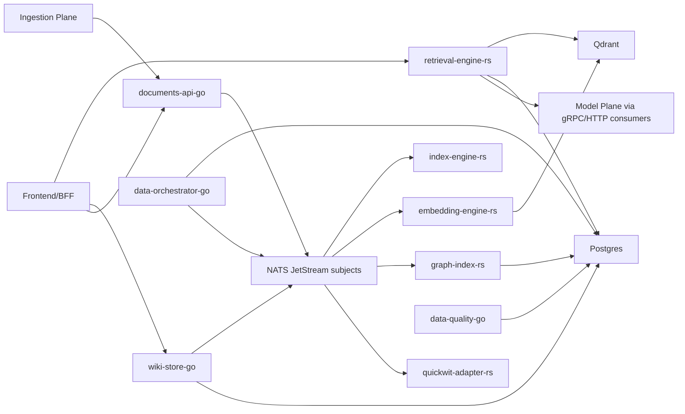

# Data Plane v2 Deep Dive

> **2026-07-20 correction:** the claims below and at lines ~148, 377, 400, 445
> that `documents-api-go` "defaults to observe mode (`AUTHCTX_ENFORCE=0`)" are
> stale. `docker-compose.yml` now sets `AUTHCTX_ENFORCE: "1"` for this service,
> and the live container was re-verified this pass with real `curl` calls:
> requests with no bearer token or a bogus bearer token both return `401`
> (genuine enforcement, not a pass-through). This is confirmed for
> `documents-api-go` only — the other Go services' enforce-mode status was not
> re-checked in this pass.

Generated: 2026-06-07

**Verified 2026-07-10**: Live `docker ps` against the running `dpv2-*` compose stack reconfirms every port/container in the topology table below (all 15 containers healthy, ports unchanged). The HTTP route lists for `documents-api-go` and `wiki-store-go` were re-checked against current source and remain accurate. Two "not implemented" claims in the original 2026-06-07 draft are now stale — see the updated `documents-api-go` and `retrieval-engine-rs` Maturity notes below. This document still does not cover the security/compliance findings uncovered in the later plane audit — org-scoped no-credential access on `graph-index-rs`/`data-quality-go`/`data-orchestrator-go`, the `wiki-store-go` `deleted_at` HTTP 500, and ZDR persistence gaps. For those, `docs/core-research/plane-audit-2026-07-02.md` (with its 2026-07-10 addendum) is the current, more authoritative source of truth; this deep dive remains useful as the structural/topology map.

Scope: `/apps/Data Plane v2`

This document maps what is in Data Plane v2, how the services work together, which relationships are currently wired, and which surfaces appear stale, partial, placeholder, or intentionally scaffolded.

## Executive Summary

Data Plane v2 is the canonical durable-knowledge plane. It owns document CRUD, knowledge-unit extraction, embeddings, retrieval, graph extraction, wiki/version storage, orchestration jobs, and retrieval quality/eval gates. Other planes may call its APIs, but they should not write Data Plane storage directly or embed/rerank independently outside isolated eval labs.

The current implementation is a mixed Go and Rust service stack with shared Postgres, Dragonfly, Qdrant, NATS JetStream, MinIO, and Quickwit infrastructure.

| Service | Path | Runtime | Main ownership | Primary APIs |
|---|---|---:|---|---|
| `documents-api-go` | `services/documents-api-go/` | Go | document CRUD, org-scoped ingest, source object lifecycle | HTTP |
| `index-engine-rs` | `services/index-engine-rs/` | Rust | chunking, fingerprinting, knowledge-unit creation | admin HTTP + NATS consumer |
| `embedding-engine-rs` | `services/embedding-engine-rs/` | Rust | embedding batches, Qdrant upsert/delete, wiki embedding subscriber | admin HTTP + NATS/JetStream consumers |
| `retrieval-engine-rs` | `services/retrieval-engine-rs/` | Rust | hybrid retrieval, traces, context packing, graph/wiki search, gRPC tools | HTTP + gRPC |
| `graph-index-rs` | `services/graph-index-rs/` | Rust | graph extraction, relationships/claims/communities, graph retrieval wire | admin HTTP + gRPC + NATS consumer |
| `wiki-store-go` | `services/wiki-store-go/` | Go | wiki pages, versions, backlinks, proposals, maintenance/source logs | HTTP + gRPC |
| `data-orchestrator-go` | `services/data-orchestrator-go/` | Go | reindex/rebuild/wiki/graph jobs, stale embedding detection | HTTP |
| `data-quality-go` | `services/data-quality-go/` | Go | eval runs, trust scoring, gates, lint, cost summary | HTTP |
| `retrieval-eval-py` | docs reference only | Python | offline eval/lab harness target | currently not present as a populated runtime service |

Current compose wiring puts almost every service and most infra on both `dpv2-net` and `inter-plane-bus`. MinIO and `minio-init` stay private to `dpv2-net`.

## Current Runtime Topology

`docker-compose.yml` defines:

- Shared infrastructure:
  - `postgres` on host `5442`.
  - `dragonfly` on host `6389`.
  - `qdrant` on hosts `6345`/`6346`.
  - `nats` on host `4232`.
  - `minio` on hosts `9010`/`9011`.
  - `quickwit` on host `7280`.
- Rust services:
  - `retrieval-engine` on HTTP `8014` and gRPC `50062`.
  - `index-engine` on `9201`.
  - `embedding-engine` on `9202`.
  - `graph-index` on `9203`.
  - `quickwit-adapter` on `9204`.
- Go services:
  - `documents-api` on `8010`.
  - `wiki-store` on `8011`.
  - `data-orchestrator` on `8012`.
  - `data-quality` on `8013`.
- Optional observability:
  - `prometheus` on `9090`.
  - `grafana` on `3001`.

Topology intent:

- Postgres is the canonical durable store for documents, knowledge-unit metadata, traces, graph/wiki state, and quality artifacts.
- Qdrant stores dense vectors provisioned by `embedding-engine-rs`.
- Quickwit is the sparse/read-model sidecar used by retrieval and the Quickwit adapter.
- NATS JetStream is the async backbone between ingest, indexing, embeddings, graph extraction, and cost/event publishing.

## Boundary and Ownership

Canonical Data Plane ownership:

- Documents, source objects, knowledge units, chunk fingerprints.
- Embeddings and vector collection lifecycle.
- Retrieval traces, candidate sets, context packing, sparse/dense/rerank policy.
- Graph entities, relationships, claims, communities, and graph-to-text-unit mappings.
- Wiki pages, versions, backlinks, proposals, source logs, maintenance logs.
- Data maintenance jobs, stale embedding detection, release gates, and trust/eval scoring.

Explicitly outside this plane:

- Browser capture, crawling, imports, and raw evidence acquisition: Ingestion Plane.
- Planning, reasoning, tool choice, agent loops, and wiki maintenance decisions: Model Plane.
- Human-facing workspace, graph/wiki UX, chat UX, and BFF orchestration: Application/Frontend Plane.

## Relationship Map



The plane uses both synchronous APIs and asynchronous event flow:

1. Synchronous CRUD and retrieval on HTTP/gRPC.
2. Event-driven indexing and maintenance over JetStream/NATS.
3. Cross-plane consumption through `inter-plane-bus`.

## Service Deep Dive

### documents-api-go

`documents-api-go` is the document ingress and metadata authority for Data Plane v2.

Main includes:

- `cmd/main.go`: config, Postgres, NATS, outbox publisher, auth context middleware, document/source routes.
- `internal/handler/*`: document and source-object HTTP handlers.
- `internal/events/*`: NATS publisher and outbox flow.
- `pkg/authctx/*`: auth-core JWT transition middleware.
- `pkg/usagepub/*`: usage/audit publisher wiring.

HTTP surface:

- `/health`
- `/readyz`
- `/metrics`
- `/v1/documents`
- `/v1/documents/bulk`
- `/v1/documents/{documentID}`
- `/v1/sources`
- `/v1/source-objects`
- `/v1/source-objects/duplicates`
- `/v1/source-objects/delete`

Relationships:

- Uses internal API key middleware for service auth.
- Runs `authctx` middleware to transition from `X-Org-ID` trust toward verified auth-core JWT claims.
- Publishes document lifecycle events via NATS outbox.

Maturity notes:

- Active and central.
- **Updated 2026-07-10**: `pkg/authctx` is no longer an unimplemented stub. `pkg/authctx/verify.go` (committed 2026-07-07) implements real RS256 JWT verification against a static `JWT_PUBLIC_KEY_FILE` and/or an auth-core JWKS endpoint (with `kid` rotation), with passing tests in `verify_test.go`. The running `dpv2-documents-api` container has `AUTHCTX_ENFORCE=0` (observe mode) but already has a valid key mounted at `/app/keys/convex-auth.pub`, so flipping to enforce mode today would perform real signature verification, not a blanket `503`. `503` now only fires if enforce mode is on and neither the key file nor a JWKS URL resolves. The package's own top-of-file doc comment still describes the Verify path as "intentionally stubbed" — that source comment is itself stale and should be corrected.
- The handler wiring creates a usage publisher, but the documented comment says the call sites are still follow-up work.

### index-engine-rs

`index-engine-rs` builds knowledge units from document content and consumes Data Plane document events.

Main includes:

- `src/main.rs`: Postgres, NATS JetStream, admin server, stream consumer.
- `chunker`, `fingerprint`, `normalizer`, `extract`, `builder`, `stream`: chunking and knowledge-unit pipeline.

Surface:

- Admin/health HTTP on `9201`.
- NATS JetStream consumer for document indexing flow.

Maturity notes:

- Active.
- The service is event-driven and intentionally narrow; its user-facing contract is downstream via retrieval, not direct app-facing APIs.

### embedding-engine-rs

`embedding-engine-rs` embeds indexed knowledge units and wiki blocks, manages Qdrant collections, and writes vectors.

Main includes:

- `src/main.rs`: Postgres, Qdrant, provider selection, JetStream consumer, wiki subscriber, admin server.
- `provider`, `batch`, `qdrant_writer`, `stream`, `wiki_consumer`.

Surface:

- Admin/health HTTP on `9202`.
- JetStream consumers for knowledge units and wiki-version embedding flow.

Relationships:

- Provisions primary, wiki-block, and entity-summary Qdrant collections at boot.
- Uses Azure OpenAI by default in compose for index-time embedding because the Model Plane gRPC embedding hop is documented as still problematic.

Maturity notes:

- Active.
- The service is production-shaped, but its default compose path is a temporary provider-routing workaround rather than the intended Model Plane gRPC path.

### retrieval-engine-rs

`retrieval-engine-rs` is the main app-facing query surface for Data Plane v2.

Main includes:

- `src/main.rs`: tracing, Postgres, Qdrant, embedder, reranker, Dragonfly cache, optional NATS invalidator, optional JWKS cache, policy client selection, HTTP server, gRPC server.
- `api`, `grpc`, `pipeline`, `search`, `trace`, `context_pack`, `authz`, `cache`, `rate_limit`, `redact`.

Surface:

- HTTP on `8014`.
- gRPC on `50062`.
- Exposes retrieval, trace, graph/wiki/knowledge search, and gateway-facing tool endpoints through its HTTP/gRPC surfaces.

Relationships:

- Reads vectors from Qdrant and canonical metadata from Postgres.
- Can use Postgres sparse search or Quickwit-backed sparse search with fallback.
- Can consume policy context from Control Plane in strict/permissive enforcement modes.
- Starts optional cache invalidation subscribers via NATS.

Maturity notes:

- Active and feature-rich.
- JWKS support exists, but compose and docs show multiple transitional auth/policy modes are still in play.
- Compose comments record a known deeper gRPC issue on the Data Plane -> Model Plane embedding hop; the service works around it by defaulting query embeddings to direct Azure HTTP.
- **Updated 2026-07-10**: `tests/pipeline_e2e.rs` is no longer a scaffold. All three tests (`happy_path`, `zdr_reject_filters_restricted`, `cache_invalidation_via_org_version`) have real, non-trivial bodies. The latter two carry `#[ignore = "requires docker-compose stack"]` so a bare `cargo test` skips them, but they are implemented, not unwritten TODOs.

### graph-index-rs

`graph-index-rs` extracts and serves graph structure from indexed content.

Main includes:

- `src/main.rs`: Postgres, extractor, JetStream consumer, HTTP server, gRPC server, orphan cleanup subscriber.
- `extractor`, `store`, `community`, `grpc`, `stream`.

Surface:

- HTTP admin/API on `9203`.
- gRPC on a separate graph port configured in service config.

Relationships:

- Consumes document/index events via JetStream.
- Persists graph entities, relationships, claims, communities, and mappings in Postgres.

Maturity notes:

- Active.
- The service is documented as GraphRAG-ready, but older docs still describe some not-yet-started AST-first extraction work that is not visible as a live runtime surface here.

### quickwit-adapter-rs

`quickwit-adapter-rs` keeps Quickwit aligned with the canonical Data Plane corpus and can rebuild its sparse read model.

Main includes:

- `src/main.rs`: Quickwit ensure-index, optional rebuild-on-start, NATS subscriber, admin server.
- `quickwit`, `rebuild`, `stream`, `api`.

Surface:

- Admin/health HTTP on `9204`.

Maturity notes:

- Active.
- Runtime is explicitly adapter/rebuild oriented, not app-facing.

### wiki-store-go

`wiki-store-go` is the durable wiki/version source of truth.

Main includes:

- `cmd/main.go`: Postgres, optional NATS publisher, HTTP server, gRPC server.
- `internal/repo/*`: page/version/proposal/source-log/maintenance-log persistence.
- `internal/handler/*`: wiki HTTP routes.
- `internal/grpcserver/*`: gRPC wiki wire.

HTTP surface:

- `/health`
- `/readyz`
- `/metrics`
- `/v1/wiki/pages`
- `/v1/wiki/pages/by-path`
- `/v1/wiki/pages/{pageID}`
- `/v1/wiki/pages/{pageID}/versions`
- `/v1/wiki/pages/{pageID}/diff`
- `/v1/wiki/pages/{pageID}/backlinks`
- `/v1/wiki/pages/{pageID}/proposals`
- `/v1/wiki/proposals/review`
- `/v1/wiki/pages/{pageID}/source-logs`
- `/v1/wiki/pages/{pageID}/maintenance-logs`
- `/v1/wiki/maintenance/sweep`

gRPC surface:

- `WikiService` is registered and served on a separate port.

Maturity notes:

- Active.
- NATS publishing is optional; if `NATS_URL` is missing the repo remains silent, which is useful for local dev but means wiki embedding events disappear.

### data-orchestrator-go

`data-orchestrator-go` is the maintenance and rebuild control plane inside Data Plane v2.

Main includes:

- `cmd/main.go`: Postgres, NATS, job executor, stale detector, cost consumer, HTTP routes.
- `internal/jobs/*`, `internal/handler/*`, `internal/cost/*`.

HTTP surface:

- `/health`
- `/readyz`
- `/metrics`
- `/v1/orchestrator/jobs`
- `/v1/orchestrator/reindex`
- `/v1/orchestrator/stale-embeddings`

Maturity notes:

- Active.
- This is operator/internal-facing control logic, not a human product surface.

### data-quality-go

`data-quality-go` owns eval, gates, lint, trust, and cost summary views.

Main includes:

- `cmd/main.go`: Postgres, eval runner, trust scorer, gate checker, linter, cost query, HTTP routes.
- `internal/eval`, `trust`, `gates`, `lint`, `cost`, `handler`.

HTTP surface:

- `/health`
- `/readyz`
- `/metrics`
- `/v1/evals/retrieval`
- `/v1/evals/retrieval/{evalID}`
- `/v1/evals/compare`
- `/v1/quality/trust`
- `/v1/quality/gates`
- `/v1/quality/lint`
- `/v1/cost/summary`

Maturity notes:

- Active.
- Docs still talk about a Python `retrieval-eval-py` scaffold, but the current runtime quality surface is clearly the Go service.

## Storage and Event Layers

Primary stores:

- Postgres: canonical metadata, wiki, graph, traces, eval, maintenance.
- Qdrant: dense vectors.
- Quickwit: sparse/read-model index.
- Dragonfly: retrieval cache layer.
- MinIO: Quickwit object storage backend.

Main event relationships:

- `documents-api-go` publishes document lifecycle via NATS outbox.
- `index-engine-rs` consumes document events and emits knowledge-unit progression.
- `embedding-engine-rs` consumes knowledge-unit and wiki-version events.
- `graph-index-rs` consumes indexed-document events.
- `quickwit-adapter-rs` consumes rebuild/update signals.
- Cost ledger and invalidation flows also ride NATS.

## Stub, Mock, Placeholder, and TODO Audit

The scan covered `stub`, `mock`, `placeholder`, `TODO`, `FIXME`, `not implemented`, `unimplemented`, `.unused`, and `.backup` across `apps/Data Plane v2`, excluding generated protobufs, dependency directories, lockfiles, and build outputs when classifying runtime concerns.

Runtime-relevant findings:

- **Updated 2026-07-10**: `services/documents-api-go/pkg/authctx/authctx.go`'s package doc comment still calls the Verify path stubbed, but `verify.go` (added 2026-07-07) implements it for real; `503` now only fires if `AUTHCTX_ENFORCE=1` and neither a key file nor a JWKS URL resolves — not because verification code is missing.
- **Updated 2026-07-10**: `services/retrieval-engine-rs/tests/pipeline_e2e.rs` re-verified; all three tests are implemented (not TODO stubs). Two are `#[ignore]`d pending a live docker-compose stack rather than unwritten.
- `tests/e2e/README.md` describes more complete scenarios than the current `pipeline_e2e.rs` implementation actually provides.
- `docs/gap-data.md` still describes `retrieval-eval-py` as a scaffold target, but the current tree does not show a populated Python runtime service under `services/retrieval-eval-py`.
- `Makefile` still refers to creating `verevon-net` as a local stub network name; current compose actually uses `inter-plane-bus`.

Not treated as runtime problems:

- `scripts/gen-clients.sh` and generated `gen/` stubs are expected client-generation tooling.
- Documentation mentions of historical placeholders or accepted divergences are records, not necessarily live defects.

## Relationship Coverage

Mapped and active:

- Ingestion -> Data Plane document ingest via `documents-api-go`.
- Documents -> indexing -> embedding -> retrieval graph pipeline through NATS.
- Wiki -> embedding flow through published wiki version events when NATS is configured.
- Frontend/BFF/Model Plane -> retrieval/wiki/document APIs via HTTP/gRPC.
- Retrieval -> Postgres/Qdrant/Quickwit/Dragonfly hybrid stack.

Mapped but partial:

- Data Plane auth transition is incomplete in *rollout*, not in *code*: `authctx` signature verification now exists and passes tests (updated 2026-07-10), but the plane still defaults to observe mode (`AUTHCTX_ENFORCE=0`), so the multi-tenant header-trust gap stays open in practice pending the rollout flip.
- Retrieval and embedding default to direct Azure HTTP in compose because the intended Data Plane -> Model Plane embedding gRPC hop still has a documented issue.
- End-to-end pipeline testing is only partially realized in code.
- Optional NATS on `wiki-store-go` means some local/dev modes suppress downstream embedding propagation.

Potentially stale or historical surfaces:

- `docs/gap-data.md` is valuable as a change log, but it is not the clean source of truth for the current runtime because it mixes completed work, remaining work, and historical wave notes.
- `docs/WIRE_SURFACE_PLAN.md` includes orchestration concepts such as run/agent CRUD and plan/todo/approval transitions that belong closer to Model Plane than the current Data Plane runtime surface.
- `tests/e2e/README.md` currently overstates what the checked-in e2e code exercises.

## Stale-Doc Candidates

Likely candidates for later cleanup register:

- `docs/gap-data.md`: keep as historical audit log unless replaced by a clearer current-state design doc; not suitable as the primary source of truth.
- `tests/e2e/README.md`: update or downgrade to scaffold status unless the missing scenarios are implemented.
- `docs/WIRE_SURFACE_PLAN.md`: verify whether the run/agent/plan/todo language is still intended for Data Plane; likely needs narrowing or relocation.

## Operational Notes

Useful local checks:

```bash
docker compose -f "apps/Data Plane v2/docker-compose.yml" config
docker compose -f "apps/Data Plane v2/docker-compose.yml" ps
docker compose -f "apps/Data Plane v2/docker-compose.yml" logs retrieval-engine documents-api wiki-store index-engine embedding-engine graph-index quickwit-adapter
```

Focused tests by service:

```bash
cd "apps/Data Plane v2/services/documents-api-go" && go test ./...
cd "apps/Data Plane v2/services/wiki-store-go" && go test ./...
cd "apps/Data Plane v2/services/data-orchestrator-go" && go test ./...
cd "apps/Data Plane v2/services/data-quality-go" && go test ./...
cd "apps/Data Plane v2" && cargo test -p retrieval-engine-rs
cd "apps/Data Plane v2" && cargo test -p embedding-engine-rs
cd "apps/Data Plane v2" && cargo test -p graph-index-rs
cd "apps/Data Plane v2" && cargo test -p index-engine-rs
cd "apps/Data Plane v2" && cargo test -p quickwit-adapter-rs
```

## Follow-Up Candidates

1. ~~Complete verified JWT enforcement in `documents-api-go/pkg/authctx`~~ — implemented 2026-07-07 (`verify.go`); remaining work is flipping `AUTHCTX_ENFORCE=1` plane-wide once upstream callers mint audience-scoped tokens, and closing the still-open org-trust gaps on `graph-index-rs`/`data-quality-go`/`data-orchestrator-go` documented in `docs/core-research/plane-audit-2026-07-02.md`.
2. Resolve the Data Plane -> Model Plane embedding gRPC hop so compose defaults can move off direct Azure HTTP.
3. Either implement the documented e2e retrieval scenarios or reduce the README claims to match the checked-in tests.
4. Decide whether `retrieval-eval-py` should exist as a real lab directory or be removed from current-state docs.
5. Tighten Data Plane docs so runtime truth is separated from historical gap logs and wave journals.
