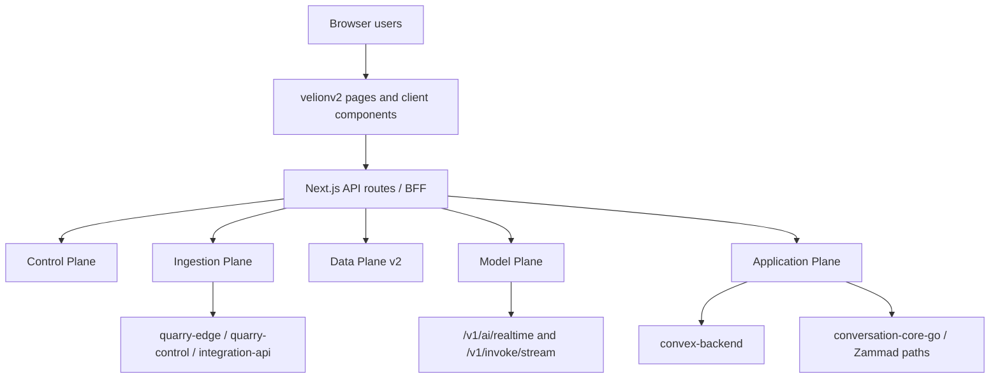

# Frontend Plane Deep Dive

## Executive Summary

The Frontend Plane is not only a UI shell. In `velionv2` it is a Next.js 16 App Router application that also acts as the browser-facing boundary and BFF for the rest of CoreSystem. It authenticates the caller against Control Plane, normalizes request/response envelopes, mints audience tokens for downstream planes, and exposes the operational product surfaces that users actually work in.

The current `velionv2` tree is a real cross-plane integration surface with broad coverage:

1. Control Plane identity, org, billing, and optional session aggregation.
2. Ingestion Plane onboarding, source discovery, Quarry search/scrape, and integration APIs.
3. Data Plane graph, documents, retrieval, and knowledge endpoints.
4. Model Plane invoke/stream and voice session minting.
5. Application Plane Convex, conversations, notifications, information-core, and support plumbing.

It is also visibly mid-convergence. Several upstream integrations are real and used today, while a smaller set of voice, inbox, passkey, and e2e parity areas still contain placeholders, TODOs, or dependency-on-upstream-partial behavior.

## Current Runtime Topology

Primary compose file: `apps/Frontend Plane/velionv2/docker-compose.yml`

### Active/default compose services

| Service | Host ports | Role |
|---|---:|---|
| `frontend` | `3000` | Next.js dev server and BFF |
| `nats` / `velion-nats` | internal | local frontend-plane NATS utility bus |

### Runtime characteristics

| Item | Current state |
|---|---|
| Framework | Next.js `16.2.6` with React `19.2.4` |
| Language | TypeScript |
| Package manager | `pnpm` |
| UI/cache | Server Components by default, TanStack Query on the client |
| Auth client | Better Auth + passkey libraries present |
| Test stack | Vitest + Playwright |
| Networks | joins shared external `inter-plane-bus` |

### Upstream service wiring exposed in compose/env

| Plane | Representative envs / defaults |
|---|---|
| Control Plane | `AUTH_CORE_URL`, `USER_CORE_URL`, `ORG_CORE_URL`, `BILLING_CORE_URL`, `SESSION_CORE_URL` |
| Ingestion Plane | `QUARRY_EDGE_URL`, `QUARRY_CONTROL_URL`, `INTEGRATION_CORE_URL`, imports and Finspo fallbacks |
| Data Plane | `GRAPH_INDEX_URL`, `DATA_PLANE_DOCUMENTS_URL`, retrieval URL fallbacks |
| Model Plane | `MODEL_PLANE_URL`, `MODEL_PLANE_AI_URL` |
| Application Plane | `CONVEX_API_URL`, `NOTIFICATION_CORE_URL`, `INFORMATION_CORE_URL`, `CONVERSATION_CORE_URL` fallback in integration client |
| Support/Zammad | `ZAMMAD_API_URL` fallback inside support routes |

## Plane Boundary and Ownership

The Frontend Plane should own:

- User-facing product surfaces and interaction flows.
- Browser-safe BFF routes and envelope normalization.
- Session-aware minting of downstream audience tokens.
- Presentation logic, client caching, route composition, and parity workflows.

It should not own:

- Canonical auth, org, user, billing, or durable session truth.
- Canonical document, retrieval, graph, or wiki persistence.
- Ingestion runtimes or connector execution.
- Agent execution loops, capability policy, or inference routing.
- Canonical support conversation persistence.

## Relationship Map

## Current Surface Inventory

## Top-level product routes

The app-level route tree shows real product coverage for:

- `login`
- `account`
- `agents`
- `chat`
- `dashboard`
- `inbox`
- `ingestions`
- `knowledge`
- `onboarding`
- `search`
- `settings`

This is a real operational workspace, not a marketing shell.

## BFF route groups

The `src/app/api` tree currently exposes:

- auth route passthrough via `auth/[...all]`
- chat routes: `stream`, `cancel`, `documents`, `history`, `models`
- connections create/disconnect
- Convex auth token minting
- ingestions actions, evidence, profiles, runs, schedules, sources
- onboarding graph preview, crawl preview, recommend plan, website ingest, source discovery, cleanup, SharePoint discovery, brand theme
- org proxy
- support routes for agents, groups, macros, tickets
- internal app surfaces: `v1/audit`, `v1/health`, `v1/integrations`, `v1/navbar`
- voice session minting

## Feature slices

Under `src/features`, the main current slices are:

- `agents-v2`
- `auth`
- `chat-v2`
- `composer-v2`
- `dashboard-v2`
- `inbox-v2`
- `ingestions-v2`
- `knowledge-v2`
- `onboarding-v2`
- `search-v2`
- `settings-v2`
- `shell-v2`

The folder layout is coherent and feature-oriented.

## Current Service-by-Service Understanding

## Control Plane integration

`src/app/api/_lib/control-plane-auth.ts`

This is the main server-side auth/session helper for BFF routes.

### What it does

- calls `auth-core /api/auth/get-session`
- builds internal service headers with user identity and correlation IDs
- exposes `requireSession`
- supports optional `CONTROL_SESSION_AUTHORITY_ENABLED`
- defends correlation headers with a sanitized charset before propagating them

### Current position

- Real and used.
- This is the gateway that lets the BFF remain session-aware without becoming the auth authority.

## Audience-token and onboarding proxy layer

`src/app/api/onboarding/_lib/onboarding-proxy.ts`

This file is a key cross-plane bridge, not just onboarding glue.

### What it includes

- URL resolution for org-core, graph-index, quarry-edge, quarry-control, integration-api, finspo-api, imports-api, documents-api, retrieval, and model-plane recommend endpoints.
- Quarry control HMAC signing helper.
- `mintAudienceToken` caching by `(cookie, audience)`.
- active-org lookup through `user-core`.
- service-header builder for internal calls.

### Current position

- This is one of the central coordination points of the entire frontend plane.
- It proves the frontend is acting as a controlled broker across multiple lower planes.

## Chat stream boundary

`src/app/api/chat/stream/route.ts`

This route is the main user-facing invoke stream boundary.

### What it does

- authenticates the request actor
- optionally scrapes a URL through Quarry
- injects built-in `web_search` and `fetch_url` tool definitions when web browsing is enabled
- forwards to Model Plane `/v1/invoke/stream`
- restreams SSE back to the browser

### Important runtime fact

- The route comment explicitly says there is no Convex persistence here and that Model Plane owns the tool loop. That ownership split is consistent with the wider architecture.

## Voice session boundary

`src/app/api/voice/session/route.ts`

This route mints an ephemeral realtime session for browser voice/media clients.

### Current position

- real route exists
- authenticates the actor
- mints a model-plane audience token when possible
- forwards to `POST /v1/ai/realtime`

### Important caveat

- Model Plane currently documents `/v1/ai/realtime` as placeholder-grade in `api/openapi.yaml`, so the frontend route is live but depends on an upstream partial surface.

## Conversation/support integration

`src/lib/integrations/conversation-core.ts`

This is a first-party support client for `conversation-core-go`, not a thin third-party adapter.

### What it includes

- support ticket listing and creation
- conversation detail access
- status/assignment/tag mutation
- message and note posting
- lightweight macro execution behavior
- inbox/group mapping helpers

### Current position

- Real and active.
- This is the frontend-facing bridge into Application Plane support workflows.

## Session-core integration

`src/lib/integrations/session-core.ts`

This file shows the frontend has already been prepared for aggregated control-session reads.

### What it includes

- `fetchControlSession`
- `refreshControlSession`
- entitlement mapping helper
- feature flag controlled activation through `CONTROL_SESSION_AUTHORITY_ENABLED`

### Important caveat

- The default URL fallback is `http://localhost:3017`, while current Control Plane documentation shows session authority moved away from the old Control Plane session-core route for several orchestration surfaces. This integration is real, but its live usefulness depends on the current aggregator deployment mode.

## Information-core integration

`src/app/api/v1/information/_lib/upstream.ts`

This is a small but real internal app bridge.

### What it does

- resolves `information-core` URL
- requires an internal API key
- normalizes upstream errors into frontend envelope failures

### Current position

- Active and straightforward.
- Confirms that `information-core` is a live Application Plane dependency from the frontend.

## Stub / Mock / Placeholder / TODO Audit

This section intentionally excludes ordinary unit-test mocks and lockfile dependencies.

### Runtime or user-visible partial surfaces

1. `src/app/api/voice/session/route.ts`
   - forwards to Model Plane `/v1/ai/realtime`, which is currently a partial upstream surface.

2. `src/features/inbox-v2/components/InboxAside.tsx`
   - contains an explicit backend handoff comment to replace placeholder rows with real `support-worker` timeline events, lock state, audit events, reminders, and automation rule endpoints.

3. `CONTROL_PLANE_PARITY_AUDIT.md`
   - documents passkey support as stubbed in the current v2 auth flow. This aligns with the present partial state rather than contradicting it.

### TODOs and test-parity gaps

1. `tests/e2e/cp-parity.spec.ts`
   - the onboarding orchestration journey remains `test.fixme` and contains selector-validation TODOs.

2. `tests/e2e/passkey.spec.ts`
   - contains TODOs for seeding a verified test user and for completing the sign-out flow.

3. `PRODUCTION_CUTOVER.md` and `AUTH_ONBOARDING_IMPLEMENTATION.md`
   - still reference the mock-driven onboarding journey as pending selector validation.

### Mock or dev-only behaviors that matter operationally

1. `src/app/api/onboarding/_lib/onboarding-proxy.ts`
   - Quarry control HMAC signing is optional and degrades to unsigned requests when the shared secret is absent.

2. `src/app/api/voice/session/route.ts`
   - falls back to `MODEL_GATEWAY_BEARER` or internal-key-style bearer when audience minting is unavailable. This is a useful dev escape hatch, but still a dev-like fallback.

## Unused, Stale, or Partial Surfaces

### Frontend-local documentation that is planning-oriented rather than runtime truth

- `AUTH_ONBOARDING_PORT_PLAN.md`
- `docs/Onboarding-plan.md`
- `SEARCH_ANSWER_ENGINE_SPEC.md`

These may still be useful product/planning references, but they should not be read as source-of-truth runtime documentation.

### Known partial functional areas

- passkey parity
- mocked onboarding e2e journey
- inbox collaboration and automation side-panel enrichment
- voice session parity with current Model Plane realtime surface

## Relationship Mapping Assessment

The relationship map in this plane is broad and mostly explicit:

- env wiring names the lower-plane boundaries
- integration clients live in `src/lib/integrations`
- route handlers under `src/app/api/*` are plane-specific brokers
- feature slices map cleanly to user-facing product areas

The main remaining ambiguity is not hidden coupling. It is partial parity:

- some routes point to upstream surfaces that are still maturing
- some UI components visibly anticipate backend work that is not fully delivered yet
- some docs and tests still describe the product as more complete than the current runtime parity actually is

## Stale-Doc Candidates

| Path | Why it is a candidate | Current replacement/source |
|---|---|---|
| `apps/Frontend Plane/velionv2/CONTROL_PLANE_PARITY_AUDIT.md` | point-in-time parity snapshot, not broad plane truth | this deep dive plus live route/integration code |
| `apps/Frontend Plane/velionv2/AUTH_ONBOARDING_PORT_PLAN.md` | migration plan doc, not runtime truth | current app routes and `FRONTEND_PLANE_DEEP_DIVE.md` |
| `apps/Frontend Plane/velionv2/docs/Onboarding-plan.md` | planning-oriented, contains mocked/unavailable expectations | live onboarding routes plus this deep dive |

These are candidates for later review, not automatic deletion.

## Bottom Line

The Frontend Plane is already a real operating surface for CoreSystem. `velionv2` is:

- a genuine user-facing workspace
- a broad BFF boundary into every lower plane
- structurally coherent in its route and feature layout
- honest about several still-partial areas in voice, inbox, passkey, and e2e parity

It is not a stub plane. The remaining work is mostly convergence and parity, not proving that the plane exists.
