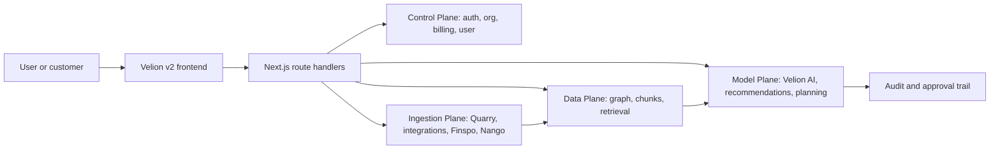

# Velion

Velion is the frontend workspace for Velion, an AI-first customer experience system where the AI worker, also named Velion, is the main operating layer for support, sales assistance, knowledge, and workflow execution.

The product goal is not "a helpdesk with AI features." Velion should feel like an AI teammate that can understand a company, propose work, execute approved actions, and keep humans in control. Every task Velion can do autonomously must also be possible manually in the UI.

## Product Vision

Velion competes with Intercom, Chatbase, Gorgias, Zendesk, and Norwegian ecommerce AI support products such as Mimir. The differentiator is an AI-native operating model:

- A user can ask Velion to create and deploy a chatbot.
- A user can ask Velion to answer or draft email, chat, and social support replies.
- A user can ask Velion to connect sources, crawl a website, inspect the knowledge graph, and explain what it learned.
- A user can ask Velion to create support policies, macros, workflows, handoff rules, and routing.
- Velion can act across connected systems only within explicit permission, approval, audit, and rollback boundaries.
- Human users can inspect sources, override decisions, approve risky actions, and manually perform the same work.

## Core Surfaces

- `Onboarding`: identify the organization, crawl the website, connect sources, preview the graph, prove that Velion understands the business, and recommend a plan.
- `Inbox`: unified conversations across support channels, with Velion drafting, summarizing, tagging, routing, and escalating.
- `Agents`: configure roles such as support, sales, ecommerce, chatbot, and workflow agents, including tools, sources, tone, policies, and deployment channels.
- `Knowledge`: manage website pages, files, connected SaaS sources, chunks, graph relationships, source quality, and answer coverage.
- `Chat`: talk directly to Velion to plan and execute work.
- `Dashboard`: monitor resolution rate, handoff rate, source health, automation impact, risk, and business outcomes.
- `Settings`: manage organization, team, billing, integrations, security, and approval policy.

## AI-First Operating Model

Velion should run every meaningful action through the same lifecycle:

1. Understand intent from a user prompt, customer conversation, event, or workflow trigger.
2. Build a plan with expected outcome, data sources, required tools, risk level, and approval requirement.
3. Retrieve grounded context from the data plane, including source citations and permissions.
4. Execute reversible low-risk actions automatically when policy allows it.
5. Request human approval for sensitive, irreversible, financial, legal, account, or customer-facing actions.
6. Write every decision, source, tool call, approval, and result to an audit trail.
7. Feed outcomes into evaluation, analytics, and knowledge improvement loops.

Manual parity is required. If Velion can deploy a widget, update a macro, answer an email, create a workflow, disconnect a source, or change a plan, the UI must expose the same action directly.

## Architecture

Velion v2 is a clean Next.js 16 App Router rebuild. The old app is product and roadmap input only; v2 intentionally does not import v1 code or architecture.



Current frontend architecture:

- Feature-sliced folders under `src/features/*`.
- Server Components by default, Client Components only at interaction leaves.
- Typed REST envelopes in `src/lib/api`.
- TanStack Query for client-side cache and mutation state.
- Active ingestion/search target is Quarry v2 through `quarry-edge` and `quarry-control`.
- BFF route handlers under `src/app/api/*` normalize upstream plane responses.
- Cursor pagination for unbounded collections.
- SSE stream IDs and `Last-Event-ID` resume shape for long-running work.
- Local-first drafts, command surfaces, undo stack, and explicit retry/status UI.

## Current Feature Map

- `src/features/onboarding-v2`: organization discovery, website crawl, integrations, graph preview, recommendation, paywall, and assembly.
- `src/features/agents-v2`: agent roles, chatbot studio, sources, tools, channels, install, brand voice, and safety controls.
- `src/features/inbox-v2`: support inbox surfaces and Zammad-backed conversation plumbing.
- `src/features/knowledge-v2`: knowledge overview, graph, and chunk inspection.
- `src/features/chat-v2`: Velion chat surface.
- `src/features/dashboard-v2`: operational overview.
- `src/features/settings-v2`: workspace configuration.

## Commands

```bash
pnpm dev
pnpm lint
pnpm typecheck
pnpm test
pnpm build
pnpm test:e2e
```

## Product Principles

- Velion is the AI worker at the center of the product, not a side panel.
- The first run experience must prove value before the paywall by showing what Velion learned and what it can improve.
- Users should never feel trapped by automation. There must always be review, approval, handoff, rollback, and manual control.
- Source trust matters. Every answer and recommendation should show what data Velion used and what is missing.
- Integrations must be connected to outcomes, not treated as setup chores.
- The UI should be dense, calm, and operational, with moments of proof where Velion explains its understanding.

## Related Docs

- `ux-gap.md` - competitor research, UX gaps, and AI-first roadmap.
- `docs/api-contracts.md` - current route handler contract conventions.
- `docs/adr/` - architecture decision records.
