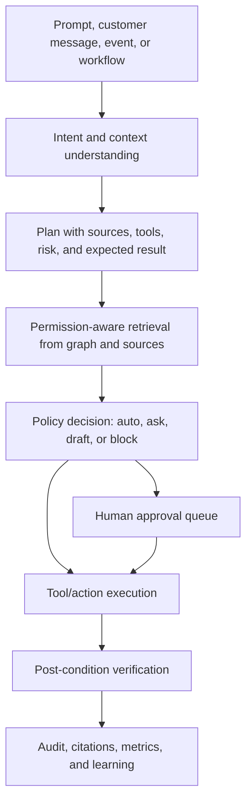

# Verevon v2 UX Gap and AI-First Product Research

Last researched: 2026-06-01 (Europe/Oslo)

This document summarizes competitor feature and UX patterns for Verevon v2, then maps them into concrete gaps for an AI-first Verevon product. The research uses official product/docs pages plus Mobbin screen references.

## Executive Summary

The market has moved from basic chatbots to AI agents that train, test, deploy, analyze, and take action. The best products make the AI feel operational rather than decorative:

- Intercom positions Fin as the AI agent for the full customer journey, with train, test, deploy, analyze loops, answer inspection, inbox copilot, and helpdesk integration.
- Zendesk is strongest on enterprise workspace, ticketing, triage, governance, customer context, approvals, and agent copilot inside a mature support workflow.
- Gorgias is strongest for ecommerce, especially Shopify context, order actions, sales assistance, AI reasoning, grounded responses, handoff controls, and revenue-aware reporting.
- Chatbase is strongest for fast self-serve setup: add sources, test in a playground, deploy to channels, add actions, and route complex issues to humans.
- Mimir is the most directly relevant Norwegian AI-first ecommerce competitor. It markets itself as a deeply integrated AI agent for Norwegian ecommerce, with email/chat/social coverage, approval drafts or autonomous replies, and deep custom stack integrations.

Verevon should not copy any one competitor. The winning position is:

> Verevon is an AI worker for customer experience. It understands the company, builds and runs support/sales workflows, answers customers, deploys chatbots, maintains knowledge, and hands control back to humans whenever risk or uncertainty requires it.

The product must prove that during onboarding, then make the same Verevon AI available everywhere in the app.

## Competitive Baseline

| Competitor     | Strongest Feature Pattern                                                                                                           | UX Pattern To Learn From                                                                                                  | Gap Verevon Must Close                                                                                                           |
| -------------- | ----------------------------------------------------------------------------------------------------------------------------------- | ------------------------------------------------------------------------------------------------------------------------- | ------------------------------------------------------------------------------------------------------------------------------- |
| Intercom / Fin | AI agent plus AI-native helpdesk, multi-channel deployment, answer inspection, performance optimization, procedures, copilot        | Polished product-led setup, AI agent lifecycle, inbox assistant, visible source inspection                                | Verevon needs a unified lifecycle for train, test, deploy, analyze, plus proof of what sources shaped each AI decision           |
| Zendesk        | Enterprise ticket workspace, omnichannel agent workspace, customer context panel, AI agents, copilot, intelligent triage, approvals | Dense three-pane workspace, right-side customer/app context, governance-first admin model                                 | Verevon needs stronger operational surfaces: queues, ticket context, approvals, SLAs, audit, routing, and admin controls         |
| Gorgias        | Ecommerce AI agent trained on Shopify, policies, website, help center, documents, and actions                                       | Ecommerce context is directly next to conversations; AI is judged by automation, CSAT, first response, and revenue impact | Verevon needs ecommerce-grade actions, source reasoning, order/customer context, and revenue/proof metrics                       |
| Chatbase       | Fast AI agent creation, sources, website crawling, playground, deploy channels, actions, analytics                                  | Simple left-nav builder where source setup, testing, deployment, and actions are obvious                                  | Verevon needs a faster path from crawl/connect to working chatbot, plus a clearer playground and deploy checklist                |
| Mimir          | Norwegian ecommerce AI support, email/chat/social, deep stack integrations, optional human approval                                 | Direct "AI does the support work" positioning, localized ecommerce language, proof by saved support work                  | Verevon needs Norwegian market localization, ecommerce workflows, and a strong answer to "what can Verevon do in my exact stack?" |

## Feature Matrix

| Capability                        |             Intercom |              Zendesk |                Gorgias |             Chatbase |                          Mimir | Verevon Target                                |
| --------------------------------- | -------------------: | -------------------: | ---------------------: | -------------------: | -----------------------------: | -------------------------------------------- |
| AI answers from company knowledge |               Strong |               Strong |                 Strong |               Strong |                         Strong | Required baseline                            |
| AI can take system actions        |               Strong |               Strong |                 Strong |               Strong |                         Strong | Required, with approval policy and audit     |
| Human-in-the-loop controls        |               Strong |               Strong |                 Strong |              Present |                         Strong | Required everywhere                          |
| Shared inbox / tickets            |               Strong |          Very strong |                 Strong |             Emerging | Replaces or abstracts helpdesk | Required for serious support                 |
| Website chatbot builder           |               Strong |               Strong |                 Strong |          Very strong |                         Strong | Required and should be prompt-driven         |
| Knowledge/source management       |               Strong |               Strong |                 Strong |               Strong |          Less visible publicly | Required, with graph proof                   |
| Graph or source relationship view |   Limited visible UX |   Limited visible UX | Reasoning/source views |         Source lists |           Not visible publicly | Differentiator for Verevon                    |
| Ecommerce order/customer context  |               Medium |               Medium |            Very strong |              Growing |                    Very strong | Required for ecommerce segment               |
| Analytics and optimization        |               Strong |          Very strong |                 Strong |               Strong |           Claims outcome focus | Required, with AI and human metrics together |
| Norwegian localization            | General multilingual | General multilingual |   General multilingual | General multilingual |                         Strong | Required for local wedge                     |
| Prompt-to-build workflows         |              Partial |              Partial |                Partial |              Partial |    Marketed as service outcome | Differentiator for Verevon                    |

## UX Patterns From Mobbin

Mobbin screen references used:

- Intercom: https://mobbin.com/screens/1c7e5287-5bb1-4089-b629-284ee0aa7fc3
- Zendesk: https://mobbin.com/screens/d9943427-d7f5-4a91-a761-4a5fda44e330
- Gorgias: https://mobbin.com/screens/d57c5727-cccd-465e-942b-4be092926533
- Chatbase: https://mobbin.com/screens/ddc14749-d551-4ff6-92fe-7bc7c0e9ec4d

Observed UX lessons:

- Support workspaces converge on a three-zone layout: navigation or queue, main conversation/work area, and right-side context.
- The right panel is not decoration. It carries customer data, source references, order details, apps, AI suggestions, and approvals.
- AI builders expose a lifecycle rather than a single settings page: sources, instructions, tools/actions, test playground, deploy, analytics.
- Ecommerce tools make order/customer data immediately actionable in the support flow.
- Good AI UX shows confidence, source usage, missing context, handoff reason, and next improvement rather than just a generated reply.

## Current Verevon v2 Stack Read

The frontend already has many of the right seams:

- `src/features/onboarding-v2` handles crawl, organization discovery, integrations, graph preview, recommendation, paywall, and assembly.
- `src/features/agents-v2` already models roles, chatbot studio, sources, tools, channels, install, identity, tone, and safety.
- `src/features/inbox-v2` provides support inbox UI and Zammad-backed API paths.
- `src/features/knowledge-v2` has overview, graph, and chunk-level inspection.
- `src/app/api/onboarding/*` and `src/app/api/connections/*` give the BFF a place to normalize model, graph, crawl, and connection routes.
- The backend planes implied by the app are directionally correct: auth/user/org/billing for control, Quarry for crawl, integration/Finspo/Nango for connectors, graph/retrieval for data, model-gateway for reasoning and recommendations.

The main gap is not "does the backend have a route." The gap is product composition: Verevon needs a visible, persistent AI operating layer that connects these surfaces into one understandable workflow.

## P0 UX Gaps

### 1. Verevon Must Be Available Everywhere

Today the AI appears in specific contexts. The target is a persistent Verevon command surface:

- Global prompt: "Ask Verevon to do work."
- Context-aware prompts in onboarding, inbox, knowledge, agents, and settings.
- Every prompt returns a plan, required data, risk, expected result, and approval need.
- Every generated action can be inspected and either approved, edited, or rejected.

Example prompts the product should support:

- "Create a website support chatbot from our website and Microsoft 365 docs."
- "Deploy the chatbot to Shopify and show me the install snippet."
- "Answer these five open emails as drafts only."
- "Find knowledge gaps causing handoffs this week."
- "Turn our return policy into an approved workflow."
- "Show me which connected sources Verevon used for this reply."

### 2. Onboarding Must Prove Understanding Before Asking For Money

The paywall should not show a generic recommendation. It should show a proof of concept:

- Company identity: org name, logo, domain, business type, market, employee count when available.
- What Verevon learned: crawled pages, products/services detected, policies found, public contact channels, connected SaaS sources.
- What customers likely ask: inferred top support intents, ecommerce/order intents, sales intents, gaps.
- What Verevon can do next: create chatbot, answer emails, draft macros, build workflows, connect Shopify/Zendesk/SharePoint, deploy widget.
- Expected operational impact: estimated deflection range, setup completeness, missing sources, required human review categories.
- Why the plan is recommended: tied to actual source count, channels, actions, workflow needs, team size, and risk.

This is where Verevon should feel smart. The user should think "it already understands our company," not "this is pricing copy."

### 3. Right Panels Must Become Operational Inspectors(but just for visualization, not editing, user shoud see the source graph and inspect nodes, but not edit the graph structure or node details. Editing should be done in the Knowledge section, where changes can be tracked and audited.) that Build Trust and Guide Action. and this is true for all right panels, not only in the intergration step of the onboarding.

Onboarding and knowledge graph right panels should be interactive:

- Zoom, pan, select nodes, and inspect connected items.
- Show source type, origin, last crawl time, permissions, chunks, related conversations, and confidence.
- Show what Verevon can answer from each node.
- Show missing data and recommended next connection.
- Let users open manual source management from the same panel.

This should also become a permanent Knowledge feature, not only an onboarding visual.

### 4. Human-In-The-Loop Needs A First-Class Approval System

Competitors converge on controlled automation. Verevon needs a shared action model:

- Draft reply: low risk, human can edit/send.
- Public chatbot answer: medium risk, must be grounded and logged.
- Data read: permission-scoped, logged.
- Data write: approval by default unless explicitly allowed by policy.
- Financial/order/account actions: approval or policy-gated automation.
- Irreversible actions: explicit confirmation, rollback instructions, audit record.

Every action should store:

- actor: user, Verevon, workflow, customer trigger
- intent
- plan
- sources
- tool calls
- risk level
- approval state
- result
- rollback or follow-up

### 5. Manual Parity Must Be Designed, Not Added Later

For every prompt action, provide the manual UI:

- Create chatbot manually in Agents.
- Add/edit source manually in Knowledge.
- Deploy widget manually in Agents or Settings.
- Create workflow manually in Automation.
- Write reply manually in Inbox.
- Route/assign manually in Inbox.
- Approve/disconnect integrations manually in Settings.

This protects trust. Users can let Verevon work faster because they know they are not losing control.

## P1 UX Gaps

### Inbox

Verevon must appear in the inbox as a copilot and as an autonomous worker:

- Conversation summary.
- Suggested reply with cited sources.
- Tone rewrite and translation.
- Intent, sentiment, priority, SLA, and routing.
- Duplicate/related ticket detection.
- Handoff reason and "why AI did not answer."
- Customer context and source graph in the right panel.
- Action suggestions such as refund request, order lookup, address change, subscription update, or follow-up email.

### Agents

The agent builder should become a Verevon-guided studio:

- Role selection: support, sales, ecommerce, chatbot, workflow.
- Prompt-driven setup: Verevon proposes instructions, tone, handoff rules, sources, and tools.
- Manual editor parity: every generated setting is editable.
- Test playground with source inspection and model comparison.
- Deployment checklist by channel.
- Safety and approval policy per role.

### Knowledge

Knowledge should become the trust center:

- Graph view for sources, chunks, topics, conversations, answers, tools, and workflows.
- Source quality score.
- Answer coverage by topic.
- Missing source recommendations.
- Permission-aware retrieval preview.
- "What Verevon knows about X" inspector.
- "What would break if this source is removed?" impact view.

### Analytics

Verevon needs AI and human metrics together:

- AI resolution rate.
- Handoff rate and reason.
- First response time.
- Time saved.
- Review queue volume.
- Source freshness and coverage.
- Top unresolved intents.
- Revenue influenced for ecommerce and sales.
- Cost per resolved inquiry.
- Risk events, approvals, and rollback count.

## P2 UX Gaps

- Workflow builder for support policies and back-office actions.
- Channel setup for email, chat, social, WhatsApp, Slack, Teams, and voice.
- App marketplace style connector management.
- AI eval harness visible to admins.
- Brand governance: tone, forbidden claims, compliance topics, locales.
- Customer-facing status and handoff transparency.
- Mobile-friendly support review queue.

## AI-First Architecture Target

Verevon should use a single action runtime across onboarding, inbox, agents, knowledge, and settings.

Needed layers:

- Product brain: model prompts and tool schemas must know what Verevon is, what it sells, what support outcomes matter, and how Verevon compares to Intercom, Chatbase, Gorgias, Mimir, and Zendesk.
- Source registry: every source has owner, permissions, freshness, type, scope, and retrieval visibility.
- Tool registry: every action has risk, reversibility, required permission, approval policy, timeout, retry, and post-condition check.
- Approval queue: reusable across replies, integrations, plan changes, workflow changes, and customer-facing actions.
- Audit trail: immutable record of Verevon plans, sources, tool calls, approvals, and outcomes.
- Eval loop: regression tests for recommendations, answers, handoffs, citations, action planning, and refusal behavior.

## Security, Reliability, And Consistency Requirements

- Tenant isolation on every BFF route and upstream call.
- Org-scoped tokens and source permissions in retrieval.
- No raw OAuth tokens or upstream secrets exposed to the browser.
- Idempotency keys for action execution.
- Timeouts, retries, and cancellation for crawl, integration, and AI jobs.
- SSE resume with `Last-Event-ID` for long-running onboarding and ingestion.
- Explicit error states instead of indefinite "waiting for verification."
- Rate limits for public widgets, chat, and support APIs.
- Tool execution policy by risk and reversibility.
- Structured audit events for every AI-generated recommendation and action.
- Human approval for financial, account, privacy, legal, or irreversible actions.

## Recommended Verevon Positioning

Verevon should present itself as:

- More AI-native than Zendesk: less enterprise setup, more prompt-to-outcome.
- More operational than Chatbase: not only chatbot creation, but inbox, workflows, approvals, actions, and knowledge operations.
- Broader than Gorgias: ecommerce strong, but also SaaS, B2B, service teams, and internal knowledge.
- More transparent than Intercom: graph/source proof, action audit, and manual parity as first-class UI.
- More productized than Mimir: same Norwegian ecommerce relevance, but with a full self-serve workspace, graph, source inspector, and AI operating layer.

## Implementation Priority

1. Global Verevon command and action plan drawer.
2. Shared action/approval model used by onboarding, inbox, agents, and knowledge.
3. Paywall proof-of-concept recommendation backed by real crawl/integration/graph data.
4. Interactive graph/source inspector in onboarding and knowledge.
5. Inbox copilot with citations, handoff reason, and draft/action suggestions.
6. Agent studio lifecycle: sources, instructions, tools, test, deploy, analyze.
7. Analytics for resolution, handoff, source gaps, time saved, and revenue impact.
8. Eval and audit views for admins.

## Source Notes

Official sources:

- Intercom Fin overview: https://www.intercom.com/fin
- Intercom Fin AI Agent explained: https://www.intercom.com/help/en/articles/7120684-fin-ai-agent-explained
- Intercom AI Inbox features: https://www.intercom.com/help/en/articles/6955446-ai-assist-for-inbox
- Intercom Inbox product page: https://www.intercom.com/help-desk/inbox
- Zendesk AI agents: https://support.zendesk.com/hc/en-us/articles/6970583409690-About-AI-agents
- Zendesk Copilot: https://support.zendesk.com/hc/en-us/articles/5524125586330-About-Zendesk-Copilot
- Zendesk Agent Workspace: https://support.zendesk.com/hc/en-us/articles/4408821259930-About-the-Zendesk-Agent-Workspace
- Zendesk AI platform: https://www.zendesk.com/service/ai/
- Gorgias AI Agent explained: https://docs.gorgias.com/en-US/ai-agent-explained-497772
- Gorgias AI Agent technology and controls: https://docs.gorgias.com/en-US/how-gorgiass-ai-agent-works-1997817
- Gorgias AI Agent and automation features: https://docs.gorgias.com/en-US/articles/ai-agent-and-automations-135134
- Gorgias Shopify app: https://www.gorgias.com/ecommerce/shopify
- Chatbase home: https://www.chatbase.co/
- Chatbase data sources: https://www.chatbase.co/docs/user-guides/chatbot/data-sources
- Chatbase actions: https://www.chatbase.co/docs/user-guides/chatbot/actions/actions-overview
- Chatbase deploy: https://www.chatbase.co/docs/user-guides/chatbot/deploy
- Chatbase playground: https://www.chatbase.co/docs/user-guides/chatbot/playground
- Mimir home: https://trymimir.com/
- Mimir Norwegian overview: https://trymimir.no/articles/hva-er-mimir-mot-norges-ai-for-kundeservice
- Mimir ecommerce support article: https://trymimir.com/articles/tired-of-support-tickets-here-s-how-ai-can-handle-them-(without-breaking-a-sweat)
- Springboard Mimir listing: https://springboard.no/martech/mimir/

Mobbin UX references:

- Intercom web screen: https://mobbin.com/screens/1c7e5287-5bb1-4089-b629-284ee0aa7fc3
- Zendesk web screen: https://mobbin.com/screens/d9943427-d7f5-4a91-a761-4a5fda44e330
- Gorgias web screen: https://mobbin.com/screens/d57c5727-cccd-465e-942b-4be092926533
- Chatbase web screen: https://mobbin.com/screens/ddc14749-d551-4ff6-92fe-7bc7c0e9ec4d
