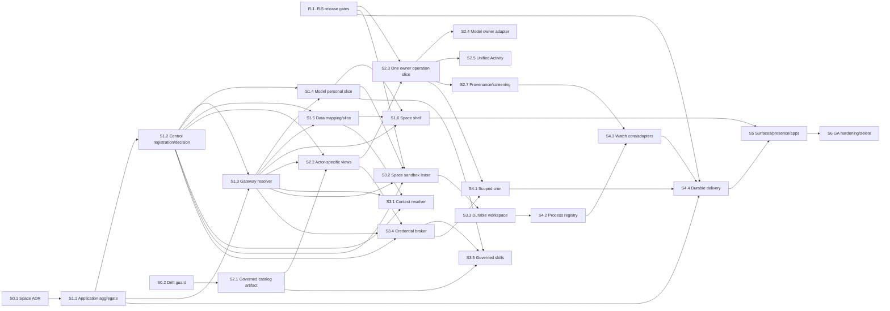

# Verevon v3 × QM: comparison and adoption plan

Date: 2026-08-13  
Status: active execution program  
Scope: Verevon v3 plus the active CoreSystem planes  
QM baseline: `d719f54075afee4648be75240fa02adb3a9071f0`  
CoreSystem baseline: working tree based on `6c951c6e8b3926da3d586efd7bea968f9452b37b`

## Execution tracker

Legend: `[ ]` not started; `[~]` implementation underway or source evidence
exists but the stated release/contract verification remains open; `[x]`
completed and verified against this plan's stated evidence. A roadmap package is
not marked `[x]` merely because one of its PR slices compiles.

| Sequence | Execution status |
|---|---|
| R-1 through R-5 release gates | `[~]` Source work exists in multiple planes; live artifact/deployment, attestation, continuation, delivery, and rollback evidence are still required. |
| S0.1 Space ADR and ID inventory | `[~]` Source inventory is underway; the cross-plane decision review is not complete. |
| S0.2 Action contract drift guard | `[~]` 2026-08-13: removed V3's handwritten `LIVE_ACTIONS`, added registry-to-Rust-dispatcher contract CI, added agent tool-set parity test, and covered `shipping.get_quotes`. Actor-specific Model availability is deliberately deferred to S2.2/S2.4. |
| S0.3 authenticated cross-plane E2E harness | `[~]` Existing verified-user Playwright and two-tenant authority fixtures cover the current session/knowledge boundary. Space decision and forged/expired Space-context coverage must follow S1.2/S1.3. |
| S0.4 product-truth cleanup | `[~]` 2026-08-13: removed the dead generic project action and made Studio's gateway-local persistence an explicit `ephemeral` API/UI contract. Broader product-truth audit remains open. |
| S1.1 Application Space aggregate | `[~]` 2026-08-13: Application now has the canonical lifecycle/state contract, one-personal-Space mutation, leased/retryable Control-registration outbox worker, and immutable lifecycle records. Deployment credentials, projections, migration, and live verification remain open. |
| S1.2 Control Space registration and decisions | `[~]` 2026-08-13: registered-Space, membership, aggregate/component authority revisions, idempotent registration repository, and audience/expiry-bound signed decision contract—including the owner-resource authorization reference—landed. Authenticated registration API, decision issuance, and effect-time verification remain open. |
| S1.3 gateway Space resolver | `[~]` 2026-08-13: an authenticated BFF membership read and the personal-thread issuance handoff are wired through Control; browser authority fields are stripped, but lifecycle/list, shared-recipient, resource-intersection, and revocation resolution remain open. |
| S1.4 Model Space propagation | `[~]` 2026-08-13: Model thread creation now has a distinct atomic Space authority envelope, durable thread fields, and a signed Control-decision verifier for the exact thread effect; the BFF injects the Control-issued envelope for a selected new personal thread. Live key provisioning, run/continuation propagation, and fresh rechecks remain open. |
| S1.5 through S1.7 | `[~]` 2026-08-13: S1.5 has a fail-closed Data mapping/schema and dense-only scoped retrieval contract; Control verification, a real binding writer, and all remaining owner slices are open. |
| S2.1 through S2.7 | `[~]` 2026-08-13: V3’s Model tool surface is now an explicit fail-closed eligibility gate rather than every UI action; the governed cross-plane catalog/operation path is still open. |
| S3.1 through S3.6 | `[~]` 2026-08-13: S3.2 now exposes an honest ephemeral/credential-free substrate profile and rejects local-isolation downgrades; durable Space leases, workspace state, credentials, skills, and cockpit remain open. |
| S4.1 through S4.5 | `[~]` 2026-08-13: S4.1 has independently deny-by-default schedule entitlement/revision fencing, signed create/fire contracts, and a fail-closed Capability Core fire-authorizer seam; creation bindings, end-to-end consumption, watches, delivery, and Work cockpit remain open. |
| S5.1 through S5.4 | `[~]` 2026-08-13: S5.1 has an adopted surface-neutral ingress/delivery ADR; web remains the only active surface and the first external adapter is still gated on the specified contract/security tests and review. |
| S6.1 through S6.3 | `[~]` 2026-08-13: S6.1 has durable owner-bound thread erase plus an authenticated, idempotent Application deletion request that Control rechecks against owner, entitlement, and legal-hold facts before lifecycle fencing. Application/Control local cleanup, Data binding revocation, queued-Ingestion cancellation, and a leased Model transcript adapter now report scoped outcomes; newly claimed cron tasks are fenced and pending fired tasks are cancelled. External-memory/blob/workspace purge, remaining adapters, chaos testing, and staged rollout remain open. |

## Executive recommendation

Do not clone QM's architecture into CoreSystem. Adopt its **scope-as-the-spine** product model and a small set of its best runtime invariants, then implement them through CoreSystem's existing authority, data, orchestration, evidence, and privacy boundaries.

The product target should be a first-class **Verevon Space**:

> One person, room, project, or case has one durable agent context, one shared workspace, one explicit collaboration authority context, one queue of work, one activity history, and one presence across supported surfaces.

“One authority context” does not mean Space membership grants transitive access to everything linked there. Effective access is always the intersection of current Space authority, the active conversation/case audience, and each owning plane's current resource authorization.

Likewise, “one queue” means one coherent **Work projection and control surface**. It does not mean replacing Temporal/NATS, Model runs, Ingestion jobs, or owner-plane state machines with one new database queue.

QM makes that promise coherently. Verevon currently has most of the underlying machinery, and in several areas has materially stronger machinery, but the pieces are attached to an active organization, a browser route, a thread, or a domain-specific project rather than one canonical collaboration scope.

The highest-leverage work is therefore:

1. Establish a canonical, Control-authorized `SpaceRef` and signed, versioned `SpaceAccessDecision`.
2. Propagate that identity through chat, threads, runs, actions, approvals, knowledge, files, sandboxes, crons, notifications, and ingestion.
3. Generate a governed Action Catalog from owner-plane contracts, let Capability Core bind the Model-eligible subset, and give every owning plane the same versioned request/receipt envelope for human and agent operations.
4. Build a Space cockpit in Verevon v3 by composing the existing chat, knowledge, run timeline, approval, evidence, cost, inbox, and settings surfaces.
5. Add the QM features CoreSystem does not yet expose coherently: a persistent Space computer, scoped authored instructions/memory, governed skills, scoped schedules, background process watches, and completion delivery.

The immediate order should be **release gates and Space contract → Personal Space authority/UI → one governed owner operation → credentials/authored context/skills → durable computer → schedules/watches/delivery → additional surfaces**. Building Slack continuity, ambient behavior, or swappable coding harnesses before the Space contract would reproduce today's fragmentation on another surface.

## Audit basis and confidence

This is a source-level comparison, not a marketing comparison.

- QM was inspected from the clean local clone at `/Volumes/Lagring/Triodelab/qm`.
- CoreSystem was inspected across Frontend, Control, Application, Data v2, Model, Ingestion, and Infra planes.
- Canonical CoreSystem ownership comes from `apps/master-ownership-matrix.md`; current source was preferred over dated runtime-status claims.
- Source evidence was inspected for the central scope, action, run, sandbox, cron, watch, skill, memory, UI, and security paths.
- No full QM or CoreSystem test suite was run for this planning pass. “Implemented” below means source-verified; it does not mean staging-verified.
- QM has no CodeGraph index in the clone, so it was inspected with repository-local search and direct reads. CoreSystem's CodeGraph index was healthy and used for structural orientation.

QM is MIT-licensed. Reimplementing its ideas is straightforward; any direct source transplant must retain the required copyright and license notice from `qm/LICENSE`. The recommendation is to port invariants and tests, not copy large modules.

### Source capability is not release capability

This plan uses three distinct meanings throughout:

| State | Meaning |
|---|---|
| **Source-verified** | A concrete implementation and tests exist in the inspected tree. |
| **Release-proven** | The exact immutable artifact, migrations, credentials, policy, health, recovery, and rollback have passed live gates. |
| **Target** | The proposed Verevon Space behavior after the roadmap is complete. |

Several foundations described as Verevon strengths are source-verified but not release-proven. Current Model status reports all 27 enabled capabilities unavailable without health attestation, no successful durable approval continuation, and no live immutable rollback rehearsal (`apps/Model Plane/MODEL_PLANE_STATUS.md:194-220,278-327`). Current Application status reports undeployed authority changes and no notification provider/feed outbox, callback reconciliation, or HA replay store (`apps/Application Plane/APPLICATION_PLANE_STATUS.md:25-45`). Sequence -1 below is therefore an entry gate for effectful Space milestones, not optional cleanup.

## The central finding

### QM's strength

QM resolves every turn into an active scope and makes that scope the common parent of memory, files, permissions, workspaces, crons, skills, apps, and background work. Its resolver maps DMs to personal scope and rooms to shared scope, then composes organization instructions, lower-scope instructions, workspace layers, policy, egress, and audience grants in one operation (`qm/src/resolution/resolution-service.ts:18-97`). The product UI mirrors that model by showing conversations, files, skills, crons, apps, people, model choice, and ambient policy together (`qm/plugins/web-ui/src/contexts.ts:422-488,630-662`).

### Verevon/CoreSystem's strength

CoreSystem has stronger enterprise foundations: explicit plane ownership, multi-tenant authority, signed delegation, ZDR/residency propagation, grounded retrieval and graph context, browser evidence through Quarry, durable agent runs, approval/proof surfaces, cost accounting, semantic caching, and a much broader typed business-action surface. These must remain authoritative.

### Verevon/CoreSystem's gap

CoreSystem already contains several things called “workspace” or “project,” but they do not form one product or authority contract:

| Existing concept | Current meaning | Why it is not yet the canonical Space |
|---|---|---|
| Verevon `activeOrg` / `workspace` | Organization identity and shell branding | No room/project/case identity; chat requests carry thread/session but no Space (`src/shared/session/session-store.ts:13-19`, `src/shared/api/chat-client.ts:37-72`). |
| V3 action registry | Strong UI schema and risk metadata | Browser registry, `LIVE_ACTIONS`, Rust string dispatch, and Model tools are separate implementations. |
| V3 support thread mapping | User + org + support conversation stored in browser session storage | It is not a shared, server-owned case or room (`src/shared/chat/support-chat-thread.ts:1-30`). |
| Data `workspace_id` | Knowledge/wiki/retrieval partition/filter | It is not propagated as a signed user/room authority decision through chat and actions. |
| Control session `workspace_id` | Session partition field | It is not a versioned room/project membership snapshot shared by all planes. |
| Model context `workspace_id` | Optional context-assembly segment identifier | It is a hint, not an authorization root (`proto/model_plane/v1/sessions.proto:423-441`). |
| Application Convex projects | Domain-specific collaboration/project records | They are not the single cross-plane scope for Model, Data, Ingestion, and Frontend. |
| Studio project | Canvas/campaign artifact grouping | It is a resource inside a Space, not necessarily the Space itself. |

Adding another generic project table would make this worse. The first deliverable must define how these concepts map to one typed `SpaceRef` while preserving their current domain ownership.

## Full capability comparison

Legend: **QM lead** means QM has the more coherent current product implementation; **Verevon lead** means CoreSystem/V3 is materially stronger; **split** means each has a different strength; **gap** means the capability is absent or not connected end to end.

| Capability | QM | Verevon v3 / CoreSystem | Verdict and action |
|---|---|---|---|
| Product focus | Focused multiplayer agent harness for Slack/web | Broad enterprise operating system spanning support, social, knowledge, ingestion, analytics, agents, studio, leads, and control | **Verevon lead in breadth.** Preserve domain products; add a Space layer across them. |
| Canonical person/room/project scope | Every session has `scopeId`; active scope owns the computer and resources | Active organization and thread dominate; several unrelated workspace/project IDs exist | **QM lead. P0.** Introduce typed `SpaceRef` and mapping, not another isolated project. |
| Multi-tenancy, residency, ZDR | Explicitly single internal organization; not a hardened multi-tenant boundary | Multi-plane, tenant-bound authority with ZDR/residency contracts | **Verevon lead.** Never inherit QM's trust assumptions. |
| Membership authority | Current shared membership checks plus versioned project roster | Strong Control authority and server-derived active org, but no Space authority revision on every effect | **Split. P0.** Keep Control authority; extend QM's roster fencing to membership, grants, entitlements, and privacy policy. |
| Read/write/manage separation | Distinct checks for shared scopes | Permissions exist, but no one cross-plane Space decision | **QM pattern worth adopting** in a signed Control decision. |
| Context resolution | One resolver composes layers, instructions, egress, security, approvals, and grants | Context packing, policy, memory, retrieval, and tools exist in different services | **QM lead in coherence; Verevon lead in depth.** Add `ResolvedSpaceContext`; do not move authority into Model. |
| Space/project cockpit | Conversations + files + skills + crons + apps + people + model/policy in one view | Many rich top-level routes; no scope-centric home | **QM lead. P0/P1.** Build `/spaces/:spaceId` using existing V3 components. |
| Shared conversations and safe fork | Shared web sessions/threads; a fork copies only entries visible to the viewer and intersects visibility for project members | Durable Model threads and rich chat UI are primarily user/org scoped; the support “shared” thread is a browser mapping, not a collaborative room | **QM lead. P1.** Space-own threads, bind recipient-audience revisions per entry, and implement visibility-preserving fork/share only after resource intersection is enforced. |
| Business action breadth | Small fixed tool surface plus shell/web apps | Broad typed catalog metadata across five owner planes (Application, Control, Data, Ingestion, Model), but runtime coverage is incomplete and some dispatchers return synthetic identifiers | **Verevon lead in catalog breadth, not proven execution breadth.** Do not reduce actions to shell commands; prove each owner path. |
| Human/agent action contract parity | Fixed wrapped tool surface reduces dispatch drift, although some shared resources are not consumed at runtime | Registry is typed in TS, gateway accepts untyped JSON and independently string-matches; Model does not execute all V3 action IDs | **Verevon gap. P0.** One catalog version and owner contract for each eligible actor, with actor-specific views and human-only authority preserved; the gateway is ingress, not an effect broker. |
| Action validation | Central wrapped tools | Browser Zod validation; gateway body is `serde_json::Value` | **QM lead in centralization.** Generate server validators and schema hashes from one contract. |
| Approvals and proof | Durable approvals and audit, with human-only authority walls | Strong source-level approval/proof/event/cost UI and ledgers, but successful durable continuation is not release-proven | **Verevon lead in primitives, not current readiness.** Clear R-3, extend proof semantics to owner operations, and remove synthetic IDs. |
| Sessions and run durability | Postgres queue, leases, heartbeats, reaper, signal replay, per-attempt tool ledger | Durable Model run/checkpoint/replay and Temporal/NATS infrastructure in source, with release/recovery gates still open | **Verevon lead in platform design; QM has useful invariants.** Port tests/invariants, not its queue, and clear R-5. |
| Cross-surface continuity | Same scoped identity/configuration in Slack and web | Web product is real; Channel Plane remains reference-only | **QM lead. P2.** Define a surface-neutral delivery contract now; implement web first and Slack only after ownership is ratified. |
| External identity continuity | Signed Slack/web identity boundaries, but convergence often depends on visible email and configuration | Strong Control identity foundation, but no complete Space-to-external-account link UX | **Split. P2.** Add verified external-identity links and anti-takeover flows; never make normalized email the canonical principal. |
| Presence / ambient agent | Room-aware ambient behavior and standing policy | Application Plane can project realtime state, but V3 has no Space presence/ambient control | **QM lead in product coherence. P2.** Start with visible web presence; ambient side effects remain opt-in and governed. |
| Grounded knowledge | Internal search, notes, and memory | Data v2 hybrid retrieval, GraphRAG, wiki, citations, confidence, source traces; Ingestion evidence via Quarry | **Verevon lead by a wide margin.** Space-scope these capabilities; do not replace them with filesystem search. |
| Learned memory | Scoped bullet memory with revision history | Rich semantic/Dreaming memory and provenance | **Verevon lead in intelligence.** Add QM-style authored/revisioned memory without replacing learned memory. |
| Authored instructions | Org and lower-scope instructions resolved hierarchically | Backlog recognizes explicit user/org/project instructions; not yet one editable hierarchy | **QM lead. P1.** Platform → org → personal/Space, with lower layers unable to weaken policy. |
| Memory privacy | Scope policy, but shared-room facts can auto-copy into personal memory | Stronger privacy model, but no clear Space promotion UX | **Do not copy QM default.** Require explicit “save to my memory” or visible policy with provenance and revocation. |
| Files/artifacts | Every scope has a file view and SHA-addressed artifact metadata | Strong Data/object-store/artifact services, but not aggregated around one Space | **Split. P1.** Use Data contracts and Space projection; do not create a local filesystem source of truth. |
| Durable agent computer | Per-scope persistent backend, layered mounts, process sessions, backup/restore | Sandbox lease/snapshot contracts exist; scope is thread/agent, snapshot registry is in memory, code interpreter deletes per-call workspace | **QM lead. P1.** Extend Model sandbox to Space scope with durable backing and run overlays. |
| Sandbox capability negotiation | Typed backend profile and capability refusals | Multiple runtime services but no clear V3-visible substrate profile | **QM pattern worth adopting.** Improve it by failing closed on security/capability downgrade. |
| Background process sessions | Scope-owned processes can be reattached and monitored | Durable agent runs exist; persistent process UX is not unified | **QM lead. P1/P2.** Add process registry on the existing Model work model. |
| Watches | Durable process watches with cursor, heartbeat, expiry, destination, cancel | No unified user-facing watch primitive | **QM lead. P1.** Generalize beyond logs to ingestion, documents, deploys, connectors, and runs. |
| Scheduled agent work | Scope-owned crons with destination, consent, auth refresh, deterministic fire keys | Model cron APIs exist, currently org-wide/admin-oriented and missing Space/delivery/policy in V3 | **Split. P1.** Extend existing cron; do not add pg-boss. |
| Completion notification | Background work can target a surface | Application owns canonical notifications; Model run UI is strong, but durable delivery/outbox/callback/HA replay is not release-proven | **Verevon foundation, product gap. P1.** Add `DeliveryTarget`, durable at-least-once processing, receipt reconciliation, and an effectively-once user projection where supported. |
| Skills | Scoped lifecycle, packs, promotion, lazy materialization, and strong import controls | Capability Core already has immutable capability versions, versioned/pinnable/eval-aware skill packages, scoped promotion checks/workflows, and Session Core provenance/runtime reads; the stores/resolvers and V3 experience are fragmented | **Split. P1.** Consolidate the existing CoreSystem path, persist every promotion, add Space resolution and safe pack import, and expose the lifecycle in V3. Do not create another registry. |
| MCP, plugins, and connectors | Scope resources and keychain grants are visible in the room cockpit | V3 already has user/private/shared/org MCP ownership and durable versioned/risk-aware plugin packages, plus broader OAuth/connectors | **Verevon foundation, Space gap. P1.** Project these existing resources into Space grants and issue short-lived delegated credentials; never union a member's ambient keychain into shared work. |
| Internal app build/publish | Agents can build, version, deploy, share, and open scoped web apps | V3 Studio is currently gateway-local, in-memory, and mainly exports social drafts; Model/Infra/Application primitives are not assembled into a governed internal-app lifecycle | **QM lead in product. P2.** Add only after Space authority and operations: Model builds, Application owns app/version/share metadata, Infra hosts/routes, Control authorizes, and evidence/ZDR/egress/rollback remain mandatory. |
| Harness portability | Pi, OpenCode, Codex, and Claude adapters behind one interface, with provider-native effect tools disabled and an allowlisted child environment | Provider/model routing and a gateway-owned loop; not a swappable coding-harness host | **QM lead in adapter discipline, P1/P3.** Add a typed runtime-adapter profile and persist selection now; defer hosting additional coding harnesses until there is a product need. |
| Tool-output hygiene | Head + tail retention, explicit narrow-refetch notice, approval pause termination | Tool loops and cost controls exist; consistent response shaping remains a backlog item | **QM implementation worth porting. P0/P1.** Add bounded output shaping and interrupted-effect markers. |
| Browser/computer-use evidence | Browser runner exists but sits outside some gates | Quarry owns execution/evidence; Model proposes; grants and live-view concepts exist | **Verevon lead.** Keep Quarry boundary and add human takeover separately. |
| Cost, budgets, evals | Budget/rate infrastructure exists | First-class cost ledger, per-turn usage/cost, model routing, quality/eval systems | **Verevon lead.** Add Space dimensions to cost/eval telemetry. |
| Deployment customization | Strong deployment-directory contract with validation and digest evidence | Multi-plane compose stacks and service-specific configuration; no single customer layer contract | **QM lead for packaging. P2.** Adapt manifest/digest evidence, not QM's single-process deployment shape. |
| Untrusted-content provenance and screening | Labels external/overheard/surface content and uses bounded concurrent screening, but important error paths proceed as `unscreened` | Quarry/Data provenance and Model safety primitives are deeper, but one cross-plane trust/screening envelope is not yet consistently visible in V3 | **Split. P1.** Standardize provenance and enforce deny or read-only/no-effects degradation; never copy QM's fail-open behavior. |
| Security posture | Thoughtful gates, but documented gaps in tenancy, command policy, browser gates, credentials, screening, retention, and governance | Stronger intended enterprise boundaries and authority ownership; staging evidence still matters | **Verevon lead by design.** Use QM limitations as negative tests. |

## What Verevon must not regress

The QM work should strengthen Verevon's differentiators, not turn it into a coding-agent wrapper.

1. **Control remains the authority** for identity, exact org membership, grants, entitlements, quotas, and signed decisions.
2. **Data v2 remains the owner** of durable knowledge, files promoted as knowledge, chunks, embeddings, retrieval, graph, wiki, and source traces.
3. **Ingestion and Quarry remain the execution/evidence boundary** for source capture and browser actions.
4. **Model remains the owner** of reasoning, threads/runs, agent execution, capabilities, sandbox leases, tasks, crons, approvals, and cost.
5. **Application remains the owner** of collaborative/realtime projections, operation/activity read models, presence, and notifications.
6. **Frontend remains a BFF and UX owner**, not a second authority or durable workflow engine.
7. **Typed business actions, grounding, citations, confidence, proof, cost, semantic caching, and ZDR/residency** are product advantages and must stay first-class.
8. **Channel Plane is not a runtime today.** A Slack plan must begin as an ownership/contract ADR, not as code that assumes a service exists.

## Target product model: Verevon Space

### Stable identity

```text
SpaceRef
  org_id
  space_id
  kind = personal | room | project | case
```

- Every `(org_id, principal_id)` gets exactly one default personal Space, enforced by a database uniqueness constraint. A personal Space, its credentials, content, memory, and thread mapping are never reused across organizations even when the human principal is the same.
- A room is a durable collaboration scope independent of any single chat thread.
- A project is a long-running collaborative scope.
- A case binds the same model to a support/customer case and is the best first domain vertical slice.
- Organization is an inherited policy/content layer, not automatically the active write Space.
- Studio projects, campaigns, tickets, documents, and threads are resources inside or linked to a Space; they are not silently reinterpreted as Spaces.

Joining another organization creates or resolves that organization's separate personal Space; switching organizations changes the active Space namespace. Leaving/suspension immediately revokes access and background work while preserving or deleting data according to the organization's retention/legal-hold policy. Organization deletion and user export/delete operate on explicit `(org_id, principal_id)` mappings and return per-owner receipts. A same-human/two-organizations isolation test is mandatory.

### Authoritative decision

Control Plane issues a short-lived, audience-bound `SpaceAccessDecision`:

```text
SpaceAccessDecision
  authenticated_subject_ref
  subject_kind = human | workload
  org_id
  space_id
  space_kind
  authority_revision
  membership_revision
  grant_revision
  entitlement_revision
  privacy_policy_ref + privacy_policy_version
  permissions = [read, write, manage, approve, schedule, share, ...]
  allowed_action_classes
  purpose
  lawful_basis
  privacy_class
  third_party_processing_allowed
  retention_class
  residency
  deletion_scope
  zero_data_retention
  service_audience
  recipient_audience_ref + recipient_audience_hash + recipient_audience_revision
  exp
  jti
```

The browser may select a Space, but a client header never grants it. The V3 gateway resolves the exact authenticated subject and Space authority through Control and mints/delegates only target-service decisions. The request body never chooses `actor_type` or `actor_id`. `service_audience` identifies the downstream workload allowed to consume the decision; it is not the human audience of a shared conversation. The owning conversation/case service supplies a server-derived, revisioned recipient list, Control authorizes every recipient, and the decision binds its opaque reference/hash. A participant or audience change forces re-resolution before retrieval, delivery, resume, or effect.

Any membership, grant, entitlement, purpose, privacy, retention, residency, third-party-processing, deletion, ZDR, or recipient-audience change advances the aggregate `authority_revision` and its relevant component revision. Owner planes verify all signed fields—subject, service audience, recipient audience, expiry, revision, action/version/schema, payload digest, resource decisions, approval, and idempotency—immediately before an effect, including resume and schedule fire.

This adapts QM's smartest project pattern: roster changes are versioned and work is performed only while the observed roster version is still current (`qm/src/projects/project-store.ts:212-223`, `qm/src/api/app-turn.ts:102-106,327-338,403-413`). CoreSystem should improve it with typed claims, Control authority, strict audiences, bounded expiry, and no historical-membership fallback.

The recommended S0.1 outcome is one canonical Application-owned Space aggregate for immutable ID, kind, name, lifecycle, and collaboration metadata, because Application already owns collaborative product projections. Control registers that `SpaceRef`, owns membership/grants/decisions, and remains the only access authority. This is a two-owner creation saga with an idempotent resource-registration contract and explicit pending/failed states—not two competing Space records.

Control should extend `user-core`'s existing generalized `resource_grants` repository and authorization taxonomy with `resource_type=space`, rather than create a second grant database (`apps/Control Plane/user-core/internal/users/acl_repository.go:17-20,64-238`; `internal/authztaxonomy/taxonomy.go:71-99`). The current document-oriented view/edit taxonomy is only a foundation: typed Space roles, subject kinds, resource registration, and the authority-revision ledger require separate migrations and tests. Application's current Convex project record must either migrate into the canonical Space aggregate or be explicitly retained as a domain resource inside one; it must not become a fifth generic project authority.

### Space agent/workspace binding

Application owns a projection that makes the product promise legible without taking over the referenced resources:

```text
SpaceAgentBinding
  space_id
  default_agent_ref
  thread_policy
  knowledge_scope_refs
  workspace_ref
  allowed_connector_refs
  default_delivery_target
  projection_version
```

Model remains authoritative for the agent, threads, and workspace lease; Data remains authoritative for knowledge; Control remains authoritative for grants; Application stores their references and projects current state. A binding change is an operation against the appropriate owning plane, not a mutable frontend preference.

### Resolved context

Model receives a server-built `ResolvedSpaceContext`, not raw client scope fields:

```text
ResolvedSpaceContext
  access_decision_ref
  recipient_audience_ref + revision
  owner_resource_decision_refs
  control_policy_floor_refs
  model_agent_instruction_refs = [platform(ro), org(ro), personal-or-space(rw)]
  data_authored_memory_refs
  knowledge_filters
  memory_read_scopes
  memory_write_scope
  workspace_layers
  action_catalog_version
  capability_budget
  egress_policy
  approval_policy
  delivery_targets
```

The resolver is a contract/orchestration step, not a new data owner. It reads authoritative inputs from their owning planes and returns references plus signed decisions. It must apply an audience floor: shared context is available only when every current recipient is entitled to it. Space membership is necessary but never sufficient for a linked private ticket, document, connector, artifact, or credential.

### Resource ownership versus creation context

For shared resources, store both:

- `owner_space_id`: the authority scope that owns and can manage the resource.
- `created_in_space_id`: the context in which it was produced.
- `created_by`: exact principal/workload.
- `operation_id` / `run_id`: causal provenance.

QM's file metadata makes this distinction explicitly (`qm/src/files/file-artifact-store.ts:15-38`). CoreSystem should apply it to artifacts, skills, schedules, deployments, knowledge promotions, and action outputs.

### Resource-authorization intersection

Linking a resource to a Space never changes that resource's ACL. Retrieval, action availability, context assembly, and effects use:

```text
effective_access =
  current Space decision
  ∩ current recipient-audience authorization
  ∩ current owner-plane resource decision
```

The context and operation envelopes carry opaque owner/resource decision references and digests, not a claim that all Space members can read every linked object. Tests must cover a private document linked into a shared Space, a connector granted to only one role, resource-grant revocation during a run, and a participant added or removed while context is being assembled.

## Unified action and operation contracts

Verevon's action registry is one of its best assets, but it is not yet an executable cross-plane contract.

Current source proves the drift:

- V3 defines typed Zod schemas, plane owner, risk, approval, and reversibility (`src/shared/actions/action-registry.ts:263-395`).
- The human client maintains a second `LIVE_ACTIONS` set (`src/shared/actions/action-client.ts:6-44`).
- `shipping.get_quotes` exists in the registry and Rust gateway, but is absent from `LIVE_ACTIONS` (`action-registry.ts:387-395`, `apps/gateway/src/domains/actions/handlers.rs:51-56`).
- The gateway accepts an untyped JSON value and independently string-matches action IDs (`handlers.rs:27-40`).
- Agent tool definitions can advertise registry actions, but action availability is not proven against the Model execution path (`src/shared/actions/agent-tools.ts:103-162`).
- Some dispatchers manufacture run/audit-looking identifiers rather than returning one durable, queryable operation record.

Replace these paths without creating a new cross-plane owner:

### Action Catalog v1

The canonical catalog is a versioned governed contract artifact, not a new runtime authority. Each owner plane owns and approves the IDL, schema, authorization class, and receipt contract for its entries. A deterministic build composes those entries, checks ownership/compatibility, and generates TypeScript, Rust, and owner-plane validators. Model Plane's existing Capability Core owns only Model eligibility, health, policy, and tool binding for the agent-callable subset (`go/services/capability-core/README.md:1-5`; `migrations/0008_execution_dispatch_capabilities.up.sql:1-75`). The V3 BFF composes the human view from the same artifact, Control decision, surface policy, and current owner availability. Neither Capability Core nor the gateway becomes the authority for another plane's human business action.

Each catalog entry includes:

```text
action_id
version
schema_hash
input_schema
output_schema
owner_plane
risk_class
approval_policy_class
reversibility
idempotency_policy
required_space_permissions
allowed_actor_types
human_only
required_service_identity
delegation_class
retention_behavior
zdr_eligibility
availability_probe_ref
```

`GET /api/v1/spaces/:space_id/actions` is a BFF projection of the release catalog plus the current Control/resource decisions and owner health. It returns only actions enabled for the authenticated human and surface. Capability Core independently derives the Model view from the same version/hash and never advertises `human_only` actions. The two views share schemas and contract identity but are intentionally not required to contain the same actions. V3 context packs must use the human resolved view, not `actionRegistry.map(...)` for every user (`src/shared/context-packs/context-pack.ts:60-68`).

### Operation envelope v1

Every action owner implements the same request/receipt IDL. Humans enter through the V3 BFF; Model agents enter through a private audience-bound capability adapter. Both routes invoke the same owner-plane contract—they do not call separate effect implementations and Model does not call back through a public browser route.

```text
operation_id
action_id + version + schema_hash
authenticated_subject_ref (server-derived)
space_decision_ref + authority_revision
service_audience
recipient_audience_ref + revision
owner_resource_decision_refs
privacy_policy_ref + privacy_policy_version
input_digest
idempotency_key
approval_ref (when required)
owner_plane

OwnerOperationReceipt
  operation_id
  owner_plane
  owner_resource_ref
  status
  effect_outcome = succeeded | failed | pending | unknown
  domain_receipt
  proof_ref
  event_stream_ref
```

The `operation_id` is a shared correlation/idempotency identifier, not proof that one global operation row exists. Each owning plane authorizes the requested domain resource, durably records the effect intent and terminal/unknown receipt, and emits it through an outbox with the same ID. The V3 gateway only validates the public envelope, resolves authority, and routes. Model owns its run and approval continuation, not another copy of the domain effect. Control issues access decisions and ingests append-only audit observations; it does **not** coordinate operation state. Application correlates owner events into the Space Activity projection and never widens authority.

There is no universal operation coordinator in v1. If a future action truly needs a distributed saga across owners, its ADR must name one domain owner and compensation protocol rather than silently putting the state machine in the gateway or Control audit service. `run_id` exists only when a real Model run exists; audit, proof, and receipt references must resolve to durable records.

Effectful owner-plane calls retain CoreSystem's existing exact-payload authorization rule: tenant-bound service identity plus short-lived current decisions over actor, Space, recipients, target resource, action/schema, payload digest, privacy processing, approval, and idempotency key.

## QM implementation patterns to adapt

| Pattern | QM evidence | Why it is smart | CoreSystem adaptation | Priority |
|---|---|---|---|---|
| Versioned authority fencing | `project-store.ts:69-84,212-223`; `app-turn.ts:102-106,327-338,403-413` | Prevents stale work from landing after a roster change | Improve it: put Control's aggregate authority revision plus membership/grant/entitlement/privacy revisions in decisions, operations, approvals, capabilities, runs, and cron fires; compare immediately before effects | P0 |
| One scope resolver | `resolution-service.ts:18-97` | Makes instructions, grants, egress, policy, and workspace agree on the same active context | Build `ResolvedSpaceContext` from Control/Data/Model/Application references; no client-authored authority | P0 |
| Audience intersection | `context-filter.ts:18-27`; `acl-store.ts:174+` | Prevents one participant's private context leaking into a shared turn | Apply audience/resource floor to retrieval, memory, artifacts, skills, and delivery; fail closed when recipient membership or resource authority is unknown | P0 |
| Explicit interrupted-effect marker | `context-compaction.ts:21-22`; `core/turn-resume.ts:39-52` | Stops a resumed agent from blindly repeating a side effect whose result was lost | Persist `effect_outcome=unknown`; require idempotency lookup or post-action verification before retry | P0 |
| Head + tail tool-result cap | `pi-tools.ts:82-94` | Preserves command/error conclusions while preventing huge middle output from consuming context | Standardize bounded result envelopes with total size, truncation marker, artifact handle, and narrow-refetch guidance | P0/P1 |
| Approval pause terminates generation | `pi-tools.ts:261-274` | Ensures the model cannot continue acting after an approval gate is raised | Make every governed tool adapter stop the round on pending approval; test forged continuation | P0 |
| Durable work fencing and orphan-steer replay | `postgres-run-store.ts:49-322`; `worker.ts:22+`; `app-helpers.ts:483+` | Serializes a conversation, fences attempts with lease tokens, records per-attempt tool outcomes, and does not lose a steer racing completion | Port these invariants and tests into current Temporal/NATS/Session run ownership; do not copy QM's Postgres queue | P0/P1 |
| Recoverable audit outbox | `deployment-layer-store.ts:38-53,196-215,401-424,499-585` | Preserves a pending audit obligation and recovers idempotent audit ingestion after a failure | Generalize outbox obligations for authority/policy mutation and privileged owner effects; never use QM's regular `postgres-audit-log.ts:53-66` log-and-drop behavior | P0/P1 |
| Typed harness adapter with native effects disabled | `harness.ts:151-202`; `harness-router.ts:12-81`; `codex-harness.ts:188-209,600-633` | Keeps provider/model choice separate from the governed tool surface and prevents built-in shell/browser/file tools from bypassing policy | Add a Model runtime-adapter profile, allowlisted child environment, and one Capability Core tool presentation; persist adapter/model on the durable run | P1 |
| Signed surface chassis and transactional activation | `plugins/chassis/src/core-client.ts:9-23`; `src/auth/source-auth.ts:5-73`; `slack-runtime.ts:16-76` | Separates surface adapters from core authority, rejects replayed signed requests, and rolls back a bad adapter reload | Generate a shared surface protocol package, add route-auth conformance tests, and use transactional adapter activation; do not duplicate signer code with drift tests only | P2 |
| Bounded provenance-aware screening | `security-posture.ts:101-143`; `security-screener.ts:28-46,48-268` | Labels source trust, chunks bounded input with overlap, limits concurrency, cancels siblings, validates responses, and supports shadow evaluation | Carry a durable provenance envelope and retain these resource controls, but effectful enforcement must deny or become read-only/no-effects when screening is uncertain | P1 |
| Substrate capability profile | `sandbox.ts:18-39,131-163`; `sandbox-routing.ts:68-95` | Prevents the UI/model from assuming persistence, processes, backup, or egress that a backend lacks | Publish a Model-owned profile; pin each Space lease; refuse security/capability downgrade rather than silently fallback | P1 |
| Layered workspace | `resolution-service.ts:37-45`; `ro-layers.ts:23+` | Gives org-shared read-only material plus a writable active Space | Data/object-store references for org RO layer, Space RW durable volume, per-run overlay; promote artifacts through Data APIs | P1 |
| Provenance-bearing artifacts | `file-artifact-store.ts:15-38,75+`; `durable-byte-store.ts:41+` | Separates owner scope from creation context and binds immutable content hashes to transfer attempts | Use Data/object storage, carry owner/created-in/actor/operation/audience/privacy metadata, keyset pagination, reclamation and expiry; close QM's orphan-blob gap | P1 |
| Durable watches | `monitor-broker.ts:26-94`; `monitor-poller.ts:16-151` | Turns detached work into a visible, cancelable, resumable object with cursor and heartbeat | Add a Model work/watch contract; Application projects it; support run/process/ingestion/document/deploy/connector events | P1 |
| Fresh authorization at schedule fire | `scheduler.ts:115-183`; `run-trigger.ts:135-241` | A schedule cannot keep acting after its creator or audience loses access | Extend existing Model cron with Space, authority/audience/resource/privacy revisions, credential refs, destination, approval policy, deterministic fire key, and fail-closed reauthorization | P1 |
| Skill lifecycle and supply-chain import | `skill-store.ts:107-280`; `pack-fetcher.ts:70-164`; `app-skills.ts:95+` | Makes reusable behavior reviewable, scoped, promotable, and reproducible | Consolidate existing `capability_versions`, `skill_packages`, promotion workflow, and Session Core resolver; add persistent scope promotion, Space grants, signed/pinned safe fetch, re-review, and rollback | P1 |
| Scoped credential grants | `resource-ref.ts:1+`; `run-trigger.ts:223+` (including the unsafe owner-keychain union to reject) | Makes connector availability visible at the active room boundary | Reuse Control resource grants, existing MCP ownership, and plugin rollout; broker short-lived action-specific credentials and show them in Space Agent | P1 |
| Append-only memory revisions | `postgres-memory-service.ts:4-66` | Gives users visible history, compare-and-swap edits, and restore | Add authored instruction/memory documents with revisions; keep learned semantic memory separate | P1 |
| Per-scope serialized provisioning | `aws-sandbox.ts:175+` | Avoids two workers provisioning/migrating the same computer simultaneously | Use existing Model lease/workflow primitives and distributed fencing; do not add a second queue | P1 |
| Deterministic cron fire keys and slot claims | `cron-store.ts:57-136`; `scheduler.ts:212-234` | Provides idempotent execution across restart and multiple workers | Carry the invariant into current orchestration/Temporal paths and proof receipts | P1 |
| Scope-centered resource UI | `plugins/web-ui/src/contexts.ts:422-488,630-662` | Makes the agent's context legible and manageable to humans | Build V3 Space tabs from existing Chat, Knowledge, AgentRunConsole, notifications, and settings components | P0/P1 |
| Deployment manifest and digest evidence | `docs/deploy-directory.md`; `cli/src/config.ts`; `cli/src/commands/check.ts`; `cli/src/commands/sandbox.ts` | Gives operators `check/doctor/plan/up/live`, exact engine versions, typed secret routing, and immutable image evidence | Generate one CoreSystem release contract spanning plane image digests, schema versions, catalog/policy hashes, secret targets, and Space contract version | P2 |

## QM patterns to reject or improve

QM's own security policy states that it assumes one organization and is not a hardened public or multi-tenant boundary (`qm/SECURITY.md:24-33`). It also documents material weaknesses in command classification, browser gates, plaintext sandbox credentials, purpose enforcement, screening coverage, audience filtering, retention, bearer links, provider routing, governance, and secret scanning (`qm/SECURITY.md:109-166`). These are a valuable negative-test list.

There is also a source-level contradiction worth turning into a CoreSystem regression test: QM's deploy documentation says enforced screening fails closed (`qm/docs/deploy-directory.md:69`), while `security-screen.ts` converts proxy errors, timeouts, unsupported attachments, and oversize payloads into `unscreened: true` and continues (`qm/src/core/orchestrator/security-screen.ts:14-18,33-150`). CoreSystem must either deny such effectful work or degrade it to an explicitly read-only/no-effects mode; “unscreened but still effectful” is not an acceptable fallback.

Do not copy:

- String-encoded authority such as `group:web-project-*`; use typed IDs and claims.
- Historical session participation as an authorization fallback.
- Automatic copying from shared-room memory into personal memory.
- Unioning an owner's credential set into a shared automation.
- A sandbox route that silently falls back to a backend with weaker persistence, egress, or isolation.
- Plaintext long-lived credentials or credentials included in snapshots.
- Development fallbacks that collapse signing/identity secret separation.
- Regex/shell-text command policy as an authorization boundary.
- Automatic skill self-review or blanket capability granting.
- Mutable skill records promoted with inherited approvals.
- Fail-open screening or directory/authorization checks.
- Security audit writes that log-and-drop on database failure, or RAM-only ownership/approval projections.
- Exact retained LLM requests/artifacts without explicit purpose, expiry, encryption posture, and deletion.
- Blob-first artifact writes without orphan reclamation, expiry, and metadata/content reconciliation.
- Bearer public app links as the default sharing model.
- A second Postgres/pg-boss work queue beside Temporal/NATS and Model's existing durable runs.
- Local scope files as a replacement for Data Plane knowledge/artifact ownership.
- Generic sharing until the runtime resolver for each resource family actually consumes the grant.

Preserve QM's human-only “future authority” wall: admin grant changes, impersonation, and approval decisions must remain outside agent-callable APIs (`qm/SECURITY.md:86-107`).

## Verevon v3 Space experience

### Navigation

Add a Space switcher below organization selection and a canonical route:

```text
/spaces
/spaces/:spaceId/chat
/spaces/:spaceId/work
/spaces/:spaceId/knowledge
/spaces/:spaceId/activity
/spaces/:spaceId/agent
/spaces/:spaceId/members
```

Do not remove existing top-level product routes. They become organization-wide views with an optional Space filter and deep-link into Space resources.

### Space home

The default Space page should answer six questions immediately:

1. Who can see and manage this Space?
2. Which agent/model and instructions are active?
3. What is the agent doing now, waiting on, or scheduled to do?
4. What knowledge, files, memory, skills, and connected apps are available here?
5. What happened, what did it cost, and what evidence proves it?
6. Where will completion or failure be delivered?

Recommended tabs:

- **Chat** — all threads in the Space, shared composer, source focus, context badge.
- **Work** — queued/running/background work, processes, watches, schedules, retries, cancel/steer.
- **Knowledge** — documents, sources, files, authored memory/instructions, learned-memory proposals, provenance.
- **Activity** — operation/run timeline, approvals, proof, cost, citations, changes, delivery receipts.
- **Agent** — default agent/model, capability profile, skills, apps/connectors, workspace/computer health.
- **Members** — roster, roles, current authority revision, invitations, removals, external/recipient-audience policy.

Reuse `AgentRunConsole` rather than rebuilding observability. It already handles durable history, event replay, approvals, evidence bundles, telemetry, and ambiguous approval-result reconciliation (`src/features/agents/components/AgentRunConsole.tsx:192-239,257-287,308-380`). Extract its timeline, proof, approval, and cost panels into Space Activity.

### First vertical slices

1. **Personal Space** — lowest sharing risk; migrate ordinary chat into a durable default Space.
2. **Support Case Space** — replace the browser-only support thread map with a server-owned case that binds conversation, ticket, knowledge, agent, operations, and run history.
3. **Project/Room Space** — current membership, shared knowledge, shared schedules, and collaborative activity.

This order proves the generic contract before adding broad sharing.

## Cross-plane ownership

| Plane | Owns for Space | Must not own |
|---|---|---|
| Control | Registered `SpaceRef`, exact membership/grants, roles, authority revisions, entitlements, privacy/residency/ZDR decision, append-only access/audit observations | Space lifecycle/UI projection, generic operation coordinator, knowledge, reasoning, provider execution |
| Application | Canonical Space ID/kind/name/lifecycle aggregate, agent/workspace binding projection, member/presence projection, activity correlation, notifications/delivery ledger | Access authority, owner-plane effect intent/receipt, durable knowledge, Model run truth |
| Data v2 | Space-linked documents, files/artifacts promoted to knowledge, user-authored personal/Space knowledge and memory content, retrieval filters, provenance | Enforceable policy floors, agent runtime configuration, membership decisions, orchestration |
| Model | Threads, runs, tasks, approvals, cost, capabilities, agent instructions/runtime configuration, skills registry/runtime, sandbox/computer, processes, watches, crons | Identity/privacy authority, Data content stores, browser execution |
| Ingestion | Space-bound source connections/jobs/evidence capture under signed authority; durable knowledge writes through Data contracts | Membership, independent knowledge store, browser planning |
| Frontend gateway | Resolve server Space context, normalize catalog/operation ingress, route to the declared owner, propagate audience-bound decisions, stream projections | Durable workflow/domain truth, effect brokerage, caller-authored scope/actor authority |
| Verevon UI | Space selection, resource cockpit, approvals and human-only authority controls | Security decisions based on hidden/disabled UI alone |
| Infra | Routing, substrate, observability, release evidence | Plane data or tenant authority |

## Implementation roadmap

The numbered items below are work packages, not single pull requests. Each package lists its required PR slices. A PR should have one authority owner and one independently verifiable change; generated clients/fixtures may cross repositories, but contract definition, owner implementation, projection, migration/backfill, enforcement, and legacy cleanup are separate changes.

### Sequence -1 — prove the foundations that Space relies on

These gates may run beside contract-only S0 work, but every effectful Space milestone depends on them.

#### R-1 — deploy and prove canonical authority/delegation

- Release the exact membership authority, signed user/org delegation, duplicate-membership migration, and denial-driven projection removal already present in source.
- Remove production `allowAnyOrg` workload selection; prove exact target audience and cross-org negatives live.

#### R-2 — attest Capability Core health

- Deploy an authoritative global health reporter and prove allow/ask/deny, stale, unhealthy, and outage behavior for catalog entries.
- Keep every unattested capability unavailable.

#### R-3 — prove approval continuation and unknown-effect reconciliation

- Complete a durable, encrypted/minimized continuation descriptor or use an owner-plane immutable intent/receipt contract.
- Prove approval grant → exact effect continuation, lost response → `unknown`, idempotent reconciliation, cancellation, expiry, and ZDR denial.

#### R-4 — prove durable Application delivery

- Add the notification/feed outbox, provider callback/receipt reconciliation, dedupe claims, and HA replay store.
- Prove authority revocation, destination loss, `sent_unconfirmed`, and unknown-outcome recovery.

#### R-5 — immutable release and rollback rehearsal

- Build clean signed artifacts with exact schema/policy/catalog hashes, accepted rollback artifacts, migration compatibility, and secret-version references.
- Rehearse forward migration, live rollback, recovery, and old/new caller compatibility under partial failure.

Entry evidence: record exact artifact IDs and live probes in existing Model/Application release-evidence docs. Source tests alone do not clear these gates.

### Sequence 0 — lock contracts and remove known drift

#### S0.1 — Space semantics ADR and ID inventory

- Write the canonical Space ADR under existing cross-plane docs.
- Inventory every current `workspace_id`, `project_id`, support-thread key, Data collection scope, and studio project.
- Classify each as `maps_to_space`, `resource_inside_space`, `tenant_partition`, or `unrelated_provider_id`.
- Ratify Application as Space ID/kind/name/lifecycle owner and Control as registered-resource membership/decision authority, including creation failure and compensation states.
- Specify `SpaceRef`, per-org personal-Space uniqueness, `SpaceAccessDecision`, authority/privacy/audience revisions, resource-authorization intersection, event envelope, deletion/legal-hold/ZDR semantics, and migration/cutover rules.
- Name Application's Space lifecycle workflow as the future delete/export request and receipt aggregator; every other plane remains the owner of its purge/export result.
- Do not add production tables in this PR.

Verification: architecture/privacy/security review by Control, Application, Data, Model, Ingestion, Infra, and Frontend owners; no unresolved ID collision, authority owner, recipient-audience owner, privacy field, or deletion owner.

Execution evidence:

- [x] 2026-08-13: [`SPACE_AUTHORITY_ADR_2026-08-13.md`](../../../SPACE_AUTHORITY_ADR_2026-08-13.md) records the canonical identifier, lifecycle/authority split, personal-Space tenant isolation, recipient audience, resource-ACL intersection, privacy fields, deletion saga owner, and current ID inventory.
- [ ] Owner review and release implementation are still required before S0.1 can be marked fully complete in the tracker.

#### S0.2 — action contract drift guard

- Remove handwritten `LIVE_ACTIONS` as an availability authority.
- Fix the immediate `shipping.get_quotes` parity bug.
- Generate/test the versioned owner-plane entry set shared by V3, Rust, and Capability Core.
- Add actor metadata and CI that fails when an eligible actor lacks an owner implementation, an unavailable reason, or a schema-compatible validator.

Verification: for every eligible actor, each action is executable or actor-specifically unavailable with one server reason; human-only actions are never advertised to Model and owner planes deny forged workload calls.

Execution evidence:

- [x] 2026-08-13: removed the client-side `LIVE_ACTIONS` authority; `shipping.get_quotes` now reaches its existing authenticated gateway dispatcher.
- [x] `apps/gateway/scripts/action-surface-contract.test.mjs` asserts exact Registry ↔ Rust dispatcher parity and a named dispatcher for each ID; `agent-tools.test.ts` asserts generated tool-spec parity.
- [ ] Actor eligibility, human-only availability, and the Model owner-contract adapter remain S2.1–S2.4 work, so S0.2 remains in progress.

#### S0.3 — authenticated cross-plane E2E harness

- Add a reproducible verified-user fixture and browser/API harness.
- Exercise gateway → Control decision → target plane → Application projection.
- Make it usable by every later Space PR.

Execution evidence:

- [x] Existing `tests/e2e/auth.setup.ts`, `cross-plane-smoke.spec.ts`, and `real-authority-knowledge.spec.ts` supply authenticated browser/API fixtures and assert real session-derived organization isolation rather than trusting `x-verevon-org-id`.
- [x] `tests/e2e/space-shell.spec.ts` supplies the authenticated Space-shell live-proof harness. Given an explicitly provisioned, active `E2E_SPACE_REF`, it proves the BFF ignores forged org/Space headers, returns the same server-composed lifecycle/membership context, exposes no decision bearer, and renders the corresponding Chat deep link. Playwright discovery passes; it has not run against a deployed fixture in this workspace.
- [ ] Add Space decision fixtures and the personal-scope, forged Space header, expired decision, and cross-plane projection cases after S1.2/S1.3 have an executable contract. No current live stack artifact was available in this pass.

Verification: personal-scope positive case, cross-org denial, forged Space header denial, expired decision denial.

#### S0.4 — product-truth cleanup

- Resolve V3's dangling `/api/v1/projects` expectation by explicitly removing it until Space exists or adapting it only after S1 contracts land.
- Label Studio's current gateway-local in-memory store as ephemeral/non-collaborative in code-facing product state; do not present it as durable Space work.
- Add a release/status badge or reason for catalog actions, capabilities, notification delivery, and other source-only features that are currently unavailable.

Execution evidence:

- [x] 2026-08-13: removed Dashboard Composer's `Add to project` branch and its unimplemented `/api/v1/projects` request.
- [x] 2026-08-13: Studio responses now carry `persistence: "ephemeral"`, and the canvas tells the user that gateway restart resets the project. `node --test apps/gateway/scripts/product-truth-contract.test.mjs`, the focused Studio Vitest suite (7 tests), and `cargo test --manifest-path apps/gateway/Cargo.toml studio` (5 tests) cover both claims.
- [ ] Audit remaining Dashboard, Studio, and agent-facing route/durability claims before marking S0.4 complete.

Verification: no V3 control silently promises a nonexistent route, durable store, executable action, or deployed capability.

### Sequence 1 — Space authority and propagation

#### S1.1 — Application canonical Space aggregate

PR slices:

1. Add immutable Space ID, `(org_id, principal_id)` personal-Space uniqueness, kind/name/lifecycle, and `pending_registration | active | suspended | deleting | deleted | failed_registration` states.
2. Publish lifecycle/tombstone events from a transactional outbox with stable event IDs and revisions.
3. Add the idempotent Control resource-registration saga; a Space is not usable until Control acknowledges registration.
4. Migrate or explicitly map Application Convex projects and the support-case mapping; add member/presence/activity read projections only after authority events exist.

Execution evidence:

- [x] 2026-08-13: `convex-core` now declares the canonical `spaces` aggregate and immutable `spaceLifecycleEvents` outbox, including per-organization personal-Space indexing, explicit lifecycle states, revisions, and stable deduplication event IDs.
- [x] `spaces.ensurePersonalSpace` requires the signed-in member, creates only `pending_registration` Space state, and is not able to activate the Space. `spaceRegistration.deliverOne` atomically claims a leased outbox row, calls only Control's `application-space-lifecycle` service principal, and activates only after a parseable `201` receipt whose snake-case `space_ref` exactly matches the claimed immutable Space. That Control reference is persisted with the aggregate; a malformed/mismatched receipt retries rather than activating. Network/configuration failures use bounded retry; worker death is recoverable after lease expiry.
- [x] Lifecycle, lease, retry, acknowledgement, receipt matching, and terminal-rejection tests pass alongside the existing Convex test suite (46 tests); typecheck and lint pass. An immutable Control `409` now terminally records `rejected` delivery and moves the local Space to `failed_registration` rather than retrying indefinitely.
- [ ] Provision the dedicated Control service credential and deployment URL, validate the real `201`/retry/replay/rejection path, add legacy project/case mapping and projections, then perform live migration/rebuild proof before marking S1.1 complete.

Verification: concurrent personal-Space creation, registration timeout/retry/compensation, same principal in two orgs, projection rebuild, out-of-order/duplicate events, deletion tombstone, and authority outage.

#### S1.2 — Control Space registration, grants, and access decision

PR slices:

1. Extend the authorization taxonomy with typed Space resource/role/subject semantics; do not treat the existing document view/edit model as sufficient.
2. Register immutable Application-issued `SpaceRef` values and extend existing `resource_grants`; add membership/grant/entitlement/privacy revision storage.
3. Issue signed, target-service decisions carrying actor, recipient-audience reference, aggregate/component revisions, permissions, privacy metadata, retention, residency, deletion scope, and ZDR.
4. Add fresh-decision/revocation APIs and signed authority events for Application's narrowing projections.

Execution evidence:

- [x] 2026-08-13: Control migration `017_space_authority` adds a registered immutable `space_ref`, typed Space kind, exact membership roles, and aggregate plus membership/privacy/recipient-audience/entitlement revisions. It does not duplicate Application's lifecycle projection or accept a browser actor/role/audience claim.
- [x] `internal/spaces` validates Application registration shape, makes every effective authority change increment `authority_revision` plus its relevant component revision, and contains the idempotent immutable `(space_ref, org_id, kind)` registration repository with initial revisions. Its focused tests and full user-core suite pass; a disposable-Postgres persistence test remains required.
- [x] The Control decision contract signs only complete, audience-bound and expiring claims, including the exact action ID/schema hash, payload digest, idempotency key, all aggregate/component revisions, the owner-resource authorization reference, and privacy/purpose/lawful-basis/retention/residency/deletion/ZDR fields. Its versioned, key-identified Ed25519 envelope keeps the signing key in Control while downstream planes verify with public material. It rejects tamper, wrong/unknown signing key, wrong service audience, expiry, incomplete privacy claims, a missing resource-authorization reference, and use for another payload/idempotency key in focused tests; the complete user-core suite passes.
- [x] The personal-thread issuer derives—not accepts—the payload digest from authoritative membership/privacy/resource evidence and the requested session key, using the same length-prefixed SHA-256 effect encoding enforced by Session Core. Its action ID and schema hash are server constants, not gateway selections. Go and Rust pin one golden vector, and changing the session key changes the issued digest.
- [x] `018_space_effect_policies` adds a Control-owned, deny-by-default policy/entitlement record; no migration default can authorize thread creation. `POST /api/v1/internal/spaces/personal-thread-decision` is reachable only by the signed-delegation Verevon gateway principal and accepts only `space_ref`, `session_key`, and an idempotency key. Control resolves current membership plus policy, derives recipient/resource/action/schema/digest, mints the decision reference and nonce with OS entropy, and signs only with deployment-supplied Ed25519 private material. Missing repository, policy, membership, entitlement, signer, or entropy fails closed. Focused and full User Core suites pass.
- [x] `PUT /api/v1/internal/spaces/effect-policy` is restricted to the dedicated `control-space-policy` principal and requires `spaces:policy:write`. Identical policy replays are no-ops; an effective privacy or entitlement change advances every active Space's aggregate authority revision and its affected component revision in the same transaction, fencing previously issued decisions. The source test suite covers scope/principal/invalid-policy/unavailable-repository denial; a disposable-Postgres transaction test remains required.
- [x] `POST /api/v1/internal/spaces/register` is wired to the Control repository and accepts only the dedicated `application-space-lifecycle` service identity holding `spaces:register`; malformed or unwired requests fail closed. The full user-core suite passes.
- [x] 2026-08-13: every Application lifecycle outbox delivery now includes its explicit lifecycle value. Control validates that closed vocabulary, permits only `pending_registration` as the first registration event, and advances `registered_spaces.registration_state` only with a higher immutable lifecycle revision. `deleting` and `deleted` therefore make existing Control membership/decision resolvers fail closed instead of leaving an access-authority record active. Equal-revision state conflicts are rejected; unknown lifecycle values cannot become authorization state. Full User Core, Convex typecheck, and Convex tests pass.
- [x] Registration carries an immutable owner principal, but Control—not Application—verifies that owner against its current active `user_org_memberships` record before atomically persisting the immutable owner and initial `owner` Space role. A cross-org/inactive owner fails as a `409`; no browser or projection assertion can create a role.
- [x] `GET /api/v1/internal/spaces/:space_ref/membership` is a gateway-only, signed-delegation current-membership resolver. It derives the user and organization from the existing authenticated gateway→User Core delegation, checks active Control Space and organization membership atomically with all authority revisions, serializes an explicit snake-case wire contract, and fails closed for another workload, unsigned delegation, absent membership, or unavailable storage. It returns no privacy/audience/resource authorization and cannot issue a decision.
- [ ] Provision the effect-policy writer and dedicated credentials, apply the migration, wire the authenticated Application → Control registration client and lifecycle acknowledgement/reconciliation, provision/rotate the Control signing key and downstream public-key set, then publish/consume revocation events and prove real issuer/revision-fencing behavior against Postgres before marking S1.2 complete.

Verification: read/write/manage/approve/schedule/share matrix; stale membership, grant, entitlement, privacy/ZDR and recipient-audience revisions; removal race; same-user/two-org isolation; exact service audience; expiry/replay; and unknown resource denial.

#### S1.3 — V3 gateway Space resolver

- Add `/api/v1/spaces` and `/api/v1/spaces/:space_id/context` BFF routes.
- Resolve the Application Space lifecycle plus Control decision; ignore client scope/actor/audience claims that conflict.
- Resolve the server-owned conversation/case recipient set and bind its hash/revision.
- Mint exact downstream service audiences and propagate decision/resource references and trace/operation IDs.

Execution evidence:

- [x] 2026-08-13: `GET /api/v1/spaces/:space_ref/membership` is an authenticated V3 BFF read over Control's gateway-only membership resolver. It derives the active organization and actor from the validated server session, forwards them only through the signed User Core delegation, URL-encodes the opaque Space reference, and rejects a missing active membership. Its gateway contract test proves forged browser identity headers are stripped and only the validated user/org reach Control. It neither accepts browser actor/org headers nor invents a Space list/context/decision. The focused test, `cargo fmt --check`, and gateway `cargo check --all-targets` pass.
- [x] For the personal-thread vertical slice, BFF chat and stream handlers remove every browser-provided Space authority field, accept only a new-thread `space_ref`, generate any absent session/idempotency binding, and call Control's gateway-only issuer under the validated user/org delegation. They insert only Control's signed decision/token fields into Model's `space_context`; a focused wiremock regression proves a forged browser token/digest is discarded and the delegated Control result is the sole forwarded authority.
- [x] `GET /api/v1/spaces/:space_ref/context` now composes two independently owned facts for the personal-Space vertical: Application's server-key lifecycle projection must return that exact active Space for the authenticated user/org, then Control's gateway-only resolver supplies current membership. The BFF returns only those public facts—no decision, audience, resource authorization, or service key—and returns `404` before Control lookup when lifecycle does not match. The focused router-through regression passes (1/1).
- [ ] Add the canonical Application Space lifecycle/list lookup, shared current access-decision issuer, recipient-audience resolver, target-service decision minting/public-key distribution, resource-decision intersection, cache invalidation, and end-to-end forged/stale/revoked coverage before treating any route as `/:space_id/context`.

Verification: no direct browser authority/actor header; wrong org/space; stale component revision; participant add/remove mid-request; private linked resource; route normalization; rate limits.

#### S1.4 — Model Space propagation

PR slices:

1. Add contract fields for `space_id`, authority/audience decision refs, resource decision refs, and privacy metadata; treat current `workspace_id` context input only as content selection.
2. Bind the Personal Space vertical slice to new threads/runs/events and prove replay without changing approvals, cron, or sandbox yet.
3. Propagate the contract separately through approvals/continuations/tasks, then cron/sandbox/processes, then cost/proof/eval records.
4. Add migrations and personal-thread mapping tables, backfill with checkpoints/digests, dual-read compatibility, and effect-time freshness enforcement.
5. Remove legacy reads only after the cutover/rollback window closes.

Execution evidence:

- [x] 2026-08-13: `CreateThreadRequest` carries an explicit `space_id`, decision reference, recipient-audience reference, privacy-policy reference, exact owner-resource authorization reference, aggregate authority revision, signed decision token, action-schema hash, payload digest, and idempotency key. Session Core rejects partial or revisionless envelopes and persists complete non-secret context separately from `workspace_id`, with the context recorded in the immutable `THREAD_CREATED` event; the bearer decision itself is never persisted.
- [x] Migration `0023_thread_space_context` adds atomic thread and run columns with compatibility check constraints for existing rows. A run inherits its Space context from its owner-authorized thread in the same transaction and includes it in the immutable `RUN_STARTED` event. The focused Session Core contract test passes; Model Gateway library compile passes (pre-existing dead-code warnings only).
- [x] Session Core verifies a bounded, versioned, key-identified Ed25519 Control decision whenever a Space envelope is supplied. It verifies the signature, service audience, expiry, `thread:create` permission, complete signed privacy-processing claims, and exact decision/org/space/actor/audience/privacy/resource/revision/action-schema/payload/idempotency bindings before the create transaction. The payload binding is a canonical SHA-256 over every persisted thread-create field, not a caller-controlled string. It accepts only a configured key id; `CONTROL_SPACE_DECISION_PUBLIC_KEYS_JSON` supports an explicit overlap key set for rotation while the singular bootstrap key remains compatible. Focused tests prove malformed/partial or policy-empty envelopes fail, a valid decision cannot be replayed for another session/effect, and current/previous rotation keys pass while an unknown key id fails; Session Core and Model Gateway compile, and scoped Go stubs regenerate and compile.
- [x] Model Gateway accepts `space_context` only as the BFF transport envelope and forwards it unchanged to the Session Core create-thread contract for both unary and SSE chat paths. Legacy browser/browser-agent paths pass no envelope. The BFF's focused forged-authority test and Model Gateway library compile pass.
- [x] Session Core now obtains a transaction-scoped PostgreSQL advisory lock over the exact `(org_id, user_id, session_key)` idempotency tuple before checking/inserting a thread. Concurrent retries of the same signed decision cannot both mint a thread; the winner commits and the waiter returns that owner-bound thread. `session-core --tests` compiles and an ignored real-Postgres concurrency regression asserts that two simultaneous handler calls return one id and leave one row. It remains a deployment proof item until exercised against disposable Postgres.
- [x] The production managed-run path now derives Space context only from its durable, owner-bound thread when inserting `runs`; it writes the same non-secret context to its immutable `RUN_STARTED` event. It refuses a missing or cross-owner thread at the persistence boundary rather than accepting a caller-restated scope. Session Core test compilation and the six terminalization unit tests pass; an ignored disposable-Postgres regression covers managed-run row/event inheritance and awaits database execution.
- [x] `ListThreads` now accepts an optional canonical `space_id` and applies it inside the same org- and owner-bound Session Core query; Model Gateway exposes that filter without accepting org/user scope from the caller. Rust contracts rebuild from the proto and `cargo check -p session-core -p model-gateway --lib` passes (existing dead-code warnings only). Go, Python, and legacy Verevon generated bindings were regenerated with `buf generate`.
- [x] Managed-run start now also transaction-locks its exact `(org_id, user_id, start_key)` before replay lookup/insertion. This converts a concurrent normal retry from a unique-constraint failure into the original immutable run receipt, preserving one terminalization obligation. Session Core test compilation passes and an ignored disposable-Postgres concurrency regression covers the two-delivery case; its live execution remains pending.
- [ ] Provision the Control public-key set and protected decision issuer, recheck current authority/revocation immediately before thread/run effects, then propagate to runs, approvals, continuations, schedules, sandbox/process/cost/evidence records, execute the migration against disposable Postgres, and complete dual-read/backfill/cutover proof before marking S1.4 complete.

Verification per slice: schema compatibility, thread/run replay, actor/audience/resource authorization, approval pause/resume, entitlement/privacy/ZDR revocation, delete/export, cost aggregation, and decision freshness immediately before effects.

#### S1.5 — Data and Ingestion Space binding

PR slices:

1. Add an explicit Data mapping from canonical Space to current workspace/collection filters; do not equate existing `workspace_id` values by name.
2. Bind one retrieval/doc/file vertical slice to Space, recipient audience, owner-resource decisions, and all privacy claims.
3. Extend wiki and remaining Data resource paths one owner API at a time.
4. Bind Ingestion source connection/import/crawl/evidence jobs through signed decisions and Data write contracts, one job family per PR.
5. Backfill/reconcile mappings and add tombstone consumption before enforcement and cleanup.

- [x] 2026-08-13: Data v2 now has an explicit RLS-protected `space_retrieval_bindings` mapping—canonical `SpaceRef`, exact `org_id`, actual Data workspace/collection, owner-resource reference, and current resource-authorization reference. It permits one active mapping only; missing, ambiguous, revoked, or mismatched mappings fail closed.
- [x] Retrieval has a boundary-injected, non-deserializable `VerifiedSpaceAuthority`/`ResolvedSpaceRetrievalScope` contract. It intersects rather than replaces caller filters and rejects a request outside the verified mapping. The scope also refuses hybrid retrieval until every arm can carry the same owner-resource restriction, avoiding a partial-filter data leak.
- [x] The focused Data Space-scope suite proves exact target injection, forged workspace/collection rejection, and missing privacy/resource authority denial (3 passing tests); the retrieval service compiles cleanly.
- [x] `/v1/retrieve` and `/v1/knowledge/search` now treat `x-space-decision` as a protected optional authority envelope: Data verifies the Control Ed25519 key set, exact `data-plane-retrieval` audience, authenticated org/subject, expiry, nonce, complete privacy fields, and `retrieval:read` permission before resolving a unique active Data binding. Invalid/missing key configuration, a forged/mismatched decision, or a missing binding fails closed; the derived scope is still non-deserializable and applies its exact filters in the canonical pipeline. Focused signature/subject binding test and retrieval-engine compile pass.
- [x] Every other authenticated retrieval route now rejects an `x-space-decision` before its handler unless it is one of the three verified/enforced dense endpoints. This prevents graph, wiki, pack, and auxiliary routes from silently treating a Space bearer as an ignorable hint while their equivalent owner-resource filters are still absent. The endpoint-classification regression passes (1/1) and retrieval-engine compiles.
- [x] Data's Model-facing unary and streaming gRPC retrieval methods now consume the same `x-space-decision` metadata authority: after normal caller identity verification they require the same target/org/subject/key-set checks and resolve the same non-deserializable Space scope before the pipeline. A supplied bearer can no longer bypass the HTTP boundary merely by changing transports; absent metadata preserves the explicit legacy unscoped path. The focused gRPC metadata regression passes in both binary and library targets, and retrieval-engine compiles.
- [x] Model Gateway forwards a signed BFF-provided Space bearer to Data only as trusted gRPC metadata during grounding; it neither creates a Data filter nor sends any browser authority field. The current personal-thread bearer is deliberately `thread:create`-only, so Data rejects it for retrieval and grounding degrades safely until Control provides the distinct `retrieval:read` issuer. Model Gateway's library compile passes (two pre-existing dead-code warnings).
- [x] Control now defines an independent `retrieval_read_entitled` policy bit (migration `019`, default `false`) and a gateway-only `personal-retrieval-decision` issuer. It derives current personal-Space membership/audience/privacy and a retrieval-specific resource reference, issues only `data-plane-retrieval` / `retrieval:read`, and cannot reuse a thread-create grant. BFF requests that second decision under its verified delegation and passes its non-browser token only to Model's Data gRPC metadata path. Focused BFF authority replacement, Control HTTP/Space tests, the full Control `user-core` suite, and Model Gateway library compile pass. This remains unavailable in live deployments until migration `019`, the explicit policy enablement, the Control public key, and a matching active Data binding are present.
- [x] A BFF/Model rollout mismatch cannot widen retrieval: `retrieval_decision_token` is compatibility-defaulted only to keep decoding safe, and Model suppresses scoped grounding when it is absent/blank rather than omitting the Data authority header and falling back to legacy org-wide retrieval. The focused Model regression passes (1/1).
- [x] Data now exposes a dedicated owner-plane provisioning endpoint for the first mapping: `POST /v1/internal/space-retrieval-bindings` requires a verified JWT with the otherwise-unused `data:space-binding:write` scope, derives the tenant solely from its claims, validates targets, serializes each `(org, Space)` replacement under a transaction advisory lock, revokes the previous active row before inserting the new one, and writes its idempotency receipt to `admin_audit_log` in the same RLS-scoped transaction. The receipt contains the exact requested target/resource binding, so reuse of an idempotency key for different input is a conflict rather than a misleading replay. It rejects API-key callers and ordinary/admin scopes; focused authorization/validation/idempotency tests and retrieval-engine compile pass. Migration `20260813133000` adds the receipt lookup index. Disposable-Postgres migration/transaction proof remains a release gate.
- [x] Auth Core's service-principal minting path now has an explicit regression for the dedicated binding-writer scope: interactive Data tokens for every role exclude `data:space-binding:write`, while only a separately registered `application-space-binder` service principal can mint that exact `data-plane` scope. The deployment template documents the required fixed-org, single-audience/single-scope registration and forbids adding it to the V3 gateway or any interactive scope set. Focused Auth Core scope/principal tests pass (41/41).
- [x] Control migration `020_space_import_effect_policy` adds a separate, deny-by-default `import_write_entitled` bit. The gateway-only `personal-import-decision` issuer derives current personal-Space membership/audience/privacy evidence and emits only `ingestion-plane-import` / `ingestion:import` with a distinct import resource reference and schema/payload digest; thread-create and retrieval grants cannot substitute. Its focused issuer/HTTP regressions and the complete User Core Go suite pass. It is intentionally not yet forwarded to V3, Ingestion, or Data: the next slice must bind it to a concrete import intent and reauthorize at queued-write time.
- [x] Imports Core now has the non-secret half of that queued-write contract: migration `004` adds an optional `space_import_intent` JSONB record to a durable job, while the immutable Pydantic schema forbids unknown fields (including a decision token) and captures the original Space/actor/resource/audience/privacy/revision/schema/payload/idempotency claims. Immediately before each Space-bound Data write, the worker must obtain a fresh `data-plane-import` decision from a narrowly configured Control service credential, match it to that durable intent, send it only in memory, and require the Data response to attest enforcement. Missing configuration, malformed/mismatched decisions, ZDR, and missing Data attestation fail the item rather than silently falling back. Python compile and diff checks pass; this workspace lacks pytest, so its new regressions remain unexecuted.
- [x] The matched service endpoints now exist: User Core exposes `import-execution-decision` only to the narrowly scoped `imports-core` principal and re-resolves current membership/entitlement/privacy before minting a new two-minute, `data-plane-import` / `documents:write` Ed25519 decision bound to the immutable intent. Documents API verifies the control key, service identity, org, target/action/schema, complete privacy/revision claims, expiry, non-ZDR posture, and permission; it only emits `X-Space-Import-Authority-Accepted: true` after the write succeeds. Full User Core and Documents API Go suites pass. The V3 ingress adapter that verifies the initial gateway-only import decision and creates this intent is still required before a user can start a Space-bound import.
- [x] The V3 connector-import ingress is now wired end-to-end in source: `knowledge.connect_source` accepts only a browser `spaceRef`, strips every forged authority field, asks Control under verified gateway delegation for an `ingestion-plane-import` decision, verifies its target/action/schema/idempotency/source-type fields, and sends the short-lived token only as a server-to-server Imports Core header. Imports Core validates the Ed25519 envelope against its independently authenticated user/org, rejects body-bearer fields, turns it into the non-secret durable intent, and requires the actual connector type to match Control's signed `import_source_type` both at request admission and again before a worker write. That source type remains bound in the execution decision and Documents API rejects a write whose document type differs. Focused BFF ingress regression, V3 typecheck/gateway check, and full User Core/Documents API Go suites pass. Python compile passes; its runtime regressions still require the declared PyJWT[crypto]/pytest test environment and live deployment still requires migrations, keys, policy, and registered service credentials.
- [ ] Apply Control migrations `019`/`020` and Data migrations `20260813130000`/`20260813133000`, provision the explicit retrieval/import policies, key set, and owner-plane binding-writer credential, backfill/reconcile real mappings, extend equivalent filters to sparse/graph/wiki/visual/keyword arms, then bind Ingestion import/crawl/evidence jobs to fresh signed decisions and Data write contracts before considering S1.5 complete.

Verification: private document in shared Space, participant and resource-grant revocation, Space-isolated retrieval, source job, purpose/lawful-basis/third-party policy, deletion/legal hold, retention, residency, ZDR, and cross-org denial.

#### S1.6 — Verevon Space shell

- Add Space switcher and `/spaces/:spaceId` routes.
- Ship Personal Space Chat, Members summary, and an Activity shell backed by existing run history first; do not label it unified operations until S2.3 lands.
- Keep top-level routes and add Space filters/deep links.

Execution evidence:

- [x] `/:spaceId` now resolves an authenticated Control membership fact through the V3 gateway and renders a fail-closed Space shell: Chat, current-membership summary, and an explicitly future Activity receipt area. Its Chat deep link sends only `space_ref`; a new Chat turn omits the local provisional thread ID so the BFF can obtain Control's effect-bound decision and Session Core mints the durable thread. The browser neither receives nor constructs any authority bearer. V3 typecheck and focused Chat wire tests pass.
- [x] The Space Activity shell now displays its first owner-bound source: `GET /api/v1/spaces/:space_ref/threads` rechecks the Application lifecycle projection and current Control membership, obtains the separate session delegation, then asks Model Gateway to apply `space_id` inside Session Core's owner-bound listing query. The durable summary echoes its non-secret `space_id` plus latest run ID/status/timestamp; the BFF rejects a missing or mismatched Space response rather than rendering it. Focused BFF tests prove the exact scoped upstream query/session bearer, mismatch denial, and run-receipt pass-through; the V3 client renders these conversation links without receiving a decision token. This remains bounded conversation/run history, not a unified operation timeline.
- [x] Application now provides `spaces.getPersonalSpaceForGateway`, a service-key-protected lifecycle projection that accepts only the BFF's server-derived user/org pair, verifies the corresponding Application membership, and returns at most one personal-Space record. It cannot grant a Space role or issue a Control decision. Application typecheck passes.
- [x] `GET /api/v1/spaces` uses that Application projection through `APPLICATION_CONVEX_URL` and the server-only `APPLICATION_CONVEX_SERVICE_KEY`; it returns active lifecycle records only and never exposes the service key. The Space page consumes this endpoint as its switcher while Control remains the separate membership/decision authority. A router-through test proves Application receives only the authenticated user/org (not forged browser values), the response carries the lifecycle record, and the service key never appears in the browser payload. V3 typecheck, BFF compile, and focused regressions pass.
- [x] The Space page now consumes the composed context endpoint rather than independently stitching lifecycle and membership browser-side. It still sends only `space_ref` into new Chat and receives no authority bearer. V3 typecheck passes.
- [x] Space conversation links are now URL-addressable: Chat reads a bounded `thread_id` deep link after mount, rejects conflicting aliases/control characters, and then loads it only through the existing owner-bound transcript route. A missing/foreign thread remains a 404 that clears the local selection. Focused parser tests and V3 typecheck pass.
- [x] While a Space cockpit is open, V3 now rechecks its server-composed lifecycle/membership context every 30 seconds. A failed recheck hides the previously resolved Space, its Chat link, and all derived activity instead of treating cached UI data as authority. The focused revoked-membership rendering regression and V3 typecheck pass; this is a browser safety fallback, not a replacement for owner-plane effect-time authorization.
- [ ] Provision the Application BFF credentials, add activity receipt projection and participant changes while open, and add browser E2E proof before marking S1.6 complete.

Verification: keyboard/accessibility, refresh/deep-link, membership removal while open, empty/loading/error states, mobile widths, authenticated E2E.

#### S1.7 — shared threads and visibility-preserving fork

- Bind shared thread participants to the server-owned recipient-audience reference and revision; do not infer recipients from all Space members.
- Store per-entry audience/provenance needed to replay only what the current audience may see.
- A fork/share operation copies references or entries only after current Space, recipient, and owner-resource authorization; it cannot launder private history into a broader room.
- Project participants/unread state through Application while Model retains thread/run truth.

Execution evidence:

- [x] 2026-08-13: the durable thread/run authority envelope now carries a distinct positive `recipient_audience_revision` and an opaque canonical `recipient_audience_hash`, in addition to its audience reference and aggregate authority revision. Control derives the personal hash from the exact authenticated recipient set, commits both values into the exact thread-create digest, and rejects ambiguous recipient lists. The BFF accepts only Control-issued values; Session Core verifies them against the signed claims, persists them without the bearer, and carries them into immutable `THREAD_CREATED`/`RUN_STARTED` evidence and inherited managed runs. A revisionless or hashless scoped envelope is rejected. Focused Control, BFF, Session Core, and Model Gateway checks pass; the real-Postgres inheritance proof remains ignored pending `DATABASE_URL`.
- [x] 2026-08-13: Application now owns versioned shared recipient-audience snapshots with canonical stable-principal hashing, compare-and-swap replacement, historical supersession, and a leased/retryable Control-registration outbox. Its BFF projection exposes only a Control-acknowledged opaque audience ref/hash/revision to an active recipient—never the participant list. Control accepts the narrowly scoped Application publisher only, recomputes the commitment, verifies every recipient has current active Space **and** organization authority, records the historical snapshot, and advances the aggregate/recipient revision for later changes. A conflicting receipt terminally rejects the snapshot and a transient error retries. Application tests/typecheck and the full Control suite pass; migration, credential provisioning, and a disposable-Postgres/outbox replay proof remain release work.
- [x] 2026-08-13: the generic gateway-delegated `thread-decision` issuer now resolves registered Space kind server-side. Personal issuance retains its one-recipient derivation; room/project/case issuance reads only the Control-acknowledged snapshot at the exact current recipient revision, requires the actor's active Space/org membership **and** presence in that snapshot, and signs the same exact Model thread effect envelope. The BFF now asks this generic issuer instead of choosing a personal/shared contract itself. Full Control tests, focused BFF forged-authority regression, and gateway compile pass; shared-space lifecycle/UI authoring plus real migration/outbox proof are still open.
- [x] 2026-08-13: `messages` and their immutable `MESSAGE_APPENDED` events now inherit the complete non-secret Space recipient snapshot (`space_id`, audience ref/revision/hash, authority revision, and resource-authorization ref) from the owning thread in the same insert. This establishes per-entry provenance required for audience-filtered replay/fork; it stores no bearer or participant list. Session Core compile and focused authority-envelope regression pass; the real-Postgres append proof and effect-time append/resume reauthorization remain open.
- [x] 2026-08-13: Control now has a distinct `model.thread.append` / `thread:append` decision contract. It resolves current personal/shared evidence, binds an exact SHA-256 commitment of message content plus thread/Space/audience/revision/resource/idempotency fields into a new payload digest, and cannot reuse a `thread:create` token. Its focused Control tests pass. Model/Session/BFF transport and effect-time verification are intentionally still open, so this is not yet append enforcement.
- [x] 2026-08-13: the append decision is now wired through the signed BFF delegation, a distinct `space_append_context` transport, Model Gateway's HTTP/SSE managed-run path, and the Session Core append RPC. Before a scoped user message is durable, Session Core locks the owning thread, rejects any later append without a complete fresh envelope, recomputes the commitment from the actual bytes, verifies the Ed25519 claim/action/schema/owner/Space/audience/revision/privacy/resource/idempotency fields, updates the thread's current non-secret provenance, and writes the message/event atomically. The one bootstrap message immediately after an already verified scoped create remains compatible; assistant/tool output inherits the just-authorized thread provenance. Focused Control, BFF, Session Core signature/content-mutation, and Model Gateway compile checks pass. A real-Postgres append/revocation-race proof and browser scope persistence remain open.
- [x] 2026-08-13: durable thread summaries now return only the non-secret `space_ref` routing identifier for a scoped thread. On reload the Chat controller recovers that identifier from the owner-authorized listing and requests a new append decision for the exact message; it never recovers or persists a token, recipient set, policy, or revision. Focused chat-client tests, V3 typecheck, and BFF compile pass.
- [ ] Wire room/case participant authoring to Application's internal CAS publisher, apply the Application/Control schema and dedicated publisher credential, add real shared-Space lifecycle/list UI, and prove the generic issuer against Postgres/outbox replay. Space membership alone remains insufficient; an unacknowledged/removed recipient must remain unable to obtain a decision.
- [ ] Add per-entry audience/provenance, current-audience replay filtering, private-resource intersection, visibility-preserving fork/share, participant/unread projections, and participant-add/remove/revocation/ZDR E2E coverage before treating S1.7 as complete.

Verification: participant added/removed mid-stream, private entry, private linked artifact, fork by partial viewer, replay after revocation, same-user/two-org, and ZDR fork denial.

### Sequence 2 — one action/operation path

#### S2.1 — canonical Action Catalog build artifacts

- Define the owner-plane contribution/approval format and schema-governance rules; each owner owns its action semantics, authorization, and receipt.
- Compose one deterministic release artifact and generate TypeScript, Rust, and owner-plane validators.
- Include version/hash, owner, risk, approval, permissions, actor eligibility/human-only, required service/delegation, privacy/ZDR, idempotency, and availability-probe metadata; runtime health remains an overlay, not part of the immutable schema hash.
- Add compatibility policy for additive and breaking schema changes.

Verification: owner sign-off/provenance, deterministic codegen, hash stability, duplicate ID/owner conflict, backward-compatibility checks, malicious schema/input tests.

Execution evidence:

- [x] 2026-08-13: V3 no longer equates a UI registry entry with a Model-executable action. `model-eligibility.ts` is an explicit allowlist, currently empty because no owner-plane governed operation adapter is live. Known registry action IDs cannot fall through to the dynamic tool escape hatch; browser actions remain available through their direct human route.
- [x] `catalog-manifest.ts` derives a deterministic, schema-versioned, SHA-256-addressable provisional action manifest from the typed registry. Its entries record actor eligibility and JSON Schemas while preserving a human-only default. Preset agents are now goal/proposal presets rather than promising direct ticketing or ingestion effects. Focused catalog/action/preset/Brreg tests (17) and V3 typecheck pass.
- [x] The provisional catalog now also records the execution-contract level rather than implying a common guarantee for every dispatcher. `tickets.create` is the sole `owner_operation_receipt` entry and declares caller-supplied idempotency; all remaining direct actions are explicitly `legacy_direct` / `not_yet_contractual`. The schema-versioned manifest test proves this distinction (4/4); the empty Model allowlist remains unchanged.
- [x] Conversation Core now publishes its first owner-issued contribution at authenticated `GET /api/v1/action-contracts`: `tickets.create/v1` supplies the owner, canonical input schema and SHA-256, human-only eligibility, required verified BFF identity/delegation, risk, idempotency, and durable receipt contract. The SHA-256 is over canonical JSON (not source formatting), and the BFF recomputes it before accepting an entry; malformed or hash-mismatched contracts fail closed. Its authenticated `/api/v1/actions/catalog` fetches that owner response over the existing signed delegation and returns only structurally complete human entries. Conversation Core HTTP regressions and focused gateway catalog/hash-mismatch tests pass. This is an owner contribution and actor-filtered projection—not yet the deterministic all-plane release artifact or generated validators promised by S2.1.
- [x] The first owner/BFF contract comparison corrected a real adapter drift: the V3 `tickets.create` schema allowed `workType`, but its dispatcher did not forward it. `ticket_create_body` now maps every currently catalogued create field (including `workType`) to Conversation Core's canonical wire form, and a focused regression locks that mapping and caller idempotency key.
- [x] Model context packs no longer leak the full browser action registry. They derive `availableActions` from the same fail-closed Model eligibility gate used by generated tool specs; with no governed owner adapter enabled, `tickets.create` and every other browser action are absent. The focused context-pack regression and V3 typecheck pass.
- [ ] Replace this temporary empty allowlist with a versioned, owner-approved catalog artifact and generated validators after S2.1’s schema-governance contract is ratified; only then permit selected entries in the Model surface.

#### S2.2 — resolved Space Action Catalog API

- Implement a server-filtered human `GET /spaces/:space_id/actions` view in the BFF and a workload/run-bound Model view in Capability Core.
- Resolve deployment health, actor class, entitlement, Space permission, recipient audience, owner-resource authorization, privacy/policy, and surface constraints independently for each view.
- Make context packs/composer and Model tool presentation consume only their respective resolved views.

Verification: unauthorized/human-only actions are never advertised to Model; human and Model views share catalog version/schema hashes but may differ in action set; caches invalidate on authority, audience, resource, policy, health, or catalog revision.

Execution evidence:

- [x] 2026-08-13: `GET /api/v1/spaces/:space_ref/actions` now provides the first server-filtered **human** action view. It first requires current Control Space membership, then relays only the structurally verified, owner-issued human catalog from Conversation Core; it returns no bearer, recipient list, or Model eligibility. The V3 client has a typed read helper. This establishes a bounded availability view, while exact resource/privacy/approval authorization remains at the owning operation effect. Focused gateway rejection, gateway compile, and V3 typecheck pass.
- [ ] Extend this slice with registered shared-Space lifecycle validation, owner-resource/policy/health filters, cache invalidation, and the separate workload/run-bound Capability Core Model view before S2.2 is complete.

#### S2.3 — Owner-plane Operation Envelope vertical slice

PR slices:

1. Publish the shared request/receipt/error/event IDL with server-derived actor, schema hash, payload digest, authority/audience/resource references, idempotency key, approval reference, privacy claims, and unknown-outcome semantics.
2. Implement one Support Case action in its owning plane: persist exact intent, authorize immediately before effect, store terminal/unknown receipt, and emit via transactional outbox.
3. Route the human request through the BFF without persisting a second workflow state.
4. Ingest Control audit observations with recoverable delivery; audit failure is visible and cannot be silently logged/dropped.
5. Correlate the owner event into Application Space Activity.

Verification: duplicate request, timeout after effect landed, actor/resource/authority revocation, receipt reconciliation, reversible/irreversible display, audit-outbox recovery, no synthetic IDs, and no gateway/Control operation coordinator.

Execution evidence:

- [x] 2026-08-13: the first owner receipt slice is `tickets.create`. Conversation Core now transactionally writes the ticket, durable `ticket.created` audit event, `conversation_events` outbox row, and content-free `(org_id, idempotency_key)` operation ledger. It binds the replay to the owner-derived operation ID, authenticated actor, conversation, action ID, and normalized request SHA-256; a key reused for a changed request is a conflict. A transaction advisory lock means concurrent exact retries wait for and return the committed receipt rather than racing into the ticket uniqueness constraint. The BFF requires a bounded idempotency key for this action and propagates only Conversation Core's `operation_id` and `audit_event_id`; it no longer manufactures ticket-create run/audit IDs. Conversation Core's full Go suite passes; V3 focused action tests/typecheck and gateway compile pass. The migration and a real concurrent-Postgres replay/rollback proof remain pending.
- [x] Ticket-operation events now have a source-verified delivery path: migration `029` adds lease, attempt, retry, and error state to the existing event outbox; the worker claims only operation-backed `ticket.created` rows, publishes their stable event ID (enabling broker/consumer de-duplication), then acknowledges only after acceptance. Publish failure releases the row for a delayed retry; a crash after broker acceptance leaves the row unacknowledged and repeats the same ID, giving at-least-once delivery rather than a false exactly-once claim. Focused dispatcher tests and the full Conversation Core Go suite pass. Staging broker/callback/replay proof remains a release gate.
- [x] The V3 action client now accepts an optional caller-owned idempotency key and otherwise generates one. `executeTicketCreate` exposes that option so an ambiguous request can be retried with the identical key and reconciled against the owner receipt rather than creating a second case. Focused action and ticket-helper tests pass (18/18), alongside V3 typecheck.
- [x] The ticket operation's normalized SHA-256 binding now covers every persisted create field, including classification, attribution, and lifecycle timestamps. A focused regression mutates each of those fields and proves a reused idempotency key cannot replay a receipt for a semantically different ticket; the full Conversation Core Go suite passes.
- [x] V3 now renders a receipt carrying `operationId` as an **Operation**, not a Model run; `runId` remains only a compatibility fallback for legacy dispatchers. The focused summary regressions and V3 typecheck pass.
- [x] The same ticket-operation outbox now publishes a stable, content-minimized Control Audit observation after its domain event and acknowledges the leased row only after both broker accepts. An audit publish failure releases the row for retry, so it cannot silently become a log-and-drop obligation; its NATS permission is restricted to `verevon.audit.v2.application.conversation-core.>`. Focused dispatcher tests, the full Conversation Core suite, and the scoped Application-broker test pass. A deployed subscriber/replay probe remains a release gate.
- [x] An ambiguous `tickets.create` response can now be reconciled without repeating the effect: Conversation Core reads only the receipt matching the verified delegated actor, organization, and original bounded idempotency key; the BFF exposes a GET receipt route and V3 calls it separately from action execution. Owner HTTP, V3 client, gateway compile, and Conversation Core regression tests pass.
- [ ] This is intentionally only the first owner-plane receipt slice: it has not yet received the complete shared Space authority/audience/resource/privacy envelope, a deployed Control-audit subscriber/replay proof, Application Activity projection, or the governed Model adapter. Do not call the remaining ticket actions or non-ticket dispatchers operation-envelope compliant.

#### S2.4 — Model owner-contract adapter

- Expose one governed Model tool that invokes the same private owner-plane contract as the human path with run/workload identity and a target-specific delegation; do not call the public BFF route.
- Remove direct inline dispatch for V3 action names.
- Stop generation on pending approval and verify unknown outcomes before retry.

Verification: human/agent parity for schema, envelope, idempotency, and receipts—not authority/action set; forged actor/action/tool, human-only denial, stale authority/audience/resource decision, approval continuation, and owner network never reached on denial.

#### S2.5 — Space Activity integration

- Project human and agent operations into one timeline.
- Reuse run proof/cost/approval panels; show domain receipts and delivery state.

Verification: mixed human/agent timeline, replay, filtering, partial owner-plane outage, accessible approval flow.

#### S2.6 — typed Model runtime-adapter profile

- Define adapter control transport, tool transport, transcript format, supported modalities, context limits, and capability requirements.
- Persist selected adapter/model/profile revision on every durable run and re-read approved runtime policy at each turn.
- Disable provider/harness-native shell, browser, file, app, plugin, and effect tools by default; present only Capability Core-approved adapters.
- Pass an allowlisted environment and only the selected provider credential to any child runtime.

Verification: unsupported adapter/model refusal, restart retains selection, native-tool bypass denial, child environment/credential isolation, and capability-health loss. Hosting additional Codex/OpenCode/Claude harnesses remains deferred until a concrete product use case.

#### S2.7 — cross-plane provenance and screening envelope

- Define a versioned envelope for source surface/external identity, authenticated actor, Space/audience, trust class, content hash, parent/derivation IDs, screening posture/decision/provider/request, privacy/retention, and evidence refs.
- Propagate it one owner boundary at a time through Ingestion/Quarry evidence, Data content/artifacts, Model messages/tool results, owner operations, and Application Activity.
- Standardize bounded screening with size/deadline/concurrency controls and shadow evaluation; on enforcement uncertainty, deny effectful processing or issue a cryptographically explicit read-only/no-effects decision.
- Never let head/tail truncation be the only inspection of a large untrusted payload; store an authorized artifact reference for narrow retrieval where policy allows.

Verification: tampered provenance, middle-of-payload attack, timeout/proxy error, unsupported attachment, oversize input, sibling cancellation, ZDR, read-only degradation, and forged “screened” claim.

### Sequence 3 — durable Space context and computer

#### S3.1 — authored context with split ownership

PR slices:

1. Control publishes signed/versioned organization policy floors and privacy constraints; these are enforceable authority, not editable knowledge documents.
2. Data owns revisioned user-authored personal/Space knowledge and memory documents with CAS, history, restore, provenance, retention, and explicit shared→personal promotion.
3. Model owns versioned agent instructions/runtime configuration and a resolver that composes Control policy refs, Data content refs, audience/resource decisions, and capability policy.
4. V3 exposes separate labels and editors for policy, agent instructions, authored memory, and learned/Dreaming memory.

Verification: precedence, lower scope cannot weaken Control policy, concurrent edit, rollback, participant/resource audience floor, privacy/ZDR propagation, promotion/revocation, and deletion.

#### S3.2 — sandbox capability profile and Space lease

- Extend sandbox scope to Space and publish persistence/process/backup/egress capabilities.
- Pin the lease to a backend and fail closed on an incompatible route.
- Add credential-free scratch mode and snapshot exclusion rules.

Execution evidence:

- [x] 2026-08-13: Execution Core now rejects a `ReadOnly` or `WorkspaceWrite` tool request when Bubblewrap cannot provide the requested local isolation. It no longer silently converts Model-authored shell/code work into a host-process passthrough. `DangerFullAccess` remains an explicit operator-authored exception and `External` remains a separately attested provisioner contract. The full `cargo test -p execution-core --lib` suite passes (377 tests), as does `cargo check -p execution-core`.
- [x] 2026-08-13: Execution Core now publishes its measured, non-authorizing `/capability-profile`: backend/isolation availability, `ephemeral` persistence, `bounded_oneshot` processes, no backup, egress-disabled-by-default, and credential-free execution. Focused profile tests prove it cannot advertise a durable, credentialed Space computer.
- [x] 2026-08-13: Sandbox Manager now refuses normal startup while it is backed only by its in-memory lease/snapshot stores. The test-only store requires the exact `SANDBOX_MANAGER_ALLOW_EPHEMERAL_DEVELOPMENT=true` opt-in, so an undeclared runtime cannot present restart-lost state as a durable Space lease. `go test ./...` passes for sandbox-manager.
- [ ] Bind this substrate truth to a signed Space capability profile and backend-pinned lease; add the scratch/snapshot lifecycle before S3.2 is complete.

Verification: backend loss/downgrade, concurrent provision, restart, suspend/destroy, expired lease, credential scan, egress policy.

#### S3.3 — durable Space workspace with run overlays

- Provide org read-only references, Space writable state, and a per-run overlay.
- Persist snapshots/object references durably; current in-memory snapshot metadata is insufficient.
- Give every overlay a `base_snapshot_revision` and immutable parent; commit/promote with CAS, a conflict receipt, and an explicit merge/retry policy—never last-writer-wins.
- Serialize provision/snapshot/suspend/destroy under distributed fencing and make snapshot publication atomic from the metadata consumer's perspective.
- Promote selected output through Data artifact APIs with owner/audience decisions; never make sandbox disk the knowledge source of truth.

Verification: resume after worker replacement, two concurrent run commits, snapshot during write, worker death before commit, stale-base conflict, isolation, path traversal, quota, ZDR ephemeral mode, artifact promotion and delete.

#### S3.4 — Space credential grants and broker

- Reuse Control resource grants and existing OAuth/MCP/plugin/connector secret stores; do not add a QM-style keychain.
- Grant owner consent for exact Space, actor/run, purpose, action/capability, resource, once/session/standing mode, expiry, and revocation.
- Broker use server-side with host/path/method/egress constraints and fresh authorization; never return a secret to the model, tool output, logs, artifact, or snapshot.
- Emit a credential-usage receipt without secret material and reauthorize every scheduled/background use.

Verification: forged scope/run/action, revoked consent, stale authority/privacy revision, wrong host/path/method, redirect/DNS rebinding/SSRF, log/output/snapshot secret scan, once-token replay, cron-time reauthorization, and usage receipt.

#### S3.5 — consolidate governed Space skills

PR slices:

1. Inventory Capability Core `capability_versions`/`skill_packages`, promotion workflow, Session Core skill APIs/provenance, grants, and V3 client; choose the canonical durable record/resolver and migration path.
2. Make promotion persist immutable reviewed/evaluated versions and scoped activation in the database; remove mutable in-memory-only scope changes.
3. Extend the one resolver with Space precedence, current Control grants, required capabilities/credentials, trust tier enforcement, rollback, and progressive disclosure.
4. Add QM-inspired safe pack import: HTTPS only, DNS pinning/private-address denial, redirects/proxies disabled, sanitized Git environment, bounded files/bytes, symlink/binary rejection, source pin/signature, stale-fetch recheck under a fleet lock.
5. Expose draft → evaluated/reviewed → published → archived and provenance in V3.

Verification: migration/provenance, SSRF/symlink/size/binary/collision, stale fetch, tamper/signature, missing capability/credential, cross-Space visibility, promotion re-review, rollback, and runtime grant consumption.

#### S3.6 — Space MCP/plugin/connector cockpit

- Project existing user/private/shared/org MCP ownership and durable plugin risk/version/rollout state into the Agent tab.
- Let Space managers request grants through human-only Control APIs; agents may request use but never change future authority.
- Show exact owner, audience, purpose, granted capabilities, credential mode, health, expiry, last use, and revoke action.

Verification: human-only grant mutation, private MCP not widened by Space linkage, plugin disabled/rollback state, connector revoke during run, and actor-specific catalog invalidation.

### Sequence 4 — schedules, processes, watches, and delivery

#### S4.1 — Space-scoped cron extension

- Extend existing Model cron records with Space, authenticated creator, recipient audience, owner-resource/credential refs, authority/privacy revisions, delivery target, approval policy, deterministic fire key, and retention/ZDR.
- Atomically claim each schedule slot and use idempotent owner effects; do not claim impossible global exactly-once execution.
- Reauthorize actor, audience, resources, entitlement, privacy, credential grant, and destination at every fire; disable visibly on revocation.
- Surface natural-language “schedule this” through the Action Catalog.

Execution evidence:

- [x] 2026-08-13: Control’s Space effect policy now has a separate `schedule_fire_entitled` claim (migration `021_space_schedule_fire_effect_policy`), defaulting to deny for every existing organization. It participates in the same entitlement-revision fencing as the other effect classes, so enabling/revoking scheduled work invalidates older authority material. Full User Core tests pass.
- [~] 2026-08-13: Control now has separate short-lived `model.cron.create` (`sha256:space-cron-create-v1`) and `model.cron.fire` (`sha256:space-cron-fire-v1`) contracts. Creation binds one schedule ID and exact task-template digest; fire binds one immutable schedule intent and deterministic fire key. Both bind the current personal-Space subject, recipient-audience hash, resource decision, all authority revisions, privacy/ZDR claims, and idempotency key. The creation issuer is verified-gateway-delegated; the fire issuer admits only `capability-core` with `spaces:schedule:reauthorize`, and re-resolves current authority before signing. Unit tests prove entitlement denial, forged intent rejection, template/fire-key separation; User Core HTTP/Space package tests pass.
- [~] 2026-08-13: Capability Core’s sweeper now requires a `FireAuthorizer` before it can claim any slot. `ControlFireAuthorizer` posts the immutable intent to Control, verifies the key-ID-bound Ed25519 response locally, recomputes the exact length-prefixed fire digest, checks action/audience/permission/expiry/ZDR, and disables a schedule with a failed fire receipt if current authorization is denied. Each fired task persists that same non-secret intent—never the short-lived decision—and the Workflow dispatcher reauthorizes it again immediately before the Temporal handoff; a missing authorizer, malformed intent, or mismatch with the durable cron-fire schedule fails the task before a workflow starts. Startup requires an explicit Control URL, scheduler service token, and decision public key; otherwise the sweeper does not start. The Model migration `0023_space_scoped_cron` adds the durable binding columns, while deliberately leaving legacy empty rows distinguishable/fail-closed. Capability Core now also verifies the BFF’s signed create decision and recomputes the template digest before persisting Control-derived Space/creator/audience/resource/privacy/revision bindings. The V3 BFF mints the schedule ID, strips forged authority fields, obtains the verified-gateway-delegated Control decision, and forwards only the signed token plus derived fields; when the legacy Settings UI lacks a Space picker it resolves only the active Personal Space from Application’s lifecycle projection. Focused non-secret-intent and pre-Temporal-reauthorization tests and the full Capability Core Go suite pass against this aggregate worktree.
- [ ] Complete the new-row model with credential/delivery/approval references and the explicit Session Core scheduled-run branch that carries a freshly reverified non-secret Space/fire intent into the owner effect; test the entire BFF → Gateway → Capability Core → Temporal → Session Core path against Control/Postgres, and make the UI display/repair the disable receipt. Existing legacy org-wide schedules remain intentionally outside this scoped path until a separate migration/disable and owner-approved cutover.

Design dependency discovered during implementation: current task dispatch starts Temporal as a service principal, while Session Core deliberately rejects service-supplied user ownership. The first safe boundary is now implemented: a non-secret `ScheduleFireIntent` is persisted with the task and receives a **fresh** Control fire decision immediately before the Temporal handoff. The signed token is not embedded in task config, Temporal input, or history, and a schedule fire is not repurposed as generic user impersonation. The remaining boundary is an explicit Session Core scheduled-run branch that derives a deterministic service-owned schedule thread from the verified fire intent and reauthorizes immediately before the Session Core effect while preserving Space/audience claims; that branch is not complete today.

##### Approved scheduled-run decision contract — `model.schedule.run` v1

`[~]` 2026-08-13: Product owner authorized the following cross-plane contract. It is a one-fire, non-delegable owner-effect decision; implementation and deployed proof remain required before it can be marked complete.

| Plane | Required operation and invariant |
|---|---|
| Control | `POST /api/v1/internal/spaces/scheduled-run-decision` accepts only Capability Core’s `spaces:schedule:reauthorize` workload. It re-resolves current membership, recipient audience, resource authorization, entitlement, credential grant, privacy/ZDR, and delivery policy for one immutable `{org_id, space_ref, subject_id, schedule_id, fire_key, template_digest, idempotency_key}`. It signs a ≤5-minute `model.schedule.run` decision for `model-plane-capability-core`, bound to deterministic `system_thread_key = schedule/<schedule_id>/<fire_key>` and `run_id = task_id`; it includes no user delegation and no secret credential. |
| Capability Core | At Temporal handoff, verifies Control’s signature, action/schema/payload digest, expiry, all revisions, and deterministic IDs. It calls Session Core's scheduled-run preparation RPC directly over its independently minted `aud=session-core` service bearer, supplies the Control decision only on that call, and persists/forwards only the non-secret intent plus resulting `thread_id`. It must never place the signed decision in task config, events, NATS, Temporal input/history, logs, or a provider request. |
| Orchestrator | Accepts only `{run_id, thread_id, org_id, service_owner, schedule_fire_intent}` after Capability Core preparation. It does not mint, receive, store, or replay the Control decision. `StartRunActivity` rechecks that the thread is exact-service-owned and invokes only the scheduled-run Session Core branch; ordinary `StartRun` stays unable to attach service work to a human thread. |
| Session Core | `PrepareScheduledRunThread` admits only the allowlisted Capability Core service identity with a dedicated scope and a bounded Control decision. It verifies `model.schedule.run`, exact Space/audience/privacy/resource/revision/digest bindings, human subject, deterministic system-thread key, and one-fire idempotency before creating/reusing a thread owned by `service:orchestrator-core`. It records no bearer, only non-secret decision refs/bindings. `StartRun` then inherits that immutable Space context only for the exact service owner. |

Required negative tests: forged/mismatched schedule or fire key; expired/revoked audience/resource/privacy/entitlement/credential decision; CapCore bearer used at a public API; token in task/Temporal/event/log payload; cross-org or human-thread attachment; duplicate fire/retry; concurrent preparation; and deletion/revocation between preparation and run start. A provider/effect must still receive fresh owner-plane authorization; this contract authorizes neither user impersonation nor an already-running external effect.

Verification: DST/calendar behavior, duplicate slot claim, crash before/after dispatch, owner-effect idempotency, restart reconciliation, member/resource/entitlement/privacy/credential revocation, approval unavailable, and destination removed.

#### S4.2 — durable process registry

- Add process start/read/write/signal/list under the Space computer profile.
- Persist redacted command identity, cursor, status, TTL, run/operation provenance, and cleanup state.

Verification: reattach, cursor resume, worker restart, TTL, TERM→KILL, secret redaction, concurrent readers.

#### S4.3 — general Watch primitive

PR slices:

1. Define the core Watch record/state machine with Space/run/source/resource authority, bounded predicate grammar, cursor, heartbeat, expiry, destination, last event, cancellation, and content trust/provenance.
2. Implement process output as the first adapter and prove cursor/partial-line behavior.
3. Add one adapter per PR for Model runs, Ingestion jobs, Data document/source changes, deployments, and connector events.
4. Prefer owner events; permit polling only behind an adapter with explicit lag/rate/budget behavior.

Verification per adapter: crash before cursor commit, duplicate event, partial line where relevant, unwatch race, expiry, noisy-source debounce, resource revocation, and fail-closed/read-only handling of unscreened external payloads.

#### S4.4 — durable idempotent Space completion delivery

- Bind work to an Application-owned `DeliveryTarget` and durable outbox/claim/receipt ledger.
- Model `pending | claimed | sent_unconfirmed | acknowledged | failed | unknown`; reconcile callbacks/provider receipts before retrying an uncertain send.
- Provide at-least-once processing and an effectively-once Space Activity/Inbox projection where the destination supports idempotency; never promise exactly-once external delivery.
- Add recipient-audience reauthorization, preferences, quiet hours, and ZDR-minimized content; web first.

Verification: duplicate terminal/outbox events, crash before/after provider call, transient notification outage, missing callback, destination/member/privacy revocation, ZDR content minimization, preference, and HA replay.

#### S4.5 — unified Work cockpit

- Project runs, approvals, processes, watches, schedules, retries, unknown outcomes, and delivery into the Space Work tab.
- Show source, actor, audience, authority freshness, next fire/heartbeat, cost, expiry, and cancel/steer/reconcile actions.

Verification: projection rebuild, mixed work ordering, stale projection label, human-only controls, accessible live updates, and partial owner outage.

Execution evidence:

- [~] 2026-08-13: the V3 Space cockpit now presents its current owner-bound run as active Work and reuses the accessible verb/object/outcome activity grammar for conversations and approvals. It explicitly labels delivery/process/watch/schedule rows as unavailable until their owning planes publish correlated Space projections—no browser-side synthetic status or authority. V3 type-check and focused Space cockpit suites pass. Cross-owner projection, controls, rebuild, and outage coverage remain open.

### Sequence 5 — additional surfaces and ambient presence

#### S5.1 — surface-neutral ingress/delivery ADR

- Define a Control-owned verified external-identity link graph; never use matching email alone as the canonical identity.
- Define signed source identity, Space/recipient mapping, thread mapping, event replay, idempotent delivery receipts, editing, and revocation.
- Ratify whether Channel Plane becomes an active runtime or the adapter lives elsewhere.

Verification: architecture and security review; no code assumes a nonexistent Channel service.

Execution evidence:

- [x] 2026-08-13: adopted [surface-neutral ingress/delivery ADR](/Volumes/Lagring/Triodelab/CoreSystem/docs/architecture/adr-surface-neutral-ingress-delivery.md). It makes Control the only external-link authority, Application the conversation-mapping and delivery/receipt owner, and Channel Plane explicitly future-only; the contract requires source/delivery binding, replay idempotency, current audience/resource/privacy/ZDR reauthorization, and honest `unknown` delivery outcomes. The next adapter remains gated on the listed security/contract tests and review.

#### S5.2 — web presence and standing orders

- Show members, active agent, current work, awaiting approval/input, and last delivery in the Space.
- Add opt-in standing orders that can only tighten organization policy and have version/history/rollback.

Verification: presence expiry, stale client, policy floor, kill switch, audit, no ambient side effect without explicit authority.

Execution evidence:

- [~] 2026-08-13: the Space Work panel now turns the authoritative thread/run projection into an explicit web-presence signal (`queued`, `running`, or `awaiting approval`) and clears it on the existing 30-second current-membership recheck failure. It does not fabricate a background agent, delivery, process, or watch state. Standing orders remain unimplemented because there is not yet a Control-owned, versioned policy-floor record with a kill switch/audit/owner-plane enforcement path.

#### S5.3 — first external surface adapter

- Implement only after S5.1, preferably Slack if product demand confirms it.
- Map external room/person identity to the same Space and never create a parallel memory/work queue.

Verification: signed ingress, account-link takeover denial, replay dedupe, membership/resource removal, external guest rules, cross-surface resume, and at-least-once delivery with an idempotent user projection.

#### S5.4 — governed internal app build/publish

- Treat this as a separate post-foundation product slice, not part of MCP/plugin grants.
- Model builds in a credential-brokered Space workspace and emits an immutable source/build artifact plus capability/privacy manifest.
- Application owns app/version/share metadata and Space projection; Infra owns sandboxed hosting/routing and immutable deployment evidence; Control owns human grants; owner APIs retain domain effects.
- Require audience/resource authorization, ZDR/retention behavior, egress policy, secrets routing, security screening, approval, rollback, and usage/cost receipts before publish.

Verification: malicious build/source, secret scan, immutable digest, human-only share/grant, private resource non-transitivity, rollback, revoked audience, ZDR, egress denial, and deployment recovery. Defer arbitrary public publishing until this internal lifecycle is proven.

### Sequence 6 — hardening and general availability

#### S6.1 — Space deletion/export and retention proof

PR slices:

1. Application's Space lifecycle workflow accepts the human request, checks Control/legal hold, fences new writes, writes the canonical tombstone/request, and publishes it through its outbox.
2. Add one idempotent owner adapter per plane for export/purge of its records, external memories, sandbox/workspace blobs, watches, schedules, projections, object storage, and search indexes.
3. Aggregate owner receipts with `pending | blocked_legal_hold | succeeded | partial | failed | unknown`, retry policy, deadlines, and operator reconciliation; never infer success from timeout.
4. Expose an honest human receipt and retain only the minimum tombstone/idempotency evidence allowed by policy.

Verification: legal hold, ZDR, concurrent new write, duplicate tombstone, owner outage, unknown receipt, retry, export consistency, delete-after-export, and partial failure. Never claim deletion when an owner failed or is unknown.

Execution evidence:

- [~] 2026-08-13: Session Core now exposes exact-owner `DeleteThread`/`DeleteThreads` RPCs and deletes thread/run events, messages, audits, plans, approvals, continuations, tasks, artifacts, and local memory-index records in a lock-protected transaction; Model Gateway’s existing DELETE routes now call those durable endpoints. Session Core test compilation and Model Gateway library checking pass, with an ignored real-Postgres owner/bulk-scope integration test ready for a disposable database. This is a per-owner transcript erase foundation only: Application’s canonical Space tombstone, legal hold, all-plane purge/export adapters, external-memory deletion receipt, and aggregate reconciliation are not yet implemented or claimed.
- [x] 2026-08-13: Application lifecycle outbox events now carry `pending_registration | active | suspended | deleting | deleted | failed_registration` into Control. Control accepts the initial immutable reference only at `pending_registration`, maps later revisions into its own active/suspended/deleting/deleted state, rejects equal-revision state conflicts, and leaves all current membership/decision queries active-state-only. A delivered `deleting` event therefore immediately fences new access decisions before any per-plane deletion adapter starts. `go test ./...` in User Core, Convex `pnpm typecheck`, and Convex tests pass.
- [x] 2026-08-13: `requestPersonalSpaceDeletion` now requires the signed-in personal-Space owner and writes a deterministic idempotency-bound `spaceDeletionRequests` record plus leased `spaceDeletionAuthorizationEvents` outbox row. Its worker sends only immutable identifiers to the separately-scoped Control endpoint and retries unavailable/malformed responses without fencing the Space. Control's `022_space_deletion_authority` migration adds deny-by-default deletion entitlement, durable legal holds, and idempotent request receipts. `POST /api/v1/internal/spaces/deletion-authorizations` admits only `application-space-lifecycle` with `spaces:deletion:authorize`; it rechecks registered owner/current organization membership, active Space state, deletion policy, and legal hold transactionally. Only a matching `authorized` receipt transitions Application to `deleting` and emits the ordinary revisioned lifecycle event; `blocked_legal_hold` and `rejected` are durable honest terminal states. Full User Core, Convex typecheck, and Convex tests pass.
- [x] 2026-08-13: Application now seeds one `pending` `spaceDeletionOwnerReceipts` row for Application, Control, Data, Ingestion, Model, and Infra only after a Control-authorized request fences the Space. Each new receipt carries a seven-day deadline and a scheduled reconciler changes only overdue `pending` rows to `unknown`; timeout never becomes success, and a later verified owner receipt may reconcile uncertainty. Its typed aggregate is intentionally conservative: a legal hold outranks all other states, any missing/pending owner is `pending`, any `unknown` receipt is `unknown`, mixed success/failure is `partial`, and only every named owner reporting `succeeded` is success. Receipt transition guards reject a completed success being silently overwritten. Legacy deadline-less rows remain pending for explicit migration rather than inferred completion. Application typecheck/lint and 53 Convex tests pass.
- [x] 2026-08-13: Application is the first real deletion owner adapter. In the same Convex transaction that changes the canonical Space to `deleting`, it removes every current and superseded recipient-audience snapshot and its delivery events for that Space, then records an `application:succeeded` receipt with a lifecycle-bound reference. It deliberately retains the canonical Space lifecycle tombstone plus deletion-request/receipt evidence for reconciliation; it does not claim deletion of Model/Data/Control/Infra records.
- [x] Control is the second local owner adapter: when its idempotent registration consumer advances a Space to `deleting` or `deleted`, it deletes Control-owned Space memberships and independently verified recipient-audience/member projections in that same transaction. It retains the registered Space reference, authority revisions, deletion request, and legal-hold evidence for reconciliation. Application records `control:succeeded` only after the specific `deleting` lifecycle delivery receives Control's accepted response, not from the earlier authorization receipt; Application typecheck/lint and 53 Convex tests pass.
- [x] Data’s retrieval engine now has a separate JWT-protected `POST /v1/internal/space-retrieval-bindings/delete` adapter requiring both the exact `service:control-space-deletion` subject and `data:space-binding:delete` (not the mapping-write scope). It revokes only active tenant/Space retrieval mappings under an advisory lock and writes an audit record bound to its immutable deletion request/idempotency key. Application creates a separate leased Data delivery record and accepts only an exact `request_id` / `owner_plane:data` response. Its outcome is deliberately `partial`: a mapped workspace/collection may be shared or privately ACLed, so erasing it here would let Space deletion widen resource-owner authority. The focused Data test proves API-key, write-scope, and non-coordinator callers are refused while the exact dedicated service is accepted; Application typecheck/lint and 52 Convex tests pass.
- [x] 2026-08-13: Ingestion now has `POST /api/v1/internal/space-deletion/cancel-imports`, restricted to the exact `control-space-deletion` service identity with `imports:space-delete`. It cancels queued Space-bound imports and nulls their pending document payloads, and returns an exact deletion `request_id` / `owner_plane:ingestion` `partial` receipt. Application creates a leased Ingestion delivery record and accepts only that bound outcome; running work must still fail its fresh Data authority check and already accepted documents/connectors remain Data/connector-owner work. Its focused test suite passes 3/3 (non-secret intent, cross-user/org denial, and body-bearer rejection) in a disposable Python environment. The repository’s pinned Pydantic core does not yet build on the workstation's Python 3.14, so this is not a full pinned-environment run. Application typecheck/lint and 53 Convex tests pass.
- [x] 2026-08-13: Model now has a separate `DeleteSpaceThreads` Session Core RPC and internal Model Gateway adapter. Both require the exact `service:control-space-deletion` workload with a dedicated `session:space-delete` scope, and Gateway additionally requires `model:space-delete` plus a matching, independently verified `aud=session-core` bearer. The database query locks and deletes only `(org_id, owner_principal_id, space_id)` threads, so it cannot become a bulk user-history or generic service-impersonation endpoint. Application creates a leased Model-owner delivery record only after Control has fenced the Space; it retries timeout/malformed replies and advances the receipt only from an exact request-bound `owner_plane:model` response. The Model outcome is deliberately `partial` because external Letta memory deletion is a separate adapter and cannot be claimed synchronously. Session Core focused scope tests, Model Gateway exact-route policy test, both Rust test-target checks, and a compiled ignored real-Postgres regression that proves same-owner/different-Space and different-owner/same-Space threads survive, pass; live database execution needs a disposable `DATABASE_URL`.
- [x] 2026-08-13: Capability Core now has a coordinator-only `POST /api/v1/internal/space-deletion/cron` adapter. It requires the exact `service:control-space-deletion` principal, a dedicated `capability:space-delete` scope, explicit non-ZDR posture, and a body `org_id` matching the signed principal before it updates any row. One statement fences only `cron_schedules` matching `(org_id, space_ref, creator_subject_id)` and cancels their non-running fired tasks; it never overwrites a running task and therefore does not claim an uncertain effect stopped. The task executor independently refuses to newly claim a task whose linked cron schedule is already deleted, and the Workflow dispatcher repeats that fence immediately before starting Temporal, covering a task claimed just before deletion. The request-bound Model receipt remains `partial`. Focused HTTP, executor-fence, and workflow-handoff regressions prove ordinary writers and cross-org bodies are rejected before SQL and retain the deleted-schedule guard. Application supplies a third independently Control-minted `X-Capability-Authorization` bearer to Model Gateway; Gateway verifies that audience separately from the Session bearer, forwards the same immutable request to Capability Core, validates its request-bound receipt, and aggregates schedule cancellation with Session transcript deletion. Model stays `partial` because external Letta memory deletion and already-started task/workflow reconciliation remain separate. Capability Core `go test ./...`, Model Gateway checking, and Application typecheck plus 53 deletion/lifecycle tests pass; deployment credentials remain open.
- [~] 2026-08-13: new background **thread-scoped** memories now use the durable `agent_memory.id` as the Letta `memory_id`, while retaining the thread's owning user on the semantic record. The Space-deletion RPC captures only those exact `(org_id, session_id=thread_id, scope=thread)` IDs before its local transaction, deletes the canonical rows, then attempts bridge deletion by the same ID after commit; an unreachable/no-match semantic response is logged as unconfirmed and never reverses or overclaims the durable erase. Migration `0026_space_deletion_semantic_memory_receipts` persists opaque `(deletion_request_id, memory_id)` pending/confirmed/unconfirmed rows with owner/Space facts, attempts, and error detail; an idempotent repeat loads only non-confirmed IDs after canonical rows are gone. Migration `0027_space_deletion_semantic_memory_leases` adds short leased claims, and the Session Core reconciliation worker retries only exact unconfirmed IDs; stale workers cannot settle a newer claim, while ambiguous/degraded bridge replies remain unconfirmed. `DeleteSpaceThreadsResponse` carries exact attempted and unconfirmed semantic-memory counts; Gateway projects those facts into `historical_uncorrelated_letta_memory` and, when applicable, `unconfirmed_correlated_letta_memory_deletion` remaining-work reasons rather than a generic deletion claim. Focused worker outcome/interval tests and Session Core binary checking pass. Historical uncorrelated bridge records remain `partial`, and no user/org memory is bulk-erased. A proven-only historical backfill and deployed bridge evidence are still required before Model can report semantic memory complete.
- [x] `getPersonalSpaceDeletionReceipt` is an owner-only authenticated read surface that returns the authorization request, individual owner receipts, and the conservative purge status separately. It has no success default and therefore gives a future V3 receipt UI an honest contract.
- [x] 2026-08-13: Verevon’s BFF now exposes `POST /api/v1/spaces/:space_ref/deletion-requests` and `GET /api/v1/spaces/deletion-requests/:request_id`. It calls Application’s service-only owner facades with server-derived session user/org facts and the confidential Application service key; Application independently rechecks current membership and exact personal owner. The browser cannot supply actor/org/service credentials, and authorization progress stays distinct from aggregate purge state in the typed client contract. The targeted gateway test proves a forged browser identity is discarded; gateway check passes.
- [x] 2026-08-13: the Personal Space cockpit now exposes a confirmed deletion request and renders the owner-only receipt with **authorization** and **purge status** as separate facts, followed by the named owner outcomes. It does not label an authorization or timeout as deleted. V3 typecheck and the focused Space-page fail-closed membership-recheck test pass.
- [x] 2026-08-13: Application finalizes a canonical Space from `deleting` to `deleted` only when the conservative aggregate has an explicit `succeeded` receipt from every named owner. The final transition writes the ordinary lifecycle event for Control reconciliation. A partial, failed, unknown, timed-out, or missing owner leaves the Space fenced; no UI or coordinator path can manufacture finalization. Application typecheck/lint and 53 tests pass.
- [x] 2026-08-13: Control now exposes scoped, Control-workload-only policy and legal-hold management endpoints. `PUT /api/v1/internal/spaces/deletion-policy` and `PUT`/`DELETE /api/v1/internal/spaces/:space_ref/legal-hold` require the exact `control-space-policy` principal plus `spaces:policy:write`; legal holds may target only a registered Space. Migration `023_space_deletion_operator_audit` appends immutable `policy_updated`, `legal_hold_applied`, and `legal_hold_released` records in the same transaction as each attempted mutation, including an idempotent replay. `go test ./...` in User Core passes. This is a Control operator API for a future authenticated control surface, not a browser-admin authorization path.
- [ ] Apply/provision migrations `022`, `023`, `0026`, and `0027` and the dedicated Control URL/service scopes in a disposable and staging environment, including the separate Control-minted Model, Session, and Capability deletion credentials. Add remaining per-owner export/purge adapters (including proven-only Letta historical records, sandbox/workspace blobs, object storage/search, watches, and reconciliation for already-running cron tasks) and their leased receipt deliveries. The current sandbox-manager deliberately refuses normal startup because both lease and snapshot stores are in-memory and it supports only thread/agent—not Space—scope; do not attach a false deletion adapter until a durable Space-bound backend and owner are defined. Infra likewise contains no Space-scoped runtime owner or storage/workspace data model to adapt. Authorization is not a purge receipt and must never be presented as one.

#### S6.2 — security and chaos matrix

- Test stale authority/audience/resource/privacy revisions during operation, approval, cron fire, sandbox process, and delivery.
- Test Control/Data/Model/Application/Ingestion outages and recovery.
- Test cross-org/resource confusion, audience changes, replay, SSRF, credential leakage, and fail-closed behavior.

Execution evidence:

- [x] 2026-08-13: Session Core has a non-database cross-organization regression for `DeleteSpaceThreads`: an exact `control-space-deletion` credential bound to `org-a` requesting `org-b` is rejected with `PermissionDenied` before a SQL transaction can begin. The focused Rust test passes. The complementary ignored disposable-Postgres test proves the SQL predicate preserves same-owner/different-Space and different-owner/same-Space rows. This validates only this deletion boundary; it is not an outage, revision-freshness, or end-to-end chaos claim.
- [x] 2026-08-13: Model Gateway has a direct S6.2 regression proving that a valid independently verified Session Core bearer cannot substitute for the separate Capability Core deletion bearer. The handler returns `403` before it reaches the Session Core client whenever the capability bearer extractor is absent. The focused Model Gateway test passes. This is a boundary regression only; it does not prove deployed multi-audience JWKS minting or an end-to-end deletion.
- [ ] Execute the full stale-revision, audience-change, resource-grant, ZDR, replay, SSRF/credential, and multi-plane outage/recovery matrix against deployed dependencies. Retain per-case artifact/version, request/receipt, fault injection, recovery, and no-unauthorized-effect evidence before marking S6.2 complete.

#### S6.3 — staged rollout

- Feature flag by organization and Space kind.
- Roll out Personal → Case → Project/Room.
- Require error, latency, denial, cost, and delivery SLOs before expanding.
- Remove legacy org-only and duplicated action paths only after measured parity.

Execution evidence:

- [x] 2026-08-13: the deletion path has an explicit Control-owned first-phase gate. `space_deletion_policies` is deny-by-default and requires both deletion entitlement and `personal_rollout_enabled`; the authorization repository rejects every non-personal Space even if that policy is enabled. The policy writer remains restricted to `control-space-policy` with `spaces:policy:write`. This makes Personal the only source-available phase and prevents a frontend rollout or forged Space kind from expanding the blast radius. Full User Core tests pass.
- [ ] Apply migration `022`, provision the policy-writer and Application deletion-authorizer scopes, and validate Personal-stage enable/disable/rejection/retry against a disposable Postgres plus staged Control/Application deployment. Do not add Case, Project, or Room until the prior phase has receipts, SLO evidence, and rollback proof. No production rollout was performed in this workspace.

## Dependency graph and parallel work



Safe parallelism:

- S0.2/S2.1 catalog governance can proceed beside S0.1 and release-gate work.
- After the Application aggregate and Control decision fixtures exist, Model personal-thread and Data mapping slices can proceed in parallel with different owners.
- Data authored-memory storage and Model sandbox profile can proceed in parallel only after Control decision, gateway audience resolution, and their own resource contracts exist.
- Cron and process work can proceed in parallel after their respective operation/credential and workspace prerequisites.
- Every effectful milestone also depends on its relevant R-1 through R-5 live release gate, even when the diagram shows the aggregate `X` edge only once.

Do not parallelize:

- Space schema design and per-plane interpretations before S0.1 is accepted.
- Human and Model action effects as separate owner implementations; actor-specific presentation/adapters are expected.
- Slack/external surfaces before membership, delivery, and replay contracts are fixed.
- Multiple teams writing migrations to the same thread/run/operation tables without one migration owner.

## Context briefs for implementation teams

Every PR should start from the same short brief:

### Invariants

- Client scope is a selector, never authority.
- Actor/subject identity is derived from authenticated human session or workload/run identity, never a request-body field.
- `org_id + space_id + authority_revision + service_audience + recipient_audience_revision` and every referenced owner-resource decision are checked before every durable or effectful boundary.
- Space authorization never widens an owner-plane resource ACL; effective access is the intersection of Space, current recipient audience, and current resource authorization.
- Lower scopes can tighten but never weaken organization policy.
- Purpose, lawful basis, privacy class, third-party-processing allowance, retention, residency, deletion scope, and ZDR travel through retrieval, provider, artifact, snapshot, delivery, schedule, and ingestion boundaries.
- Shared context uses the strict current-recipient intersection, not all Space members or service JWT `aud`.
- Every side effect has an idempotency key, exact schema/payload digest, durable owner intent/decision, and owner receipt; Control audit and the gateway do not coordinate it.
- Human-only future-authority actions are absent from Model views and denied again at the owner plane.
- Unknown outcome is not failure and not success; reconcile before retry.
- ZDR means no content persistence in threads, caches, artifacts, logs, snapshots, or delivery bodies.
- Plane owners remain unchanged; no direct database crossing.

### Required tests

- Unit: schema, decision, precedence, state machine, idempotency.
- Integration: authoritative service + database/queue/object-store path.
- Contract: generated clients and cross-plane fixtures.
- E2E: authenticated user through V3 gateway and owning plane.
- Security: cross-tenant, stale authority/entitlement/privacy/resource/audience revision, wrong service or recipient audience, forged actor/scope, replay, expiry, denied effect.
- Recovery: timeout/duplicate/restart/partial failure.
- Coverage: at least the repository-required 80% for new logic, with critical authorization branches explicitly covered.

## Rollout and rollback

### Migration

Cross-plane dual writes are not atomic, so migration uses Application's canonical Space lifecycle outbox and idempotent per-plane consumers:

1. Add nullable `space_id`/decision fields, per-plane mapping tables, stable source-event IDs, consumer checkpoints/watermarks, and tombstone handlers; no destructive rename.
2. Create default personal Spaces once per `(org_id, principal_id)` through the Application→Control registration saga and publish canonical lifecycle events.
3. Run idempotent consumers to build per-plane mappings while legacy reads remain authoritative; record source revision, processed watermark, failure, and retry.
4. Fence or serialize mutations for each record during its backfill window; never copy a row while allowing an untracked concurrent edit/delete.
5. Backfill in bounded batches and reconcile counts plus digests for ID, owner, org, resource ACL, audience, authority/privacy refs, retention, and deletion relationships.
6. Shadow-read Space and legacy paths for internal organizations; compare results and projection lag without serving divergent new state.
7. Dual-read and dual-project during a bounded cutover window. Enable Space writes only when all required consumer watermarks pass the declared cutover revision and delete/tombstone reconciliation is clean.
8. Enforce non-null Space per owner path only after write, membership-change, delete, partial-plane-outage, and rollback rehearsals pass.
9. Remove old paths and mappings in later owner-specific cleanup PRs after the rollback window expires.

Cutover abort criteria include any digest mismatch, unknown tombstone, stale authority projection, consumer lag beyond SLO, or unsupported legacy reader. Abort stops new-only writes, drains/reconciles in-flight operations, and retains dual-read/legacy projection compatibility; it does not merely turn off routes and strand Space-only records.

### Feature flags

- `space_context_v1`
- `space_operations_v1`
- `space_computer_v1`
- `space_watches_v1`
- `space_external_surfaces_v1`

Flags must be server-enforced and included in release evidence. Rollback must preserve additive Space records, keep bounded dual-read/legacy projections, block or drain new-only mutations, and rewind consumers to tested checkpoints when safe. It must not delete Space data or infer that every plane rolled back atomically.

### Observability

Dimension existing telemetry by `space_kind` and opaque `space_id` where privacy allows:

- decision latency/error/denial reason
- stale authority/membership/grant/entitlement/privacy/audience/resource revision denials
- Action Catalog mismatch/hash
- operation start/approval/effect/reconcile/terminal latency
- duplicate/idempotent hits
- workspace cold start/resume/capability downgrade
- watch lag/duplicate/expiry
- cron fire/revocation/delivery result
- cross-plane projection lag
- ZDR persistence rejection
- cost/tokens/retrieval confidence/eval score

Never put raw content, credentials, or sensitive names in labels.

## Success criteria

The first release is ready only when:

- Every new thread, run, operation, approval, task, cron, sandbox lease, watch, artifact, and delivery is attributable to a canonical Space.
- A removed member, recipient, entitlement, resource grant, credential grant, or tightened privacy/ZDR policy invalidates stale work before any new effect, including cron and resumed approvals.
- V3 and Model receive independently filtered actor views of the same Action Catalog version/schema hashes; human-only actions never appear to Model.
- A linked private resource remains private unless its owner-plane ACL independently grants the complete current recipient audience.
- There are no synthetic run/audit/proof identifiers on the operation path.
- A personal or shared Space resumes its thread history, instructions, knowledge filter, work state, and Activity after browser and worker restart.
- Space Activity shows human and agent operations, approvals, evidence, cost, and delivery in causal order.
- Scheduled/background work reauthorizes at execution time and uses durable at-least-once delivery plus idempotent/effectively-once user projection where supported; unknown sends remain visible and reconcilable.
- ZDR tests prove content does not persist in every participating plane.
- Cross-tenant, same-user/two-org, wrong service/recipient audience, private-resource, forged actor/scope, stale-authority, replay, and partial-failure E2E tests pass.
- A full delete/export returns an honest per-plane receipt.
- The R-1 through R-5 immutable/live evidence gates pass for the exact release artifact; source tests alone do not qualify it.

## Recommended first three funded milestones

These are dependency-complete milestones composed of the separate PR slices above; they are not single PRs.

1. **Release truth and contract lock.** Complete S0.1/S0.2 while the responsible teams clear R-1 through R-5. The exit is an accepted Space/privacy/audience/resource ADR, an owner-governed catalog artifact and drift CI, plus live immutable evidence for authority, capability health, approval continuation, delivery recovery, and rollback.
2. **Personal Space authority product.** Land S1.1 Application aggregate → S1.2 Control registration/decision → S1.3 gateway resolver, then the one Data mapping/retrieval slice, one Model personal-thread/run slice, and S1.6 Chat/Member/Activity shell. The Activity page uses current run history only; it is not called unified operations yet.
3. **One governed Support Case operation.** Land S2.1 catalog codegen → S2.2 actor-specific views → S2.3 one owner-plane intent/receipt/outbox path → S2.4 Model adapter → S2.5 Activity correlation. Prove a human and an eligible agent use the same owner effect contract without giving the agent human-only authority.

Only after these milestones should the product sequence move to **Space credential grants → governed skills and authored context → durable Space computer → scoped schedules/processes/watches/delivery**. External surfaces and internal app publishing follow those controls.

## Decision log

Decisions made by this plan:

- Use **Space** as the product term and `space_id` as the new canonical cross-plane identifier.
- Define one personal Space per `(org_id, principal_id)`, never one cross-organization personal scope.
- Keep organization as an inherited authority/policy layer, not the only work scope.
- Use typed Space kinds; do not encode projects as generic groups.
- Application owns Space identity/kind/name/lifecycle; Control registers the resource and owns membership, grants, privacy/entitlement decisions, and revisions.
- Distinguish downstream service audience from the revisioned human recipient audience.
- Never let Space linkage widen an owner-plane resource ACL.
- Preserve all plane ownership boundaries.
- Extend current work/cron/orchestration systems; do not copy QM's queue.
- Use Data/object-store contracts for durable artifacts and knowledge; sandbox disk is execution state.
- Split instruction ownership: Control policy floors, Model agent/runtime configuration, Data authored memory/knowledge; keep learned semantic memory separate.
- Govern the catalog as an owner-plane release artifact; Capability Core owns Model eligibility/tool binding, not every human action.
- Give human and agent paths the same schemas/owner receipts but actor-specific resolved action sets.
- Keep owner-plane effect intent/receipt durable; gateway and Control audit are not generic operation coordinators.
- Use at-least-once delivery with idempotent/effectively-once projections and explicit unknown state, not an exactly-once claim.
- Consolidate existing Capability/Skill registries and promotion paths instead of adding another skill platform.
- Implement web first; treat Slack/Channel work as a later contract-gated phase.
- Improve on QM by failing closed on authority, screening, egress, substrate, and retention uncertainty.

Open decisions that must be closed in S0.1:

- Exact schema/taxonomy migration for extending Control `resource_grants`, typed roles/subjects, and the authority revision ledger.
- Whether an existing generic Application project can be migrated into a Space or remains a resource inside one.
- Exact mapping of Data `workspace_id` to Space without breaking existing collections.
- Which owning conversation/case service publishes the canonical recipient-audience revision for each Space kind.
- Application Activity indexing/retention for shared `operation_id` values without becoming their workflow owner.
- Data/object-store substrate for the persistent Space workspace and snapshot metadata.
- Product policy for external guests and future Slack rooms.
