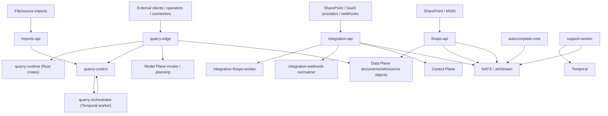

# Ingestion Plane Deep Dive

> **Verified 2026-07-11** (host-curl + source + compose): All service ports below confirmed live (200) — quarry-edge `:8082`, quarry-control `:8081`, imports-api `:3025`, integration-api `:3026`, integration-webhook-normalizer `:3036`, finspo-api `:3130`, and shipping-core `:3156`. Quarry stub claims re-confirmed in source. Corrections applied this pass: **shipping-core** and **integration-email-worker** were missing from the topology and have been added; **support-worker** was wrongly described as "not part of the main compose path" — it is a default (non-profile-gated) compose service and is running. autocomplete-core correctly remains absent from the Ingestion compose (it is referenced by velionv3 on `:3219`). Containers report `(unhealthy)` only because their exec-based healthchecks fail against a corrupted containerd store; the processes serve traffic normally.

## Executive Summary

The Ingestion Plane is the system's acquisition and normalization boundary. It accepts documents, pages, connectors, and support events from external systems, turns them into jobs and normalized records, and then hands durable content into the Data Plane and orchestration signals into the rest of CoreSystem.

The current plane is not a single stack. It is a layered mix of:

1. `Quarry-v2` as the public web/page ingestion runtime.
2. `integration-corev2` as the first-party connector broker.
3. `finspo-core` as the SharePoint and document-governance sync service.
4. `imports-core` as the file/source import API.
5. `shipping-core` as the carrier quote/booking/tracking service (host-published `:3156`).
6. `autocomplete-core` as a tenant-scoped suggestion sidecar.
7. `services/support-worker` as a support automation worker on Temporal + NATS.
8. Legacy or historical code still present on disk: `Quarry`, `integration-core`, plus profile-gated legacy services in compose.

That mixed state matters. The plane is functional, but it is not fully converged. Several surfaces are intentionally forward-stubbed, some docs still describe superseded architecture, and compose still carries legacy or partially wired services alongside the current stack.

## Current Runtime Topology

Primary compose file: `apps/Ingestion Plane/docker-compose.yml`

Active/default runtime services visible in compose:

| Service | Port(s) | Role |
|---|---:|---|
| `quarry-edge` | `8082` | Public ingest API for scrape/crawl/search/extract/research/agent jobs |
| `quarry-control` | `8081` | Durable control API for jobs, artifacts, stores, schedules, webhooks, event history |
| `quarry-orchestrator` | worker | Temporal worker for Quarry workflows |
| `imports-api` | `3025` | File/source import API |
| `integration-api` | `3026` | Connector API, OAuth broker, discovery/actions/hotpath runtime |
| `integration-finspo-worker` | worker | Worker linking integration-corev2 and finspo flows |
| `integration-email-worker` | worker | Email-sync worker; decrypts real provider OAuth tokens (vault key is load-bearing, no insecure default) and feeds conversation-ingest-rs |
| `integration-webhook-normalizer` | `3036` | Webhook normalization microservice |
| `shipping-core` | `3156`→`8080` | Carrier quotes/booking/labels/customs/tracking (Bring/DHL/UPS/FedEx + local mocks) |
| `finspo-api` | `3130` | SharePoint/document-governance sync API |
| `support-worker` | worker | Temporal worker + NATS bridge for support automation (triage/SLA/CSAT). Default compose service, not profile-gated |

Additional runtime surface on disk but **not** part of the Ingestion compose path:

| Service | Role |
|---|---|
| `autocomplete-core` | Tenant-scoped typeahead/suggestions API with optional NATS consumer. Not launched by the Ingestion compose; velionv3 references it at `http://autocomplete-core:3219` |

Legacy or profile-gated compose surfaces:

| Service/folder | Status |
|---|---|
| `integration-worker` | Compose profile `legacy` |
| `integration-engine-go-api` and worker | Compose profile `legacy` |
| `Quarry` | Older Quarry codebase retained on disk as donor/runtime predecessor |
| `integration-core` | Older connector stack retained on disk |

## Plane Boundary and Ownership

The Ingestion Plane owns external acquisition and normalization, not durable knowledge retrieval or long-lived inference.

It should own:

- External connector auth handshakes and session creation.
- Scraping/crawling/browser execution.
- Import job intake and source submission.
- SharePoint/connector sync orchestration.
- Support-event-triggered operational automations.
- Normalization of provider payloads before they enter durable planes.

It should not own:

- Durable retrieval, embeddings, graph index, or search index storage logic. That belongs to Data Plane v2.
- Long-lived model planning/inference orchestration. That belongs to Model Plane.
- User/org/session/auth policy ownership. That belongs to Control Plane.
- End-user application workflow state. That belongs to Application Plane / Frontend Plane.

## Relationship Map

## Quarry-v2

`Quarry-v2` is the most structurally important core in this plane. It splits public ingest, hot-path execution, and durable orchestration into separate services.

### Runtime split

| Component | Implementation | Responsibility |
|---|---|---|
| `quarry-edge` | Rust | Public API, auth, request validation, preflight, cache-aware dispatch, SSE |
| `quarry-runtime` | Rust crates | Driver selection, browser leases, execution, transforms, artifacts, action loop |
| `quarry-control` | Go | Durable resources: jobs, stores, snapshots, profiles, schedules, artifacts, webhooks, history |
| `quarry-orchestrator` | Go | Temporal worker for workflows, retries, schedule execution, checkpoints |
| `lab/evals` | Rust/Python-adjacent experimentation | Benchmarking, provider matrix, eval scaffolding |

### How it works

- `quarry-edge` is the public entrypoint.
- Fast-path requests can execute directly through Rust runtime logic.
- Durable or workflow-heavy requests pass through `quarry-control` and `quarry-orchestrator`.
- `quarry-control` owns resource/history APIs and the stable operator surface.
- `quarry-orchestrator` runs Temporal workflows rather than exposing business logic directly.

### Cross-plane dependencies

- Model Plane: `quarry-edge` calls Model Plane invoke/planning paths for answer, query, and agent-style flows.
- Data Plane: `quarry-edge` and related answer/search paths call retrieval URLs in Data Plane.
- NATS/Temporal/Postgres/Dragonfly/object storage underpin long-running job execution and artifact durability.

### Observed runtime signals

- `QUARRY_EDGE_AUTH_DEV_BYPASS=1` is explicitly blocked in production by startup checks.
- Compose comments state the model gateway `/v1/invoke/stream` path is still a stub on the downstream side, so some streamed answer flows are not end-to-end complete.
- `quarry-control` mounts a broad resource surface, but some schedule/resource families are intentionally empty or stubbed while schema/Temporal wiring catches up.

## integration-corev2

`integration-corev2` is the first-party connector broker. It handles provider sessions, OAuth flows, provider discovery, actions, hotpath behavior, and downstream calls into Finspo or other consumers.

### Runtime pieces

| Component | Responsibility |
|---|---|
| `cmd/api/main.go` | Main connector API server |
| `cmd/finspo-worker/main.go` | Worker joining integration flows to Finspo operations |
| `services/webhook-normalizer-rs` | Normalize inbound webhook payloads |
| internal services | OAuth, provider client, discovery, actions, hotpath, token vault, repositories |

### How it works

- Loads runtime config and validates it.
- Builds persistence, with in-memory fallback if `DATABASE_URL` is missing.
- Creates provider catalog, OAuth service, token vault, and optional NATS publisher.
- Uses Control Plane clients where needed for org/user context.
- Feeds provider-derived work into Finspo and other downstream consumers.

### Current caveats

- Compose still reuses `./integration-core/.env` for some local credentials, which is a strong sign of incomplete migration from v1.
- Multiple providers are registered in catalog/discovery surfaces before all direct OAuth, discovery, or actions implementations exist.
- Legacy integration services remain in compose behind `legacy` profiles.

## finspo-core

`finspo-core` is the SharePoint/document-governance ingestion core.

### Responsibilities

- Sync drive/site/file metadata from Microsoft Graph/SharePoint.
- Publish normalized source-object and file inventory downstream.
- Expose operational and analytics APIs.
- Interact with Data Plane source object/document endpoints.

### How it works

- Starts Postgres-backed API service on `3130`.
- Runs migrations and schedulers.
- Uses NATS for event publishing.
- Pulls connector credentials via integration-corev2.
- Talks to Data Plane document/source-object APIs rather than owning the durable knowledge stores itself.

### Notable characteristics

- API key plus `X-Org-ID` model is used at the service boundary.
- README frames it as no AI in-process, which aligns with plane separation.

## imports-core

`imports-core` is a Python FastAPI job intake service for file/source import requests.

### Responsibilities

- Accept uploaded files and source-based import requests.
- Create and track import jobs.
- Enforce internal auth and quota checks.
- Dispatch work to orchestrators or downstream services.

### How it works

- Exposes `/health`.
- Exposes import job routes under `/api/v1/import/jobs/...`.
- Performs quota/auth checks before dispatch.
- Holds temporary import-job state rather than long-lived knowledge state.

### Current position

- Still described as active development in its README.
- Functionally present in compose as `imports-api`.

## shipping-core

`shipping-core` is the carrier-integration service (quotes, booking, labels, customs, tracking). It is a Go service, host-published on `:3156` (container `:8080`), and is the intended Model Plane shipping tool behind operator/chat questions like "shipping time Oslo→Trondheim". Large uncommitted work has landed (booking service/store, per-carrier booking adapters, and new `internal/{dataplane,events,modelplane,recommend,reliability}` subdirs); that work is almost certainly NOT in the running image because image rebuild is currently Docker-blocked, so newer routes may 404 live even though they exist in source.

### Observed 2026-07-11

- `GET /api/carriers` returns `200` **without auth** [live-curl]; `POST /api/quotes` with an empty body returns `400` (validation, not authorization) [live-curl] — consistent with the prior finding that quote/carrier routes carry no auth/org gate.
- Bring transit-time parsing reads `expectedDelivery.alternativeDeliveryDates[0].workingDays` / `formattedExpectedDeliveryDate` (`internal/carrier/bring/bring.go:175-181`, wire types in `wire.go:96-100`); a unit test fixture (`bring_test.go`) exercises this path and asserts `TransitDays == 2` [source-only]. Whether that field placement matches live Bring responses is a shipping-core correctness question tracked in that service's own audit, not this doc.
- Carrier provenance: DHL/UPS/FedEx use vendor sandbox/test endpoints (not production); PostNord/DSV/Helthjem/Porterbuddy are explicit local mocks. Re-verify the `is_mock` vs real-provenance (`mode`/`environment`) fields against `/api/carriers` output before trusting the flag.

## autocomplete-core

`autocomplete-core` is a small tenant-scoped suggestions service.

### Responsibilities

- Provide suggestion/typeahead responses.
- Optionally consume push/update events from NATS.

### Implemented surface

- `/health`
- `/ready`
- `/v1/suggestions`
- `/v1/internal/push`

### Current position

- Exists as a sidecar utility rather than a central ingestion backbone service.
- README still lists pending work such as Velion proxy routing and title ingestion parity.

## support-worker

`services/support-worker` is a standalone TypeScript Temporal worker with a NATS bridge.

### Responsibilities

- Run support automation workflows such as triage, SLA, and CSAT.
- Subscribe/bridge NATS events into Temporal workflows.
- Execute support-related activities like classification, Zammad patching, notifications, and CSAT sending.

### Current position

- The code is real and not just build output.
- **Correction (2026-07-11):** it **is** a default service in `docker-compose.yml` (no `legacy`/optional profile) and is running. It reads as an operational worker rather than a public-API core, but it is part of the default compose path.

## Storage and Messaging

Across the plane, the following infrastructure appears in runtime paths or compose:

- Postgres for durable resource state, connector state, and sync state.
- Dragonfly for queue/cache/session support in Quarry and adjacent services.
- Temporal for durable workflows and schedules.
- NATS / JetStream for event propagation and normalization handoff.
- Object storage / artifact storage for Quarry outputs.

This is a high-fanout plane. Most services do not persist their own long-term semantic knowledge; they normalize or stage data and then hand off to Data Plane or downstream consumers.

## Stub, Mock, Placeholder, and TODO Audit

This section intentionally excludes normal test mocks and focuses on runtime-relevant or documentation-relevant partial surfaces.

### Quarry-v2

1. `Quarry-v2/docs/REST_RESOURCES.md`
   - Many resources are explicitly described as "forward stub" surfaces.
   - This matches the codebase state rather than being accidental drift.

2. `Quarry-v2/crates/quarry-edge/src/auth.rs`
   - Dev auth bypass injects stub claims for local development.
   - Protected by explicit production startup failure, so this is deliberate but important.

3. `Quarry-v2/crates/quarry-edge/src/answer_routes.rs`
   - Comments indicate downstream model-gateway `/v1/invoke/stream` is currently a stub.
   - Impact: streamed answer/invoke parity is incomplete across plane boundaries.

4. `Quarry-v2/services/quarry-control/internal/resources/cycle23.go`
   - `/v1/sources` list is still schema-TODO.
   - Schedule `trigger` and `backfill` endpoints are stubbed while Temporal SDK wiring is pending.
   - Notes in responses explicitly acknowledge the stub state.

5. `Quarry-v2/services/quarry-control/internal/temporal/client.go`
   - Concrete SDK client wiring is deferred; current path documents the upcoming swap.

6. `Quarry-v2/crates/quarry-runtime/src/request_queue.rs`
   - Dragonfly-backed and Postgres-backed request queues are still TODO.
   - That means durable multi-worker queue implementations are not fully converged in the runtime.

7. `Quarry-v2/crates/quarry-runtime/src/artifact_store.rs`
   - Contains `unimplemented!()` paths.
   - These should be treated as live partial surfaces until proven unreachable in production.

8. `Quarry-v2/lab/evals/src/bench_runner.rs`
   - Several evaluation modes return explicit stub/pending notes.
   - This is acceptable for lab scope, but the docs should not overstate live benchmark coverage.

9. `Quarry-v2/sdks/typescript/docs/*.md`
   - Generated SDK docs contain placeholder TODO content.
   - These are doc quality issues, not runtime blockers, but they are stale candidates if the SDK is meant to be user-facing.

10. `Quarry-v2/docs/QUARRY_V2_MODEL_PLANE_PARITY.md` and `gap-quarry.md`
   - Both openly describe unsupported or placeholder paths such as audio and model-parity gaps.
   - These are useful planning docs, but not a source of truth for "what is live today".

### integration-corev2

1. `integration-corev2/internal/discovery/service.go`
   - Returns `discovery is not implemented for <provider>` for unsupported providers.

2. `integration-corev2/internal/actions/service.go`
   - Returns `actions are not implemented for provider <provider>`.

3. `integration-corev2/internal/oauth/service.go`
   - Some providers are registered in the catalog but direct OAuth is not implemented yet.

4. `integration-corev2/internal/oauth/provider_client.go`
   - Profile discovery is not implemented for some providers.

5. `integration-corev2/README.md`
   - Local examples use placeholder Azure secrets.
   - Acceptable for documentation examples, but worth flagging during stale-doc review if examples imply broader provider readiness than code supports.

### Compose and operational glue

1. `docker-compose.yml`
   - Contains a non-secret publishable placeholder to avoid a local dashboard crash.
   - Also retains legacy-profile services and some empty connector env paths.

2. `smoke-test-integration-api.sh`
   - Uses fake success payloads in smoke examples.
   - Test infrastructure, not runtime risk, but it can mislead readers if treated as proof of full provider parity.

### imports-core

- No major runtime stub surfaced in the initial pass beyond normal example/development markers.
- Its main risk is documentation maturity, not explicit `not implemented` runtime branches found in the sampled entrypoints.

### autocomplete-core

- README lists pending parity work including proxy/title/correction items.
- This reads as partial scope rather than stale dead code.

### support-worker

- No obvious runtime placeholder surfaced in the main worker bootstrap.
- Classification depends on whether this service is still actively wired into production event flows.

## Relationship Coverage

The plane's main relationships are mapped well enough to understand the current system:

- Quarry public ingest -> Quarry runtime/control/orchestrator.
- Quarry -> Model Plane invoke/planning.
- Quarry -> Data Plane retrieval.
- Integration broker -> provider OAuth/discovery/actions -> Finspo and downstream consumers.
- Finspo -> Data Plane document/source-object surfaces.
- Imports -> internal import jobs and downstream orchestrators.
- Support worker -> Temporal + NATS.

What is not fully converged:

- Some Quarry control resources are mounted before their backing schema/Temporal implementation is complete.
- Some integration provider surfaces are advertised at catalog level before all provider-specific implementations exist.
- Compose still contains migration residue from older integration stacks.

## Likely Unused, Legacy, or Transitional Surfaces

### `Quarry`

The older `apps/Ingestion Plane/Quarry` tree remains on disk. Current docs and compose center on `Quarry-v2`, so the older tree should be treated as a donor/legacy codebase unless a live runtime still points at it.

### `integration-core`

`integration-corev2` is the current connector stack, but compose still references older env/layout expectations. The older `integration-core` folder is a likely archival or migration residue.

### Legacy compose profiles

`integration-worker`, `integration-engine-go-api`, and related legacy-profile surfaces remain present even though the main compose flow is on v2 services.

### Historical architecture docs

Some plane docs still describe pre-v2 Quarry or older service ownership, which now mismatches the compose/runtime evidence.

## Stale-Doc Candidates

These are candidates only. Do not delete until the cross-plane deletion register is complete.

1. `apps/Ingestion Plane/INGESTION_PLANE_ARCHITECTURE.md`
   - Describes an older Quarry/Go-centric architecture and older stack shape.
   - Current replacement/source of truth: `docker-compose.yml`, `Quarry-v2/docs/ARCHITECTURE.md`, this deep dive.

2. `apps/Ingestion Plane/IMPORTS_COMPLETION_SUMMARY.md`
   - Needs verification; filename suggests milestone closure rather than current source of truth.
   - Likely historical unless it still matches current imports-core state.

3. `apps/Ingestion Plane/Quarry-v2/docs/REST_RESOURCES.md`
   - Useful, but it documents intended route parity and forward stubs rather than only live-backed surfaces.
   - Keep for planning, not as runtime truth.

4. `apps/Ingestion Plane/Quarry-v2/docs/gap-quarry.md`
   - Planning/progress document with mixed current and future states.
   - Useful historically, risky as current architecture truth.

5. `apps/Ingestion Plane/README.md`
   - Closer to current reality than `INGESTION_PLANE_ARCHITECTURE.md`, but still needs a line-by-line truth pass against v2 plus compose.

## Operational Notes

- The plane has meaningful migration residue. Cleanup should be evidence-led, not cosmetic.
- Quarry-v2 is clearly the strategic web/page ingestion path.
- Connector maturity is uneven by provider. Catalog presence does not guarantee full discovery/actions/OAuth parity.
- Finspo looks more production-shaped than several other ingestion subsystems because its ownership boundary is narrower.
- `autocomplete-core` and `support-worker` are real services but peripheral to the primary ingestion backbone.

## Recommended Follow-Up Checks

1. ~~Verify whether `services/support-worker` is deployed anywhere or is now orphaned.~~ Resolved 2026-07-11: it is a default (non-profile-gated) compose service and is running.
2. Verify whether `integration-core` has any remaining runtime consumers.
3. Trace actual Frontend/Application calls into `integration-api`, `imports-api`, `autocomplete-core`, and Quarry to identify dead public surfaces.
4. Confirm whether Quarry schedule aliases are now backed by a real Temporal SDK client anywhere outside the sampled code.
5. Use the later stale-doc deletion register to separate:
   - historical planning docs worth archiving,
   - misleading docs to update,
   - safe-to-delete docs that are no longer referenced.
