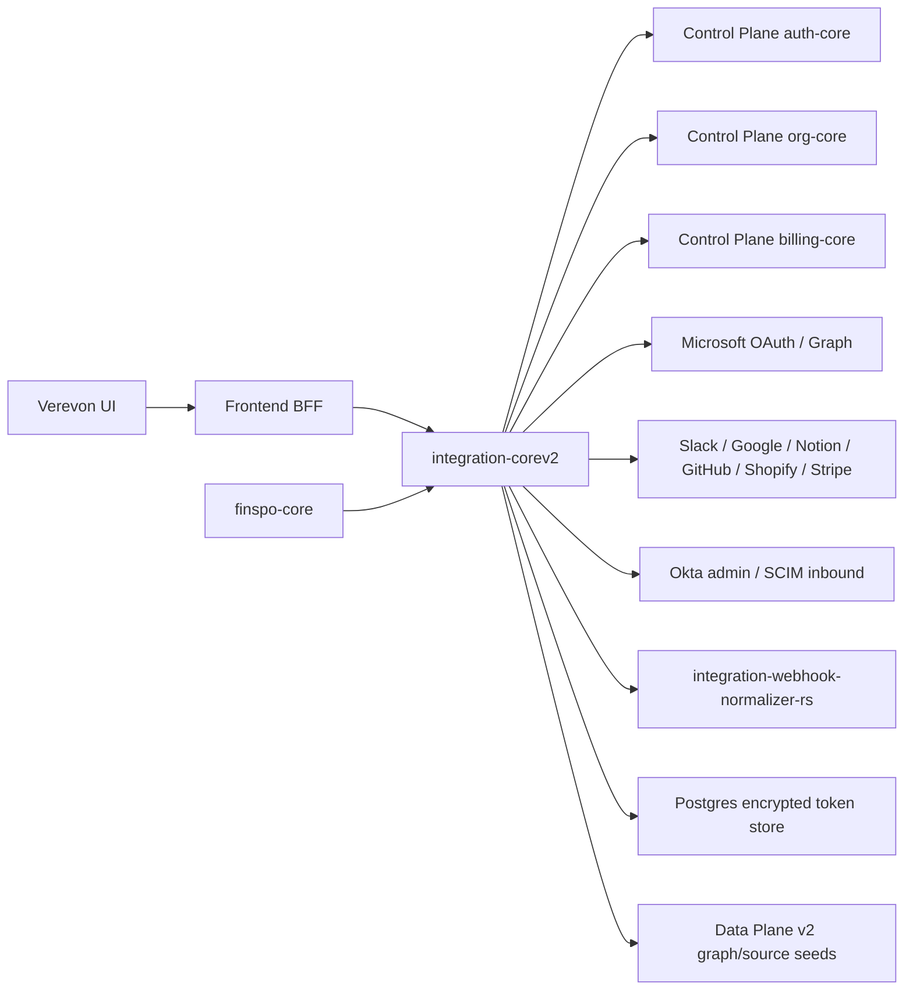

# integration-corev2 Architecture

## Goal

`integration-corev2` replaces the existing Ingestion Plane `integration-core`
v1. Verevon owns the integration layer instead of outsourcing the critical OAuth
and token lifecycle to Nango. The product UI remains Verevon-native, while
backend planes consume provider access through a narrow token broker contract.

This is not a standalone clone of the old ID-Knuten NestJS integration service.
The NestJS service remains a provider-action reference. The runtime authority is
Verevon's Control Plane.

## Boundaries

## Responsibilities

- `integration-corev2`: OAuth sessions, scope/capability catalog, encrypted
  provider credentials, connection lifecycle, safe provider discovery, internal
  token broker, source consent, sync job events, webhook intake, token leases,
  integration audit, v1 route replacement.
- `integration-webhook-normalizer-rs`: optional Rust hot-path worker for
  deterministic webhook normalization, body hashing, replay key extraction, and
  stable webhook ID generation. It does not own secrets, OAuth, provider tokens,
  or durable state.
- `auth-core`: session verification for Bearer user requests through
  `POST /internal/sessions/verify`.
- `org-core`: organization plan/entitlement lookup for user-facing connect
  sessions through `GET /orgs/{id}`.
- `billing-core`: usage metering through
  `POST /api/v1/billing/orgs/{id}/usage`.
- `finspo-core`: Microsoft 365 domain logic such as SharePoint inventory,
  ACL capture, governance proposals, Outlook/inbox enrichment later.
- `Data Plane v2`: normalized graph and source evidence.
- `Verevon UI`: provider selection, consent explanation, source management,
  real-time inspectors, profile/dashboard views, and settings UX.

## Why Go

Go matches `finspo-core`, compiles to a small static service, has strong
standard-library HTTP support, and is easier than Rust for provider OAuth
plumbing while still being safer and more operationally predictable than a
large Node service for this security boundary.

## Why Rust For The Webhook Hot Path

Webhook intake is the one integration-core path that can become bursty and
provider-noisy: duplicate events, signed raw bodies, provider-specific delivery
headers, replay identity extraction, and canonical event IDs. Rust is used here
for deterministic byte-level normalization and predictable latency. The Go
service keeps ownership of provider secrets, signature verification, Postgres,
NATS, tokens, consent, and API orchestration.

## Nango lessons kept

- Provider config and connection IDs are first-class.
- Connect sessions are short-lived and scoped.
- Connection lifecycle is separate from data sync.
- Provider-specific auth and provider-specific data sync are separate modules.
- Token broker/proxy is the only place that reads provider credentials.

## NestJS lessons kept

- Provider modules from the existing `integration-service` are treated as
  compatibility and behavior references.
- OpenTelemetry and event-publishing patterns are useful operational references.
- Token fetching from `auth-service` is not copied; provider tokens belong in
  `integration-corev2`.
- Bearer/internal auth, org scoping, plan gating, sync event names, and billing
  usage are copied from v1 because those are the replacement contracts.

## Nango parts intentionally not copied

- Hosted connect UI.
- Generic 800-provider runtime.
- TypeScript function runtime.
- Direct provider token exposure to application code.

Verevon should add providers deliberately as product capabilities, not as a
generic integration marketplace.

## Implementation direction

The Go service is the durable integration core. The legacy Nango service and
NestJS provider modules are blueprints while callers migrate:

- Microsoft, Slack, Google Workspace, Notion, GitHub, Shopify, and Stripe are
  first-party OAuth providers in the Go core. Provider credentials still gate
  runtime connect-session creation.
- Okta and SCIM are first-party enterprise adapters, but they are not normal
  user OAuth connect-session providers: Okta uses admin/API-token configuration
  and SCIM is inbound provisioning. SCIM bearer tokens are durable per-org
  records stored as SHA-256 hashes plus short prefixes; env tokens remain only
  as bootstrap fallbacks.
- `GET /api/v1/providers` stays public, matching v1.
  It also returns readiness fields (`configured`, `status`, `missingConfig`) so
  UI callers can distinguish ready OAuth providers from admin/inbound adapters.
- User-facing routes verify Bearer tokens against auth-core. Internal service
  routes use the shared `x-internal-api-key`.
- Connect-session creation is gated by org-core's effective plan for Bearer
  requests and bypassed for trusted internal onboarding/orchestration calls.
- New product callers should depend on Verevon connection IDs, capabilities, and
  token leases instead of Nango connection IDs.
- Internal token leases require an allowlisted `consumer`. Expiring-token
  refreshes are singleflighted per connection inside each Go process and, when
  the Postgres repository is active, guarded by a transaction-scoped advisory
  lock so multiple Go replicas do not refresh the same provider token at once.
  The refresh path re-reads the connection under the lock and reuses a token
  that another replica already refreshed.
- Existing callers can migrate through the internal-auth `/integrations/...`
  compatibility routes. These routes are route-name compatible with the useful
  NestJS provider actions, but they still require a Verevon connection and never
  expose a raw arbitrary proxy.
- Onboarding and Knowledge previews should use
  `GET /api/v1/connections/{id}/discovery` for bounded proof metadata before
  deeper ingestion jobs run. Discovery hides sensitive fallback labels such as
  mailbox emails and private Drive folder names; it should be treated as proof
  metadata, not content ingestion.
- Source sync should create `sync-jobs` and stream/poll `sync-events`; discovery
  is only safe proof metadata and must not trigger irreversible content
  ingestion.
- Microsoft sync jobs stop at `waiting_provider` for `finspo-core` handoff.
  Other provider sync jobs stop at `handoff_data_plane` until a Data Plane v2
  worker claims the source request. These states are intentional orchestration
  boundaries, not failed syncs. Failed or cancelled jobs can be retried through
  `POST /api/v1/sync-jobs/{id}/retry`, which creates a new job with `retryOf`
  metadata instead of mutating the original job.
- Internal workers claim handoff jobs through `POST /internal/sync-jobs/claim`.
  The claim is atomic in Postgres (`FOR UPDATE SKIP LOCKED`), requires an
  allowlisted consumer such as `finspo-core` or `data-plane-v2`, and moves the
  job to `running`.
- Workers advance durable checkpoints through
  `PATCH /internal/sync-jobs/{id}/progress`. The checkpoint stores only safe
  source references, deduped by source/external ID, while actual source records,
  content, and graph evidence remain owned by Finspo or Data Plane.
- Worker contract clients live in `internal/handoff`. They cover Finspo source
  creation/sync, Data Plane internal document creation, and integration-corev2
  claim/progress calls. They are deliberately thin contract helpers: they carry
  internal headers, parse service envelopes, and avoid logging remote bodies or
  secrets, but they do not make integration-corev2 the owner of source content.
- `cmd/finspo-worker` is the first worker using those contracts. It claims
  Microsoft `finspo-core` jobs, maps bounded SharePoint identifiers from job
  checkpoint/metadata, calls Finspo source creation/sync, then records a safe
  source reference in the integration checkpoint. It does not read provider
  tokens itself; Finspo continues to request Microsoft leases from the internal
  token broker.
- Webhook events are normalized with an explicit `schemaVersion` so Go fallback,
  Rust hot path, NATS consumers, and future Data Plane workers can evolve safely
  without silently changing event identity.
- Integration audit events are inserted into local durable storage and forwarded
  best-effort to audit-core's `/v1/audit` endpoint when `AUDIT_CORE_URL` is
  configured. Audit forwarding is non-blocking and never contains provider
  tokens.
- Requests honor an incoming `X-Request-ID` or generate one when missing. The
  ID is returned in response headers and JSON metadata, included in request
  logs, and forwarded with audit events.
- `/metrics` is exposed behind internal API-key auth and currently emits
  request counters plus accumulated request duration by method, route template,
  and status. Provider-specific latency/error dashboards still need richer
  instrumentation.

## Unified-Service Feature Split

Unified-service is retired as a standalone NestJS runtime. Its useful features
are preserved as smaller owned surfaces:

- Unified profile becomes a Verevon v2 BFF projection composed from Control Plane
  user/org data, `integration-corev2` connections/consents/sync status, and Data
  Plane source evidence.
- Consent lives in `integration_connection_consents` and is exposed on
  `/api/v1/connections/{id}/consents`.
- Real-time progress is exposed through Verevon v2 BFF SSE and the
  `integration-corev2` sync-event snapshot route.
- NATS remains the event backbone, but events contain only token references,
  connection IDs, org/user IDs, scopes/capabilities, status, and safe metadata.
- Matching/intelligence stays in Model Plane or Data Plane jobs, not in
  `integration-corev2`.
- Redis can be used by UI/BFF as ephemeral stream/cache state; durable
  integration state stays in Postgres and Data Plane.
