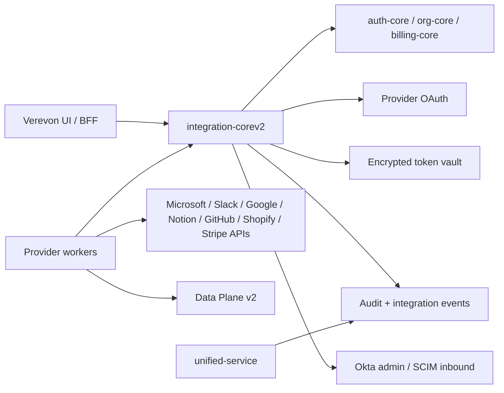

# Provider Blueprint

## Goal

`integration-corev2` is the first-party Verevon integration core and the direct
replacement for the existing Ingestion Plane `integration-core` v1. Nango and
the existing NestJS services are references for product shape and provider edge
cases, not runtime dependencies.

The Go core owns credentials, OAuth state, refresh, revocation, audit, and
internal token leasing. Control Plane services remain authoritative for user
sessions, organizations, plans, and billing. Product services consume narrow
internal contracts and must not store provider tokens.

## Borrowed From Nango

- Provider keys and connection IDs are stable product concepts.
- Connect sessions are short-lived and scoped to one user, org, provider, and
  capability bundle.
- Provider auth, provider actions, and provider sync are separate concerns.
- Webhooks are normalized before they enter product/data-plane code.
- Application code should request a brokered token, not load raw credentials.

## Borrowed From The NestJS Services

- Provider modules are useful product boundaries: Microsoft, Slack, Google,
  Notion, GitHub, Shopify, Stripe, Okta, and SCIM.
- Existing route names and provider actions are useful compatibility references.
- OpenTelemetry spans and NATS events are useful operational references.
- The anti-pattern to remove is token ownership in `auth-service`; provider
  tokens belong in `integration-corev2`.
- The contracts to keep are auth-core Bearer verification, org-core plan gates,
  internal API-key trust, billing usage, and connection sync events.

## First-Party Go Shape

## Provider Implementation Contract

Each provider should add these pieces in order:

1. Catalog entry with safe onboarding bundle and higher-risk bundles.
2. Config validation for client ID/secret and provider-specific base URLs.
3. Authorization URL builder.
4. Token exchange and refresh client.
5. Minimal profile/workspace discovery.
6. Disconnect/revoke behavior when the provider supports it.
7. Safe onboarding metadata seed for Data Plane v2.
8. Provider-specific sync/actions behind explicit capabilities.
9. Webhook verification and event normalization.

## Current Provider Status

| Provider | Catalog | Direct OAuth | Notes |
| --- | --- | --- | --- |
| Microsoft 365 | yes | yes | Primary implementation path. Includes knowledge, inbox, and full bundles. |
| Slack | yes | yes | Uses Slack OAuth v2 and comma-separated bot scopes. |
| Google Workspace | yes | yes | Uses offline access and PKCE for Drive, Gmail, and Calendar bundles. |
| Notion | yes | yes | Notion scopes are mostly integration-setting driven; keep capability language internal. |
| GitHub | yes | yes | OAuth app support is live; prefer GitHub App installation permissions for private repos later. |
| Shopify | yes | yes | Requires `providerContext.shop` or `shop` in connect-session requests. |
| Stripe | yes | yes | Stripe Connect OAuth plus signed webhook intake and billing support actions. |
| Okta | yes | no | Admin/API-token adapter. User/group discovery and lifecycle actions require explicit admin consent. |
| SCIM | yes | no | Inbound provisioning endpoint model with per-org bearer token; no OAuth flow. |

## Capability Rules

- `onboarding` must avoid sensitive scopes and content reads unless the provider
  cannot expose metadata separately.
- Mail send, chat write, order write, file write, and private repository access
  are always sensitive.
- Any write action requires human-in-the-loop policy before product execution.
- The broker may return short-lived access tokens only to authenticated internal
  services with the right org/workspace context.
- Bearer callers are always scoped by the auth-core principal. They cannot list,
  inspect, delete, sync, or act on another organization's connections.
- Internal callers must use the shared `x-internal-api-key` and provide explicit
  org/user/workspace context where needed.
- Discovery responses are read-only proof metadata. They must not include email
  bodies, chat messages, document contents, source code, customer records, order
  details, or private filenames.

## Migration Rules

- New callers should use `integration-corev2` contracts first.
- Old Nango connection IDs should be migrated to Verevon connection IDs through a
  compatibility mapping, not leaked into new APIs.
- Existing v1 callers should be able to keep the same high-level route shape:
  `/api/v1/providers`, `/api/v1/providers/{provider}/connect-session`,
  `/api/v1/providers/{provider}/connect`, `/api/v1/connections`, connection
  status/delete/sync, capabilities, consents, sync jobs/events, webhook intake,
  integration profile projections, and `/internal/connectors/token`.
- The NestJS `integration-service` can temporarily call `integration-corev2` for
  token leases while its provider actions are moved or replaced by named Go
  operations.
- NestJS-style `/integrations/...` compatibility routes may exist during
  migration, but they must resolve a Verevon connection and execute only
  whitelisted named actions.
- `unified-service` consumes integration events and read models only. It must
  not own OAuth credentials.

## Named Action Surface

The old NestJS services exposed common actions like Slack channel listing,
Microsoft mail/calendar reads, Google Drive listing, GitHub repositories, and
Notion pages/databases. The Go core keeps these as named operations instead of
copying the broad proxy shape. Stripe billing reads are also named actions.

This is intentional: Verevon workers can do the important jobs, but the broker
does not become an arbitrary request tunnel to every provider API.

Raw provider proxy routes should return `410 Gone`. If a product workflow needs
a new provider operation, add a named action with explicit parameter handling,
tests, audit metadata, and capability review.

## Sync, Webhook, And Token-Lease Primitives

Nango's useful primitives are rebuilt as Verevon-owned records:

- Connect sessions create Verevon connection IDs, scopes, and capabilities.
- `/internal/connectors/token` leases provider tokens to trusted services and
  records a token lease without exposing tokens to browser code.
- `/api/v1/sync-jobs` creates durable sync intent records. Internal workers use
  `/internal/sync-jobs/claim` to atomically claim `finspo-core` or
  `data-plane-v2` handoffs, then `/internal/sync-jobs/{id}/progress` to advance
  checkpoints and append UI-visible events.
- Worker implementations should reuse `internal/handoff` for downstream
  service contracts: Finspo source creation/sync, Data Plane internal document
  creation, and integration-corev2 claim/progress. The helpers set internal
  headers, parse envelopes, and keep service-token material out of errors.
- `cmd/finspo-worker` implements the Microsoft handoff path today. It expects
  SharePoint `site_id` and `drive_id` in job checkpoint/metadata, supports
  camelCase aliases, and records only safe source references back into
  integration-corev2.
- `/api/v1/sync-jobs/{id}/events` exposes a safe SSE snapshot for BFF/UI
  progress fanout.
- `/api/v1/webhooks/{provider}` verifies provider signatures where configured,
  stores normalized webhook events, and emits NATS notifications without tokens.
- `/api/v1/connections/{id}/consents` records source/purpose consent for
  reversible source management.
