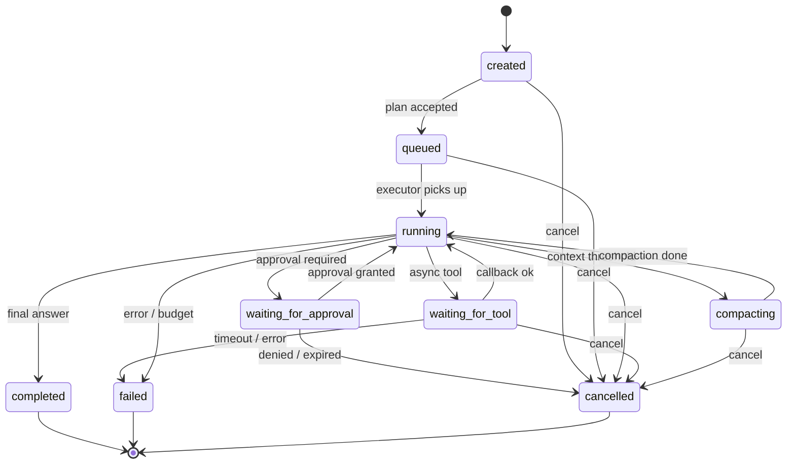

# Run State Machine — Model Plane v2

**Status:** Accepted (Phase 0 Contract Lock)
**Owner:** agent-core
**Last updated:** 2025

A `run` represents one turn of agent execution attached to a `thread`. This
document defines the canonical states, transitions, guards, emitted events,
and persistence rules. agent-core is the sole authority for advancing run
state; no other service may mutate `runs.state`.

---

## 1. States

| State | Terminal | Description |
|---|---|---|
| `created` | ❌ | Run row persisted, plan not yet queued. |
| `queued` | ❌ | Plan accepted, waiting for executor slot. |
| `running` | ❌ | Executor actively stepping through actions. |
| `waiting_for_approval` | ❌ | Paused pending human approval (see `approval_id`). |
| `waiting_for_tool` | ❌ | Paused pending async tool / connector callback. |
| `compacting` | ❌ | Context compaction in progress; execution suspended. |
| `completed` | ✅ | Finished successfully. Final answer persisted. |
| `failed` | ✅ | Terminated with error. `failure_reason` populated. |
| `cancelled` | ✅ | User- or system-cancelled before completion. |

Terminal states are immutable — no transitions out of `completed`, `failed`,
or `cancelled`.

---

## 2. Transition table

| From → To | Trigger | Guard | Emitted event |
|---|---|---|---|
| `created` → `queued` | Planner accepted plan | Plan valid, budget ok | `run.state_changed` |
| `queued` → `running` | Executor picks up run | Slot available | `run.state_changed` |
| `running` → `waiting_for_approval` | Action requires approval | Policy matched | `run.approval.requested` |
| `waiting_for_approval` → `running` | Approval granted | `approval.status = granted` | `run.approval.resolved` |
| `waiting_for_approval` → `cancelled` | Approval denied or expired | — | `run.approval.resolved`, `run.state_changed` |
| `running` → `waiting_for_tool` | Async tool invoked | Tool declared async | `run.tool_call.awaiting` |
| `waiting_for_tool` → `running` | Tool callback received | Callback matches `tool_call_id` | `run.tool_call.completed` |
| `waiting_for_tool` → `failed` | Tool timeout / error | Timeout exceeded | `run.tool_call.failed`, `run.state_changed` |
| `running` → `compacting` | Context over threshold | Token budget crossed | `run.compaction.started` |
| `compacting` → `running` | Compaction done | Summary persisted | `run.compaction.completed` |
| `running` → `completed` | Planner emitted final answer | No outstanding actions | `run.state_changed` |
| `running` → `failed` | Uncaught error / budget exhausted | — | `run.state_changed` |
| any non-terminal → `cancelled` | User or system cancel | Cancel authorised | `run.state_changed` |

Any transition not in this table is rejected with HTTP 409 and event
`run.transition.rejected`.

---

## 3. Diagram

---

## 4. Persistence

- Current state lives on `runs.state` (enum).
- Every transition writes one row to `run_state_transitions` with:
  `run_id`, `from_state`, `to_state`, `reason`, `actor_type`, `actor_id`,
  `transition_id` (UUIDv7), `created_at`.
- The corresponding envelope event carries `causation_id =
  transition_id` so downstream consumers can reconstruct the history.
- Transition insert + state update + event publish execute in a single
  transactional outbox write; the NATS publisher drains the outbox.

---

## 5. Invariants

1. **Single writer.** Only agent-core mutates `runs.state`.
2. **Monotonic.** Terminal states never transition.
3. **Idempotent cancel.** Cancelling a terminal run is a no-op and returns
   the existing state.
4. **Pause symmetry.** For every `waiting_for_*` entry there is exactly one
   resolving transition (resume, fail, or cancel).
5. **Budget ownership.** `running → failed` on budget exhaustion is driven
   by the executor, not by external services.

---

## 6. Timeouts (defaults)

| State | Default timeout | On timeout |
|---|---|---|
| `queued` | 5 min | → `failed` (reason: `queue_timeout`) |
| `waiting_for_approval` | 24 h | → `cancelled` (reason: `approval_expired`) |
| `waiting_for_tool` | 30 min | → `failed` (reason: `tool_timeout`) |
| `compacting` | 2 min | → `failed` (reason: `compaction_timeout`) |

Timeouts are enforced by a single agent-core reaper loop; they are
overridable per-org via policy.

---

## 7. Cross-references

- Envelope — `event-envelope.md`
- Identifiers — `identifiers.md`
- Ownership — `adr/ADR-001-service-ownership-matrix.md`
- Decision — `adr/ADR-003-run-state-machine.md`
