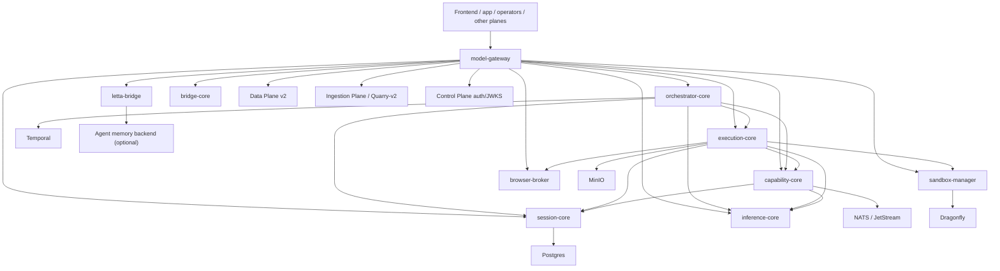

# Model Plane Deep Dive

## Executive Summary

The Model Plane is the AI reasoning, agent execution, orchestration, and capability-routing layer of CoreSystem. It is the plane that accepts authenticated invoke/session/task traffic, assembles context, routes inference, executes tool or agent loops, manages approvals and subagent lineage, and exposes capability and work APIs outward to the rest of the system.

This plane has a real production-shaped core, but it also contains a visible mix of:

1. Active current runtime under `apps/Model Plane`.
2. Historical donor or predecessor surface under `apps/Model Plane v2`.
3. Real services that are live in compose but still described as future or partial in older docs.
4. A set of adjacent capabilities that remain in-memory, best-effort, noop, or placeholder-backed.

The result is a plane that already has genuine agent support, but not a fully converged one. Core agent loop pieces are implemented; several surrounding durability, bridge, memory-adapter, and provider-completeness areas are still hybrid or partial.

## Current Runtime Topology

Primary compose file: `apps/Model Plane/deploy/docker-compose.yml`

### Infrastructure

| Service | Port(s) | Role |
|---|---:|---|
| `postgres` | `55434` | `session-core` durable store |
| `temporal-postgres` | internal | Temporal backing DB |
| `nats` | `4228`, `8228` | Event bus / inter-plane messaging |
| `minio` | `9002`, `9003` | Artifact/object storage |
| `dragonfly` | `6391` | Cache/lease/rate-limit support |
| `temporal` | `7234` | Durable orchestration engine |
| `temporal-ui` | `8233` | Temporal operator UI |
| `otel-collector` | `4317`, `4318`, `8889` | Tracing/metrics aggregation |

### Rust services

| Service | Host ports | Responsibility |
|---|---:|---|
| `model-gateway` | `8080`, `9090` | Public HTTP/gRPC boundary, auth, invoke/stream, routing, orchestration proxies |
| `session-core` | `18081`, `9091` | Durable thread/run/context/approval/lineage state |
| `inference-core` | `18082`, `9092` | Provider routing for chat, embeddings, speech, translation, vision, document intel, realtime, video |
| `execution-core` | `18083`, `9093` | Runtime step loop, shell execution, browser-agent loop, permission/approval gates |

### Go services

| Service | Host ports | Responsibility |
|---|---:|---|
| `orchestrator-core` | `8084` | Temporal worker and orchestration gRPC proxy |
| `capability-core` | `8085`, `9097` | Capability registry, policy, workplane HTTP APIs, learning review trigger |
| `sandbox-manager` | `8086`, `9094` | Sandbox lease and snapshot lifecycle |
| `browser-broker` | `8087`, `9095` | Browser grant issuance/revocation/validation |
| `letta-bridge` | `8088`, `9096` | Memory bridge with in-memory or external backend |
| `cost-core` | `8089`, `9098` | Cost/token ledger surface |
| `bridge-core` | `8091`, `9100` | CLI/IDE/channel ingress and session transport |

### Non-runtime but important plane directories

| Path | Role |
|---|---|
| `api/` | OpenAPI + SDKs |
| `proto/` | Protobuf contracts |
| `rust/crates/` | Shared Rust contracts/events/telemetry/orchestration libs |
| `python/` | Offline labs (`eval-lab-py`, `graph-lab-py`, `provider-research-py`, `mp-events-py`) |
| `bridges/` | Bridge-related docs/material |
| `scripts/` | verification and operational scripts |
| `../Model Plane v2` | predecessor/donor surface still present on disk |

## Plane Boundary and Ownership

The Model Plane owns reasoning and execution, not enterprise identity or durable business records.

It should own:

- Authenticated AI invoke and streaming entrypoints.
- Thread/run/context assembly for model interactions.
- Tool execution loops and approval gates.
- Agent and subagent execution behavior.
- Capability selection, policy checks, and skill surfaces.
- Temporal orchestration for long-running model workflows.
- Model/inference provider routing.
- Model-plane-local artifacts and internal event publication.

It should not own:

- User/org/auth/billing source-of-truth records. Control Plane owns those.
- Retrieval/document/embedding/graph durable stores. Data Plane owns those.
- Raw external ingestion/scraping/connectors. Ingestion Plane owns those.
- End-user app workflow state and interface composition. Application/Frontend own those.

## Relationship Map

## Current Service-by-Service Understanding

## model-gateway

`rust/services/model-gateway`

This is the public boundary of the plane.

### Responsibilities

- HTTP, gRPC, SSE, and some WebSocket-adjacent surfaces.
- Auth validation using JWKS or optional dev bypass.
- Normalization of invoke and orchestration requests.
- Routing to session-core, inference-core, capability-core, sandbox-manager, browser-broker, letta-bridge, and Data/Ingress dependencies.
- Best-effort background consumers for capability-registry cache coherence and document-index readiness.

### What it includes

- Public invoke and invoke-stream surfaces.
- Fetch and extract-structured surfaces that depend on `QUARRY_EDGE_URL`.
- Orchestration routes for plans, todos, approvals, and subagent lineage.
- HTTP proxying for capability-core workplane APIs: tasks, cron, memory, skills.
- Approval gate support in `approvals.rs`.
- Capability/MCP runtime cache consumers.

### Important runtime facts

- Data Plane retrieval, graph, and wiki URLs are explicitly wired through env vars.
- Quarry-dependent RPCs honestly return `Unimplemented` when Quarry edge is not configured.
- Approval persistence is best-effort from gateway to durable orchestration state; the gateway also keeps an in-memory approval store.

## session-core

`rust/services/session-core`

This is the durable state authority of the plane.

### Responsibilities

- Thread/message/run/checkpoint state.
- Event replay.
- Context assembly.
- Orchestration state surfaces for plans, todos, approvals, lineage, and run-event streaming.
- NATS/event publication and compaction loops.

### What it includes

- Postgres migrations and connection setup.
- gRPC services for session and orchestration surfaces.
- Broadcast/replay channel for orchestration events.
- Background NATS and compaction workers.

### Important runtime facts

- The code now implements `ListPlans`, `ListTodos`, `ListApprovals`, `CreateApproval`, `DecideApproval`, `GetSubagentLineage`, and `AttachSubagent` in `orchestration_grpc.rs`.
- Approval creation broadcasts orchestration events and persists durable state in Postgres.
- Subagent lineage is durable, queryable, and event-emitting rather than only a proto placeholder.

This is a critical correction relative to older docs that still describe these surfaces as mostly scaffolded.

## inference-core

`rust/services/inference-core`

This is the model provider router.

### Responsibilities

- Chat/invoke provider routing.
- Embeddings.
- Speech synthesis/transcription.
- Translation and language analytics.
- Vision and document intelligence.
- Realtime session provider routing.
- Video generation/provider routing.

### What it includes

- Config-driven provider chain.
- Multiple provider chain constructors by modality.
- gRPC serving plus health endpoints.
- In-memory cache only; no durable state ownership.

### Important runtime facts

- This service is broader than a plain LLM proxy. It already hosts multimodal routing chains.
- Some modalities are production-shaped only when the corresponding env is configured.
- Several docs still talk about future `ai-core`, while much of that routing already exists here.

## execution-core

`rust/services/execution-core`

This is the runtime loop and the clearest evidence that Model Plane does have agent support.

### Responsibilities

- `ExecuteStep` and `ResumeRun`.
- Tool dispatch.
- Permission gating.
- Approval pausing.
- Shell execution via sandboxed process path.
- Browser-agent planning/execution loop.
- Subagent hook/spawn behavior.

### Evidence of agent support

1. `browser_agent.rs`
   - Implements a full browser action/observation loop.
   - Tracks plan status, step limits, runtime limits, domain allowlists, stop criteria, approval pauses, and Quarry observations.

2. `runtime_loop/mod.rs`
   - Explicitly handles `browser_agent` and `subagent.*` tools.
   - Routes `shell` through a real sandboxed executor path.

3. `grpc.rs`
   - Creates approvals when runtime outcome is `awaiting_approval`.

4. `subagent` module
   - Participates in subagent spawning/annotation behavior.

This is real agent-capable runtime behavior, not just nomenclature.

## orchestrator-core

`go/services/orchestrator-core`

This is the durable outer workflow shell around the runtime.

### Responsibilities

- Temporal workflow ownership.
- Long-running supervision and research/task flows.
- Feedback-promotion loop wiring.
- Compatibility subscriptions on NATS.
- Orchestration gRPC service.

### What it includes

- Workflows:
  - `InteractiveRunSupervision`
  - `DeepTaskWorkflow`
  - `MemoryConsolidationWorkflow`
  - `SkillPromotionWorkflow`
  - `FeedbackPromotionWorkflow`
  - `WideResearchWorkflow`
- Activities that call session-core, inference-core, execution-core, and capability-core.
- Compatibility adapter for legacy run/session subjects.
- gRPC handlers that proxy orchestration RPCs to session-core.

### Important runtime facts

- Orchestration gRPC handlers are no longer pure `Unimplemented`; they proxy to session-core when configured.
- Some Temporal activities still degrade gracefully or behave as placeholders when downstream services are absent.

## capability-core

`go/services/capability-core`

This service is a hybrid registry/policy/workplane service.

### Responsibilities

- gRPC capability and policy evaluation.
- HTTP APIs for skills, MCP servers, routing, safety, memory, tasks, and cron.
- Capability reconcile event publication.
- Learning-review trigger on `RUN_COMPLETED`.
- Delegation helpers to session-core and inference-core.

### What it includes

- A registry loaded from Postgres-backed source when available, or static seed fallback.
- A Postgres-backed models registry.
- A Postgres-backed mutable capabilities store.
- HTTP CRUD APIs over `agent_memory`, `agent_skills`, and other registry/workplane tables.
- NATS-driven learning-review consumer that fetches transcript/context and persists learned skills.

### Important runtime facts

- Some older docs say capability-core is in-memory only. That is no longer fully true.
- The gRPC registry/policy engine still relies on an in-memory `Registry` abstraction, but that registry is loaded from durable sources when possible.
- HTTP workplane APIs are plainly durable Postgres-backed CRUD surfaces.

So the right description is hybrid, not "in-memory only" and not "fully converged platform".

## sandbox-manager

`go/services/sandbox-manager`

### Responsibilities

- Acquire/release sandbox leases.
- Create snapshot references.
- Report health.

### Important runtime facts

- The implementation does handle `AcquireLease`, `ReleaseLease`, `SnapshotSandbox`, and `Health`.
- Stores are in-memory, not Dragonfly- or MinIO-backed durable lifecycle managers yet.
- `cmd/main.go` still contains a misleading comment saying the gRPC server returns `Unimplemented`, but the server implementation is live.

## browser-broker

`go/services/browser-broker`

### Responsibilities

- Acquire, revoke, and validate browser grants.
- Maintain browser-session scope control.

### Important runtime facts

- Grant lifecycle methods are implemented against an in-memory store.
- This is more live than some old docs imply, but durability is still not there.

## letta-bridge

`go/services/letta-bridge`

### Responsibilities

- Memory indexing/search bridge.
- Optional external memory backend adapter.

### Important runtime facts

- Falls back to in-memory substring store unless `AGENT_MEMORY_URL` is configured.
- The "real" adapter path is optional and not the default runtime.
- This remains one of the clearest partial surfaces in the plane.

## bridge-core

`go/services/bridge-core`

### Responsibilities

- Session registration/listing/get/close for channels.
- Payload ingestion for CLI/IDE/web/API sessions.
- Channel adapter registry.

### Important runtime facts

- The HTTP API is real and mounted.
- Default adapters are `NoopAdapter` pass-through/deliver-noop implementations.
- This means the ingress shell exists, but most concrete channel delivery paths are not yet wired.

## cost-core

`go/services/cost-core`

### Responsibilities

- Cost/token ledger.
- HTTP API and health.
- Usage envelope subscription.

### Important runtime facts

- Ledger is currently in-memory.
- gRPC only serves health, not a real cost RPC surface yet.
- The usage feed subscriber still uses `NATS_FEED_PATH` placeholder file input until a real NATS client is wired.

## Agent Support Assessment

The answer to "does Model Plane have agent support?" is yes, but with qualifiers.

### Clearly implemented

- Agent invoke flows through `model-gateway`.
- Runtime step execution in `execution-core`.
- Browser-agent loop with planning/actions/observations.
- Approval gating and pending-approval lifecycle.
- Subagent lineage persistence and retrieval.
- Learned skill review loop in capability-core.
- Temporal supervision workflows around execution.

### Still partial

- Some approval state is still held in gateway memory first, with best-effort durable write-through.
- Bridge/channel adapters are mostly noop by default.
- Memory-adapter bridge is fallback/in-memory unless external backend is configured.
- Cost and some capability surfaces are not durably complete.
- Some modality or cross-plane features still depend on downstream env wiring or provider readiness.

So this is genuine agent support, not finished agent platform convergence.

## Cross-Plane Dependencies

### Control Plane

- `model-gateway` validates auth through Control Plane JWKS configuration.
- Model Plane consumes identity context but should not own identity.

### Data Plane v2

- `model-gateway` routes retrieval, graph, and wiki calls into Data Plane.
- Data Plane retrieval-engine also depends on Model Plane inference-core for embeddings in some paths.

### Ingestion Plane

- `model-gateway` fetch/extract paths depend on Quarry edge when configured.
- Browser-agent flows intersect with Quarry for action/observation execution.

### Frontend/Application Plane

- Public clients should largely interact with Model Plane through `model-gateway`.
- Capability, orchestration, task, memory, and skill APIs are surfaced outward via gateway or capability-core.

## Storage and Messaging

Current storage and bus picture:

- Postgres: session-core durable data; capability-core workplane/registry data; Temporal backing DB.
- Dragonfly: configured for capability/sandbox support, but several stores are still in-memory in code.
- MinIO: configured for artifacts, but durability varies by surface.
- Temporal: real workflow engine for orchestrator-core.
- NATS / JetStream: compat events, run events, capability reconcile events, learning-review trigger, usage flow.

## Stub, Mock, Placeholder, and TODO Audit

This section excludes normal test-only mocks and generated proto stubs, and focuses on runtime-relevant or documentation-relevant partial surfaces.

### model-gateway

1. `rust/services/model-gateway/src/grpc.rs`
   - Quarry-dependent RPCs return `Unimplemented` when Quarry edge is not configured.
   - Several mock modality outputs exist in test scaffolding.

2. `rust/services/model-gateway/src/auth.rs`
   - Dev auth bypass injects stub claims for local development.

3. `api/openapi.yaml`
   - `/v1/ai/realtime` is still documented as a placeholder session route.

4. `rust/services/model-gateway/src/approvals.rs`
   - Approval store is explicitly in-memory and documented as a lightweight, ephemeral source of truth with best-effort durable persistence.

### orchestrator-core

1. `go/services/orchestrator-core/cmd/activities/activities.go`
   - Several activities degrade gracefully when downstream services are unavailable.
   - This is resilient behavior, but it also means some flows are placeholders under degraded conditions rather than hard failures.

2. Older README/docs references still call some activity paths placeholder-backed.

### capability-core

1. `internal/server/server.go`
   - Comment still says "in-memory registry and policy engine", which is only partially true now because the service loads from durable Postgres sources when available.

2. `internal/registry/registry.go`
   - Registry abstraction is still an in-memory loaded catalog, even though backing data can be Postgres.

3. Some internal catalogs (`commands`, `tasks`, `schedule`, `coordination`, `modalities`) are still seed-style in-memory metadata.

### sandbox-manager

1. `cmd/main.go`
   - Comment says "stub returning Unimplemented", but server implementation supports acquire/release/snapshot/health.
   - This is stale commentary, not just a missing feature.

2. Durability is still missing because stores are in-memory.

### browser-broker

- Grant lifecycle is real, but storage is in-memory only.

### letta-bridge

- Default memory backend is in-memory.
- External backend is optional and not the default.

### bridge-core

1. `internal/channel/adapter.go`
   - Default channel adapters are noop or skeleton behavior.
   - WebSocket adapter is explicitly described as future-iteration skeleton.

### cost-core

1. `cmd/main.go`
   - NATS usage subscriber is a placeholder file-based feed until real NATS client wiring is completed.

2. gRPC is health-only.

### Documentation overclaims and underclaims

1. `docs/gap-model.md`
   - Claims there are no stubs or TODO-only files in shipped services.
   - That is no longer defensible against the actual current runtime surface.

2. `docs/ARCHITECTURE.md`
   - Understates how much of bridge-core, browser-broker, sandbox-manager, session-core orchestration, and multimodal routing is already implemented.

## Relationship Coverage

The plane's main current relationships are mapped well enough to support later system-wide analysis:

- gateway -> session/inference/execution/orchestration/capability
- execution -> approvals/sandbox/browser-agent/subagent
- orchestration -> Temporal plus sibling services
- capability -> registry/workplane/learning loop
- gateway -> Data Plane and Quarry
- bridge/core sidecars -> ingress, grants, leases, memory, cost

What remains partially mapped or partially converged:

- Exact production usage of `bridge-core` versus other ingress paths.
- Whether `letta-bridge` ever runs with a real external backend outside local or planned deployments.
- How much `cost-core` is actually consumed today versus staged for future enforcement.

## Likely Legacy, Donor, or Transitional Surfaces

### `Model Plane v2`

`apps/Model Plane v2` remains on disk with `agent-core`, `ai-core`, `capability-core`, `cost-core`, `execution-core`, and `llm-worker` directories. Current `apps/Model Plane/README.md` explicitly frames the Rust-first current stack as replacing Model Plane v2 through incremental cutover.

This makes `Model Plane v2` a donor/migration surface, not the primary current source of truth.

### Older docs that no longer match code

- Some docs still present capability-core, sandbox-manager, browser-broker, bridge-core, or orchestration surfaces as future or mostly stubbed.
- Other docs swing too far the other direction and claim shipped services are fully free of stubs.

## Stale-Doc Candidates

These are candidates only. Do not delete until the cross-plane stale-doc register is compiled.

1. `apps/Model Plane/docs/ARCHITECTURE.md`
   - Valuable, but partially stale.
   - Undercalls current implementation in session-core orchestration, sandbox-manager, browser-broker, bridge-core, and capability-core durability.

2. `apps/Model Plane/docs/gap-model.md`
   - Overclaims completeness in places that the current code contradicts.
   - Keep as historical plan/audit input, not current runtime truth.

3. `apps/Model Plane/README.md`
   - Mostly useful, but some placeholder/stub statements need a fresh truth pass.

4. `apps/Model Plane/api/openapi.yaml`
   - At least the realtime section is explicitly placeholder-oriented and may lag actual routed modality support elsewhere.

5. Any doc that treats `bridge-core` or `cost-core` as absent when compose now runs them.

## Operational Notes

- The active runtime is `apps/Model Plane`, not `Model Plane v2`.
- The Model Plane is already the main agent-capable execution layer of the system.
- Several secondary capabilities are real enough to route traffic but not yet durably mature.
- The biggest documentation risk in this plane is contradiction, not absence.

## Recommended Follow-Up Checks

1. Trace which Frontend/Application flows currently call `model-gateway` orchestration routes versus capability-core HTTP APIs directly.
2. Verify whether `bridge-core` is actually wired into any current clients or still primarily staged infrastructure.
3. Verify whether `cost-core` receives real NATS usage in deployed environments or still relies on placeholder feed mode.
4. Confirm whether `letta-bridge` is ever run with `AGENT_MEMORY_URL` in any non-local environment.
5. When building the stale-doc register, classify Model Plane docs into:
   - still useful but needs update,
   - historical planning docs worth archiving,
   - safe deletions.
