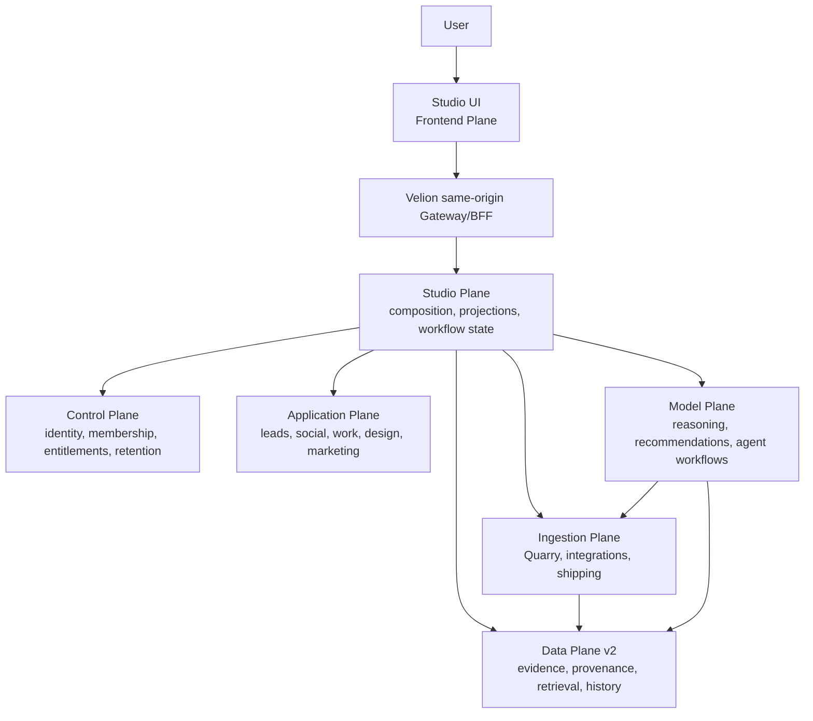
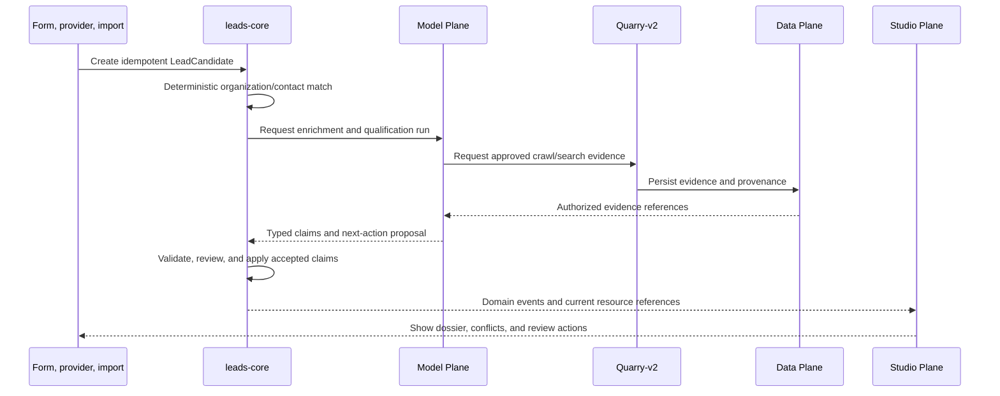

# Velion Studio Plane

**Status:** Proposed architecture and delivery baseline  
**Last updated:** 2026-07-19  
**Product owner:** Studio  
**Runtime position:** Composition layer between the Frontend Plane and existing domain authorities

## Purpose

Studio is the place where users turn trusted business signals into approved work.

It brings lead intelligence, competitor monitoring, marketing, human work
management, design, and shipping into one coherent Velion workspace. Studio is
not a second implementation of those domains. It composes their data, actions,
approvals, and workflows while each canonical domain remains owned by its
existing plane and core.

The central product loop is:

```text
discover a signal
  -> collect attributable evidence
  -> understand and recommend
  -> review and approve
  -> create work or content
  -> execute through the owning core
  -> measure the factual result
```

## Architectural decision

Studio Plane is a **product composition and cross-domain workflow plane**.

It owns:

- Studio workspace composition and navigation;
- saved views, layouts, filters, and user-visible module configuration;
- typed links between resources owned by different domains;
- rebuildable cross-domain read projections;
- cross-domain workflow instance and compensation state;
- Studio-level command routing, progress, and failure visibility;
- the Studio overview, signal inbox, approval inbox, and activity feed; and
- versioned Studio composite contracts consumed by the Frontend gateway.

It does **not** own:

- users, organizations, roles, entitlements, billing, or canonical audit;
- CRM accounts, contacts, opportunities, stages, or activities;
- raw crawls, search results, screenshots, or provider credentials;
- durable knowledge, embeddings, retrieval, or source evidence;
- reasoning, model runs, agent tasks, or tool selection;
- social provider accounts, posts, publish jobs, or provider metrics;
- canonical design documents or artifacts;
- carrier quotes, bookings, tracking, labels, or manifests; or
- arbitrary copies of data from other cores.

This boundary is non-negotiable. Studio Plane must not become a shared database,
a generic proxy, or a distributed monolith.

## Position in CoreSystem



The browser continues to call the Velion same-origin gateway. It never calls
Studio Plane or another plane directly. The gateway derives the authenticated
organization and actor, strips forged scope headers, normalizes typed envelopes,
and obtains audience-bound service tokens.

## Product information architecture

Studio should be a workspace with focused modules, not one enormous page.

```text
Studio
  Home
    active work, important signals, approvals, failures, recent artifacts

  Revenue
    Accounts
    Leads
    Contacts
    Opportunities
    Pipeline
    Activities

  Market
    Competitors
    Watchlists
    Signals
    Changes
    Market briefs

  Campaigns
    Campaigns
    Audiences
    Journeys
    Content calendar
    Approvals
    Performance

  Create
    Design canvas
    Assets
    Templates
    Brand system
    Reviews
    Exports

  Work
    Projects
    Work items
    Boards
    Dependencies
    Comments

  Operations
    Shipping quotes
    Bookings
    Tracking
    Exceptions
    Documents
```

Shipping may appear under Studio for a unified experience, but its canonical
state and external actions remain in `shipping-core`.

## Domain ownership

| Capability | Canonical owner | Studio responsibility |
|---|---|---|
| Identity, organization, roles | Control Plane | Display effective access; never grant it |
| Entitlements, quotas, retention | Control Plane | Enforce returned decisions and show limits |
| Accounts, contacts, leads, opportunities | Application Plane `leads-core` | Revenue UI, composite views, links, workflow progress |
| Competitor relationships and watch policies | Initially a bounded module in `leads-core`; extract `market-core` only when justified | Watchlist and signal experience |
| Web crawl, search, screenshots, changes | Ingestion Plane Quarry-v2 | Request authorized jobs and show progress/evidence links |
| Provider OAuth, APIs, and webhooks | Ingestion Plane `integration-corev2` | Connection readiness and provider action status |
| Durable evidence and provenance | Data Plane v2 | Render citations, freshness, conflicts, and source history |
| Qualification and recommendations | Model Plane | Start runs and present attributable proposals |
| Social accounts, posts, approvals, publishing | Application Plane `social-core` | Campaign and content experience |
| Cross-channel journeys and audiences | Future Application Plane `marketing-core` | Journey builder and measurement views |
| Human projects and work items | Future Application Plane `work-core` | Project, board, list, and linked-work views |
| Agent tasks and cron | Model Plane session/orchestrator/capability cores | Show linked execution state only |
| Design documents, revisions, artifacts | Application Plane `studio-core` | Design editor, reviews, and exports |
| Quotes, bookings, labels, tracking | Ingestion Plane `shipping-core` | Read models and risk-gated user actions |

Physical directory placement does not override these ownership rules. Existing
cores remain in their current planes. Moving a core requires a separate ADR,
data migration, contract migration, and rollback plan.

## Planned Studio Plane components

Studio Plane should begin small.

```text
apps/Studio Plane/
  README.md
  contracts/                  # future versioned Studio composite contracts
  services/
    studio-composition-core/  # future workspace/views/links/composite queries
    studio-projection-worker/ # future rebuildable event projections
  docs/
    adr/                      # plane-specific architectural decisions
    runbooks/                 # deployment, rebuild, recovery, rollback
```

Do not create empty services merely to match this tree. Add a component only
when it owns durable state or a separately deployable workload.

### `studio-composition-core`

This service may own:

- Studio workspaces and module configuration;
- saved views and filters;
- typed cross-domain resource links;
- user-visible workflow instances;
- cross-domain correlation and causation metadata;
- compensation state for partial cross-domain failures; and
- composite queries that cannot be served efficiently by the gateway alone.

It must not persist canonical CRM, campaign, design, or shipment records.

### `studio-projection-worker`

This optional worker may consume versioned domain events and build disposable,
rebuildable Studio read models. Every projection must record its source event,
source revision, freshness, and rebuild checkpoint.

A projection may improve reads, but it can never authorize a write or override
the source domain.

## Canonical resource references

Cross-domain links must use typed references rather than copied records:

```json
{
  "kind": "lead_account",
  "id": "account_01J...",
  "ownerPlane": "application",
  "ownerService": "leads-core",
  "organizationId": "org_01J...",
  "revision": "42"
}
```

Common resource kinds include:

- `lead_account`, `contact`, `opportunity`, `competitor_watch`;
- `campaign`, `audience`, `journey`, `social_post`;
- `work_project`, `work_item`;
- `design_project`, `design_revision`, `artifact`;
- `shipment`, `booking`, `tracking_event`; and
- `evidence_document`, `source_snapshot`, `model_run`.

IDs must be stable, opaque, organization-scoped, and generated by the owning
service. Studio must not mint IDs for resources it does not own.

## Lead and competitor model

Lead and competitor intelligence should share organization identity and
evidence primitives without becoming the same workflow.

An organization may hold multiple relationships to the user's organization:

```text
prospect | lead | customer | competitor | partner | supplier
```

Relationships are temporal and non-exclusive. A supplier may also be a
competitor; a lead may later become a customer.

`leads-core` should evolve in bounded modules:

```text
accounts       canonical commercial organization records
contacts       separately protected person records
candidates     unreviewed intake and match state
opportunities  pipeline and commercial stage state
activities     notes, calls, tasks, messages, and timeline references
relationships  lead/customer/competitor/partner/supplier roles
claims         accepted structured facts with provenance
watchlists     monitoring intent, cadence, sources, and budgets
sync           external CRM links, cursors, conflicts, and outcomes
```

Do not store an opaque mutable "AI profile". Every asserted field must be
traceable:

```text
subject_id
field_name
typed_value
source_reference
source_class
observed_at
freshness_until
confidence
verification_state
fact_class: observed | estimated | generated
privacy_class
purpose and lawful basis when personal data is involved
producing_run_id
review_state and reviewer
```

Data Plane owns the underlying evidence. `leads-core` owns the accepted
operational projection and source references.

## Lead intelligence workflow



AI may propose entity matches, merges, qualification, next actions, and
monitoring changes. It must not silently merge records, overwrite verified
facts, contact people, publish content, or create external side effects.

## Monitoring and automatic discovery

Daily full-web searches for every record are prohibited. Monitoring must be
adaptive and budgeted.

Every watch policy should define:

- subject and relationship role;
- approved sources and domains;
- cadence and importance tier;
- last successful observation and last material change;
- freshness TTL;
- per-run and monthly budget;
- domain/provider rate limits;
- content fingerprint or validator state;
- retry, backoff, and circuit-breaker state;
- retention and ZDR policy; and
- notification and review thresholds.

Quarry performs deterministic collection and change detection. Model Plane
reanalyzes only when evidence changes, expires, or a user explicitly requests
it. Crawled content is untrusted data and must never become agent instructions.

LinkedIn must be accessed through approved APIs and granted capabilities only.
Do not scrape LinkedIn profiles or treat LinkedIn as a universal verification
authority. Bronnoysundregistrene is authoritative for Norwegian legal-entity
facts; company websites and social profiles are supporting evidence.

## Marketing architecture

`social-core` remains authoritative for social provider accounts, post drafts,
scheduling, approvals, publish jobs, provider attempts, and factual metrics.

Create `marketing-core` only when non-social campaign orchestration exists. It
should own:

- audience definitions and immutable audience snapshots;
- segments and eligibility evaluation;
- consent, suppression, unsubscribe, and contact-frequency policy;
- campaigns and journey definitions;
- triggers, waits, branches, goals, and experiment variants;
- attribution and conversion references; and
- channel-neutral delivery intents.

Channel executors remain separate:

```text
marketing-core delivery intent
  -> social-core for social publishing
  -> authorized email/SMS provider adapter
  -> conversation/inbox contracts for approved messaging
```

The same campaign must not have two canonical owners. Until `marketing-core`
exists, `social-core` campaigns remain explicitly social campaigns. A future
migration must introduce a channel-neutral campaign ID and make social records
channel executions referencing it.

## Human work management

Use the name `work-core` or `project-core`, not `task-core`. Model Plane already
owns agent task execution, cron, and durable run coordination.

The first version should contain only:

- projects;
- work items;
- statuses and workflows;
- assignees and teams;
- due dates and priorities;
- dependencies and blockers;
- comments and mentions;
- list and board ordering; and
- typed links to leads, campaigns, designs, evidence, and shipments.

An agent run may reference a human work item, and a human work item may show an
agent run's progress. They remain different records with different owners.

Do not attempt full Plane or AFFiNE parity before the linked-work-item workflow
is proven useful inside Velion.

## Design Studio

The design capability is `studio-core`; do not create a second peer
`design-core`.

`studio-core` owns:

- structured design documents;
- pages, boards, frames, layers, components, variants, and tokens;
- monotonic revisions and append-only typed operations;
- optimistic concurrency, undo/redo, and conflict handling;
- comments, reviews, approvals, and publish intents;
- immutable artifact manifests;
- sandboxed previews and signed downloads; and
- exports and explicit downstream handoffs.

Model Plane proposes typed design operations. `studio-core` validates
authorization, schema, current revision, quota, and policy before applying an
operation. Raw model-generated HTML is never canonical editable state.

The current Velion gateway-local canvas store is a prototype. Migration must:

1. preserve the current UI and response shape behind an adapter;
2. persist projects in `studio-core`;
3. add revisions and operation idempotency;
4. reject stale writes honestly;
5. introduce artifact manifests and signed previews;
6. connect Model runs and review state; and
7. remove the gateway-local store only after restart and tenant-isolation tests.

## Shipping workspace

`shipping-core` remains the only shipping authority. Studio may present:

- carrier availability and explicit production/sandbox/mock provenance;
- rate comparison and recommendation explanations;
- booking list and detail;
- tracking timeline;
- labels, customs documents, manifests, and audit references;
- reliability evidence; and
- exception-driven work items.

Release read-only shipping first. External writes require separate confirmation
and execution-time authorization:

- create or confirm booking;
- cancel shipment;
- schedule pickup;
- create manifest; and
- any action that may incur a carrier charge.

Studio stores only links, annotations, workflow state, and rebuildable
projections. It never copies the canonical shipment ledger.

## Public lead capture and CRM integrations

Website chatbot and public widget traffic belongs to Channel Plane when that
runtime exists. Until then, supported intake should be described honestly as:

- manual entry;
- CSV import;
- signed contact-form webhook;
- authorized provider lead forms; and
- controlled internal API ingestion.

Every public intake edge must verify signature or origin, rate-limit, validate
schemas, record consent/notice metadata, deduplicate, and create a candidate
rather than an accepted CRM record.

CRM interoperability should begin with one-way synchronization to one provider.
Each adapter requires:

- external record links;
- sync cursor and checkpoint state;
- provider revision/etag where available;
- mapping version;
- explicit system-of-record and field precedence rules;
- webhook deduplication and replay protection;
- conflict records and user-visible resolution;
- token-expiry/reconnect handling; and
- redacted dead-letter and retry tooling.

Do not launch bidirectional "sync everything" without proven conflict handling.

## Composite API

The Frontend gateway may expose a normalized Studio contract backed by Studio
Plane and the owning domain APIs:

```text
GET    /api/v1/studio/overview
GET    /api/v1/studio/activity
GET    /api/v1/studio/signals
GET    /api/v1/studio/approvals

GET    /api/v1/studio/workspaces
POST   /api/v1/studio/workspaces
GET    /api/v1/studio/workspaces/:workspaceId
PATCH  /api/v1/studio/workspaces/:workspaceId

GET    /api/v1/studio/views
POST   /api/v1/studio/views
PATCH  /api/v1/studio/views/:viewId
DELETE /api/v1/studio/views/:viewId

GET    /api/v1/studio/links
POST   /api/v1/studio/links
DELETE /api/v1/studio/links/:linkId

POST   /api/v1/studio/workflows
GET    /api/v1/studio/workflows/:workflowId
POST   /api/v1/studio/workflows/:workflowId/cancel
POST   /api/v1/studio/workflows/:workflowId/retry
```

Domain commands keep domain-specific contracts. Do not replace them with a
generic `POST /commands` endpoint or arbitrary JSON action bus.

Responses use the CoreSystem typed envelopes:

```json
{ "data": {} }
```

```json
{
  "data": [],
  "meta": { "cursor": null, "source": "live" },
  "links": { "next": null }
}
```

```json
{
  "error": {
    "code": "stale_revision",
    "message": "The resource changed before this operation was applied.",
    "details": {}
  }
}
```

## Actions and approvals

Every meaningful operation must be registered in Velion's shared action
contract before the UI or Model Plane invokes it.

Initial action families:

```text
leads.capture_candidate
leads.enrich_account
leads.review_match
leads.move_opportunity
leads.start_monitoring

market.create_watch
market.refresh_watch
market.review_signal

marketing.create_campaign
marketing.create_journey
marketing.activate_journey

work.create_item
work.assign_item
work.change_status

studio.apply_operations
studio.request_export
studio.publish_artifact

shipping.request_quotes
shipping.create_booking
shipping.confirm_booking
shipping.cancel_booking
```

Each descriptor includes:

- versioned input and output schemas;
- owning plane and service;
- risk level;
- required capability and entitlement;
- approval requirement;
- reversibility and compensation behavior;
- idempotency strategy;
- audit classification; and
- ZDR/retention behavior.

Approval must be checked again at execution time. A prior UI approval cannot be
used to bypass changed permissions, policy, revision, or provider state.

## Events and workflows

Use synchronous APIs for immediate reads and domain commands. Use durable jobs
and events for crawl, enrichment, monitoring, publishing, export, sync, and
shipping operations.

Every event envelope contains:

```text
event_id
event_type and schema_version
occurred_at
organization_id
producer_plane and producer_service
actor/principal reference
correlation_id and causation_id
idempotency_key
retention and ZDR metadata
typed payload
```

Owners publish through a transactional outbox. Consumers deduplicate, bound
retries, redact dead-letter payloads, and expose reconciliation status.

Example Studio-owned events:

```text
velion.studio.v1.workspace.updated
velion.studio.v1.view.saved
velion.studio.v1.resource.linked
velion.studio.v1.workflow.started
velion.studio.v1.workflow.completed
velion.studio.v1.workflow.failed
velion.studio.v1.projection.rebuilt
```

Studio consumes domain events but never republishes them as if Studio were the
domain owner.

## Security, privacy, and trust

All implementations must satisfy the following:

1. Derive organization and actor from validated identity; caller headers never
   grant scope.
2. Use audience-bound service identity for every cross-plane call.
3. Enforce authorization on every resource and every workflow transition.
4. Require idempotency keys on all mutating commands.
5. Use expected revisions for mutable resources.
6. Propagate retention, privacy class, purpose, lawful basis, residency, and ZDR.
7. Separate company records from contact/person data.
8. Support access, correction, export, suppression, and erasure for personal data.
9. Never place personal data, provider tokens, secrets, or raw payloads in logs.
10. Treat external content as untrusted; prevent SSRF and prompt injection.
11. Rate-limit by organization, actor, provider, domain, and action risk.
12. Enforce quotas and cancellation for Model, crawl, export, sync, and provider work.
13. Require HITL for outreach, publishing, consequential CRM changes, and shipping writes.
14. Preserve field-level provenance and distinguish observed, estimated, and generated values.
15. Prove cross-tenant denial with automated negative tests.

## Open-source reference policy

Parcelvoy, Postiz, Plane, and AFFiNE are product and architecture references,
not repositories to merge into CoreSystem.

- Parcelvoy is useful for audience, segment, campaign, and journey concepts, but
  the upstream repository is archived.
- Postiz overlaps with `social-core` and uses AGPL-3.0.
- Plane uses AGPL-3.0 and should not be casually copied into a first-party core.
- AFFiNE's local-first collaboration and block model are useful references, but
  adopting its runtime or code requires a file-level license and architecture review.

Any code reuse requires legal, security, maintenance, and dependency review.
Prefer Velion-native contracts and selectively integrate isolated external
systems through anti-corruption adapters.

## Delivery roadmap

### Phase 0 - Contracts and trust foundation

- Approve the plane and domain ownership matrix.
- Define canonical resource references, provenance claims, privacy, and consent.
- Define action, API, event, idempotency, revision, and approval contracts.
- Threat-model lead PII, crawling, provider integrations, publishing, and shipping.
- Establish deployment revision evidence and tenant-negative contract tests.

**Gate:** approved ADRs, threat model, contract tests, and rollback strategy.

### Phase 1 - Studio shell and revenue-intelligence vertical

- Add Studio Home, Revenue, Market, Campaigns, Create, Work, and Operations routes.
- Build accounts, candidates, relationships, opportunities, activities, and claims.
- Expose authorized provider-lead list/detail APIs with retention and erasure.
- Deliver Brreg match, one website crawl, cited dossier, and next-action proposal.
- Add the first real lead action contracts and human review queue.
- Move canvas persistence from gateway memory into durable `studio-core` in parallel.

**Gate:** candidate to reviewed opportunity works end to end and survives restart;
every enriched field has provenance; cross-tenant tests pass.

### Phase 2 - Competitor monitoring and discovery

- Add watch policies, source sets, adaptive cadence, budgets, and freshness.
- Connect Quarry change detection and Data Plane evidence.
- Add typed competitor signals, diffs, review, and notifications.
- Reuse organization identity while preserving separate competitor workflows.

**Gate:** one material source change creates one attributable signal; unchanged
content creates none; replay and provider failure degrade honestly.

### Phase 3 - CRM interoperability

- Add CSV plus one high-value CRM adapter.
- Implement sync ledger, cursors, external links, mapping versions, and conflicts.
- Begin one-way; add bidirectional sync only after conflict tests pass.

**Gate:** replay creates no duplicates; conflicts are visible and reversible;
token expiration and reconnect are tested.

### Phase 4 - Marketing activation

- Complete social draft, approval, publish, and factual metric flows.
- Add audience snapshots, consent/suppression, and a minimal journey engine.
- Hand off Studio artifacts through immutable typed references.

**Gate:** suppression cannot be bypassed; retries cannot duplicate sends or
posts; execution rechecks approval and permissions.

### Phase 5 - Human work management

- Add durable projects, work items, boards, dependencies, comments, and links.
- Link leads, signals, campaigns, designs, and shipments to work items.
- Keep Model agent tasks separate.

**Gate:** durable recovery, ordering invariants, notification deduplication,
permissions, and browser E2E pass.

### Phase 6 - Design Studio maturity

- Add canonical design documents, typed operations, revisions, tokens, and components.
- Add signed sandbox previews, artifacts, review, approval, and export jobs.
- Add collaboration only after operation semantics are stable.

**Gate:** edit, undo, review, reload, export, and rollback work without lost
revisions; stale and unauthorized operations fail honestly.

### Phase 7 - Shipping workspace

- Release read-only carrier, quote, booking, tracking, and audit views.
- Prove deployed authentication, tenant isolation, carrier provenance, and revision parity.
- Add sandbox-first booking, confirmation, cancellation, pickup, and manifests.

**Gate:** no routine test can incur a carrier charge; every write is idempotent,
approved, tenant-scoped, and audited.

## Testing strategy

Every capability requires:

- unit tests for domain rules and schema validation;
- contract tests between gateway, Studio Plane, and owner cores;
- integration tests with real databases and event delivery;
- consumer-driven event compatibility tests;
- cross-tenant negative tests;
- idempotency, replay, retry, and compensation tests;
- retention, ZDR, consent, suppression, access, and erasure tests;
- provider outage and degraded-data tests;
- browser E2E for critical user journeys;
- performance and budget tests for crawl, monitoring, projections, and Model runs; and
- deployment smoke tests that report the running source revision.

Changed critical modules target at least 80% measured coverage. Coverage does
not replace integration, security, or E2E evidence.

## Observability and operations

Studio must expose:

- request, workflow, and event correlation IDs;
- per-domain availability and freshness;
- projection lag and rebuild checkpoints;
- workflow stage, retry, compensation, and terminal failure state;
- Model/crawl/provider cost by organization and workflow;
- approval wait time and rejection reason;
- sync conflicts and dead-letter counts;
- provider rate-limit and circuit-breaker state;
- deployment revision and contract versions; and
- privacy-safe audit references.

No UI may report success before the owning domain confirms the operation.

## Definition of done

Studio Plane is ready for production only when:

- Studio can compose live domain data without becoming a second authority;
- all domain writes go to the owning core through typed commands;
- user and organization scope is derived from validated identity everywhere;
- cross-tenant negative tests pass for every resource type;
- long-running workflows are idempotent, replay-safe, cancelable, and recoverable;
- evidence-backed fields show source, freshness, confidence, and fact class;
- personal data supports consent, retention, correction, export, and erasure;
- HITL cannot be bypassed by UI, API, retry, queue, worker, or direct provider path;
- projections can be deleted and rebuilt from source events;
- degraded and unavailable systems are shown honestly without fabricated data;
- deployment revisions match verified source; and
- rollback is documented and tested.

## First release

The first release should prove one complete promise:

```text
authorized lead candidate
  -> deterministic Brreg match
  -> cited website evidence
  -> explainable AI qualification
  -> human review
  -> opportunity and linked work item
  -> approved campaign or social draft
```

This is the smallest end-to-end workflow that demonstrates why Studio exists.
It exercises Velion's current strengths without pretending that CRM, market
intelligence, marketing automation, project management, design, and shipping
are already complete products.

