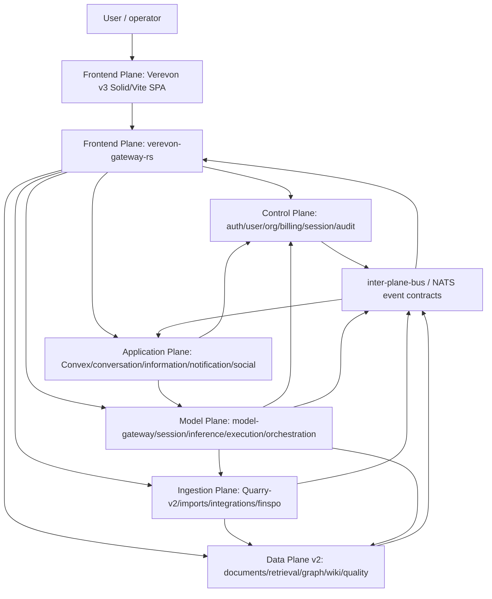

# CoreSystem Cross-Plane Architecture Map

Updated: 2026-07-02

Scope:
- `apps/Frontend Plane/verevonv3`
- `apps/Control Plane`
- `apps/Data Plane v2`
- `apps/Ingestion Plane`
- `apps/Model Plane`
- `apps/Application Plane`

Reference-only:
- `apps/Channel Plane` is future/docs-only.
- `apps/Frontend Plane/verevonv2` is historical/reference unless explicitly targeted.

This is the single consolidated runtime map for the currently active CoreSystem planes. It combines the authority model, current Verevon v3 gateway wiring, compose/runtime evidence, and remaining integration-proof gaps.

## Current Status

| Area | Status | Evidence |
|---|---|---|
| Compose config | Confirmed | All six main compose files validated with `docker compose config --quiet`. |
| Local runtime | Confirmed | All six main stacks are running on the developer machine; `inter-plane-bus` exists with 50 containers. |
| Host health | Mostly confirmed | Frontend, gateway, Control Go services, Data Plane, Ingestion, Application Go services, Convex backend, and Model `/healthz`/`readyz` endpoints respond. |
| Gateway reachability to planes | Confirmed | `verevon-gateway-rs` can resolve and reach Control, Data, Ingestion, Model, and Application service names over `inter-plane-bus`. |
| Model reachability to lower planes | Confirmed | `model-plane-model-gateway-1` can reach Control auth session, Data health endpoints, Quarry edge, and internal Model services. |
| Data live smoke | Confirmed | Data HTTP smoke passes 13/13 when Data Plane `.env` is loaded; Quickwit retrieval smoke reaches `quickwit_hits=1`. |
| Model live smoke | Confirmed | `scripts/smoke-wave10.js` passes all checked model-gateway gRPC calls. |
| Ingestion live smoke | Partial | Updated integration-api smoke now reaches current routes; it fails on unsigned/invalid GitHub webhook acceptance, which is a real boundary finding. |
| Control live smoke | Confirmed | Updated Control smoke passes service health and `controlplane-postgres` SQL/catalog checks. |
| Authenticated user E2E | Not proven | Verevon gateway signup works, but signin is blocked by email verification and no Playwright/authenticated browser harness exists. |
| Cross-plane policy blockers | Open | Data documents-api Control consultation and Verevon onboarding-through-Quarry-edge are still open. |

## Authority Model

```text
Control owns authority.
Data owns durable knowledge.
Ingestion captures evidence.
Model reasons and executes agent loops.
Application projects collaborative/realtime workspace state.
Frontend presents and normalizes access through Verevon v3.
```

Non-negotiable rules:

1. No direct database crossing between planes.
2. Frontend/browser traffic enters backend planes through the Verevon v3 gateway.
3. Ingestion persists durable knowledge through Data Plane contracts only.
4. Model consumes Data and Ingestion through published APIs and grants; it does not own retrieval, browser execution, or durable knowledge.
5. Application may mirror/project state for collaboration and notifications; it does not become authority for identity, billing, durable knowledge, ingestion, or reasoning.
6. Zero Data Retention and GDPR metadata must propagate across every boundary that can persist content.

## Consolidated Runtime Map



## Plane Map

| Plane | Runtime role | Primary local stack | Key live services observed |
|---|---|---|---|
| Frontend Plane | Human-facing Verevon v3 UI and same-origin gateway/BFF. | `apps/Frontend Plane/verevonv3/docker-compose.yml` | `verevonv3`, `verevon-gateway-rs`, `verevon-nats` |
| Control Plane | Identity, users, orgs, billing, sessions, audit, quotas, entitlements. | `apps/Control Plane/docker-compose.yml` | `auth-service`, `user-service`, `org-core-service`, `billing-core-service`, `session-core-service`, `audit-core-service` |
| Data Plane v2 | Durable knowledge: documents, chunks, embeddings, retrieval, graph, wiki, source traces, quality. | `apps/Data Plane v2/docker-compose.yml` | `dpv2-documents-api`, `dpv2-retrieval-engine`, `dpv2-embedding-engine`, `dpv2-graph-index`, `dpv2-wiki-store`, `dpv2-quickwit-adapter` |
| Ingestion Plane | Evidence capture, Quarry-v2, imports, integrations, SharePoint/M365 sync. | `apps/Ingestion Plane/docker-compose.yml` | `quarry-edge`, `quarry-control`, `imports-api`, `integration-api`, `finspo-api`, `integration-webhook-normalizer` |
| Model Plane | Reasoning, sessions/runs, inference, execution loops, capabilities, sandboxes, browser grants, cost. | `apps/Model Plane/deploy/docker-compose.yml` | `model-gateway`, `session-core`, `inference-core`, `execution-core`, `orchestrator-core`, `capability-core`, `browser-broker`, `sandbox-manager`, `cost-core` |
| Application Plane | Collaborative/realtime workspace projections and application-facing services. | `apps/Application Plane/docker-compose.yml` | `convex-backend`, `convex-gateway`, `conversation-core-go`, `conversation-ingest-rs`, `information-core`, `notification-core`, `social-core`, `insight-core`, `leads-core` |

## Verevon v3 Gateway Wiring

Verevon v3 has three runtime surfaces:

| Surface | Role |
|---|---|
| Root Solid/Vite app | Current product workspace target. |
| `apps/gateway` Rust Axum gateway | Same-origin BFF, upstream normalization, session/actor enforcement, envelopes, CORS/security headers, metrics, rate limiting, cross-plane proxy modules. |
| `apps/verevon-web` Next.js app | Separate web app under Verevon v3; ownership still needs explicit documentation. |

Current gateway upstream configuration includes these plane families:

| Plane | Gateway upstreams |
|---|---|
| Control | `AUTH_CORE_URL`, `USER_CORE_URL`, `ORG_CORE_URL`, `SESSION_CORE_URL`, `BILLING_CORE_URL`, `AUDIT_CORE_URL` |
| Data | `DOCUMENTS_API_URL`, `RETRIEVAL_ENGINE_URL`, `WIKI_STORE_URL`, `EMBEDDING_ENGINE_URL`, `GRAPH_INDEX_URL`, `QUICKWIT_ADAPTER_URL`, `QDRANT_URL`, `QUICKWIT_URL` |
| Ingestion | `QUARRY_EDGE_URL`, `QUARRY_CONTROL_URL`, `IMPORTS_API_URL`, `INTEGRATION_CORE_URL`, `FINSPO_CORE_URL`, `SEARXNG_URL`, `AUTOCOMPLETE_CORE_URL` |
| Model | `MODEL_GATEWAY_URL`, `MODEL_PLANE_RECOMMEND_URL`, `INFERENCE_CORE_URL`, `COST_CORE_URL` |
| Application | `CONVERSATION_CORE_URL`, `INFORMATION_CORE_URL`, `NOTIFICATION_CORE_URL`, `SOCIAL_CORE_URL`, `INSIGHT_CORE_URL`, `LEADS_CORE_URL`, `ZAMMAD_API_URL` |

Gateway route modules currently cover actions, agents, AG-UI, AI/chat, audit, auth, billing, browser, cost, eval, finetune, inbox/tickets, information, ingestions, insights, integrations, knowledge, leads, MCP, monitoring, navbar, notifications, onboarding, orchestration, orgs, ownership, privacy, router policy, search, settings, shares, social, and studio.

## Live Proof Run

Commands were run on 2026-07-02 against the current local Docker runtime.

### Runtime Baseline

| Check | Result | Notes |
|---|---|---|
| `docker --version` / `docker compose version` | Pass | Docker 29.5.3, Compose v5.1.4. |
| `docker network inspect inter-plane-bus` | Pass | Network exists; observed 50 containers. |
| `docker compose config --quiet` for six main stacks | Pass | Frontend Verevon v3, Control, Data v2, Ingestion, Application, and Model compose files validate. |
| `docker compose ps` for six main stacks | Pass | Main runtime containers are running; core services with healthchecks report healthy. |

### Host Health Evidence

Representative host-exposed checks:

| Plane | Check | Result |
|---|---|---|
| Frontend | `http://localhost:5199/` | 200, Vite HTML served. |
| Frontend | `http://localhost:3185/health` | 200, `verevon-gateway-rs`. |
| Control | user/org/billing/session/audit health endpoints | 200. |
| Control | `http://localhost:3011/api/auth/get-session` | 200, `null` without a session. Plain `/health` is not a valid auth-core endpoint. |
| Data | documents/wiki/orchestrator/quality/retrieval/index/embedding/graph/quickwit-adapter health endpoints | 200. |
| Ingestion | imports/integration/finspo/webhook-normalizer/quarry-control/quarry-edge health endpoints | 200. |
| Application | conversation/information/notification/social/insight/leads health endpoints | 200. |
| Application | `http://localhost:3210/` | 200, Convex backend is running. `http://localhost:3210/webhooks/health` returned 404 in this pass. |
| Model | model/session/inference/execution/orchestrator/capability/sandbox/browser/letta/cost/bridge `/healthz` and key `/readyz` endpoints | 200. |

### In-Container Cross-Plane Reachability

From `verevon-gateway-rs`, the following service names resolved and returned 200:

| Plane | Services reached from gateway |
|---|---|
| Control | `auth-core`, `user-core`, `org-core`, `billing-core`, `session-core`, `audit-core` |
| Data | `dpv2-documents-api`, `dpv2-retrieval-engine`, `dpv2-wiki-store`, `dpv2-embedding-engine`, `dpv2-graph-index` |
| Ingestion | `quarry-edge`, `quarry-control`, `imports-api`, `integration-api` |
| Model | `model-gateway`, `model-plane-cost-core-1` |
| Application | `conversation-core-go`, `information-core`, `notification-core`, `social-core` |

From `model-plane-model-gateway-1`, these dependencies resolved and returned 200:

| Plane | Services reached from Model gateway |
|---|---|
| Control | `auth-core` session endpoint |
| Data | `dpv2-retrieval-engine`, `dpv2-documents-api`, `dpv2-graph-index`, `dpv2-wiki-store` |
| Ingestion | `quarry-edge` |
| Model internal | `model-plane-session-core-1`, `model-plane-inference-core-1`, `model-plane-execution-core-1` |

### Contract And Smoke Evidence

| Area | Command | Result | Notes |
|---|---|---|---|
| Data Plane HTTP smoke | `set -a; . ./.env; set +a; bash scripts/smoke-test.sh --http-only` | Pass | 13 passed, 0 failed; health, readiness, document create/get/delete. Without `.env`, CRUD failed because the internal key was missing. |
| Data Quickwit sparse retrieval | `bash scripts/smoke-quickwit-retrieval.sh` | Pass | Rust fallback test passed, retrieval reports `quickwit-with-postgres-fallback`, source object indexed in Quickwit after 30 attempts. |
| Model gRPC gateway | `node scripts/smoke-wave10.js` | Pass | Health, Sleep, SyntheticOutput, plan mode, team, skills, MCP/plugin registry, permission, policy, message, analytics, task, and trajectory RPCs passed. |
| Ingestion integration-api | `bash smoke-test-integration-api.sh` | Fail on real boundary | Current script passes health, provider catalog, auth rejection, internal key, connect-session, and not-found checks; it fails because GitHub webhook accepts missing/invalid signatures with 200. |
| Control integration script | `bash test-control-plane-integration.sh` | Pass | Updated to current auth session endpoint, org-core host port, audit-core 8187, and `controlplane-postgres`; 9 passed, 0 failed. |
| Model durable-layer script | `bash scripts/verify-durable-layer.sh` | Pass | Updated readiness waits for SQL against `session_core`; durable layer verified against throwaway Postgres. |
| Verevon auth gateway probe | throwaway signup/signin curl flow | Partial | Signup returned 200; signin returned `EMAIL_NOT_VERIFIED`; `/api/v1/me` and session-context remain 401 without a verified session. |
| Quarry edge onboarding probe | host curl/source inspection | Open | Verevon onboarding still calls `quarry-control`; edge `/v1/jobs` returns 401 without edge auth/HMAC while control `/v1/jobs` lists jobs under rollout mode. |
| Data Control consultation probe | source/runtime/env inspection | Open/partial | retrieval-engine runs with strict Control enforcement; documents-api `authctx` enforce mode still returns 503 because signature verification is not implemented. |

## Proof Ladder

| Level | Meaning | Current status |
|---|---|---|
| L0 compose config | Compose files parse and required variables are satisfiable. | Confirmed for all six main stacks. |
| L1 container health | Containers are running and service-native probes pass. | Confirmed for primary services. Some auxiliary UI/worker containers have no health status. |
| L2 network reachability | Cross-plane service names resolve from the containers that need them. | Confirmed from Verevon gateway and Model gateway. |
| L3 API contract smoke | A real API path mutates/reads/cleans up state or exercises a gRPC contract. | Confirmed for Data HTTP CRUD, Data Quickwit source-object indexing, Model gRPC smoke, and partial Ingestion integration-api auth/catalog behavior. |
| L4 authenticated product journey | Browser/user flow proves Frontend -> Gateway -> Control -> Data/Ingestion/Model/Application behavior with real session and policy. | Not proven in this pass. |
| L5 policy and tenancy proof | Cross-tenant denial, Control consultation, ZDR/GDPR propagation, and edge-only ingestion are automatically tested. | Not complete; blockers remain open. |

## Remaining Integration Gaps

| Priority | Gap | Evidence | Next action |
|---|---|---|---|
| P0 | Data Plane Control consultation is still not complete. | retrieval-engine is strict, but documents-api `authctx` still has unimplemented signature verification and fail-closed 503 enforce mode. | Implement documents-api JWT verification/JWKS consultation and add tenant-isolation integration tests. |
| P0 | Verevon onboarding path through Quarry edge is not proven. | Source still posts onboarding jobs/events to `quarry_control_url`; edge `/v1/jobs` rejects unauthenticated host calls while control accepts unsigned listing under rollout mode. | Migrate onboarding crawl handlers to `quarry-edge` and add a gateway smoke test that fails if direct control is used. |
| P0 | Integration API accepts unsigned/invalid GitHub webhooks in the live environment. | Updated smoke script posts to `/api/v1/webhooks/github`; missing and invalid signatures return 200 accepted. | Require provider webhook secrets or fail closed when the secret is absent, then rerun the smoke script. |
| P1 | No authenticated Verevon browser E2E ran. | No Playwright dependency/config exists; gateway signup succeeds but signin blocks on `EMAIL_NOT_VERIFIED`, leaving protected routes 401. | Add a seeded verified test account or test-only verified-session fixture, then add Playwright smoke coverage across gateway route families. |
| P2 | Convex runtime proof is thin. | Convex backend root responds, but `/webhooks/health` returned 404 and pnpm script gates remain blocked by ignored `esbuild` builds. | Resolve pnpm approval and add a Convex runtime/codegen/webhook smoke. |
| P2 | Gateway health only proves upstream reachability, not every domain route contract. | In-container checks hit health/session endpoints, not each domain API. | Add route-family smoke coverage for auth, billing, ownership, search, knowledge, ingestions, chat, inbox, cost, and notifications. |
| P2 | Static quality gates remain red in several planes. | Plane audit files record fmt/clippy/ESLint/Knip/test failures. | Fix quality gates after integration proof scripts are current enough to protect behavior. |

## Canonical Follow-Up Sequence

1. Fix Integration API webhook signature fail-closed behavior and keep the updated smoke script as the regression check.
2. Add a Verevon gateway smoke suite that runs from inside `verevon-gateway-rs` and checks route families, not just service health.
3. Add a seeded verified auth fixture and an authenticated Verevon Playwright smoke that proves at least one user journey through every active plane.
4. Implement/prove documents-api Control consultation and tenant isolation.
5. Move/prove Verevon onboarding ingestion through `quarry-edge`.
6. Promote the current ad hoc commands into checked scripts or Make targets, then link them from this map.
