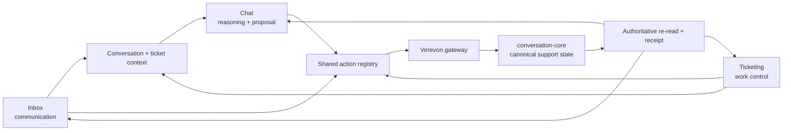

# Verevon Inbox & Ticketing

> **Implementation record — 2026-08-03.** This document is the delivery companion to [VEREVON.md](VEREVON.md), [Verevon-ai-first.md](Verevon-ai-first.md), [verevon-feature-map.md](verevon-feature-map.md), [verevon-vision.md](verevon-vision.md), and [verevon-roadmap.md](verevon-roadmap.md). It records what is actually wired in the Frontend Plane and gateway, rather than treating a design target as shipped product capability.

> **Current execution ledger — 2026-08-15.** [verevon-roadmap.md](verevon-roadmap.md#current-execution-ledger--2026-08-15)
> is the canonical current-status checklist for the six Verevon documents.
> This document remains the detailed Support delivery record; its dated notes
> are evidence, not a substitute for the current ledger when a status claim
> conflicts.

> **Space and operation boundary — 2026-08-15.** Inbox and Ticketing are
> owner-plane work surfaces inside a future Verevon Space; they are not the
> authority for Space membership, a customer resource, or a provider effect.
> A Space decision can narrow context and audience but can never broaden the
> Conversation/Ticketing owner authorization. The upcoming Action Catalog must
> give direct human and eligible-agent requests the same versioned request and
> receipt shape while retaining human-only approvals, grants, and customer-send
> authority. No scheduled run or background watch may send, mutate, or retry a
> customer interaction merely because it has a Space or cron context.

> **Web-evidence boundary — 2026-08-15.** Support agents may consume cited
> Quarry search/read/browser evidence through governed Model Plane tools, but
> Inbox and Ticketing never receive raw CDP access, provider credentials, or
> host filesystem paths. Quarry's local-Chromium egress proof does not prove a
> customer-message provider effect: send, delivery, read, bounce, and retry
> still require the authoritative provider receipts tracked in this document.
> Remote browser drivers and browser artifact transfers remain gated and cannot
> be used to widen Support's action authority.

> **Local implementation loop — 2026-08-03.** “Deployed” and “runtime
> verified” here mean running the current implementation in the local Docker
> stack. Rebuild affected images, apply migrations/configuration, exercise
> Inbox/Ticketing/Support/Outbound flows, fix errors, and continue building
> until the local end-to-end loop is stable. No external production release is
> implied.

> **Local runtime verification — 2026-08-03.** The gateway, frontend, and
> conversation-core images were rebuilt and their local health endpoints passed.
> The Support Ticketing workspace rendered through the rebuilt gateway with no
> browser-console errors. Verification exposed stale Control-plane broker
> topology: the `conversation-core-interactive-retention` consumer was absent
> even though the source configuration granted only its required scoped
> permissions. Rebuilding and running the idempotent Control NATS provisioner,
> then restarting Conversation Core, bound the consumer successfully. The
> broker-contract regression fixtures now include the two newly scoped NATS
> credentials, so this drift is caught before a local rebuild claims success.
>
> **Provider-proof status — 2026-08-04.** The local Integration API and email
> worker are running, and the source-level send, acceptance-receipt,
> machine-readable email-bounce, and unknown-outcome paths pass their focused
> tests. Google OAuth has been re-authorized: the settings UI reports
> **Connected**, and its manual incremental sync was accepted and reached
> `handoff_data_plane`. After the mailbox was changed to an account with Gmail
> enabled, the worker ingested six Google messages at 14:16 UTC. This is live
> inbound-read and ingestion evidence, not provider acceptance or delivery
> evidence; a real send still needs its own authoritative receipt.
> Unrelated X and Discord connections also report their own unavailable-provider
> errors and are not part of the email acceptance/delivery gate.

> **Integration status verification — 2026-08-04.** The local Integration
> API now gets the exact plane-token issuer alongside Auth Core's JWKS, while
> retaining its configured issuer only as a compatibility fallback for older
> authorities. This prevents an independently rebuilt Ingestion stack from
> rejecting a valid Gateway audience token when its local Compose issuer drifts.
> The authenticated Support Inbox connection read was verified as HTTP `200`
> and its warning/retry banner disappeared before the subsequent Auth Core
> rebuild required the browser session to sign in again. Finspo now keeps an
> unexpired Microsoft Graph lease in process per organization (refreshing one
> minute before expiry), preventing a page-by-page SharePoint sync from
> exhausting Integration Core's token-broker limit. Outlook's scheduled worker
> has ingested new messages during this audit; the reconnected Gmail account
> has also ingested six messages. The previous disabled-mailbox failure is not
> a success signal and should be disconnected or re-authorised deliberately if
> it remains configured.
> A terminal OAuth refresh rejection (`invalid_grant`, including Google's
> revoked-token response) now changes the canonical connection to
> `needs_refresh`, removes it from email-sync eligibility, and renders
> **Needs reconnect** in the UI. This prevents an infinite retry loop and a
> false “Connected” label; it is not a delivery receipt. The completed Google
> reconnect used `http://localhost:3026/oauth/callback/google`. The Settings
> **Sync** action now uses the canonical per-connection route rather than the
> read-only sync-job collection, so it creates the expected durable handoff
> instead of returning HTTP 405. The Gateway now proxies the protected
> sync-job event stream, so the Settings page's event subscription no longer
> resolves to HTTP 404 (an unauthenticated route check correctly returns 401).
> The remaining provider-backed send/acceptance gate is a real send and its
> authoritative provider receipt.

> **OAuth callback and Discord readiness — 2026-08-05.** Integration Core now
> derives every provider callback from `INTEGRATION_PUBLIC_BASE_URL`, trims
> trailing slashes, and normalizes provider aliases before constructing the
> path. The local public base is currently the temporary Cloudflare Tunnel
> `https://nor-instrumentation-music-educators.trycloudflare.com`, so the exact
> callback paths used by the running stack are:
>
> | Provider | Callback                   |
> | -------- | -------------------------- |
> | Slack    | `/oauth/callback/slack`    |
> | Discord  | `/oauth/callback/discord`  |
> | Notion   | `/oauth/callback/notion`   |
> | LinkedIn | `/oauth/callback/linkedin` |
> | X        | `/oauth/callback/x`        |
>
> The full URL is the public base plus the path; it must be registered exactly
> in each provider dashboard, with no query string or trailing slash. Slack's
> dashboard still contains the old localhost URL and rejected the temporary
> `trycloudflare.com` host as an invalid redirect entry during this verification.
> This is a provider-dashboard/stable-host blocker, not a callback-construction
> bug in Integration Core. Slack's own OAuth guidance requires HTTPS and an
> exact or parent-path-compatible configured redirect URL; see [Installing with
> OAuth](https://docs.slack.dev/authentication/installing-with-oauth/).
>
> Discord's exact public callback was added alongside localhost and verified
> after reload in the Discord Developer Portal. Discord is now visible as a
> Support/Inbox channel and its OAuth connection exists, but actual ingestion is
> not ready: the local `integration-api` is healthy while the email worker logs
> `DISCORD_BOT_TOKEN` as missing. The Discord bot must also be installed in the
> target server, have Message Content Intent enabled, and have a tenant-bound
> managed guild before sync can read messages. The UI now distinguishes an
> authorized Discord connection from healthy message delivery and states these
> prerequisites instead of claiming that messages will arrive automatically.
>
> Notion was at its sign-in gate, LinkedIn showed no app in the current signed-in
> developer account, and X was at its sign-in gate during this pass. Their
> callback registrations remain pending dashboard verification. A named/stable
> HTTPS development hostname is the durable fix; a quick-tunnel hostname can
> change and requires re-registering every provider callback when it changes.

## Product goal

Verevon Support is a single, governed resolution loop across three distinct surfaces:

| Surface   | Job                                                                    | Canonical responsibility                                                           |
| --------- | ---------------------------------------------------------------------- | ---------------------------------------------------------------------------------- |
| Chat      | Reason, retrieve evidence, explain, plan and propose permitted actions | Reasoning and proposal; never invents operational state or completion              |
| Inbox     | Triage and communicate across channels                                 | Conversation, sender identity, thread, draft and delivery workflow                 |
| Ticketing | Control durable work                                                   | Ownership, lifecycle, SLA, structured case data, dependencies and verified outcome |

The product objective is: for every inbound signal, determine whether the right result is an answer, draft, question, customer case, internal work item, incident, or permitted business action—and complete it with evidence, approval where needed, authoritative verification, and an audit receipt.

This is deliberately not three independent AI implementations. Chat is the
reasoning workspace, Inbox is the communication workspace, and Ticketing is
the work-control workspace. Today the V3 typed action registry is a useful UX
contract, not yet an authoritative server catalog; each meaningful mutation
must therefore still re-authorize with its owning service and return that
owner's durable receipt. The Space/Action Catalog program will replace this
parallelism with a versioned contract without moving support-state or provider
authority into Chat, the gateway, or Model Plane.

## Research basis and parity standard

This design uses the August 2, 2026 competitive deep-dive as its evidence base. The practical synthesis is:

| Reference | What Verevon adopts                                                | Verevon differentiator                                                           |
| --------- | ------------------------------------------------------------------ | -------------------------------------------------------------------------------- |
| Outlook   | Fast, familiar multi-message work shell                            | Work is structured and traceable, not only mail                                  |
| Zendesk   | Lifecycle discipline, queues, SLA and operational visibility       | Avoid heavyweight administration until the core resolution loop is proven        |
| Intercom  | Conversation-to-case transitions and AI/human handoff              | The handoff is grounded in sources, policy and durable action receipts           |
| Gorgias   | Business context and in-workspace actions                          | Context and actions are typed, permission-aware and not commerce-vendor-specific |
| Mimir     | Explicit assist/review/autopilot operation and proactive direction | Every action remains previewable, governed and authoritatively verified          |

Feature parity means completing the same support job with comparable control and visibility—not copying every vendor add-on. Required first-release parity is: omnichannel conversation work, shared identity, search/views/triage, notes and collaboration, assignment, ticket lifecycle, SLAs, context, action previews, approvals, send/verification receipts, collision protection, AI handoff, audit, and quality measurement. Workforce scheduling, voice replacement, marketing campaigns, a giant custom-object administration system, and commerce-specific breadth are explicitly staged.

The unified-support navigation pass additionally reviewed current reference
screens from [Intercom](https://mobbin.com/screens/b1a806f1-b212-45a8-b525-fea3fa01b961),
[Gorgias](https://mobbin.com/screens/58b46bc3-dac8-4d4c-bdfe-219d0878a647),
[Zendesk](https://mobbin.com/screens/1726a274-3bae-470e-a1e9-dbff16fab03a),
and [HubSpot](https://mobbin.com/screens/6228df0a-7927-4862-b9be-c792cf7a19e8)
on 2026-08-02. Their common usable pattern is deliberately small: personal
queues first, then shared exception queues, then channels or saved views. It
informed taxonomy and hierarchy only; Verevon does not copy their screens or
make any vendor-specific workflow authoritative.

The work-type boundary is also grounded in current primary product guidance:
[Intercom's ticket categories and customer-visibility model](https://www.intercom.com/help/en/articles/8300308-how-customers-get-notified-about-tickets),
[Intercom's type-specific state categories](https://www.intercom.com/help/en/articles/9730130-how-ticket-states-work),
and [Zendesk's explicit problem/incident linking model](https://support.zendesk.com/hc/en-us/articles/4408835103898-Working-with-problem-and-incident-tickets?page=2&per_page=30), reviewed on 2026-08-03.
They support a closed work taxonomy and deliberate lifecycle rules—not hidden
cross-ticket resolution. Verevon therefore ships safe type-aware routing first,
while reserving incident propagation for an explicit future dependency model.

## Architecture and invariants



The non-negotiable rules are:

1. Chat does not become the canonical store for case state, ownership, SLA or completion.
2. A meaningful UI mutation must use the action registry, gateway policy boundary and audit path; no feature-specific raw mutation bypass is permitted.
3. A successful model message or accepted request is not a completed business outcome. The UI re-reads canonical state and must surface a failed/unknown outcome honestly.
4. The active organization and authenticated user scope every action. No raw OAuth tokens or upstream secrets reach the browser.
5. AI output is always labelled by state: suggestion, editable draft, awaiting approval, executing, verified, failed, or human-authored change.
6. Every supported human operation remains available without AI.

## Implemented in this delivery slice

### Unified Support workspace and operational navigation

- The primary Inbox icon now opens **Support**, a single workspace with
  **Conversations** and **Tickets** modes. The query-driven `/support` route
  switches the rendered workspace itself, not merely the navigation chrome.
  Existing `/inbox` and `/tickets` deep links remain valid while resolving to
  the same Support context.
- Conversations retain the high-signal operational views that have a live
  Inbox route contract: My conversations, Unassigned, Created by you, All
  conversations, Spam, Feedback, and the connected channel lanes
  (Email, Messenger, Instagram, WhatsApp, Slack, Microsoft Teams, Discord,
  Twitter/X and SMS). This restores real filters without reviving a broad
  administration tree or a duplicate "AI conversations" section.
- The old **Mentions** queue has been removed. It guessed from ticket titles
  and tags (`@`, `urgent`, or `vip`) instead of reading an authenticated
  user-specific mention record, so it could not truthfully be a personal work
  queue. Old `/inbox/mentions` URLs now fall back to the actionable personal
  queue; a real mentions view remains contingent on a canonical scoped
  mention/read-model contract.
- Tickets follow the Zendesk/HubSpot-style work queue model: All tickets, My
  tickets, Unassigned, waiting-on-customer/team, Escalated and Resolved,
  followed by the attention queues Suggested by AI, SLA risk and Breached SLA.
  **Rules / queues** sits separately under Configure, so durable Ticketing
  setup is reachable without pretending that administration is another work queue.
  AI-suggested work stays a reviewable support queue; Chat remains the
  dedicated reasoning surface.
- Sidebar selection is exact across ticket filter keys. A parent queue is not
  painted active when a narrower state is selected—for example, **SLA risk**
  is not active alongside **Breached SLA**. This keeps the URL, visible
  filter, and loaded work queue truthful and shareable.
- The UI does not synthesize new filters in the browser: each item points to
  an existing Inbox or Ticketing query contract. Dynamic saved views remain
  in the Ticketing workspace until a scoped, permission-aware shared-view
  navigation model is introduced.
- The compact Inbox filter popover is now deliberately limited to local
  lifecycle status and clearing the current search. Work queues, ownership
  views and channels live only in the Support sidebar; the popover no longer
  opens duplicate modal copies or legacy `/inbox` routes.

### Calm, case-first workspace

- The familiar tri-pane Inbox layout remains intact: support navigation and
  queues on the left, the selected customer conversation in the centre, and
  contextual case tools on the right. The change is information architecture,
  not a new dashboard shell.
- The right context rail retains four compact, direct tabs: **Details**,
  **Verevon**, **Actions**, and **Audit**. This keeps factual case context,
  local assistance, deliberate follow-up work, and accountability distinct
  without turning support into a second global Chat experience.
- The **Verevon** tab is scoped to the selected conversation and its permitted
  evidence/actions. The **Audit** tab carries collaboration, follow, consent,
  and recorded feedback outcomes; **Actions** contains calendar and
  deliberately scheduled follow-up work.
- The centre workspace keeps **Conversation**, **Ticket**, and a contextual
  **Activity** tab. It separates the canonical work-history projection from
  the provider delivery ledger, so an agent can see lifecycle work and
  authoritative delivery receipts without treating either as a duplicate
  transcript. **More conversation actions → Show delivery activity** opens
  that same surface, while the message thread and reply composer remain the
  default focus.

### Self-service email connection

- When the root Inbox is empty and the active organization has no inbox-capable source, the work queue now offers **Connect Gmail** and **Connect Outlook**. Each button starts integration-core's authenticated connect session with the explicit `full` capability bundle, then uses the existing COOP-safe OAuth-window status poll; the Inbox never handles an OAuth token.
- The entry point is hidden until an active organization is resolved, preventing an early, inert click during session hydration. On successful provider completion the browser re-reads both the organization's connections and the canonical conversation queue, then says only that messages will appear when ingestion delivers them—never that a mailbox has been imported or is ready before the provider says so.
- The unified Support sidebar now turns **Email** into a provider-aware account group only after an active Gmail or Outlook connection has granted mailbox-read access. It prefers the provider-confirmed `mailbox_address` stored in the connection context, with the existing profile label only as a legacy fallback. OAuth completion records that address; the scheduled Gmail/Outlook sync also self-heals older connections that lack it, without making an identity lookup a reason to fail mail ingestion. Selecting a row sends a durable `connection_id` filter through the Gateway to Conversation Core's thread-reference ownership check, rather than filtering a cached browser list. Multiple accounts of the same provider remain distinct.
- The active mailbox is repeated as a compact, provider-marked chip in the Inbox header and can be cleared there. This makes the scope legible when the Support sidebar is collapsed. The browser still receives no token or mailbox credential; the filter resolves only against Conversation Core's tenant-scoped thread references. Connection scope is carried through initial load, pagination, focus recovery, and the 15-second background refresh, so a reload cannot replace an account-scoped queue with the all-email queue. Local verification on 2026-08-04 confirmed the Gmail account view continued to show its six Gmail conversations and no Outlook conversations after a hard reload and background refresh.
- A declared Microsoft `shared_mailboxes` connection setting is rendered beneath its owning Outlook account, and the Inbox-header **Add shared mailbox** action takes the operator to Integration settings. This is only a declared view at present: delegated shared-mailbox authorization, durable configuration, and Microsoft Graph shared-mailbox sync remain separate work, so the UI never claims that a shared mailbox is connected or syncing before provider evidence exists.

### Messenger-first Meta consent

- The workspace Meta connection no longer requests the catalog's all-product `full` bundle. That bundle combined Messenger with unrelated Instagram, WhatsApp, Ads, Catalog, Threads, Insights, and Business Management permissions, producing Meta's invalid-scope consent failure for a Messenger setup.
- Meta now has a dedicated `messenger` bundle with only `pages_show_list`, `pages_read_engagement`, `pages_manage_metadata`, and `pages_messaging`. The Settings connect/reconnect flow chooses that bundle for Meta; all non-Meta providers retain their existing `full` connection path. Ads, Instagram, WhatsApp, Catalog, Threads, and publishing require separately reviewed product consent and are not implied by a Messenger connection.
- On 2026-08-04, the Meta dashboard was given two separate Facebook Login for Business configurations: **Verevon Support Messaging** (system-user token, 60-day renewal, required Page asset, and Messenger plus WhatsApp messaging permissions) and **Verevon Studio Ads** (system-user token, required Ad Account asset, and `ads_management`, `ads_read`, and `business_management`). The existing Conversions configuration remains separate. Integration Core selects `support_messaging` only for the `messenger` bundle, `studio_ads` only for the `ads` bundle, and `conversions` only for the `conversions` bundle. Configuration IDs are local environment values, never browser data.
- `META_BUSINESS_LOGIN_SUPPORT_MESSAGING_CONFIG_ID` and `META_BUSINESS_LOGIN_STUDIO_ADS_CONFIG_ID` are therefore explicit deployment settings. Support cannot inherit Ads authority, and Studio cannot inherit customer conversation authority. Neither configuration publishes the Meta app or grants production access by itself.
- Integration Core treats `META_APP_CLIENT_ID` and `META_APP_CLIENT_SECRET` as the credential pair for the unified Meta/Messenger OAuth client. They override the legacy Facebook pair only for the unified `meta` provider, while `FACEBOOK_CLIENT_*` remains available for legacy Facebook/WhatsApp/Ads and `INSTAGRAM_CLIENT_*` for a deliberately separate Instagram OAuth app. A single OAuth request has one `client_id`; Threads and Instagram app identifiers are not merged into a Messenger authorization request. The public `META_JS_SDK_APP_ID` follows the unified Meta app unless explicitly overridden.
- Local Meta OAuth uses `http://localhost:3026/oauth/callback/meta`; the Messenger-capable Meta app must register that exact callback. On 2026-08-04, the local Integration Core was rebuilt against the Messenger-capable app and Meta displayed its consent dialog for the four scoped permissions without an invalid-scope or redirect failure. No consent, Page attachment, subscription, or message ingestion was claimed from that scope-only verification.
- Integration Core records the provider's actual granted permission snapshot after OAuth. A successful consent dialog alone is not evidence that a Page is subscribed, webhook delivery is active, historical messages were ingested, or a reply was delivered; those require their respective provider and ingestion receipts.
- The Support sidebar derives Messenger, Instagram, and WhatsApp lanes from those provisioned webhook assets—not simply from an OAuth status. Integration Core stores Page, linked Instagram-account, and WhatsApp Business-account identifiers separately while retaining the combined list solely for webhook ownership resolution. A consent-only Meta connection is therefore not advertised as a live social inbox; a Page cannot make Instagram appear live. If an operator opens its Messenger route directly, the empty state explains that a manageable Facebook Page is missing and links to **Integrations → Sync**, which reruns idempotent asset discovery and Page webhook subscription. This prevents the former misleading “connected, waiting for messages” state.
- **Enable Instagram inbox** is a separate, narrow consent journey through the independently configured `instagram` OAuth provider—not an expanded request against the Messenger app. It uses the **Instagram API with Instagram Login** contract: `instagram_business_basic`, `instagram_business_manage_comments`, and `instagram_business_manage_messages`, Instagram OAuth, and `graph.instagram.com`. It does not request Pages, Ads, WhatsApp, Threads, or Business Management. After consent, **Sync** discovers the authenticated professional Instagram asset; the channel is displayed only after Integration Core has stored its webhook identity.
- The provisioning implementation distinguishes those two APIs. A unified Meta/Messenger connection discovers Pages, their linked Instagram professional accounts, and WhatsApp Business assets through `graph.facebook.com`; a standalone Instagram Login connection verifies only its authenticated professional account through `graph.instagram.com/me`. Instagram's webhook subscription is configured at the Meta app level, so its Sync validates and persists the account identity without attempting a Facebook Page `/subscribed_apps` mutation. On 2026-08-04, local Docker verification persisted the connected Instagram professional-account identity and the Support sidebar displayed the Instagram lane after reload.
- A Meta connection with valid consent but no accessible Page, linked Instagram asset, or WhatsApp Business Account remains a failed provisioning result—not a connected inbox. Local verification on 2026-08-04 returned that exact absence result for the Messenger-only connection, so Messenger and WhatsApp were correctly withheld. The currently implemented inbound Meta lanes are Messenger, Instagram, and WhatsApp; Facebook is represented by the Page-backed Messenger lane, and Threads remains out of scope until its dedicated inbound milestone below.
- `INSTAGRAM_CLIENT_ID` and `INSTAGRAM_CLIENT_SECRET` are required for this journey and must belong to the linked Instagram app. Verevon intentionally does not fall back to Facebook/Messenger credentials: Facebook Login and `graph.facebook.com` use a different permission/token model and caused the invalid-scope failure. `INSTAGRAM_AUTHORIZATION_URL`, `INSTAGRAM_TOKEN_URL`, and `INSTAGRAM_GRAPH_API_BASE_URL` therefore default to the Instagram Login endpoints, not Facebook endpoints.
- On 2026-08-04, the local stack was updated to use the Instagram Login endpoints and the dashboard permissions were set to **Ready for testing**. The Instagram OAuth redirect must be the current public Integration Core callback (`<INTEGRATION_PUBLIC_BASE_URL>/oauth/callback/instagram`); a localhost callback is not valid while the temporary HTTPS tunnel is in use. The webhook URL remains a different endpoint: `<INTEGRATION_PUBLIC_BASE_URL>/api/v1/webhooks/instagram`.
- The OAuth callback is not a webhook endpoint. Instagram webhook validation calls `GET /api/v1/webhooks/instagram` with `hub.mode`, `hub.verify_token`, and `hub.challenge`; the dashboard token must exactly match `META_WEBHOOK_VERIFY_TOKEN`. Meta cannot validate `localhost`, so the callback field needs a public HTTPS tunnel/domain (for example `https://<public-host>/api/v1/webhooks/instagram`) that forwards to local Docker port 3026. Without that reachable endpoint and a published Meta app, incoming Instagram events cannot be delivered to the local stack.
- Threads is deliberately not displayed as a Support inbox channel yet. Current Integration Core support is limited to Threads profile, publishing, and insights actions; there is no inbound reply/comment normalization, support conversation action, delivery receipt, or webhook contract. A future Threads-support milestone must add those contracts behind its dedicated Threads client and reviewed consent, then prove inbound asset provisioning before the sidebar exposes the lane.

### Personal conversation follow preference

- The former inert “Subscribe teammate” placeholder is now an explicit **Follow conversation** control in the existing Activity rail. It records only the active operator's content-free, tenant-scoped preference and is disabled until the canonical preference has loaded. It is not a fabricated teammate picker or a browser-local flag.
- The low-risk, reversible `inbox.follow_conversation` action validates a conversation ID plus desired follow state, derives organization and actor from the authenticated session, and reaches conversation-core through the gateway's audited action boundary. Follow and unfollow are idempotent; the browser re-reads canonical state after every successful action instead of assuming the toggle succeeded.
- Migration 021 stores `(org_id, conversation_id, user_id, created_at)` with a conversation foreign key and scoped user lookup index. It stores no transcript, customer record, provider reference, recipient list, or notification content.
- Inbound `message.received` events now carry a bounded, deterministic `follower_user_ids` projection to notification-core. The consumer accepts one request per current follower through the existing membership and preference gate, with deterministic per-user idempotency. Its payload is deliberately generic: **“New activity in a followed conversation”**, opaque conversation/message IDs, and `/inbox`; it never reads, stores, or delivers a customer message body, sender identity, provider reference, or transcript field.
- The `inbox.conversation_followed_message` in-app preference defaults on, while email defaults off. Invalid event identifiers terminate; former/non-member followers and invalid recipients are skipped; transient notification faults retry safely. The JetStream consumer is pre-provisioned for the exact conversation-message subject and has no stream-discovery or consumer-creation permission. The local stack now binds that durable successfully. Its notification runtime is presently configured as `disabled`, so this is a verified governed fan-out and feed-request path—not a claim of a live external or in-app delivery until a real runtime and active recipient configuration are enabled.

### Customer-feedback consent foundation

- CSAT now has a canonical support-contact preference (`conversation_csat_preferences`) instead of borrowing a Control-Plane user or marketing-consent record. It is tenant scoped, defaults to no consent, is tied to the contacted conversation’s durable support identity, and records the accountable operator and timestamp whenever it changes.
- Authenticated support operators can read or set only `/conversations/:id/csat-preference` through conversation-core. A conversation without a canonical contact returns not found; a browser cannot target another organization’s contact. This is consent authority only: it does not send a survey, infer consent from an email address, or fabricate a CSAT score.
- The contextual Inbox **Conversation activity** panel exposes this as
  **Request feedback**. It always reads the canonical state first, sends
  changes through the audited `inbox.set_csat_preference` action, and rereads
  after success. It labels a positive value as operator-recorded customer
  consent, never as independently verified consent or proof of survey
  delivery.

### Customer-feedback outcomes, without fabricated delivery

- A resolved Ticket can now hold one tenant-scoped, 1–5 `ticket_csat_outcomes`
  record. The ledger is deliberately score-only: it retains no customer text,
  contact address, delivery route, or survey token. The core service rejects
  recording unless the linked Ticket is `resolved`/`closed` and the linked
  support contact currently has explicit CSAT consent.
- The operator records the score through the audited
  `tickets.record_csat_outcome` action; the gateway derives organization and
  actor from the authenticated session, then conversation-core rereads the
  canonical Ticket and preference before its upsert. The Inbox rereads the
  canonical outcome after a successful action and labels it as a **recorded
  customer outcome**, never an automatically sent survey.
- The organization scorecard reports only recorded ratings, positive ratings
  (4–5), average score, and positive rate across those ratings. It explicitly
  does not expose a response rate: no automatic survey transport or delivery
  evidence exists yet, so there is no truthful denominator. Survey dispatch
  remains disabled until a separately approved, delivery-evidenced channel is
  implemented.

### Reliable Ticketing state and mutation path

- Ticket-list failures are now distinct from an empty queue; a ticketing outage no longer renders the false claim “No tickets.”
- A `ticket.resolved` lifecycle event now represents a real transition from active work into `resolved` or `closed`, not a repeated terminal-status PATCH. This prevents retried UI writes and later metadata edits from inflating “conversations handled” or creating duplicate downstream quality/CSAT work.
- The Ticketing detail's **Activity** panel is now a tenant-scoped, bounded (20-item) read of persisted ticket creation, updates, links, macro runs, checklist creation, and checklist-item changes—not a reconstruction from the ticket's current fields. Macro and checklist writes commit their corresponding activity audit in the same database transaction; the UI never implies that an operation occurred if its durable write failed. It displays only action, safe linked-resource kind, and timestamp; raw audit payloads, customer content, and provider metadata never cross the API boundary. The authenticated gateway forwards `/tickets/:id/activity`, conversation-core first verifies the ticket belongs to the active organization, and migrations 019–020 add the scoped audit lookup indexes.
- Ticket creation from Inbox, and Ticketing update, assignment, resolution,
  resource-link and bounded macro-creation operations now execute through
  `tickets.*` actions at `/api/v1/actions/execute`.
- The action schemas cover snooze/closed lifecycle values and typed resource-link relation, metadata and conversation-source fields. Gateway mapping preserves those values for conversation-core.
- After every ticket action, the frontend rereads the authoritative ticket from conversation-core before changing the visible state. The action result contains the durable `ticketId` for creation.
- Ticketing's **Follow up tomorrow** control records a 24-hour RFC3339 `follow_up_at` on the canonical ticket through `tickets.update`; it does not reuse snooze, change ticket lifecycle, or alter the separate SLA `due_at` deadline. The gateway maps the typed `followUpAt` contract to conversation-core's `follow_up_at`, and the browser journey verifies the persisted value directly from the ticket authority.
- A combined assignment plus lifecycle mutation is rejected client-side rather than silently making a partially successful compound write. Each operation receives an independent action/audit record.
- A classification action now returns the created ticket's durable ID (rather than the AI-action record ID), so a cross-surface handoff cannot navigate to the wrong resource.
- Each canonical ticket now has a durable `work_type`: **Customer case**, **Internal work**, or **Incident**. Migration 013 defaults existing and newly-created records to `customer_case`, while conversation-core accepts only those three values. The Ticket detail selector changes the type through the audited `tickets.update` action, gateway maps `workType` to `work_type`, and the UI re-reads the ticket authority before it displays the change. Work type describes the kind of work; it does not replace lifecycle, assignment, priority, SLA, or the linked conversation.
- AI triage and resolution-plan prompts may now propose one of those same three values. The browser parser, Inbox proposal gateway, conversation-core action normalization, reviewer editor, and asynchronous executor all enforce the closed set. A reviewer sees a controlled work-type selector and may correct the suggestion before approving; `Assist` and ZDR still leave it transient, and no proposal can change a ticket, escalate an incident, or alter ownership until its normal review/execution receipt completes.
- Work type is a canonical, shareable Ticketing filter (`work_type`) rather than a browser-side category. The Support sidebar exposes **Customer cases**, **Internal work**, and **Incidents** as a focused group; the service rejects invalid filter values and the rendered queue title reflects the selected type. This makes the taxonomy usable for triage without duplicating the lifecycle or SLA queues.
- Owner/admin automation rules can use that canonical work type as a bounded condition for routing or priority work. Rules cannot silently reclassify a ticket, resolve linked tickets, or propagate a status through dependencies; those higher-impact lifecycle semantics remain explicitly human-controlled.
- Ticket-to-ticket links now return a bounded canonical target snapshot on every ticket read: ticket key, relationship, status, and work type. Ticketing renders that context after its authoritative re-read, so an operator sees the linked work rather than an opaque identifier. This is visibility and safer decision support, not automatic parent/child resolution or a claim that all links are incident relationships.
- Resolving a ticket with canonical, non-terminal child links now requires a second explicit confirmation. The dialog lists each open child and states that resolving the parent does not change it; after confirmation the normal audited `tickets.resolve` action runs for the selected ticket only. Reopen likewise preserves the relationship. This establishes a safe lifecycle decision point without pretending to have Zendesk-style incident propagation.
- The core, gateway, and authenticated browser tests cover the full round-trip: defaulting, normalization, invalid-value rejection, camelCase action mapping, review-gated AI classification to an Incident, action receipt, persisted canonical re-read, incident-only filtering, and bounded incident-rule matching. The browser regression creates an owner-managed Incident rule in Support, creates a fresh Incident through the authenticated boundary, and verifies the canonical service applied its urgent-priority routing. This is a shared taxonomy on one Ticket record—not a claim that Customer Case, Internal Work, and Incident already have separate schemas, merge/split semantics, or independent state machines.

### Dedicated incidents and problems

- Migration 015 now provides separate, organization-scoped **Incident** (`INC-*`) and **Problem** (`PRB-*`) records. A ticket's `work_type=incident` remains a useful queue/routing signal, but it is no longer represented as incident-management authority.
- Incident lifecycle is deliberately narrow and explicit: `declared`, `investigating`, `monitoring`, and `resolved`. Problem lifecycle is `investigating`, `known_error`, and `resolved`. Both records hold explicit ownership; a problem may be linked as the root-cause context for an incident without collapsing the two records.
- An incident may link a canonical ticket only as `affected`, `root_cause`, or `related`. Core resolves both objects in the active organization before storing the link, and migration 016 enforces the Incident→Problem organization boundary in PostgreSQL as defense in depth. No incident, problem, or ticket update propagates a status to another record; resolving an incident leaves every affected ticket untouched.
- Core writes operational audit events for record creation, lifecycle/field changes, and ticket links even before an incident has a customer ticket. The audit is therefore not borrowed from a conversation whose relationship may not yet exist.
- The unified Ticketing detail loads the operational panel only for Incident work. An operator can declare an incident from the selected ticket, which creates the separate record and then explicitly creates the `affected` link; they can also register a problem, associate a known problem when declaring, and change the displayed Incident/Problem lifecycle. The ticket is never silently converted into the incident record.
- Direct human incident and problem operations remain deliberately separate from AI. In Review mode only, AI triage may now stage a bounded `incident.create` proposal beside its independent ticket-classification proposal. The proposal contains only the already-linked ticket, title, strict severity, customer impact, confidence, reason, and bounded message evidence. An authorised reviewer can edit the exact incident fields, approve or reject that one ledger entry, and core then creates the incident plus its `affected` ticket link atomically. Migration 017 makes the action ID organization-unique on the incident, so execution is retry-safe. Approval cannot set ownership or lifecycle, transition a Problem, alter any ticket lifecycle, or propagate state; those remain explicit human operations.
- Review-mode incident triage may additionally stage one independent `problem.create` root-cause candidate. Its strictly bounded payload is title, summary, optional root-cause text, confidence, reason, and message evidence; it cannot name an owner, lifecycle state, ticket, or incident relationship. A reviewer approves or rejects it independently of the ticket update and Incident proposal. On approval, core creates one `investigating` Problem owned and created by that reviewer, idempotently keyed by the organization and AI action ID (migration 018). It does not infer a causal relation or create a link—an operator can make that explicit later in the Incident/Problem workspace.

### Activated durable Ticketing views

- Ticket views were already canonical configuration in conversation-core, but the operator shell previously rendered them as inert rows. Ticketing now exposes saved views in the live queue and in the rules workspace; choosing one applies its durable filters through the shareable `/tickets` URL and re-reads the matching canonical ticket list.
- The view adapter admits only the ticket list contract's bounded scalar filters (`queue`, status, team, label, priority, severity, SLA state, and assignment). Any other JSON persisted on a view is ignored rather than becoming a hidden client-side predicate or an unbounded query parameter.
- The live browser journey creates an admin-owned canonical view with a deliberately ignored payload key, selects it in the UI, confirms the URL contains only the supported `status=open` filter plus the view id, and sees the matching ticket from conversation-core.

### AI classification review and verified promotion

- Inbox shows ticket-classification proposals from the canonical `conversation_ai_actions` review queue. Category, intent, priority and severity are editable before the agent decides.
- The review acknowledgment is deliberately truthful: approval is **recorded** and awaits verified execution; it never calls an accepted decision “applied” or “promoted.”
- The review panel asks for the explicit, organization-scoped `status=all` ledger. That matters because conversation-core's omitted-status default is the legacy `suggested` queue, while ticket proposals occupy the separate, reviewable `suggest_ticket` state. Pending actions and executed actions are then rendered as distinct states.
- A durable `executed` ledger state renders an operator-visible execution receipt (“support ticket is open and routed”) that persists on reload. A ledger outage is an explicit error, never the false empty-state claim that there are no AI proposals.
- The canonical review transition accepts both explicit pending states: generic proposals use `suggested`, while ticket classification uses `suggest_ticket`. Terminal states remain compare-and-set protected.
- The ticket executor reads the human-edited fields atomically merged into `suggested_fields`, promotes the suggested ticket to `open`, and the browser test confirms the canonical ticket carries those final values.
- Existing-ticket `ticket.update` proposals may now include a reviewer-editable **active-work** state: `open`, `waiting_customer`, `waiting_team`, or `escalated`. This follows Intercom's distinction between in-progress/waiting work and resolution, including the SLA implications of waiting on a customer ([ticket-state guidance](https://www.intercom.com/help/en/articles/9730130-how-ticket-states-work), rechecked 2026-08-03). The browser parser, authenticated gateway, core normalization, reviewer editor, and executor all accept the same bounded eight-field proposal shape, including an optional paired canonical `team_id` / `team_name` route. Existing-ticket routing is not silently dropped: the review card can correct a stale pair, blocks approval until it is active and canonical, and the executor passes the approved pair through the canonical Ticketing validator before it changes a durable record. `resolved`, `closed`, and `snoozed` are rejected at the gateway, proposal, and review boundaries, so AI cannot bypass the explicit human resolution confirmation for linked work.
- Browser test setup completes onboarding through the authenticated gateway path and re-reads session state. This caught and fixed an authorization bug where onboarding completion could be delegated as a fallback local identity instead of the validated session user, leaving Inbox inaccessible after a fresh load.

### Reviewable AI reply proposals

- A `draft.reply` is an approval-bound external-effect proposal. The Inbox review queue presents its exact plain-text `body_text` in an editable, bounded draft field; it never substitutes a model summary or renders untrusted HTML as the approval surface. `internal.note` uses the same review-edit pattern without becoming customer-visible.
- A reviewer may revise that exact body before approval. conversation-core validates non-empty text up to 8,000 characters and atomically replaces the proposal's top-level `body_text` with the reviewed version in the same compare-and-set decision write. The later executor therefore reads the human-reviewed text, not a stale model draft; rejected actions never carry edits. A missing or emptied body disables approval, preventing an opaque or malformed action from being approved.
- The composer’s **Draft with Verevon** action and the Verevon-side-panel reply assistant now create a durable `suggested` `draft.reply` proposal for a non-ZDR organization instead of inserting a send-ready message into the composer. The proposal refreshes the conversation-local review queue, where an operator must inspect and decide on the exact text.
- The browser-facing gateway endpoint accepts only `conversation_id` plus a bounded plain-text `body_text`; it fixes the executable kind to `draft.reply`, derives org and actor from the authenticated session, and cannot receive client-supplied action status, actor, or organization. conversation-core independently requires that the conversation exists in the active organization and normalizes the persisted payload to that exact body only. This keeps the proposal boundary narrow even if a caller bypasses the UI.
- If Control Plane reports `interactiveRetention.zdr: true`, the generated reply remains an explicitly labelled, transient composer draft. It is not persisted to the review queue because the current action ledger does not yet propagate the ZDR retention contract. This is an intentional fail-closed restriction, not a claim of a durable AI review trail in a zero-retention organization.
- The live browser journey creates an authenticated feedback conversation, stores a real draft proposal, opens the Inbox, verifies the exact draft in the editable review field, changes it, captures the approval request, and polls the canonical ledger for the durable `approved` decision carrying the revised body. The fixture has no provider sender, so it proves governed human editing/review/approval—not delivery or provider acceptance.
- The provider receipt boundary remains deliberately layered: approval records a decision, `submitted` records provider acceptance, and later provider callbacks may add delivery/read/failure evidence. None of those states is inferred from the earlier state.
- Email correlation is provider-specific and fail-closed. [Gmail `users.messages.send`](https://developers.google.com/workspace/gmail/api/reference/rest/v1/users.messages/send) returns a `Message` resource, so Verevon requires its returned message ID before it may create a Gmail `submitted` receipt. An empty/malformed Gmail success is reconciliation-required rather than a false acceptance claim. [Microsoft Graph `sendMail`](https://learn.microsoft.com/en-us/graph/api/user-sendmail?view=graph-rest-1.0) legitimately returns a bodyless `202 Accepted`, which remains an acceptance receipt without a provider-message correlation or delivery claim. Both references were rechecked on 2026-08-03.
- The integration boundary now translates Verevon's normalized email envelope into each provider's actual send contract before transmission: Microsoft receives a Graph `message` with `body` and `toRecipients`; Gmail receives a base64url RFC 822 message (and only its bounded provider `threadId`). Existing callers that deliberately supply an already-native Graph `message` or Gmail `raw` request remain supported. Normalized recipient addresses, subject, and Gmail thread ID are bounded and reject CR/LF injection, while HTML plus text produces a standards-compliant multipart alternative message. This is request-shape parity and provider acceptance plumbing; it is not a claim that `202 Accepted` proves delivery or that email bounces can yet be correlated safely.
- Gmail's documented reply grouping also requires the matching subject plus RFC 2822 `References` and `In-Reply-To` headers. Migration 014 now carries the bounded identifiers from the signed email-sync event through the Rust ingest bridge into the canonical channel-thread reference. The latest non-empty inbound message identifier becomes the reply target; its prior references plus that message ID form the reply chain. Both human and approval-executed AI replies pass that durable provenance to the Gmail MIME adapter, whose CR/LF checks remain a second boundary. Browser clients cannot supply, view, or overwrite these values. Existing references with no provenance continue to work as before, but cannot claim provider-guaranteed grouping. This foundation is intentionally distinct from delivery-failure correlation: no email bounce is inferred from a subject or sender heuristic. [Gmail sending guide](https://developers.google.com/workspace/gmail/api/guides/sending)
- Every normalized outbound Microsoft or Gmail email now also carries the opaque, signed outbound-intent identifier as `X-Verevon-Outbound-Intent`; Graph receives it through its documented custom internet-message-header support and Gmail through the RFC 822 message. The identifier contains no customer content and is validated as a short token at the integration boundary. It is a correlation prerequisite only: Verevon will not mark an email failed simply because an incoming email echoes that marker. A later phase must additionally prove an RFC delivery-status/auto-submitted machine report before changing the delivery ledger. [Microsoft Graph custom message headers](https://learn.microsoft.com/en-us/graph/api/user-sendmail?view=graph-rest-1.0)
- The exact report gate is now implemented. Gmail walks a delivery report's nested MIME tree to find the marker; Microsoft Graph explicitly selects `internetMessageHeaders` in its initial delta request, which Graph carries into the opaque delta links. Ingestion forwards only the bounded `Auto-Submitted`, `Content-Type`, and opaque marker metadata across its signed boundary. conversation-core marks an intent's separate provider-delivery state as **failed** only when all of these hold: provider is Gmail or Microsoft, marker matches a submitted intent in the same organization, `Auto-Submitted` is `auto-replied`, and content type is `multipart/report` with `report-type=delivery-status`. It records a content-free audit receipt with `email_delivery_status`; ordinary mail, an echoed marker alone, malformed metadata, foreign tenants, prior `read` evidence, or any non-submitted intent are no-ops. The delivery report is retained as inbound support evidence while the ledger carries the durable outcome. [Microsoft Graph message headers](https://learn.microsoft.com/en-us/graph/api/resources/message?view=graph-rest-1.0) · [Graph message delta queries](https://learn.microsoft.com/en-us/graph/delta-query-messages)

### Reply submission receipts and delivery honesty

- conversation-core's manual outbound path already persists an idempotent outbound intent and finalizes a message only after the configured channel provider accepts the send request. The Inbox now carries its canonical `provider` and `provider_message_id` response through the client mapping into the transcript.
- A returned provider receipt displays “submitted to provider; provider accepted the request; delivery is not confirmed.” It deliberately does **not** say the customer received or read the message. Internal notes and incoming messages never receive that outbound label.
- Unknown and terminal send outcomes remain errors rather than optimistic transcript entries; the existing idempotency key is retained for a human's deliberate retry. WhatsApp status callbacks and Messenger/Instagram delivery callbacks now persist only when they name the exact provider message already recorded for that organization. Email bounces, provider-specific delivery nuances outside those channels, and a live provider-backed browser proof remain separate release requirements.
- The UI maps `delivery_unknown` to a specific reconciliation warning: **do not retry automatically**. It separately explains a rejected channel send (`send_failed`) and an unconfigured outbound channel (`delivery_unavailable`) rather than collapsing all three into a generic failure.

### Canonical delivery-outcome ledger and reconciliation visibility

- The Inbox now reads a bounded, content-free outbound-intent ledger for the selected conversation. It contains only durable provider/outcome metadata: submission state, provider receipt identifier, bounded error code and timestamps. It deliberately excludes reply text, idempotency keys, actor IDs, approval/action identifiers, provider thread identifiers and hashes.
- conversation-core first verifies that the conversation belongs to the active organization, then returns at most 50 ledger entries. An unknown or foreign conversation is a canonical 404—not an empty delivery history—and the gateway delegates only the authenticated organization and actor.
- The operator sees distinct truthful states: provider **submitted** (provider accepted the request; delivery still unconfirmed), **sending** (wait—do not duplicate), **unknown** (reconciliation required; do not retry automatically), **retryable** (human review before retry), and **failed** (no provider-acceptance receipt). Ledger-load failure is visible; it never becomes a false “no delivery outcomes” state.

### Attachment metadata, without unsafe downloads

- Inbound providers can now carry up to 25 bounded attachment descriptors per message. conversation-core sanitizes and validates filename, MIME type, byte size, and opaque provider/storage references before it persists each descriptor with its organization and message.
- A conversation read returns only attachment ID, filename, MIME type, and size. Inbox renders those as compact, non-clickable attachment chips beneath the relevant message. The browser never receives a provider reference, storage key, signed URL, or arbitrary download target.
- This makes inbound files visible to the operator without falsely implying that their contents have been downloaded, scanned, or are safe to open. Upload, malware scanning, retention-aware binary storage, and an authorized per-file download contract remain separate work; no attachment link is rendered until that authority exists.
- Exact-provider callbacks are stored separately from submission: WhatsApp `delivered`, `read`, and `failed` statuses update the matching message receipt; on `failed`, a valid numeric Meta `errors[].code` is retained while provider titles, messages, and diagnostic detail are discarded. Messenger/Instagram delivery callbacks update only the concrete `mids` they provide. Generic read watermarks are intentionally ignored because they do not identify a message. Each accepted receipt transition commits with a metadata-only `outbound.delivery_recorded` audit event—intent id, provider, state, callback time, and bounded error code, never customer content. The UI distinguishes `delivered`, `read`, `failed`, and `unconfirmed` without claiming customer receipt from provider acceptance. Focused Inbox, Core callback, migration, and authenticated browser tests cover the canonical route and empty-ledger behavior. Email bounces, provider-specific delivery nuances outside those channels, and live provider-backed browser proof remain release requirements.

### Linked work dependencies

- **Link to existing ticket** is now a real Inbox-to-Ticketing handoff. The operator selects exactly one existing case; the selected conversation is persisted as that case's tenant-validated `conversation_source` linked resource through the typed, audited `tickets.link_resource` action. It does not reassign the case's primary conversation or mutate lifecycle, ownership, SLA, or customer content. The selector requires explicit confirmation and excludes the target case's own primary conversation; Core rejects an empty, foreign, already-attached, or primary-source attachment even if a caller bypasses the UI. Migration 012 enforces one secondary case attachment per conversation under concurrent requests, and the authenticated browser journey creates isolated cases, completes the selector action, and re-reads the ticket authority for the durable link.
- Ticketing now models a Ticket→Ticket relationship as a first-class `ticket` linked-resource kind, with an explicit **Parent**, **Child**, or **Related** relationship selected by the operator. The relationship is executed through `tickets.link_resource`, audited, and re-read from conversation-core before the UI changes.
- conversation-core requires a non-empty, distinct target ticket, resolves that target within the active organization, and rejects a cross-organization target as not found. This prevents self-dependencies and tenant-reference leakage even when a caller bypasses the browser UI.
- Linked tickets are visible in the case context and can be opened internally. The live browser journey creates two canonical tickets, links them through the Ticketing UI, verifies the stored relation from the source ticket, and reloads to confirm persistence.
- A terminal ticket now exposes a distinct **Reopen** operation, executed through the standard audited `tickets.update` action. The live dependency journey resolves and reopens the source ticket, then verifies the dependency remains intact; lifecycle change never silently discards linked work.
- Inbox row-level **Snooze** now uses that same `tickets.update` action for a linked canonical support ticket, with a 24-hour RFC3339 wake time, followed by a canonical re-read. A mapping defect that silently omitted `snoozed_until` at the gateway was caught by the live browser test and corrected with a gateway regression test.
- The previous Inbox-only snooze, archive, and bulk controls merely hid conversations in local component state. The unsupported archive/bulk controls have been removed rather than presented as completed support work. Operators without a linked Ticketing record are told to create or open one before they can snooze the conversation.
- Inbox close controls now follow the same boundary: a conversation with a linked Ticketing record offers **Resolve ticket** and performs `tickets.resolve` with a canonical re-read; an un-ticketed thread explicitly offers **Close conversation**. This prevents a conversation-state patch from being presented as the closure of durable support work.
- The former combined **Send & Close** composer control has been removed. Reply acceptance and durable case resolution are separate outcomes with distinct authorities; a one-click compound flow previously could close a conversation before a provider had accepted the reply. Operators now submit the reply, see its provider-acceptance result, and deliberately use the explicit close/resolve control.

### Audited macros and checklist work

- Macro execution now has an explicit review gate in both Inbox and Ticketing: the operator sees the stored action and condition payload, then confirms a revision-bound run. The action carries the macro's `updated_at` revision; conversation-core rejects a changed macro with a conflict instead of executing configuration different from the reviewed payload.
- Running an active ticket macro, creating a resolution checklist, and marking a checklist item complete now use the same typed `/api/v1/actions/execute` boundary as ticket lifecycle work: `tickets.run_macro`, `tickets.create_checklist`, and `tickets.update_checklist_item`.
- The browser does not trust a macro or checklist response as its displayed state. Each helper waits for the action receipt and re-reads the canonical ticket before replacing the screen state. This prevents a partial direct write from appearing as completed work.
- The action gateway validates ticket, macro, checklist and item identifiers
  (and the boolean completion state), forwards only the accepted shape to
  conversation-core under the authenticated organization, and returns the
  standard action receipt. Creating a macro uses the bounded
  `tickets.create_macro` contract: name, optional description, visibility, and
  exactly one allowed status outcome. Operator application remains separately
  review-gated and revision-bound through `tickets.run_macro`.
- The live browser journey proves an operator can create a linked-work relationship, create a resolution checklist through the action gateway, then resolve and reopen the same ticket without losing durable work state.
- Inbox's macro panel now follows that same contract. It no longer inserts arbitrary macro JSON into a reply composer; it runs the selected active macro against the linked canonical support ticket, re-reads that ticket, and updates the Inbox projection only after the verified result is returned. The live browser suite creates an admin-owned macro, applies it in Inbox, observes `tickets.run_macro`, and polls the canonical status transition.

### Chat alignment without taking over Chat ownership

- Ticketing now offers **Ask Verevon / Spør Verevon**. It launches the existing Chat surface in a new isolated thread with a case-aware prompt: ticket ID/key, conversation ID, title, status, priority, severity, category, intent, owner and SLA fields.
- Before the handoff is written, the browser performs the same authenticated conversation-detail read used by Inbox. It includes at most the last 12 authorized message bodies, excludes unrelated contact metadata, and explicitly tells Chat when that read is unavailable. Chat therefore reasons over evidence it actually received instead of claiming that history was reviewed.
- The full Chat handoff is text-only: it must label reply or note text as a draft in the Chat answer and must never claim that a side-panel proposal is ready, editable, staged, sent, or delivered. The operator can copy/edit that text and use the Support right rail's separate review-bound proposal flow when they need a durable action.
- Before the browser opens Chat, Ticketing writes a durable, body-free `ticket.chat_handoff_requested` activity receipt through its own action contract. This is deliberately only proof that an operator requested the handoff—not proof that Chat acted, that an action completed, or that a customer received anything.
- Linked-resource URLs are restricted to `http:` and `https:` before rendering, preventing unsafe protocols from becoming external links.

### Internal ticket-side conversations

- Ticketing now has a canonical **internal conversation** for bounded, ticket-scoped coordination. Starting one requires a one-line subject and first message; replies are accepted only while the thread is open, and an operator may explicitly close or reopen it.
- These records have no customer channel, recipient, provider reference, or delivery path. The Audit panel states that they never send a customer update and do not replace the separately owned Verevon Chat surface.
- Ticket reads return at most 10 recent internal threads and 20 recent messages per thread. Every create/reply/status transition is tenant-bound, emits a body-free audit entry, and the UI re-reads the canonical ticket after the action. Customer conversation, ticket lifecycle, assignment, SLA, and Chat state are untouched.

### AI-first Inbox operating context

- Every Inbox assist invocation now carries a shared **Model Context Pack** rendered into the model prompt through the existing, typed model-gateway contract. The gateway has no accepted `context_pack` field today (an unknown JSON field would be ignored), so the pack is deliberately rendered as a clear, bounded text section instead of being falsely represented as an API integration.
- The pack states the Inbox route, selected durable ticket key/identifier and lifecycle state, the first 25 visible work records, active queue filters, and the Ticketing actions Verevon may recommend for human review. Inbox and Ticketing now extend that same contract with the selected conversation, customer/org labels, channel, ticket status/SLA, bounded related conversations, permission summary, and reviewable actions.
- `InboxPage` now passes the active filtered queue and route filter into every right-rail assist request; the adapter bounds it to 25 records before it reaches the prompt. This keeps a triage proposal aware of the operator's current work set without turning the model into a source of routing authority.
- The operational block remains `ids-and-summaries-only` for work-record lists. The selected Support context may include only the bounded customer/org labels, channel, lifecycle/SLA fields, and explicitly requested Knowledge excerpts; raw message bodies never enter the context pack. Customer transcript facts remain in a separately delimited transcript. The prompt also explicitly tells the model not to infer missing facts or claim a send, routing change, ticket mutation, or business action has executed.
- Before every Inbox assist call, the browser reads the canonical organization `interactiveRetention.zdr` posture from Control Plane and forwards that exact value to model-gateway. It no longer hardcodes retained model traffic. If the retention authority cannot be read, the assist request fails before any customer transcript reaches a model endpoint; it never silently falls back to `zdr: false`.
- Support AI now has an explicit, organization-owned operating mode in **Organization security**. `Off` stops the Inbox client before it sends a customer transcript to a model. `Assist` permits only transient output in the active operator surface. `Review` permits the existing bounded, exact-payload review queue. Missing legacy metadata safely resolves to `Review` to preserve existing governed behavior. Every Inbox draft path, including the source-backed shortcut, carries the exact server-returned mode and ZDR posture forward; no client-side default may turn an Assist result into a retained review proposal.
- After a fresh right-rail answer, suggested next step, or generated next-action draft, the Support rail now shows **run information** from that exact invoke: the Control-Plane policy mode, the configured ZDR posture, and the model identity only when model-gateway returned one. The reviewed non-streaming response contract returns measured input/output tokens and elapsed time, plus the Model Plane pricing calculation for a standard-retention run when available. Its optional answer-quality signal is labelled as heuristic—not a factual confidence, customer outcome, action result, provider bill, or delivery receipt. An idempotent replay retains the original measurements. The rail renders only fields supplied by that exact fresh run and explicitly says “not reported” when a value is unavailable, including ZDR pricing; a rehydrated Chat answer has no invented run metadata.
- The gateway independently re-reads that policy before accepting a durable `draft.reply`, `internal.note`, `ticket.update`, or Inbox classification proposal. It rejects retained proposals for `Off`, `Assist`, and ZDR rather than trusting the browser. This covers both the dedicated Inbox proposal ingress and the shared `tickets.classify_conversation` action route.
- **Autopilot and proactive support actions are not implemented.** There is no high-confidence bypass, customer-send bypass, or automatic ticket/lifecycle/routing mutation in this slice. They remain later roadmap work requiring a separate explicit policy, outcome verification, and audit design.
- The Verevon side panel now also provides a bounded **resolution plan** request. One model result can contain a concise factual summary plus optional reply, internal-note, and triage suggestions. It is parsed strictly; unknown fields, oversized text, malformed JSON, unsupported triage values, and non-canonical team pairs are rejected. Generating the plan never creates an action, sends a message, changes a ticket, or writes to the review ledger.
- Each plan item is separately staged by the operator. Reply and note text move into the existing reply-assistance path; triage uses the already-bounded review proposal path. Once staged, an item is removed from the plan to avoid duplicate competing drafts. `Assist` and ZDR retain the same transient-only boundary; `Review` still requires an explicit second click and the normal human approval flow.
- Composer destination is explicit at the Inbox boundary: an Assist-mode reply selects the customer-reply composer, while an Assist-mode internal note selects the internal-note composer before its text is inserted. The destination resets when the operator changes conversation. This prevents a private model suggestion from being left in a customer-send mode; neither Assist item is persisted or sent merely by staging it.
- For reviewable reply, internal-note, existing-ticket update, incident-create, and problem-create proposals staged from one plan, the browser assigns a bounded opaque `proposal_group_id`. Gateway and conversation-core validate and persist it in the organization-scoped AI-action ledger; the review queue labels the relationship after reload. This is an audit/display correlation only—there is no grouped approval, bulk rejection, or group execution. Each payload keeps its own reviewer decision, state transition, and execution/receipt path. Conversation classification without an existing ticket remains on its distinct reviewed action path and is not represented as atomically grouped work.
- The review queue now presents related pending actions under a compact **AI resolution plan** header inside the existing list/detail review panel. The header names the related proposal types and states the exact safety boundary: the proposals belong together, but every decision is independent and there is no approve-all action. Each member keeps its own editable payload, Approve/Reject controls, compare-and-set transition, and execution receipt; the grouped header is never an execution control.
- Right-rail Knowledge questions perform a bounded, organization-scoped Knowledge search before the Support answer and pass at most five redacted title/path/excerpt links into the same context pack. Search failure does not fabricate grounding or block the support answer; Verevon must say when a relevant article could not be verified.
- Global Chat now recognizes a narrow set of Support-intelligence questions (SLA risk, unresolved issues, recurring shipping problems, follow-up, and relevant support/Knowledge sources). The gateway removes the client control field, reads tickets and conversations through the authenticated active-membership conversation-core contract, projects at most 25 lifecycle summaries per collection, and appends a `complete` flag plus partial-error markers. Empty results are meaningful only when `complete=true`; Support actions remain review-only, and Knowledge retrieval remains permission-checked by Model Plane.
- The same authenticated gateway adds a verified Support permission scope to `support_` thread turns. This keeps the right rail and Global Chat aligned on the active organization/role without trusting browser-supplied permission labels. Their shared history remains the existing `support_` thread namespace, and the right rail exposes **Open in Chat** after a shared thread is created. Ticketing's explicit **Open in Verevon Chat** handoff is separate and always starts a new thread.
- Ticketing now carries the exact support scope (`user`, organization, and conversation) through that explicit handoff. Once the Chat response completes, the browser binds the new thread to the scope in session storage and the Ticketing Verevon panel rehydrates the latest non-error assistant turn from the local or authenticated Chat transcript after navigation or reload. The binding stores no customer content and does not make the answer visible for another user, organization, or conversation; an answer is shown only when an authoritative Chat transcript exists.
- The Ticketing Verevon rail now exposes **Suggest next action** beside the case answer. Verevon can recommend the single safest next step, then prepare a customer reply, private internal note, or bounded Ticket update from that scoped context. A Ticket update is available only when the selected Ticket has an authorized transcript with canonical message IDs; those IDs are carried as bounded proposal evidence, while preview-only text cannot create a durable update. Before an operator leaves the rail, its card shows the proposed user-facing field values and rationale, while withholding internal team identifiers. In Review mode the exact payload enters the canonical AI-action review queue; in Assist or ZDR mode it remains visibly transient. The button never sends a customer message, changes ticket state, or claims completion without the normal human review and authoritative receipt.
- Outbound remains truthful: it now reads the selected receipt from the organization-scoped canonical ledger, while its Verevon rail stays explanation-only and uses no message body, recipient list, or campaign context. Creation remains disabled; filters expose only stored work and delivery-evidence states, never fabricated drafts, schedules, or "sent" claims. A receipt with an `unknown` work outcome now directs the operator to its source conversation for manual reconciliation and explicitly offers no automatic retry. It does not yet have an outbound action contract, recipient-management authority, or campaign context pack.
- The authenticated browser regression creates an isolated feedback conversation and existing ticket, submits a reply, internal-note, and ticket-update proposal with one correlation through the live gateway, then reloads Inbox. It proves the canonical ledger retains all three correlations and the rendered review queue exposes exactly one independent approve/reject pair for each proposal. It deliberately makes no decision and sends no customer content.
- Support now has a truthful, organization-scoped **AI review** queue. Its canonical `status=review` read returns both pending ledger states (`suggested` and the historical `suggest_ticket`) without exposing another organization’s proposals. The queue is intentionally a discovery and routing surface: it opens the original Inbox conversation by durable ID, where the existing exact-payload approval/rejection controls and evidence remain available. It cannot approve an action from a context-free global list.
- The same AI Review surface now shows an honest **recent review outcomes** summary from the latest 100 organization-scoped ledger actions: approved/executed, declined, failed-after-approval, and still awaiting decision. It is a bounded operational quality signal, not an invented success rate, a cross-organization benchmark, or a claim that an approval was delivered to a customer. If that non-essential read fails, the review queue stays usable and the missing summary is stated plainly.
- The review summary now also shows the **proposal mix** from those same 100 recorded actions, grouped only by the action kind actually present in the ledger. This gives an operator useful context for the outcome counts without inferring quality, clustering customer issues, or treating approved proposals as verified delivery.
- The same organization-scoped ledger window now reports median time from proposal creation to a persisted terminal review decision/outcome (`approved`, `executed`, `rejected`, or `failed`). Invalid or negative timestamp pairs are excluded. This is a workflow-timing signal only: it never claims customer delivery time, resolution time, a model-quality score, or an outcome beyond the recorded ledger state.
- Ticketing now adds a first, evidence-bounded **recurring-support signal** in the active canonical queue. It groups only active tickets with an exact normalized category, intent, and work type match, lists at most three supporting ticket keys, and never reads another organization. An operator can explicitly run a permission-aware Knowledge lookup for that signal: a completed empty result is labelled only as a **knowledge-gap candidate**, while an unavailable lookup remains unverified. It is deliberately not semantic clustering, a causal claim, proof that knowledge is absent, or an automated Incident/Problem declaration.
- **Semantic recurrence is intentionally not enabled yet.** Before it can replace the exact-taxonomy signal, the cross-plane contract must: (1) have conversation-core produce a bounded, organization-scoped support-recurrence projection rather than let a browser or Data Plane service read support tables directly; (2) reject a request if active membership, the request's explicit ticket scope, retention posture, or a dedicated support-recurrence permission cannot be verified; (3) make ZDR requests ineligible rather than silently retaining a reusable ticket corpus; (4) return only a bounded candidate cluster with algorithm/version, corpus-window, similarity threshold, and at most three authorized ticket identifiers as inspectable evidence; (5) label candidates as **similarity candidates**, never a shared cause, incident, problem, or missing-Knowledge proof; and (6) require an operator to open the supporting work and explicitly choose any follow-up. No cluster may change lifecycle, ownership, priority, routing, incident/problem links, Knowledge content, or customer communication. Outcome evaluation can only count an independently verified later result, never semantic similarity or model confidence itself.
- The live browser proof creates an authenticated Inbox conversation, captures the actual organization-posture response, and verifies that the immediately following model request carries the same `zdr` flag. This is propagation evidence, not a claim that every provider is ZDR-attested; provider attestation remains an explicit release/business gate.
- This improves the handoff between Chat-style reasoning and Inbox operations without changing the Chat surface, its state, or its ownership. Inbox remains the communication workspace and Ticketing remains canonical for durable work.

### Authenticated Support/Chat runtime boundary

- On 2026-08-03, the signed-in Support case flow exposed a real `401` from the Model Gateway. The failure was an issuer-contract split, not a model or Support-context failure: Auth Core minted Model/Data Plane JWTs with the canonical Docker issuer `http://auth-core:3011/api/convex-auth`, while stale Model Plane and Data Plane containers still validated `http://localhost:3011/api/convex-auth`.
- The deployment defaults now use one issuer across Model Gateway, Session Core, Inference Core, Cost Core, Capability/Execution dependencies, and Data Plane retrieval services. The affected containers were recreated with the explicit cross-plane Compose overlay so permission-aware retrieval and GDPR NATS consumers remain on the shared `inter-plane-bus` network.
- Live verification re-ran the selected `TCK-AED8D574` prompt after the rollout. Chat reached a structured `TCK-AED8D574 – Analyse` result containing the customer goal, unresolved facts, risk, and next safe step. The Ticketing Verevon panel now shows the authorized conversation message plus the resulting Chat answer after returning to the case, including after a reload. Any reply or note remains a text-only draft in Chat; no reply, ticket mutation, or business action was sent, and no delivery was claimed without a receipt.
- This is runtime/auth propagation evidence for the local stack, not a provider-delivery, callback, SLA, or production deployment certificate. Future cross-plane restarts must use the repository's `make cross-plane-up` posture and must keep the Auth Core issuer and external network selection aligned.

### Evidence-correct Inbox assistance

- Evidence is scoped to the **latest completed model output for the currently selected ticket**. Starting a new assist, receiving an uncited result, or selecting another ticket clears the old source set; an older asynchronous result is discarded when its ticket or request is no longer current. The operator cannot accidentally read yesterday's citation as support for today's proposal.
- Returned sources render their title, optional supporting excerpt, and an inspectable external link only when the URI is valid `http:` or `https:`. Invalid or unsafe protocols remain plain text rather than becoming a navigable link.
- An empty source set is explicit: the panel says the latest result has no external sources and is based only on the conversation transcript. This is not a claim that the answer has been externally grounded.
- These guarantees apply to summary, reply-draft, intent/routing-card, and free-form Inbox assist results. They improve the Inbox-to-Chat reasoning contract without modifying the separately owned Chat implementation.

### Structured AI triage and human promotion

- **Propose triage** replaces the old free-form “assess and route” advice. Verevon must return one bounded JSON proposal containing confidence, an evidence-based rationale, `category`, `intent`, `priority`, `severity`, and—only when it exactly matches the active canonical directory—an optional Ticketing team ID/name pair. Prose, malformed JSON, unsupported values, empty proposals, and unrecognised fields remain transient and do not create a case or a routing change.
- A valid result is sent through the existing typed `tickets.classify_conversation` action contract with the selected conversation identifier and the bounded article IDs used as evidence references. conversation-core records the proposal as `ticket.classification`; its existing review executor promotes it idempotently only after a human approves it. The shared review panel exposes the proposed fields for edit, then records approval/rejection and distinguishes that decision from verified execution.
- The shared gateway stamps every Inbox classification request as `suggest_ticket`. Even when model confidence is high, the Inbox path cannot fall through to conversation-core's separate automatic-ticket capability; confidence informs the proposal and review decision, never a hidden open-ticket transition.
- The review card also renders the recorded rationale and bounded message-reference IDs with the editable fields and confidence. They are review metadata—not a claim that the proposed ticket, escalation, or route has executed—and they let the operator compare the proposal with the visible conversation before deciding.
- When the action ledger reaches `executed`, Inbox re-reads the Ticketing projection for the still-selected conversation and organization before rendering the promoted support ticket. Approval by itself never refreshes the record as though work were complete; delayed execution remains visibly pending until the canonical receipt arrives.
- This first structured triage bundle deliberately does **not** assign an individual agent, change lifecycle state, or claim an escalation occurred. It may propose a canonical team for human review; the reviewer must approve or correct that routing separately from any later ownership or lifecycle action.

### Reviewable AI updates for existing tickets

- When a conversation already has a canonical Ticketing record, the same
  evidence-backed triage result becomes a `ticket.update` proposal rather than
  creating a second suggested ticket. It can contain only category, intent,
  priority, and severity; status, assignment, team routing, SLA and follow-up
  values are excluded at the browser, gateway, service and executor boundaries.
- The review panel exposes the exact proposed fields, confidence, rationale and
  bounded transcript-message references for human inspection and field editing
  before approval. Its compare-and-set review merges those edits atomically into
  the proposal; the executor rechecks that the proposal's ticket belongs to the
  selected conversation, applies only the bounded fields through canonical
  `UpdateTicket`, and emits an execution receipt. An approved proposal is never
  described as applied until that receipt is present.
- This closes the unsafe duplicate-case path for an existing ticket while
  retaining the distinct classification path for an un-ticketed conversation.
- With ZDR enabled, even a valid triage result is displayed only as transient assistance. The browser does not call the durable classification action, so no AI rationale, fields, or evidence references are retained through this path.
- In `Assist` mode, the same rule applies even without ZDR: draft replies and notes stay in the active composer, and triage remains visible only in the active panel. Neither is placed in the review ledger or applied.

### Explicit automation control

- Ticket rules are real, durable policy automation: conversation-core evaluates
  active `ticket.created` and `ticket.updated` rules against canonical ticket
  state and only applies their bounded ticket patch when the configured
  conditions match. They are not represented as an unscoped AI “autopilot”.
- The Ticketing **Rules / queues** workspace now shows each rule's actual
  active or paused state and lets an operator pause or resume it through the
  organization-scoped rule endpoint. The feedback appears in that workspace,
  including when no ticket is selected; the UI does not imply that a rule is
  active until the canonical update succeeds.
- Operators can create a rule through a bounded builder rather than raw JSON:
  `ticket.created` or `ticket.updated`, one of the supported ticket-state
  conditions, and one of the supported state/label actions. The service
  rejects unsupported triggers, fields, oversized values, empty rules and
  unbounded maps. Comma-separated labels are serialized as the canonical
  string list the ticket executor consumes; the service rejects a scalar
  label action from any non-UI caller so an accepted rule is always runnable.
- Rule mutation is an owner/admin capability at both boundaries. Members and
  viewers can see the policy state but receive an explicit read-only message;
  the browser does not offer a mutation that conversation-core will reject.

### Queue keyboard navigation

- Inbox supports `j` and `k` to move through the visible filtered queue. The
  shortcut uses the exact current queue ordering and loads the selected
  canonical conversation rather than altering local state only. It is disabled
  while typing, while modifier keys are held, and while a dialog is open, so it
  cannot steal composer input or bypass a review surface.
- The queue now also exposes a persistent compact search field in its existing
  top bar. `/` focuses that field only when no text control or dialog is
  active; the search remains a local, visible filter over the loaded canonical
  queue and never turns arbitrary customer content into a server query.
- This is deliberately a control for deterministic, existing policy rules.
  Generative assistance remains proposal-and-review based; no high-confidence
  model result is silently promoted into a lifecycle, ownership, routing, or
  customer-message action.

### Canonical Ticketing teams and reviewable routing

- Ticketing now owns an organization-scoped canonical team directory. It is intentionally separate from provider Inbox groups: source-side groups are useful context, but they cannot become ticket-routing authority merely because an integration returned a label.
- Administrators can create and activate/deactivate Ticketing teams in the Ticketing workspace. Human assignment uses the existing auditable `tickets.assign` action and the core service resolves the submitted ID back to the canonical name; unknown, inactive, and name-only team assignments are rejected.
- Inbox triage receives only active canonical ID/name pairs. A model can propose a team only by returning an exact pair from that directory; unsupported, partial, or mismatched pairs are invalid transient output. The review card presents a selector over the same active directory and includes both fields in the approval record. If a previously persisted proposal references a retired or stale team, the reviewer can repair it by choosing an active canonical team; approval remains blocked until that correction is made.
- The AI action executor still owns the post-approval promotion. Its Ticketing update passes through the same canonical-team validation, so a stale or forged directory value cannot silently route a durable ticket.
- The team directory is optional **routing metadata**, never a prerequisite for reviewing a reply or a non-routed ticket proposal. During a rolling gateway/core deployment where the directory route is temporarily unavailable, Inbox fail-closes to an empty directory and keeps the independently canonical review ledger usable; it does not invent a team or turn the transport failure into a false empty review queue.

### Truthful guided Inbox actions

- The former local-only “Verevon-guided inbox actions” runner has been removed.
  It had no live launcher and could sequence proposal-like actions whose
  priority/group updates were only local projections. Keeping it would make
  a future UI exposure unsafe and would compete with the canonical action
  review ledger.
- Inbox work modals now have one truthful contract: a workflow without a
  durable, verifiable backend operation explicitly says that **no change was
  saved** and offers only a return to the Inbox. This protects support
  operators from believing they watched, linked or updated customer work when
  nothing occurred.
- AI replies and classification remain available through their dedicated,
  reviewable proposal paths; no modal may represent a local mutation as an
  approved or executed AI action.
- **Internal action notes** now use that same durable review path. The Inbox
  AI panel can draft a transcript-grounded, private operator note; the gateway
  accepts only the explicit `internal.note` kind and bounded plain text; and
  approval writes via conversation-core's canonical internal-message path.
  It never uses a channel thread or provider sender, so approving the note
  cannot deliver content to a customer.

### Durable personal follow-ups, without false ticket changes

- Inbox calendar events and notes now proxy through the session-guarded gateway to Control Plane `user-core`, which owns the authenticated operator's personal calendar settings. The browser never fabricates an event identifier, status, or successful save.
- After creating an event or note, Inbox re-reads `/api/v1/navbar/calendar` from that authority before rendering it. A load or save failure is visible as an error and explicitly says that no change was saved.
- A follow-up created here is plainly labelled a **personal reminder**. It contains a ticket number rather than a customer/ticket title by default, and it does not change the support ticket's lifecycle, assignment, ownership, SLA, queue, or team-visible work state.
- The live browser journey creates a canonical support ticket, schedules a personal Inbox reminder, confirms the user-core calendar contains it, proves the ticket status is unchanged, then reloads and sees the reminder again. This closes the former local-only calendar illusion while preserving the boundary between personal planning and canonical team work.

### Team-visible Ticketing follow-up, without lifecycle overloading

- Ticketing now exposes **Follow up tomorrow**, a durable team-work control distinct from Inbox's personal calendar reminder, Ticketing snooze, and the SLA deadline. It sends the typed `followUpAt` action field, which the gateway remaps to canonical ticket `follow_up_at` and then re-reads before updating the UI.
- The operation is deliberately a follow-up time only: it preserves status, owner, team, queue, snooze time and the SLA `due_at` deadline. It is visible to the shared Ticketing work model; it is not an operator-private reminder and does not hide the ticket from a queue.
- Contract, gateway and browser coverage assert the complete boundary: `follow_up_at` becomes `followUpAt` in the action, becomes `follow_up_at` again at conversation-core, and is persisted on the real ticket returned by the authority without affecting the separate SLA `due_at` field.
- Inbox Details renders a linked ticket's canonical team follow-up read-only, so communication and work-control surfaces agree on shared work without turning the Inbox calendar into a shadow ticket store.

### Canonical SLA visibility in Inbox

- Inbox now projects a linked Ticketing record's canonical `sla_state` and `due_at` into the customer context and workflow-health panels. A risk or breach therefore remains visible while an operator works the conversation rather than only after they navigate back to Ticketing.
- Inbox does not calculate, reset, or mutate an SLA clock. When Ticketing supplies no SLA state or deadline, Inbox renders no synthetic “on track” state; the workflow panel remains honest about the absence of a verified SLA signal.

### Durable personal queue preferences, without shared-state leakage

- Inbox **Pin** and **Read** were previously component-local sets. They are now authenticated, user-scoped preferences owned by Control Plane `user-core` under `inbox_workspace`; they are not fields on a conversation or ticket and therefore cannot impersonate a team-visible lifecycle, ownership, SLA, or assignment change.
- The gateway exposes only three session-guarded operations: fetch personal workspace state, set a conversation pin, and set a conversation read state. Each write validates a bounded conversation identifier, de-duplicates the bounded preference list, persists it for the authenticated user, and returns the resulting canonical preference state.
- The Inbox queue never optimistically claims success. It replaces its local projection only with the returned state; a failed write leaves the prior visible state and reports that no personal preference was saved. Reloading fetches the persisted state again.
- The queue and selected-conversation header both use that same canonical Pin operation. The header no longer opens an inert “watch” workflow: it pins/unpins the selected conversation in the operator’s personal workspace and changes its accessible label to reflect the returned state. Live browser verification pins from the header, observes the durable **Unpin** state, and restores the original preference. No ticket or shared conversation mutation is part of that flow.

### Canonical draft-collision control, with truthful collaboration/SLA state

- The Activity panel no longer fabricates an “on track” SLA result or claims that no teammate is drafting. Neither fact had a canonical source at render time.
- conversation-core now owns an organization-scoped `conversation_draft_leases` record with a one-minute expiry. Its single database upsert permits a claim only when no lease exists, the caller already owns it, or the prior lease has expired. The record is tied to an existing conversation in the same organization.
- Gateway routes expose lease read, claim, and release under the existing authenticated conversation delegation. conversation-core derives the lease owner from the authenticated actor; a browser cannot choose another operator's identity, and a release deletes only the caller's own lease.
- The Inbox composer claims before an operator can submit a reply—on focus or when **Send** is clicked—renews every 30 seconds, and releases after provider acceptance, blur, or component cleanup. A 409 conflict locks both the composer and Send action and tells the operator that another person is drafting. A lease service/network failure is shown separately as unavailable (never mislabelled as another operator); **Send** retries the claim. A failed/unknown send retains the lease for the human's deliberate retry rather than silently treating it as finished.
- Unit tests cover owner renewal, competing-agent conflict, non-owner release, and reclamation after release. The live browser journey creates a real authenticated conversation, claims the lease in the composer, verifies it through the canonical GET route, blurs the composer, and verifies the route returns 404.
- The Activity panel now reads the canonical lease on demand and distinguishes an active lease, a confirmed absence (404), and an unavailable read. It never displays another operator's identity; the current operator can see only that they hold the lease themselves. The live browser journey verifies the confirmed-empty state after an authenticated conversation read.
- Side comments, subscriptions, automation rules, and per-conversation SLA state remain explicitly unavailable until their corresponding canonical contracts are implemented.

### Canonical conversation work activity, without an audit-data spill

- The Inbox **Activity** tab now starts with a bounded 20-item **Work activity**
  timeline. It is a canonical conversation-core projection of allow-listed
  lifecycle events—conversation, message, note, status, assignment, tag,
  ticket, macro, and checklist changes—not a browser reconstruction and not a
  second transcript.
- conversation-core first verifies that the requested conversation belongs to
  the active organization, then reads only event ID, action, actor ID,
  linked-resource kind, and timestamp from `conversation_audit_events`. The
  API never returns the raw audit payload, message body, provider metadata, or
  contact data. The frontend intentionally renders no actor identifier.
- Migration 024 adds the tenant-and-conversation lookup index for this bounded
  read. The authenticated gateway exposes the narrow read at
  `/api/v1/inbox/conversations/:id/activity`; it does not add a new mutable
  browser boundary.
- A timeline read failure is explicit and does not become a misleading “No
  work activity” empty state. Provider acceptance, delivery, failure, and
  unknown outcomes remain in the adjacent delivery ledger and retain their
  existing evidence-specific wording.

### Private recoverable personal drafts, with Zero Data Retention enforcement

- An unfinished reply or internal note can now be recovered as a private `conversation_drafts` record keyed by organization, conversation, and authenticated operator. It is not a shared note, transcript event, activity entry, AI proposal, or team-presence signal. Another operator receives a normal 404 for the same conversation's draft and cannot infer its contents or existence.
- Draft content is bounded to 8,000 Unicode characters at the browser, gateway proposal boundary where applicable, and conversation-core service. It is scoped by the gateway's authenticated delegation; the browser cannot choose an organization or author identifier. The canonical table cascades on conversation deletion, and an explicit successful reply deletes its matching personal recovery draft.
- The composer restores an owned draft's text and reply/internal-note mode only when the operator has not already edited the newly opened conversation. It saves after a short typing pause or blur, removes the durable record when the composer is cleared, and coordinates its lease request so a rapid focus-and-send action waits for the one canonical lease claim instead of silently dropping the send.
- Every personal-draft read, write, and delete first asks Org Core for the active organization's `interactiveRetention.zdr` posture through the gateway's signed delegation. A retention authority error fails closed with `retention_posture_unavailable`; ZDR returns the explicit `412 zdr_draft_persistence_forbidden` response and conversation-core is never called. The browser then leaves text only in the open field and says so rather than implying it was saved.
- This gate prevents new personal-draft persistence while ZDR is active. A false-to-true ZDR transition now also commits a content-free Org Core outbox intent in the same transaction as the setting, publishes it with a stable JetStream message ID, and retries it until acknowledged. Conversation Core consumes only that scoped event and idempotently deletes `conversation_drafts` for the organization. The event contains only the organization ID and `zdr: true`; it carries no actor identity, customer content, draft text, ticket data, or audit payload.
- That retroactive cleanup is deliberately narrow. It removes historic personal recovery drafts and nothing else: conversations, messages, tickets, outbound delivery evidence, and the durable support audit remain intact. This is not a claim of general historical-data erasure or a replacement for the separate hard organization-deletion fan-out. The Inbox therefore still makes no false “all historical data erased” claim.
- Focused coverage proves recovery with internal-note mode, persistence of an edited owner draft, ZDR's no-write behavior, lease conflict/unavailability truthfulness, core author isolation and deletion. The authenticated running-stack browser journey now creates an isolated feedback conversation, writes a private composer draft, confirms its canonical body, reloads, restores that text, and deletes only the test record—without pressing **Send** or creating an outbound message. This proves the migration-008/service-principal path currently deployed locally; it is not provider delivery evidence.

### Evidence in code

- Frontend Ticketing: `apps/Frontend Plane/verevonv3/src/features/tickets/components/TicketingPage.tsx`
- Unified Support route and workspace switcher: `apps/Frontend Plane/verevonv3/src/features/support/components/SupportPage.tsx`, `apps/Frontend Plane/verevonv3/src/app/App.tsx`
- Unified Support sidebar, organization-scoped AI review routing/outcomes, and source-conversation handoff coverage: `apps/Frontend Plane/verevonv3/src/features/core/components/sidebar/CoreSidebarSupportPanel.tsx`, `apps/Frontend Plane/verevonv3/src/features/support/components/SupportPage.tsx`, `apps/Frontend Plane/verevonv3/src/features/support/components/AiReviewQueue.tsx`, `apps/Frontend Plane/verevonv3/src/features/support/components/AiReviewQueue.test.tsx`, `apps/Frontend Plane/verevonv3/src/features/inbox/components/InboxPage.tsx`, `apps/Frontend Plane/verevonv3/src/features/inbox/components/InboxPage.test.tsx`, `apps/Application Plane/conversation-core/conversation-core-go/internal/conversation/service.go`, `apps/Application Plane/conversation-core/conversation-core-go/internal/conversation/repository.go`
- Inbox status-only popover and truthful work-modal coverage: `apps/Frontend Plane/verevonv3/src/features/inbox/components/TicketQueue.tsx`, `apps/Frontend Plane/verevonv3/src/features/inbox/components/InboxWorkModal.test.tsx`
- Saved-view live proof: `apps/Frontend Plane/verevonv3/tests/e2e/inbox-ticketing-ai-first.spec.ts`
- Shared ticket action helpers and safe bulk review/results: `apps/Frontend Plane/verevonv3/src/features/tickets/lib/ticket-actions.ts`, `apps/Frontend Plane/verevonv3/src/features/tickets/lib/ticket-bulk-actions.ts`, `apps/Frontend Plane/verevonv3/src/features/tickets/lib/ticket-bulk-actions.test.ts`, `apps/Frontend Plane/verevonv3/src/features/tickets/components/TicketingPage.test.tsx`
- Team follow-up authority: `apps/Application Plane/conversation-core/conversation-core-go/internal/database/migrations/007_ticket_follow_up.sql`, `apps/Application Plane/conversation-core/conversation-core-go/internal/conversation/types.go`, `apps/Application Plane/conversation-core/conversation-core-go/internal/http/handlers.go`
- Dedicated Incident/Problem authority and AI-action idempotency: `apps/Application Plane/conversation-core/conversation-core-go/internal/database/migrations/015_incident_problem_management.sql`, `apps/Application Plane/conversation-core/conversation-core-go/internal/database/migrations/016_incident_problem_tenant_fk.sql`, `apps/Application Plane/conversation-core/conversation-core-go/internal/database/migrations/017_ai_incident_action_idempotency.sql`, `apps/Application Plane/conversation-core/conversation-core-go/internal/database/migrations/018_ai_problem_action_idempotency.sql`, `apps/Application Plane/conversation-core/conversation-core-go/internal/conversation/service.go`, `apps/Application Plane/conversation-core/conversation-core-go/internal/conversation/repository.go`, `apps/Application Plane/conversation-core/conversation-core-go/internal/consumers/ai_action_executor.go`, `apps/Application Plane/conversation-core/conversation-core-go/internal/http/handlers.go`, `apps/Frontend Plane/verevonv3/apps/gateway/src/domains/tickets.rs`, `apps/Frontend Plane/verevonv3/apps/gateway/src/domains/inbox.rs`, `apps/Frontend Plane/verevonv3/src/shared/api/tickets-client.ts`, `apps/Frontend Plane/verevonv3/src/shared/api/inbox-client.ts`, `apps/Frontend Plane/verevonv3/src/features/tickets/components/TicketingPage.tsx`, `apps/Frontend Plane/verevonv3/src/features/inbox/components/InboxAside.tsx`
- Ticket-to-Chat launch policy: `apps/Frontend Plane/verevonv3/src/features/tickets/lib/ticket-chat-launch.ts`
- Shared contracts: `apps/Frontend Plane/verevonv3/src/shared/actions/action-registry.ts`
- Personal follow authority and governed notification fan-out: `apps/Application Plane/conversation-core/conversation-core-go/internal/database/migrations/021_conversation_follows.sql`, `apps/Application Plane/conversation-core/conversation-core-go/internal/conversation/follow.go`, `apps/Application Plane/conversation-core/conversation-core-go/internal/conversation/service.go`, `apps/Application Plane/notification-core/internal/consumers/conversation_followed_message.go`, `apps/Application Plane/notification-core/internal/consumers/conversation_followed_message_test.go`, `apps/Application Plane/notification-core/migrations/009_register_conversation_followed_message.up.sql`, `apps/Application Plane/nats.conf`, `apps/Application Plane/scripts/provision-jetstream.sh`
- Gateway mapping: `apps/Frontend Plane/verevonv3/apps/gateway/src/domains/actions/dispatchers.rs`
- Inbox review UI: `apps/Frontend Plane/verevonv3/src/features/inbox/components/AiActionReviewPanel.tsx`
- Draft-reply review regression test: `apps/Frontend Plane/verevonv3/src/features/inbox/components/AiActionReviewPanel.test.tsx`
- Draft proposal client and retention-aware assist result: `apps/Frontend Plane/verevonv3/src/shared/api/inbox-client.ts`, `apps/Frontend Plane/verevonv3/src/features/inbox/lib/inbox-ai.ts`, `apps/Frontend Plane/verevonv3/src/features/inbox/components/InboxPage.tsx`, `apps/Frontend Plane/verevonv3/src/features/inbox/components/InboxAside.tsx`
- ZDR transition and historic-draft cleanup contract: `apps/Control Plane/org-core/migrations/019_interactive_retention_outbox.up.sql`, `apps/Control Plane/org-core/internal/org/interactive_retention_outbox.go`, `apps/Control Plane/org-core/internal/org/repository.go`, `apps/Control Plane/org-core/internal/org/service_enhanced.go`, `apps/Control Plane/org-core/internal/nats/shared_publisher.go`, `apps/Control Plane/audit-core/internal/provisioner/provisioner.go`, `apps/Control Plane/control-shared-nats.conf`, `apps/Application Plane/conversation-core/conversation-core-go/internal/consumers/interactive_retention_consumer.go`, and `apps/Application Plane/conversation-core/conversation-core-go/internal/conversation/draft.go`
- Organization-owned Support AI policy: `apps/Control Plane/org-core/internal/org/service_enhanced.go`, `apps/Control Plane/org-core/internal/http/handlers.go`, `apps/Frontend Plane/verevonv3/apps/gateway/src/domains/orgs/settings.rs`, `apps/Frontend Plane/verevonv3/apps/gateway/src/domains/inbox.rs`, `apps/Frontend Plane/verevonv3/apps/gateway/src/domains/actions/dispatchers.rs`, `apps/Frontend Plane/verevonv3/src/features/settings/components/WorkspaceSettingsPage.tsx`
- Draft proposal authority and narrow gateway ingress: `apps/Application Plane/conversation-core/conversation-core-go/internal/http/server.go`, `apps/Application Plane/conversation-core/conversation-core-go/internal/conversation/service.go`, `apps/Frontend Plane/verevonv3/apps/gateway/src/domains/inbox.rs`
- Outbound delivery ledger: `apps/Application Plane/conversation-core/conversation-core-go/internal/conversation/outbound_intent.go`, `apps/Application Plane/conversation-core/conversation-core-go/internal/conversation/repository.go`, `apps/Application Plane/conversation-core/conversation-core-go/internal/http/handlers.go`, `apps/Frontend Plane/verevonv3/apps/gateway/src/domains/inbox.rs`, `apps/Frontend Plane/verevonv3/src/features/inbox/components/OutboundDeliveryLedger.tsx`
- Canonical Inbox work-activity projection and UI proof: `apps/Application Plane/conversation-core/conversation-core-go/internal/database/migrations/024_conversation_activity_lookup.sql`, `apps/Application Plane/conversation-core/conversation-core-go/internal/conversation/types.go`, `apps/Application Plane/conversation-core/conversation-core-go/internal/conversation/service.go`, `apps/Application Plane/conversation-core/conversation-core-go/internal/conversation/repository.go`, `apps/Application Plane/conversation-core/conversation-core-go/internal/http/handlers.go`, `apps/Frontend Plane/verevonv3/apps/gateway/src/domains/inbox.rs`, `apps/Frontend Plane/verevonv3/src/shared/api/inbox-client.ts`, `apps/Frontend Plane/verevonv3/src/features/inbox/components/ConversationActivityTimeline.tsx`, `apps/Frontend Plane/verevonv3/src/features/inbox/components/ConversationActivityTimeline.test.tsx`, `apps/Frontend Plane/verevonv3/src/features/inbox/components/InboxPage.test.tsx`
- Inbox AI context adapter: `apps/Frontend Plane/verevonv3/src/features/inbox/lib/inbox-ai-context.ts`
- Shared Support context and right-rail Knowledge enrichment: `apps/Frontend Plane/verevonv3/src/shared/context-packs/context-pack.ts`, `apps/Frontend Plane/verevonv3/src/features/inbox/lib/inbox-ai-context.ts`, `apps/Frontend Plane/verevonv3/src/features/inbox/lib/inbox-ai.ts`, `apps/Frontend Plane/verevonv3/src/features/tickets/components/TicketingPage.tsx`
- Global Chat Support context contract: `apps/Frontend Plane/verevonv3/src/shared/api/chat-client.ts`, `apps/Frontend Plane/verevonv3/apps/gateway/src/domains/chat/support.rs`, `apps/Frontend Plane/verevonv3/apps/gateway/src/domains/chat/json_handlers.rs`, `apps/Frontend Plane/verevonv3/apps/gateway/src/domains/chat/streams.rs`
- Bounded multi-step resolution-plan parser, independently staged proposal grouping, review-label coverage, and authenticated reload proof: `apps/Frontend Plane/verevonv3/src/features/inbox/lib/inbox-ai-triage.ts`, `apps/Frontend Plane/verevonv3/src/features/inbox/lib/inbox-ai-triage.test.ts`, `apps/Frontend Plane/verevonv3/src/features/inbox/components/InboxAside.tsx`, `apps/Frontend Plane/verevonv3/src/features/inbox/components/InboxAside.test.tsx`, `apps/Frontend Plane/verevonv3/src/features/inbox/components/AiActionReviewPanel.tsx`, `apps/Frontend Plane/verevonv3/src/features/inbox/components/AiActionReviewPanel.test.tsx`, `apps/Frontend Plane/verevonv3/tests/e2e/inbox-ticketing-ai-first.spec.ts`
- Durable proposal-group authority and boundary checks: `apps/Application Plane/conversation-core/conversation-core-go/internal/database/migrations/010_ai_action_proposal_groups.sql`, `apps/Application Plane/conversation-core/conversation-core-go/internal/conversation/types.go`, `apps/Application Plane/conversation-core/conversation-core-go/internal/conversation/service.go`, `apps/Application Plane/conversation-core/conversation-core-go/internal/conversation/repository.go`, `apps/Application Plane/conversation-core/conversation-core-go/internal/http/handlers.go`, `apps/Frontend Plane/verevonv3/apps/gateway/src/domains/inbox.rs`, `apps/Frontend Plane/verevonv3/src/shared/api/inbox-client.ts`, `apps/Frontend Plane/verevonv3/src/shared/api/inbox-client.test.ts`
- Evidence-correct source presentation and regression coverage: `apps/Frontend Plane/verevonv3/src/features/inbox/components/InboxAside.tsx`, `apps/Frontend Plane/verevonv3/src/features/inbox/components/InboxAsidePrimitives.tsx`, `apps/Frontend Plane/verevonv3/src/features/inbox/components/InboxAside.test.tsx`
- Structured Inbox triage parser and contract coverage: `apps/Frontend Plane/verevonv3/src/features/inbox/lib/inbox-ai-triage.ts`, `apps/Frontend Plane/verevonv3/src/features/inbox/lib/inbox-ai-triage.test.ts`, `apps/Frontend Plane/verevonv3/src/features/inbox/components/InboxAside.tsx`, `apps/Frontend Plane/verevonv3/apps/gateway/src/domains/actions/dispatchers.rs`
- Canonical Ticketing team authority and reviewed routing: `apps/Application Plane/conversation-core/conversation-core-go/internal/database/migrations/009_ticket_teams.sql`, `apps/Application Plane/conversation-core/conversation-core-go/internal/conversation/service.go`, `apps/Application Plane/conversation-core/conversation-core-go/internal/consumers/ai_action_executor.go`, `apps/Frontend Plane/verevonv3/apps/gateway/src/domains/inbox.rs`, `apps/Frontend Plane/verevonv3/apps/gateway/src/domains/tickets.rs`, `apps/Frontend Plane/verevonv3/src/features/inbox/components/InboxAside.tsx`, `apps/Frontend Plane/verevonv3/src/features/inbox/components/AiActionReviewPanel.tsx`, `apps/Frontend Plane/verevonv3/src/features/inbox/components/AiActionReviewPanel.test.tsx`
- Canonical Inbox SLA projection: `apps/Frontend Plane/verevonv3/src/features/inbox/lib/inbox-model.ts`, `apps/Frontend Plane/verevonv3/src/features/inbox/components/InboxAside.tsx`, `apps/Frontend Plane/verevonv3/src/features/inbox/components/InboxAside.test.tsx`
- Personal calendar BFF/client: `apps/Frontend Plane/verevonv3/apps/gateway/src/domains/navbar.rs`, `apps/Frontend Plane/verevonv3/src/shared/api/navbar-client.ts`
- Inbox calendar proof: `apps/Frontend Plane/verevonv3/src/features/inbox/components/InboxAside.test.tsx`, `apps/Frontend Plane/verevonv3/tests/e2e/inbox-ticketing-ai-first.spec.ts`
- Personal Inbox workspace contract: `apps/Control Plane/user-core/internal/http/inbox_workspace_handlers.go`, `apps/Frontend Plane/verevonv3/apps/gateway/src/domains/inbox.rs`, `apps/Frontend Plane/verevonv3/src/shared/api/inbox-workspace-client.ts`
- Pin/read UI and proof: `apps/Frontend Plane/verevonv3/src/features/inbox/components/TicketQueue.tsx`, `apps/Frontend Plane/verevonv3/src/features/inbox/components/ConversationPanel.tsx`, `apps/Frontend Plane/verevonv3/src/features/inbox/components/InboxPage.tsx`, `apps/Frontend Plane/verevonv3/tests/e2e/inbox-ticketing-ai-first.spec.ts`
- Canonical draft lease: `apps/Application Plane/conversation-core/conversation-core-go/internal/database/migrations/006_conversation_draft_leases.sql`, `apps/Application Plane/conversation-core/conversation-core-go/internal/conversation/draft_lease.go`, `apps/Application Plane/conversation-core/conversation-core-go/internal/http/draft_lease.go`
- Lease gateway/UI and proof: `apps/Frontend Plane/verevonv3/apps/gateway/src/domains/inbox.rs`, `apps/Frontend Plane/verevonv3/src/shared/api/inbox-client.ts`, `apps/Frontend Plane/verevonv3/src/features/inbox/components/ConversationPanel.tsx`, `apps/Frontend Plane/verevonv3/src/features/inbox/components/InboxAside.tsx`, `apps/Frontend Plane/verevonv3/src/features/inbox/components/InboxPage.test.tsx`, `apps/Frontend Plane/verevonv3/src/features/inbox/components/InboxAside.test.tsx`, `apps/Frontend Plane/verevonv3/tests/e2e/inbox-ticketing-ai-first.spec.ts`
- Personal draft authority and live recovery proof: `apps/Application Plane/conversation-core/conversation-core-go/internal/database/migrations/008_conversation_drafts.sql`, `apps/Application Plane/conversation-core/conversation-core-go/internal/conversation/draft.go`, `apps/Application Plane/conversation-core/conversation-core-go/internal/http/draft.go`, `apps/Frontend Plane/verevonv3/apps/gateway/src/domains/inbox.rs`, `apps/Frontend Plane/verevonv3/src/shared/api/inbox-client.ts`, `apps/Frontend Plane/verevonv3/src/features/inbox/components/ConversationPanel.tsx`, `apps/Frontend Plane/verevonv3/src/features/inbox/components/InboxPage.test.tsx`, `apps/Frontend Plane/verevonv3/tests/e2e/inbox-ticketing-ai-first.spec.ts`
- Inbox canonical snooze: `apps/Frontend Plane/verevonv3/src/features/inbox/components/TicketQueue.tsx`, `apps/Frontend Plane/verevonv3/src/features/inbox/components/InboxPage.tsx`
- Organization-scoped Outbound receipt ledger: `apps/Application Plane/conversation-core/conversation-core-go/internal/conversation/outbound_intent.go`, `apps/Application Plane/conversation-core/conversation-core-go/internal/conversation/repository.go`, `apps/Application Plane/conversation-core/conversation-core-go/internal/http/handlers.go`, `apps/Frontend Plane/verevonv3/apps/gateway/src/domains/inbox.rs`, `apps/Frontend Plane/verevonv3/src/shared/api/inbox-client.ts`, `apps/Frontend Plane/verevonv3/src/features/support/components/SupportOutboundPage.tsx`
- Guided action truthfulness test: `apps/Frontend Plane/verevonv3/src/features/inbox/components/InboxWorkModal.test.tsx`
- Canonical review CAS: `apps/Application Plane/conversation-core/conversation-core-go/internal/conversation/repository.go`

## Delivery gates still required

The slice above is a foundation, not a release certificate. The next work stays ordered by safety and operability:

1. **Complete the honest foundation.** The classification review/promotion path, audited macro/checklist changes and durable ticket-execution receipt are browser-verified; the transcript and delivery ledger render provider acceptance and stale/unknown reconciliation states without calling them delivery. Next, add live provider-backed acceptance proof, provider callbacks/bounce handling, delivery/read state and end-to-end retention behavior.
2. **Unify work objects.** The first durable Ticket→Ticket dependency, canonical Customer case / Internal work / Incident taxonomy, review-gated AI work-type proposal, canonical type queues, type-aware bounded automation condition, canonical linked-ticket context, an explicit resolve-with-open-children review step, and separate Incident/Problem records with audited explicit ticket links are shipped. AI can now also propose—not execute—an idempotent Incident declaration linked to an existing ticket and an independent, reviewer-owned Problem candidate with no inferred relationship. The Inbox/Ticketing/Chat surfaces now share the bounded Support context contract. Outbound now reads an organization-scoped, content-free projection of the canonical `conversation_outbound_intents` ledger, with exact work and provider-receipt states; it deliberately does not invent drafts, schedules, audience lists, campaigns, sends, or delivery outcomes. Next add carefully bounded relationship/context proposals, then consider merge/split/reopen, controlled customer communications, and any state propagation only with an explicit policy and preview.
3. **Finish the operator shell.** Personal follow-up/reminder, pin/read persistence, canonical Ticketing snooze, collision-safe reply drafting, safe recoverable personal drafts, activated durable views, team-visible Ticketing follow-up due dates, macro previews, focused queue keyboard control, a first **safe bulk confirmation** flow, canonical draft-lease presence in the reply composer, a payload-redacted canonical work-activity timeline, retention-toggle draft purge propagation, ticket-scoped internal conversations, and a truthful Ticket→Chat handoff-request receipt are shipped. Ticketing uses selection checkboxes and a compact bulk-action bar—an established Inbox pattern ([Intercom's bulk-action guidance](https://www.intercom.com/help/en/articles/6274899-get-started-with-intercom-inbox), rechecked 2026-08-03)—but permits only reviewed active-work statuses. The dialog names every selected ticket; each item receives its own auditable action plus canonical reread; successful and failed items are reported separately. It intentionally excludes resolution, closure, snooze, assignment, and macros until each has a dedicated bulk policy. The unified ticket workspace keeps the existing list/detail layout, while `Sak` stays focused on lifecycle and the first-class `Relatert` tab owns linked resources, incident/problem context, and audited ticket dependencies. The Inbox owns `/` for persistent queue search; `j`/`k` move the visible queue without stealing focus from inputs, and global CMD/CTRL+K remains available for knowledge search. A fresh foreign draft lease is read before editing, rechecked every 15 seconds, and can be manually refreshed; it locks the composer without exposing another operator's identity or draft contents. Next: add a separately owned structured Chat return/receipt only when the Chat team exposes an approved contract.
4. **Make AI the default operating layer.** Evidence-correct summaries and a ZDR-safe, reviewable classification bundle are now wired, including canonical-team routing with stale-proposal repair. `Off`, `Assist`, and `Review` are now enforced for Inbox model use and persisted proposals. The organization-scoped AI review queue exposes all pending proposal states but routes decisions back to their evidence-bearing source conversation. Conversation-scoped multi-action resolution-plan presentation is now shipped: related actions are visibly grouped while every proposal remains independently reviewable, with no approve-all control. Support-aware Global Chat lookup, right-rail Knowledge enrichment, verified Support permission scope, shared `support_` history, fresh-run policy/model disclosure, an evidence-bound Ticket-update next-action proposal, and a reviewed per-invoke usage contract are now wired. That contract reports measured tokens and latency, a pricing calculation only when available, and an explicitly heuristic answer-quality signal; it is not evidence of a customer or business outcome. Next: macro/action bundles, the separately governed `Autopilot` and `Proactive` modes, and richer multi-object review bundles—never context-free global approval.
5. **Improve and prevent recurrence.** The first bounded AI/human review-outcomes scorecard is shipped directly from the action ledger, with a proposal-type mix and median recorded review-decision timing for the same action window. Ticketing also provides the first exact-taxonomy recurring-support signal from the active queue; an explicit permission-aware lookup can flag a completed empty retrieval as a knowledge-gap candidate. Both are transparent lower-bounds, not semantic clustering or proof that knowledge is absent. Next add evidence-reviewed semantic clustering and carefully consented proactive workflows only after actions have verified outcomes.

## Definition of done for the complete loop

A pilot agent can receive a customer signal in the correct organization and thread; open Chat with visible, permission-scoped case context; obtain an evidence-backed recommendation; review one structured proposal for reply, ticket state and allowed business actions; approve the exact payload where policy requires; see execution and authoritative verification; return to the original Inbox/Ticketing record with lifecycle, SLA, audit, cost and receipt updated; and safely handle reply, bounce, timeout, reopen or failed action.

Until that loop is live-verified, Verevon must describe these items as implementation work or roadmap—not as completed competitor parity.

## Verification for this slice

- On 2026-08-04, the Support channel catalogue was separated from connection
  readiness. Messenger, Instagram, WhatsApp, Threads, Slack, Teams, Discord,
  X, and SMS remain stable, directly addressable filters; provider discovery
  can enrich a lane but can no longer make its navigation disappear. Email
  remains intentionally connection-driven because each Gmail or Outlook row
  represents a specific permission-scoped mailbox.
- Settings now presents Meta as one operator-facing integration. Existing
  standalone Instagram authorization remains active in integration-core but is
  folded into the Meta card, so it no longer creates a second reconnect path
  that requests an incompatible platform app. The Meta card also suppresses
  **Enable Instagram inbox** once the active standalone Instagram connection
  proves `social.inbox.read`.
- The Instagram empty lane now distinguishes account/asset connection from
  message delivery. It says that no conversations have been received and asks
  the operator to verify webhook and Meta app state; it no longer promises that
  messages will appear merely because ingestion exists. The account and local
  webhook endpoint are configured, but the Meta app remains **Unpublished**.
  Meta's dashboard requires a published app for live webhooks, and the app is
  currently ineligible for submission until a real privacy-policy URL is
  supplied. This remains a release gate, not a code-level delivery receipt.
- The Meta dashboard's Support Messaging business-login configuration was
  saved with its Pages asset and selected permissions, and the Web platform
  Site URL was aligned with the active HTTPS development tunnel and App
  Domain. A fresh local Meta connect session now starts successfully and uses
  the public callback; completing provider consent remains an explicit user
  step and is not claimed here.
- Focused regression coverage passes **57/57** across the unified integration
  card, stable Support channel catalogue, and evidence-correct Instagram empty
  state. `pnpm typecheck` and the production `pnpm build` also pass.

- On 2026-08-03, the local gateway, integration-corev2 and email worker were
  healthy, and the signed-in Inbox still received a structured failure for the
  optional connection catalogue. The gateway now preserves an integration-core
  public structured error message only when it is bounded and free of URLs;
  the Inbox renders that recovery cue beside its existing retry without
  exposing topology or making conversation availability depend on provider
  status. This narrows an operational diagnosis gap; it is not live-provider
  acceptance, callback, bounce, read, or retention proof.
- The shell-level `/` shortcut now explicitly defers to the mounted Inbox queue
  search. This prevents a global knowledge-search overlay from opening beside
  the local Inbox search input, while preserving the global CMD/CTRL+K
  shortcut. Regression coverage proves ownership both inside and outside the
  support route.
- The conversation composer now reads the existing canonical, tenant-scoped
  draft lease on open and while it remains mounted. A fresh lease owned by
  another authenticated operator produces a concise presence cue, disables
  editing and send, and offers an immediate recheck; no name or draft content
  is exposed. The focused Inbox regression proves that a foreign lease locks a
  second operator before input and that an authoritative 404 re-enables the
  composer. This is collision protection, not a substitute for a full shared
  activity timeline or side-conversation model.
- The center **Activity** tab now consumes a tenant-validated, payload-redacted
  work-activity projection before its existing provider-outcome ledger. Focused
  UI coverage proves the canonical status label reaches the selected Inbox
  conversation while actor identifiers remain absent; component coverage proves
  an unavailable source is an alert, not a false empty timeline.
- Inbox treats the connection catalogue as optional operational context: if integrations cannot be read, the existing conversation list stays usable and a concise, retryable status explains that channel-connection state is temporarily unavailable. It does not turn the outage into an empty Inbox or infer that any channel is disconnected. The focused regression proves a 503 followed by a successful retry.
- On 2026-08-03, the complete authenticated Inbox/Ticketing browser suite passed **17/17** against the local frontend and gateway. The checks deliberately follow the current case-first layout: AI review is in the center **Ticket** tab, provider outcomes in center **Activity**, personal follow-up in **Actions**, collaboration and consent-aware CSAT in **Audit**, and dependencies in Ticketing **Related**. This is interaction coverage, not a claim that provider delivery or survey dispatch occurred.

```bash
cd "apps/Frontend Plane/verevonv3"
pnpm vitest run src/features/core/components/CoreShell.test.tsx src/features/inbox/components/AiActionReviewPanel.test.tsx src/features/inbox/components/InboxPage.test.tsx src/features/tickets/components/TicketingPage.test.tsx
pnpm vitest run src/features/inbox/components/ConversationActivityTimeline.test.tsx src/features/inbox/components/InboxPage.test.tsx
pnpm vitest run src/shared/api/inbox-client.test.ts src/features/inbox/lib/inbox-layout.test.ts src/features/inbox/components/AiActionReviewPanel.test.tsx src/features/inbox/components/InboxPage.test.tsx src/features/tickets/components/TicketingPage.test.tsx src/features/tickets/lib/ticket-actions.test.ts src/features/tickets/lib/ticket-bulk-actions.test.ts src/features/tickets/lib/ticket-chat-launch.test.ts src/features/tickets/lib/ticket-resource-links.test.ts src/shared/actions/action-client.test.ts
pnpm vitest run src/features/inbox/components/InboxAside.test.tsx src/features/inbox/lib/inbox-ai.test.ts src/features/inbox/lib/inbox-ai-triage.test.ts
pnpm vitest run src/features/support/components/AiReviewQueue.test.tsx src/features/core/components/sidebar/CoreSidebarSupportPanel.test.tsx src/features/inbox/components/InboxPage.test.tsx
pnpm vitest run src/features/core/components/sidebar/CoreSidebarInboxPanel.test.tsx src/features/inbox/lib/inbox-model.test.ts
pnpm vitest run src/shared/api/organization-client.test.ts src/features/settings/components/SettingsPages.test.tsx
pnpm typecheck
E2E_BASE_URL=http://localhost:5173 pnpm exec playwright test tests/e2e/inbox-ticketing-ai-first.spec.ts --project=e2e
cd "../../Application Plane/conversation-core/conversation-core-go" && go test ./internal/conversation ./internal/consumers ./internal/http
cd "../../../Frontend Plane/verevonv3" && cargo test --manifest-path apps/gateway/Cargo.toml onboarding
```

The tests cover truthful list-failure state, explicit all-status action-ledger retrieval, action-gateway mutation contracts, authoritative re-reads, safe Ticket-to-Chat context, unsafe resource-link rejection, tenant-validated Ticket→Ticket dependency, provider-acceptance (not delivery) transcript wording, Inbox ticket creation through the audited action route, canonical draft-lease conflict/unavailability behaviour, author-private personal-draft recovery/save/delete behavior, ZDR no-write behavior, canonical Inbox SLA projection, team-visible due-date mapping, retention-posture propagation, bounded exact-body requirements for durable AI reply proposals, bounded structured Inbox triage parsing and durable classification payload creation, reviewable active-work status proposals with terminal-state rejection, canonical-team exact-pair validation and review-time routing edits, ZDR-safe transient triage, current/evidence-source clearing, and allow-listed saved-view filter mapping. The live browser journeys additionally prove authenticated onboarding completion, Inbox selection, editable AI ticket review, approved promotion, canonical ticket verification and a durable receipt after reload, authenticated creation of a `draft.reply` proposal, exact-text review before approval and its canonical approval record, durable resolution-plan proposal correlation after reload with independent controls for reply/note/ticket-update entries, a durable saved view changing only supported URL filters and returning a canonical matching ticket, human-created ticket dependency persistence, Inbox macro execution, canonical Inbox snooze with its persisted wake time, a canonical team-visible Ticketing follow-up due date, user-core-backed personal reminder persistence without a ticket lifecycle change, persisted personal Inbox pin/read state without a shared-work mutation, a composer claim/release cycle against a real authenticated conversation, private personal-draft save/reload/recovery without an outbound send, a model invoke carrying the live organization ZDR posture, and a canonical empty draft-lease activity state. Structured-triage end-to-end evidence and live provider delivery/bounce proof remain deployment follow-ups rather than claimed completed browser journeys.

### Local Integration Core rebuild and X/Notion provider setup — 2026-08-05

- `integration-api` and `integration-email-worker` were rebuilt and force-recreated locally with the current layered environment files. Both containers are running, and `GET http://127.0.0.1:3026/ready` returns `{"service":"integration-corev2","status":"ok","storage":"ready"}`.
- The recreated containers load `INTEGRATION_PUBLIC_BASE_URL`, `NOTION_CLIENT_ID`, `X_CLIENT_ID`, Slack, and LinkedIn client configuration. No secret values are recorded here. The active development base is `https://nor-instrumentation-music-educators.trycloudflare.com`; provider callback URLs therefore use the exact paths `/oauth/callback/notion` and `/oauth/callback/x`.
- The Notion developer account is signed in. The existing `Verevonv3` OAuth connection retains its localhost callback and now also contains `https://nor-instrumentation-music-educators.trycloudflare.com/oauth/callback/notion`; the entry was reloaded and verified after saving. This proves provider-dashboard configuration, not a completed Verevon workspace authorization or content sync.
- The X developer account is signed in. The active X app retains its localhost callback and now also contains `https://nor-instrumentation-music-educators.trycloudflare.com/oauth/callback/x`; the setting was saved and verified by reopening Authentication settings. Verevon currently reports the X connection as connected. X developer-console access is account/app state, not evidence that direct-message ingestion or publishing has succeeded.
- The rebuilt worker still reports separate runtime blockers that must not be hidden by a healthy container status: an expired Microsoft SPA refresh token requires reconnect, Discord still lacks `DISCORD_BOT_TOKEN`, and X DM ingestion returns the provider's paid-tier `402` response. These are provider/account prerequisites, not Docker build failures. The worker's `404` response from the internal sync-job claim path is the implemented empty-queue result (`sync_job_not_available`), not a route mismatch; scheduled provider polling remains independent of that handoff queue.

### Multi-account OAuth connections and account selection — 2026-08-05

- Integration Core now treats the provider-confirmed account identity as the
  connection key after token exchange. A reconnect for the same provider
  account updates its existing row; a successful authorization for a different
  provider account creates a separate active connection in the same Verevon
  organization. The lookup is implemented in both the memory and Postgres
  repositories and is covered by a regression test for same-account reconnect
  versus a second account.
- Settings no longer collapses connections to one row per provider. Every active
  account is rendered with its provider-confirmed mailbox address when the
  provider supplies one, plus a **Connect another account** action. Sync and
  disconnect remain scoped to the displayed connection; OAuth tokens never
  reach the browser.
- Google now requests `prompt=select_account consent`, following Google's
  documented account-picker and consent behavior:
  [Google OAuth web-server authorization](https://developers.google.com/identity/protocols/oauth2/web-server).
  Microsoft already requests `prompt=select_account`.
- Notion and X do not expose a documented generic account-picker parameter in
  their authorization contracts. To connect a different Notion workspace or X
  identity, the operator must sign out of the provider account in the OAuth
  window (or use a separate browser profile) before selecting **Connect another
  account**. The Notion client now sends the documented `owner=user` parameter
  and uses the returned `workspace_id` as the stable account identity. Notion's
  authorization page still performs its own workspace/page selection after
  sign-in:
  [Notion authorization](https://developers.notion.com/guides/get-started/authorization).
  This is intentionally documented as a provider constraint rather than
  pretending an unsupported `prompt` parameter will switch accounts.
- Verification on 2026-08-05: `go test ./...` passed in
  `apps/Ingestion Plane/integration-corev2`; `pnpm typecheck` and `pnpm build`
  passed in `apps/Frontend Plane/verevonv3`; the two Integration Core images
  were rebuilt and force-recreated locally; `GET http://127.0.0.1:3026/health`
  returned `{"service":"integration-corev2","status":"ok"}`. The focused
  Vitest runner for `SettingsPages.test.tsx` stalled without producing a test
  result and was stopped; it is not recorded as a passing UI test.

### Notion scope-less connection persistence fix — 2026-08-05

- The reported Notion failure was not an OAuth invalid-scope response. The
  provider callback completed, but Integration Core attempted to write a Go
  `nil` slice as SQL `NULL` into the PostgreSQL `integration_connections.scopes`
  column, which is `NOT NULL` (`SQLSTATE 23502`). Notion's OAuth grant does not
  require a provider scope list in this flow; the authorized workspace/page
  selection is the relevant grant.
- Integration Core now normalizes optional string-array fields to empty arrays
  before every Postgres connection/session write. The memory store and OAuth
  callback path apply the same invariant, so a scope-less provider cannot
  regress this error.
- Verification: `go test ./...` passed in
  `apps/Ingestion Plane/integration-corev2`; `integration-api` and
  `integration-email-worker` were rebuilt and force-recreated locally;
  `GET /health` and `GET /ready` both returned success, with storage reported
  as ready. Existing Microsoft, Discord, X DM, and sync-job contract warnings
  remain separate provider/ingestion follow-ups.

### LinkedIn OAuth permission narrowing — 2026-08-05

- The live callback reached Integration Core successfully but LinkedIn returned
  `unauthorized_scope_error`. The Settings connection path was requesting the
  LinkedIn `full` bundle, which includes reviewed or product-specific
  permissions such as organization, advertising, conversions, and lead-sync
  access. LinkedIn only accepts scopes assigned to the developer application;
  its authorization guidance identifies an invalid/unassigned scope as the
  cause of this class of failure.
- The initial LinkedIn connection now requests only the `onboarding` bundle
  (`openid`, `profile`, and `email`). Publishing, organization, advertising,
  conversion, and lead-sync access remain explicit later consent journeys and
  are not silently requested during basic account connection.
- This follows LinkedIn's current authorization guidance: the scopes available
  to an app depend on its enabled Products or approved Partner Programs, and
  an unassigned scope produces an invalid-scope authorization failure:
  [LinkedIn 3-legged OAuth flow](https://learn.microsoft.com/en-us/linkedin/shared/authentication/authorization-code-flow)
  and [LinkedIn API access and permissions](https://learn.microsoft.com/en-us/linkedin/shared/authentication/getting-access).
- Verification: the focused bundle test passed (`4/4`), `pnpm typecheck`
  passed, and `pnpm build` passed in `apps/Frontend Plane/verevonv3`.
  An unauthenticated authorization probe with the active client ID, tunnel
  callback, and `openid profile email` reached LinkedIn's login flow (`HTTP
303`); this validates URL/scope acceptance, not a completed user consent or
  connection.

### Support channel projection and inbound-delivery truthfulness — 2026-08-05

- LinkedIn is now included in the unified Support and Inbox channel navigation,
  with a provider mark and a canonical `channel=linkedin` route. A LinkedIn
  OAuth connection currently grants identity/social publishing access; the
  local ingestion worker has no LinkedIn inbound-sync plan, so the page labels
  the filter as not enabled for inbox delivery instead of claiming that a
  connected account is receiving messages.
- Slack, Discord, and X remain visible as distinct channel filters. Their empty
  states now describe the actual delivery boundary: Slack only reads
  conversations the Verevon app can access, Discord requires the bot token,
  guild binding, and Message Content Intent, and X DM ingestion requires the
  provider's Pro-or-above API tier. OAuth authorization alone is not presented
  as message delivery.
- Reconnect consent is now capability-scoped: Slack, Discord, and X request
  their `inbox` bundle instead of unrelated `full` permissions; LinkedIn stays
  on identity-only `onboarding` until approved inbound API access exists.
- The local Ingestion Plane Compose stack now explicitly forwards
  `DISCORD_BOT_TOKEN` to `integration-email-worker`. The secret is still
  optional at process start so the stack remains diagnosable, but Discord
  delivery cannot begin until the local secret is supplied, the bot is
  installed in the selected guild, and Message Content Intent is enabled in
  the Discord developer dashboard.
- The Integration Core sync-job poller's `404 sync_job_not_available` is a
  normal empty-queue response from the implemented internal claim route, not a
  missing route. It does not block provider polling; provider errors are
  recorded per connection instead of stopping the worker.
- Each provider sync attempt now projects `synced` or `failed` onto the
  connection's `lastSyncStatus` while preserving the detailed error in the
  durable email sync state. This lets Support distinguish an authorized but
  delivery-blocked source from one that has actually received messages.
- Verification: Support/Inbox source, sidebar, and InboxPage tests passed
  (`49/49` across the earlier focused suite), the updated consent tests plus
  source/sidebar/InboxPage tests passed (`57/57`), `pnpm typecheck` passed,
  `pnpm build` passed, Integration Core `go test ./...` passed, and the rebuilt
  local `integration-api` is healthy at `http://127.0.0.1:3026/health`.
- Remaining external prerequisites are intentionally not represented as
  completed: Slack needs the app invited to each channel whose history should
  be ingested; X DM delivery needs the provider's Pro-or-above tier; Discord
  needs a real bot token and privileged intent; and LinkedIn inbound requires
  a separate approved Communications or Community Management API product and
  an implementation in the ingestion worker. These cannot be enabled by a
  local rebuild alone. Slack's access model is documented by
  [users.conversations](https://api.slack.com/methods/users.conversations),
  and LinkedIn's restricted communications surface is documented in the
  [Communications API overview](https://learn.microsoft.com/en-us/linkedin/shared/integrations/communications/overview).

### Provider-backed Support refresh — 2026-08-05

- The Conversations queue now exposes **Fetch new messages from provider**
  only for an active Gmail/Outlook mailbox, Microsoft Teams, or Slack source.
  A mailbox-specific filter refreshes only that connection; an unscoped
  email/Teams/Slack lane refreshes its currently connected source connections.
  The UI does not expose this control for Meta, Discord, X, or LinkedIn,
  because their current inbound paths are webhook-, entitlement-,
  bot-configuration-, or product-approval-gated rather than a safe polling
  refresh.
- This is not the generic `connections/:id/sync` path. Support calls the new
  organization-scoped `connections/:id/inbox-sync` contract with one bounded
  channel (`email`, `teams`, or `slack`). integration-core verifies both the
  active connection and its exact inbox-read capability/scope before it
  creates an `inbox` job targeted to `email-worker`. A browser cannot select
  an arbitrary internal worker or claim a channel that was not granted.
- The email worker claims these jobs over the existing authenticated internal
  sync-job contract, runs the matching provider fetcher, then records a
  content-free terminal receipt: `completed` with an ingested-message count,
  or `failed` with a bounded failure code. Queueing is therefore visibly
  distinct from completion. A completed refresh means the worker completed a
  provider fetch/ingest pass; it does **not** mean that a provider delivered a
  customer reply, that a particular message exists, or that all external
  provider history is available.
- After the receipt reaches a terminal state, Support reloads its canonical
  connections and conversation query. If the job remains pending, failed, or
  cancelled, the queue keeps its previous conversations and gives the
  operator an explicit status rather than presenting an optimistic refresh.
  A batch refresh isolates each selected connection: a failed mailbox records
  its own failed receipt and does not delay another mailbox. When results are
  mixed, the UI reports a partial refresh instead of calling the batch either
  wholly successful or wholly failed.
  The worker retains the scheduled 60-second polling baseline; its separate
  manual-job poll reduces the explicit refresh handoff without converting a
  provider webhook into a delivery claim.
- This change completes a usable operator loop for the locally working
  polling providers, but it does not remove real provider prerequisites:
  an expired Outlook token still needs reconnecting; Slack still sees only
  channels, DMs, and group conversations to which the app has access; and
  Teams requires its channel-read grant. The existing exact-source empty
  states remain the authoritative guidance for the non-working providers.

Verification on 2026-08-05: focused frontend client and Inbox tests cover the
scoped request, selected-mailbox handoff, completed receipt, and canonical
reload. integration-core API, email-worker, and configuration tests cover the
capability gate, `email-worker` queue target, provider fetch claim, terminal
receipt, independent provider failures, and default local Docker wiring. A
signed-in local Support check verified Gmail completion, truthful partial
results when the currently expired Outlook connection fails, and audit handoff
after correcting the local Audit Core URL to `http://audit-core:8187`.

### Email account health and resilient Support navigation — 2026-08-05

- Gmail and Outlook mailbox lanes now expose the latest provider-sync state as
  **Synced**, **Syncing**, **Reconnect**, **Needs attention**, or **Status
  unavailable**. The state is derived from the canonical connection status and
  latest sync receipt; it does not inspect customer content.
- **Synced** means that the latest inbox fetch completed. Its tooltip explicitly
  states that it is not evidence of a customer delivery or read event. Delivery
  evidence remains confined to the Outbound ledger and provider receipts.
- A failed connections-status request no longer silently removes mailbox queues.
  Support preserves the operational filters, displays a concise unavailable
  notice, and offers a deliberate retry. This prevents a transient gateway or
  authorization failure from looking like a user has no inbox sources.
- Mailbox labels now prefer the provider-confirmed mailbox identity, and the
  sidebar uses query-aware navigation state. Only the currently selected
  connection receives the active/page indication; other mailbox links remain
  navigable without incorrectly claiming they are selected.
- The local Vite MCP development endpoint is opt-in via
  `VEREVON_VITE_MCP_ENABLED=true`. Its single-transport implementation could
  otherwise terminate the local frontend after a second devtools/MCP client
  connected. The normal Docker frontend remains healthy without it.

Verification on 2026-08-05: focused inbox-source and Support-sidebar tests
passed (`18/18`), `pnpm typecheck` passed, and the rebuilt local Docker
frontend and gateway both reported healthy. A signed-in in-app-browser check
confirmed the Gmail route as the single active mailbox, the Outlook route as
inactive, and truthful **Synced** source-health labels for both connected
mailboxes.

### Read-only Verevon explanation for Outbound receipts — 2026-08-05

- The Outbound **Verevon** rail is now a real, read-only assistant for a
  selected canonical delivery receipt. It receives only bounded receipt
  identifiers, source-conversation ID, provider, work state, delivery state,
  and bounded failure code. Recipient lists, message bodies, campaign data,
  send payloads, actor identifiers, and idempotency material remain outside
  the context pack.
- The dedicated `outbound` assist mode is support-read-only: it creates or
  continues the same scoped `support_` Chat thread for the authenticated user,
  organization, and source conversation, and exposes **Open in Chat** only
  after a thread exists. The prompt requires a separation between provider
  evidence and unknown outcome, and forbids inferred delivery/read status,
  messages, automatic retry, or execution.
- Operators can request a concise receipt explanation or ask a free-form
  receipt question. The rail has no reply draft, send, retry, campaign, or
  recipient-management control. Any unknown or retryable outcome is directed
  back to the source conversation for manual reconciliation.
- An empty ledger remains fail-closed: until an operator selects a canonical
  receipt, the rail gives Verevon no outbound context and makes no model call.

Verification on 2026-08-05: focused Inbox AI, Outbound, inbox-source, and
Support-sidebar tests passed (`31/31`); `pnpm typecheck` and `pnpm build`
passed. A signed-in local in-app-browser check verified the empty-ledger state
and confirmed that selecting **Verevon** shows only the explicit
selection-required boundary. The local ledger had no receipt matching the
active filter, so no model invocation or outbound side effect was performed
for this UI verification.

### Outbound receipt detail, audit, and safe reconciliation rail — 2026-08-05

- The selected receipt's **Details** tab now renders the canonical
  content-free facts in one place: channel, work state, delivery state, source
  conversation, opaque provider receipt ID when present, callback timestamp,
  and bounded failure code. A provider-accepted submission remains explicitly
  distinct from delivery or read evidence.
- The **Actions** tab is a governed manual handoff, not an execution surface.
  It gives state-specific next-step guidance and opens the original Support
  conversation for reconciliation. `unknown` and `retryable` outcomes
  explicitly prohibit automatic retry; a new send remains unavailable from
  the ledger for every state.
- The **Audit** tab presents only ledger identifiers, states, and timestamps.
  It intentionally does not surface customer message content, recipients,
  campaign data, operators, or send payloads.

Verification on 2026-08-05: the focused Outbound component test passes
(`6/6`), including provider receipt facts, the manual source-conversation
route, the content-free audit rail, and the absence of retry controls.
`pnpm typecheck` and the production Vite build pass. The local frontend and
gateway images were rebuilt and both containers became healthy after Vite's
initial cold render. This is UI and contract coverage only; it is not a real
provider send, delivery, read, or bounce proof.
